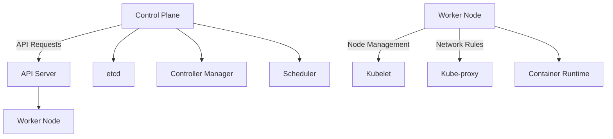

## 9.1.3 Kubernetes Essentials

Kubernetes has become the de facto standard for container orchestration, providing a robust platform for deploying, scaling, and managing containerized applications. This section delves into the essentials of Kubernetes, offering a comprehensive guide to understanding its architecture, key concepts, and practical deployment strategies for microservices.

### Kubernetes Architecture

Kubernetes is designed to automate the deployment, scaling, and operation of application containers across clusters of hosts. Its architecture is composed of several key components:

#### Control Plane (Master Node)

The control plane is responsible for managing the Kubernetes cluster. It consists of:

- **API Server**: The front-end for the Kubernetes control plane, handling RESTful requests from users and other components.
- **etcd**: A distributed key-value store that holds the cluster's state and configuration data.
- **Controller Manager**: Manages various controllers that regulate the state of the cluster, such as node controllers and replication controllers.
- **Scheduler**: Assigns workloads to nodes based on resource availability and other constraints.

#### Worker Nodes

Worker nodes are the machines where the application containers run. Each node contains:

- **Kubelet**: An agent that ensures containers are running in a Pod as expected.
- **Kube-proxy**: Manages network rules on nodes, facilitating communication between Pods.
- **Container Runtime**: The software responsible for running containers, such as Docker or containerd.



### Key Concepts

Understanding Kubernetes requires familiarity with several core concepts:

#### Pods

A Pod is the smallest deployable unit in Kubernetes, encapsulating one or more containers with shared storage and network resources. Pods are ephemeral and can be replaced by new instances.

#### Services

Services provide a stable endpoint for accessing Pods, abstracting the underlying Pod IPs. They enable load balancing and service discovery within the cluster.

#### Deployments

Deployments manage the desired state of application Pods, facilitating updates and rollbacks. They ensure that the specified number of Pod replicas are running at any given time.

#### ReplicaSets

ReplicaSets maintain a stable set of replica Pods, ensuring that a specified number of replicas are running. They are often used by Deployments to manage scaling.

#### ConfigMaps and Secrets

ConfigMaps store non-sensitive configuration data, while Secrets manage sensitive information like passwords and API keys. Both provide a way to decouple configuration from application code.

### Setting Up a Kubernetes Cluster

Setting up a Kubernetes cluster can be done using various methods, depending on your environment and requirements. Here, we outline the steps for setting up a cluster using Google Kubernetes Engine (GKE):

1. **Create a GKE Cluster**:
   - Navigate to the Google Cloud Console.
   - Select "Kubernetes Engine" and click "Create Cluster".
   - Configure the cluster settings, such as the number of nodes and machine type.
   - Click "Create" to provision the cluster.

2. **Install `kubectl`**:
   - Ensure `kubectl` is installed on your local machine to interact with the cluster.
   - Authenticate `kubectl` with your GKE cluster using the command:
     ```bash
     gcloud container clusters get-credentials [CLUSTER_NAME] --zone [ZONE] --project [PROJECT_ID]
     ```

3. **Verify Cluster Access**:
   - Run `kubectl get nodes` to verify that your cluster is accessible and the nodes are ready.

### Deploying Applications

Deploying applications in Kubernetes involves creating YAML manifests that define the desired state of your application components.

#### Example Deployment and Service

Below is an example of a simple Deployment and Service definition for a Java-based application:

```yaml
apiVersion: apps/v1
kind: Deployment
metadata:
  name: java-app
spec:
  replicas: 3
  selector:
    matchLabels:
      app: java-app
  template:
    metadata:
      labels:
        app: java-app
    spec:
      containers:
      - name: java-container
        image: openjdk:11-jre
        ports:
        - containerPort: 8080
```

```yaml
apiVersion: v1
kind: Service
metadata:
  name: java-app-service
spec:
  selector:
    app: java-app
  ports:
  - protocol: TCP
    port: 80
    targetPort: 8080
  type: LoadBalancer
```

To deploy these resources, apply the manifests using `kubectl`:

```bash
kubectl apply -f deployment.yaml
kubectl apply -f service.yaml
```

### Implementing Scaling and Autoscaling

Kubernetes supports both manual and automatic scaling of applications:

#### Manual Scaling

Use `kubectl scale` to manually adjust the number of replicas:

```bash
kubectl scale deployment java-app --replicas=5
```

#### Automatic Scaling

Configure the Horizontal Pod Autoscaler (HPA) to automatically adjust the number of replicas based on CPU utilization:

```bash
kubectl autoscale deployment java-app --cpu-percent=50 --min=1 --max=10
```

### Managing Configuration and Secrets

Kubernetes provides ConfigMaps and Secrets to manage application configurations and sensitive data securely.

#### ConfigMaps

Create a ConfigMap from a file:

```bash
kubectl create configmap app-config --from-file=config.properties
```

Mount the ConfigMap in a Pod:

```yaml
spec:
  containers:
  - name: java-container
    image: openjdk:11-jre
    volumeMounts:
    - name: config-volume
      mountPath: /etc/config
  volumes:
  - name: config-volume
    configMap:
      name: app-config
```

#### Secrets

Create a Secret from literal values:

```bash
kubectl create secret generic db-secret --from-literal=username=admin --from-literal=password=secret
```

Use the Secret in a Pod:

```yaml
spec:
  containers:
  - name: java-container
    image: openjdk:11-jre
    env:
    - name: DB_USERNAME
      valueFrom:
        secretKeyRef:
          name: db-secret
          key: username
    - name: DB_PASSWORD
      valueFrom:
        secretKeyRef:
          name: db-secret
          key: password
```

### Monitoring and Logging Kubernetes

Effective monitoring and logging are crucial for maintaining a healthy Kubernetes environment.

#### Prometheus and Grafana

- **Prometheus**: A powerful monitoring system that collects metrics from configured targets at given intervals.
- **Grafana**: A visualization tool that integrates with Prometheus to display metrics in dashboards.

Set up Prometheus and Grafana using Helm:

```bash
helm install prometheus stable/prometheus
helm install grafana stable/grafana
```

#### ELK Stack

The ELK stack (Elasticsearch, Logstash, Kibana) provides a comprehensive logging solution. Deploy it in your cluster to aggregate and visualize logs.

### Ensuring Cluster Security

Security is paramount in Kubernetes environments. Implement the following practices:

#### Role-Based Access Control (RBAC)

Define roles and permissions to control access to the Kubernetes API:

```yaml
apiVersion: rbac.authorization.k8s.io/v1
kind: Role
metadata:
  namespace: default
  name: pod-reader
rules:
- apiGroups: [""]
  resources: ["pods"]
  verbs: ["get", "watch", "list"]
```

#### Network Policies

Use network policies to control traffic flow between Pods:

```yaml
apiVersion: networking.k8s.io/v1
kind: NetworkPolicy
metadata:
  name: allow-app
spec:
  podSelector:
    matchLabels:
      app: java-app
  policyTypes:
  - Ingress
  ingress:
  - from:
    - podSelector:
        matchLabels:
          app: frontend
```

#### Securing the API Server

- Enable TLS for secure communication.
- Use authentication and authorization mechanisms to restrict access.

### Conclusion

Kubernetes provides a powerful platform for managing microservices, offering scalability, resilience, and flexibility. By mastering Kubernetes essentials, you can effectively deploy, scale, and secure your applications in a cloud-native environment.

For further exploration, consider the following resources:
- [Kubernetes Official Documentation](https://kubernetes.io/docs/)
- [Kubernetes Patterns: Reusable Elements for Designing Cloud-Native Applications](https://www.oreilly.com/library/view/kubernetes-patterns/9781492050285/)
- [Certified Kubernetes Administrator (CKA) Training](https://www.cncf.io/certification/cka/)

## Quiz Time!



### What is the role of the Kubernetes API Server?

- [x] It acts as the front-end for the Kubernetes control plane, handling RESTful requests.
- [ ] It stores the cluster's state and configuration data.
- [ ] It assigns workloads to nodes based on resource availability.
- [ ] It manages network rules on nodes.

> **Explanation:** The API Server is the front-end for the Kubernetes control plane, responsible for handling RESTful requests from users and other components.

### What is a Pod in Kubernetes?

- [x] The smallest deployable unit in Kubernetes, encapsulating one or more containers.
- [ ] A stable endpoint for accessing Pods.
- [ ] A mechanism for managing application configurations.
- [ ] A tool for monitoring and logging.

> **Explanation:** A Pod is the smallest deployable unit in Kubernetes, encapsulating one or more containers with shared storage and network resources.

### How do you manually scale a Deployment in Kubernetes?

- [x] Use the command `kubectl scale deployment <name> --replicas=<number>`.
- [ ] Modify the number of replicas in the YAML manifest and reapply it.
- [ ] Use the command `kubectl autoscale deployment <name> --cpu-percent=<number>`.
- [ ] Adjust the node pool size in the cloud provider's console.

> **Explanation:** The `kubectl scale` command is used to manually adjust the number of replicas for a Deployment.

### What is the purpose of a ConfigMap in Kubernetes?

- [x] To store non-sensitive configuration data for applications.
- [ ] To manage sensitive information like passwords.
- [ ] To provide a stable endpoint for accessing Pods.
- [ ] To monitor and log application performance.

> **Explanation:** ConfigMaps are used to store non-sensitive configuration data, allowing applications to be configured without changing the code.

### Which tool is commonly used for monitoring Kubernetes clusters?

- [x] Prometheus
- [ ] Docker
- [ ] Kubelet
- [ ] etcd

> **Explanation:** Prometheus is a powerful monitoring system commonly used to collect metrics from Kubernetes clusters.

### What is the function of the Kubernetes Scheduler?

- [x] It assigns workloads to nodes based on resource availability and constraints.
- [ ] It manages network rules on nodes.
- [ ] It stores the cluster's state and configuration data.
- [ ] It handles RESTful requests from users.

> **Explanation:** The Scheduler assigns workloads to nodes based on resource availability and other constraints.

### How can you secure sensitive data in Kubernetes?

- [x] Use Secrets to manage sensitive information like passwords and API keys.
- [ ] Store sensitive data in ConfigMaps.
- [ ] Use the API Server to encrypt data.
- [ ] Store sensitive data in the container image.

> **Explanation:** Secrets are used to manage sensitive information securely in Kubernetes.

### What is the purpose of a Service in Kubernetes?

- [x] To provide a stable endpoint for accessing Pods and enable load balancing.
- [ ] To encapsulate one or more containers with shared resources.
- [ ] To manage application configurations.
- [ ] To collect metrics and logs.

> **Explanation:** Services provide a stable endpoint for accessing Pods and enable load balancing and service discovery.

### Which command is used to apply a YAML manifest in Kubernetes?

- [x] `kubectl apply -f <filename>`
- [ ] `kubectl create -f <filename>`
- [ ] `kubectl deploy -f <filename>`
- [ ] `kubectl run -f <filename>`

> **Explanation:** The `kubectl apply -f <filename>` command is used to apply a YAML manifest to the Kubernetes cluster.

### True or False: Network policies in Kubernetes can control traffic flow between Pods.

- [x] True
- [ ] False

> **Explanation:** Network policies in Kubernetes are used to control traffic flow between Pods, enhancing security and isolation.


