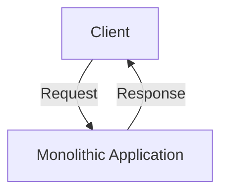
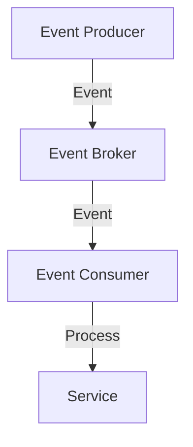

## 1.1.3 EDA vs. Traditional Architectures

In the ever-evolving landscape of software architecture, understanding the differences between Event-Driven Architecture (EDA) and traditional architectures is crucial for designing systems that are scalable, resilient, and responsive. This section delves into the core distinctions between these architectural styles, highlighting their respective strengths and weaknesses.

### Monolithic vs. Event-Driven

Monolithic architectures are characterized by their tightly coupled components, where the entire application is built as a single, indivisible unit. This approach often leads to challenges in scaling and maintaining the system as it grows. In contrast, Event-Driven Architecture promotes a decoupled design, where components communicate through events, allowing for greater modularity and flexibility.

**Monolithic Architecture:**

- **Tightly Coupled Components:** In a monolithic system, components are interdependent, making it difficult to isolate and update individual parts without affecting the entire system.
- **Single Deployment Unit:** The entire application is deployed as one unit, which can lead to longer deployment times and increased risk of downtime during updates.

**Event-Driven Architecture:**

- **Decoupled Components:** EDA allows components to operate independently, communicating through events. This decoupling facilitates easier updates and maintenance.
- **Scalable and Flexible:** Each component can be scaled independently based on demand, enhancing the system's ability to handle varying loads.

### Synchronous Communication in Traditional Architectures

Traditional architectures often rely on synchronous communication patterns, such as request-response, where a client sends a request and waits for a response before proceeding. While straightforward, this approach has several limitations:

- **Scalability Bottlenecks:** Synchronous communication can lead to bottlenecks, as each request must be processed sequentially, limiting the system's ability to handle high volumes of concurrent requests.
- **Reduced Resilience:** If a service becomes unavailable, the entire system can be affected, as requests are blocked waiting for a response.

### Asynchronous Advantages in EDA

Event-Driven Architecture leverages asynchronous communication, where components emit events and continue processing without waiting for a response. This approach offers several advantages:

- **Enhanced Responsiveness:** Asynchronous communication allows systems to remain responsive even under heavy load, as components can process events independently.
- **Increased Throughput:** By decoupling the sender and receiver, EDA can handle a higher volume of events simultaneously, improving overall system throughput.

### Scalability and Flexibility

Scalability is a critical factor in modern software systems. Traditional architectures often struggle with scalability due to their monolithic nature and synchronous communication patterns.

**Traditional Architecture Challenges:**

- **Limited Scalability:** Scaling a monolithic application often requires scaling the entire system, which can be resource-intensive and costly.
- **Rigid Structure:** The tightly coupled nature of traditional architectures makes it difficult to adapt to changing requirements.

**EDA's Inherent Scalability:**

- **Independent Scaling:** EDA allows individual components to be scaled independently, optimizing resource usage and reducing costs.
- **Adaptability:** The decoupled design of EDA makes it easier to introduce new features and adapt to changing business needs.

### Resilience and Fault Tolerance

Resilience is the ability of a system to handle failures gracefully. Traditional architectures often lack resilience due to their synchronous nature and tight coupling.

**Traditional Architecture Limitations:**

- **Single Point of Failure:** A failure in one component can cascade through the system, leading to widespread outages.
- **Difficult Recovery:** Recovering from failures often requires manual intervention and can be time-consuming.

**EDA's Resilience:**

- **Failure Isolation:** EDA isolates failures to individual components, preventing them from affecting the entire system.
- **Graceful Degradation:** Systems can continue to operate at reduced capacity, maintaining essential functionality even during failures.

### Use Case Suitability

While EDA offers numerous advantages, it is not always the best choice for every scenario. Understanding when to use EDA versus traditional architectures is key to successful system design.

**When to Use EDA:**

- **High Scalability Requirements:** Systems that need to handle large volumes of events or users benefit from EDA's scalability.
- **Real-Time Processing:** Applications requiring real-time data processing, such as IoT or financial systems, are well-suited for EDA.
- **Complex Event Handling:** Systems with complex event-driven workflows, such as e-commerce platforms, can leverage EDA for improved responsiveness.

**When Traditional Architectures May Be Preferable:**

- **Simple Applications:** For small, simple applications with limited scalability needs, a monolithic architecture may be sufficient.
- **Tight Consistency Requirements:** Applications requiring strict consistency and low latency may benefit from synchronous communication patterns.

### Practical Example: Java Code Snippet

To illustrate the differences, consider a simple Java example using Spring Boot to demonstrate synchronous vs. asynchronous communication.

**Synchronous Example:**

```java
@RestController
public class SyncController {

    @GetMapping("/sync")
    public String synchronousEndpoint() {
        // Simulate a synchronous operation
        return performSynchronousOperation();
    }

    private String performSynchronousOperation() {
        // Simulate a time-consuming task
        try {
            Thread.sleep(2000); // 2 seconds delay
        } catch (InterruptedException e) {
            Thread.currentThread().interrupt();
        }
        return "Synchronous Response";
    }
}
```

**Asynchronous Example:**

```java
@RestController
public class AsyncController {

    @GetMapping("/async")
    public CompletableFuture<String> asynchronousEndpoint() {
        // Perform asynchronous operation
        return CompletableFuture.supplyAsync(this::performAsynchronousOperation);
    }

    private String performAsynchronousOperation() {
        // Simulate a time-consuming task
        try {
            Thread.sleep(2000); // 2 seconds delay
        } catch (InterruptedException e) {
            Thread.currentThread().interrupt();
        }
        return "Asynchronous Response";
    }
}
```

In the asynchronous example, the endpoint immediately returns a `CompletableFuture`, allowing the server to handle other requests while the operation completes.

### Diagrams

To further illustrate the differences, consider the following diagrams:

#### Monolithic Architecture



#### Event-Driven Architecture



### Conclusion

Event-Driven Architecture offers significant advantages over traditional architectures, particularly in terms of scalability, flexibility, and resilience. By embracing asynchronous communication and decoupled components, EDA enables systems to handle complex, high-volume workloads with ease. However, it's essential to evaluate the specific needs of your application to determine the most suitable architectural style.

## Quiz Time!



### What is a key characteristic of monolithic architectures?

- [x] Tightly coupled components
- [ ] Asynchronous communication
- [ ] Independent scaling of components
- [ ] Event-driven workflows

> **Explanation:** Monolithic architectures are characterized by tightly coupled components, making it difficult to isolate and update individual parts without affecting the entire system.

### What is a limitation of synchronous communication in traditional architectures?

- [x] Scalability bottlenecks
- [ ] Enhanced responsiveness
- [ ] Increased throughput
- [ ] Independent component scaling

> **Explanation:** Synchronous communication can lead to scalability bottlenecks, as each request must be processed sequentially, limiting the system's ability to handle high volumes of concurrent requests.

### How does EDA enhance system responsiveness?

- [x] Through asynchronous communication
- [ ] By tightly coupling components
- [ ] By using synchronous request-response patterns
- [ ] By deploying as a single unit

> **Explanation:** EDA enhances system responsiveness through asynchronous communication, allowing components to process events independently without waiting for a response.

### What is a benefit of EDA's decoupled design?

- [x] Easier updates and maintenance
- [ ] Tightly coupled components
- [ ] Single deployment unit
- [ ] Synchronous communication

> **Explanation:** EDA's decoupled design facilitates easier updates and maintenance, as components can operate independently and communicate through events.

### In what scenario is EDA particularly advantageous?

- [x] High scalability requirements
- [ ] Simple applications with limited scalability needs
- [ ] Applications requiring strict consistency
- [ ] Low latency applications

> **Explanation:** EDA is particularly advantageous in scenarios with high scalability requirements, as it allows individual components to be scaled independently.

### What is a challenge of traditional architectures?

- [x] Limited scalability
- [ ] Enhanced resilience
- [ ] Independent component scaling
- [ ] Asynchronous communication

> **Explanation:** Traditional architectures often face limited scalability due to their monolithic nature and synchronous communication patterns.

### How does EDA improve system resilience?

- [x] By isolating failures to individual components
- [ ] By using synchronous communication
- [ ] By tightly coupling components
- [ ] By deploying as a single unit

> **Explanation:** EDA improves system resilience by isolating failures to individual components, preventing them from affecting the entire system.

### What is a characteristic of asynchronous communication in EDA?

- [x] Components emit events and continue processing
- [ ] Components wait for a response before proceeding
- [ ] Requests are processed sequentially
- [ ] Single point of failure

> **Explanation:** In asynchronous communication, components emit events and continue processing without waiting for a response, enhancing system responsiveness and throughput.

### When might traditional architectures be preferable?

- [x] For small, simple applications
- [ ] For high scalability requirements
- [ ] For real-time processing
- [ ] For complex event handling

> **Explanation:** Traditional architectures might be preferable for small, simple applications with limited scalability needs, where the complexity of EDA is not justified.

### True or False: EDA allows for independent scaling of components.

- [x] True
- [ ] False

> **Explanation:** True. EDA allows for independent scaling of components, optimizing resource usage and enhancing scalability.


