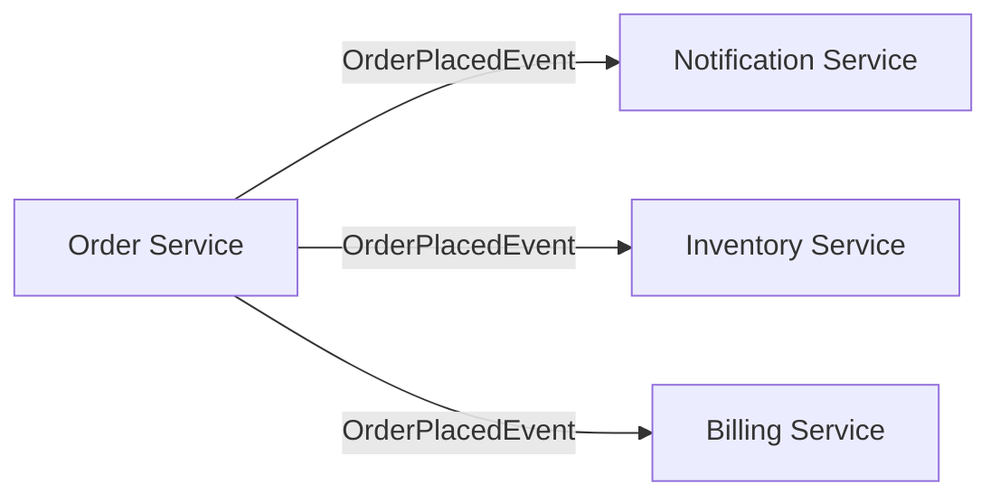

## 1.2.2 Decoupling Components

In the realm of software architecture, decoupling components is a fundamental principle that significantly enhances the scalability, flexibility, and maintainability of systems. Event-Driven Architecture (EDA) inherently promotes decoupling by allowing components to communicate through events rather than direct calls. This section delves into the myriad benefits of decoupling components within event-driven systems, providing insights into how this approach can transform the way systems are designed, deployed, and evolved.

### Loose Coupling Benefits

Loose coupling refers to the reduction of dependencies between components, allowing them to operate independently. In an event-driven system, components are typically decoupled through the use of events, which serve as the primary means of communication. This decoupling offers several advantages:

- **Reduced Dependencies:** By minimizing direct dependencies between components, systems become easier to maintain and evolve. Changes in one component do not necessitate changes in others, reducing the risk of cascading failures and simplifying the development process.

- **Improved Maintainability:** With fewer dependencies, the codebase becomes more modular and easier to understand. This modularity allows developers to focus on individual components without needing to grasp the entire system's complexity.

- **Enhanced Flexibility:** Decoupled components can be modified or replaced without impacting the rest of the system. This flexibility is crucial for adapting to changing business requirements or integrating new technologies.

Consider the following Java example illustrating loose coupling through event-driven communication:

```java
// Event class
public class OrderPlacedEvent {
    private final String orderId;
    private final String customerId;

    public OrderPlacedEvent(String orderId, String customerId) {
        this.orderId = orderId;
        this.customerId = customerId;
    }

    // Getters
    public String getOrderId() {
        return orderId;
    }

    public String getCustomerId() {
        return customerId;
    }
}

// Event producer
public class OrderService {
    private final EventBus eventBus;

    public OrderService(EventBus eventBus) {
        this.eventBus = eventBus;
    }

    public void placeOrder(String orderId, String customerId) {
        // Business logic for placing an order
        OrderPlacedEvent event = new OrderPlacedEvent(orderId, customerId);
        eventBus.publish(event); // Publish event to decouple from consumers
    }
}

// Event consumer
public class NotificationService {
    public void onOrderPlaced(OrderPlacedEvent event) {
        // Handle the event, e.g., send notification
        System.out.println("Notification sent for order: " + event.getOrderId());
    }
}
```

In this example, the `OrderService` and `NotificationService` are decoupled through the `OrderPlacedEvent`. The `OrderService` publishes an event when an order is placed, and the `NotificationService` listens for this event to send notifications. This decoupling allows each service to evolve independently.

### Independent Deployment

One of the standout benefits of decoupling components is the ability to deploy them independently. This capability minimizes downtime and deployment risks, as changes to one component do not require redeploying the entire system.

- **Minimized Downtime:** Independent deployment allows for rolling updates, where only the updated component is taken offline, reducing the impact on users.

- **Reduced Deployment Risks:** By isolating deployments, the risk of introducing system-wide issues is minimized. If a deployment fails, it only affects the specific component, making rollback procedures simpler and less disruptive.

For instance, in a microservices architecture, each service can be deployed independently, as illustrated in the following diagram:



In this architecture, each service can be independently deployed and scaled, allowing for greater agility and resilience.

### Enhanced Reusability

Decoupled components are inherently more reusable, as they are designed to operate independently of specific implementations. This reusability extends across different parts of the system or even different projects.

- **Cross-System Reusability:** Components designed to handle specific events can be reused in different systems that generate similar events, reducing development time and effort.

- **Standardized Interfaces:** By adhering to standardized event interfaces, components can be easily integrated into new environments, promoting consistency and reducing integration challenges.

Consider a reusable `PaymentService` that processes payment events:

```java
public class PaymentProcessedEvent {
    private final String paymentId;
    private final double amount;

    public PaymentProcessedEvent(String paymentId, double amount) {
        this.paymentId = paymentId;
        this.amount = amount;
    }

    // Getters
    public String getPaymentId() {
        return paymentId;
    }

    public double getAmount() {
        return amount;
    }
}

public class PaymentService {
    public void processPayment(PaymentProcessedEvent event) {
        // Process payment logic
        System.out.println("Processed payment: " + event.getPaymentId());
    }
}
```

This `PaymentService` can be reused in any system that generates `PaymentProcessedEvent`, enhancing its applicability and reducing redundancy.

### Simplified Testing

Testing decoupled components is significantly simplified, as each component can be tested in isolation. This isolation leads to more reliable and robust systems.

- **Unit Testing:** Individual components can be unit tested without requiring the entire system to be operational. This isolation allows for more thorough testing and quicker feedback loops.

- **Mocking Dependencies:** With decoupled components, dependencies can be easily mocked, enabling focused testing on the component's functionality rather than its interactions with other components.

Here's an example of a unit test for the `NotificationService` using a mock event:

```java
import org.junit.jupiter.api.Test;
import static org.mockito.Mockito.*;

public class NotificationServiceTest {

    @Test
    public void testOnOrderPlaced() {
        // Arrange
        OrderPlacedEvent mockEvent = mock(OrderPlacedEvent.class);
        when(mockEvent.getOrderId()).thenReturn("12345");

        NotificationService notificationService = new NotificationService();

        // Act
        notificationService.onOrderPlaced(mockEvent);

        // Assert
        // Verify that the notification logic was executed
        // (In a real test, you would verify the side effects, e.g., a message was sent)
    }
}
```

This test demonstrates how the `NotificationService` can be tested independently by mocking the `OrderPlacedEvent`.

### Easier Replacement and Upgrades

Decoupling facilitates the seamless replacement or upgrading of individual components without affecting the entire system. This capability is crucial for maintaining system agility and ensuring that components can evolve with technological advancements.

- **Seamless Upgrades:** Components can be upgraded to newer versions without requiring changes to other parts of the system. This flexibility allows for continuous improvement and adoption of new features.

- **Component Replacement:** If a component becomes obsolete or a better alternative is available, it can be replaced with minimal disruption to the system.

For example, if a new version of the `InventoryService` is developed, it can be deployed independently, as long as it adheres to the same event interface:

```java
public class NewInventoryService {
    public void onOrderPlaced(OrderPlacedEvent event) {
        // New logic for handling inventory updates
        System.out.println("Updated inventory for order: " + event.getOrderId());
    }
}
```

This new service can replace the existing one without affecting other services that consume the `OrderPlacedEvent`.

### Conclusion

Decoupling components in event-driven architectures offers numerous benefits, including reduced dependencies, independent deployment, enhanced reusability, simplified testing, and easier replacement and upgrades. By embracing these principles, architects and developers can design systems that are more resilient, scalable, and adaptable to change. As you continue your journey in mastering event-driven architectures, consider how these benefits can be leveraged to create robust and flexible systems that meet the demands of modern software development.

## Quiz Time!



### What is a primary benefit of decoupling components in an event-driven architecture?

- [x] Reduced dependencies between components
- [ ] Increased complexity of the system
- [ ] Higher coupling between components
- [ ] Slower communication between components

> **Explanation:** Decoupling components reduces dependencies, making the system easier to maintain and evolve.

### How does independent deployment benefit an event-driven system?

- [x] Minimizes downtime and deployment risks
- [ ] Requires redeploying the entire system
- [ ] Increases the risk of system-wide issues
- [ ] Necessitates complex rollback procedures

> **Explanation:** Independent deployment allows for rolling updates, minimizing downtime and deployment risks.

### What advantage does enhanced reusability provide in decoupled systems?

- [x] Components can be reused across different systems
- [ ] Components are tightly integrated with specific implementations
- [ ] Reusability is limited to the original system
- [ ] Components cannot be standardized

> **Explanation:** Decoupled components can be reused across different systems, reducing development time and effort.

### Why is testing simplified in decoupled components?

- [x] Components can be tested in isolation
- [ ] Entire system must be operational for testing
- [ ] Dependencies cannot be mocked
- [ ] Testing requires complex integration setups

> **Explanation:** Decoupled components can be tested independently, allowing for focused and efficient testing.

### How does decoupling facilitate easier replacement and upgrades?

- [x] Components can be upgraded without affecting the entire system
- [ ] Entire system must be upgraded simultaneously
- [ ] Replacement requires changes to all components
- [ ] Upgrades are not possible in decoupled systems

> **Explanation:** Decoupling allows components to be upgraded or replaced independently, maintaining system agility.

### What is a key characteristic of loosely coupled components?

- [x] They operate independently of each other
- [ ] They have strong dependencies on each other
- [ ] They require synchronous communication
- [ ] They must be deployed together

> **Explanation:** Loosely coupled components operate independently, reducing dependencies and increasing flexibility.

### Which of the following is a benefit of reduced dependencies in a system?

- [x] Improved maintainability
- [ ] Increased complexity
- [ ] Higher risk of cascading failures
- [ ] More difficult to understand

> **Explanation:** Reduced dependencies lead to improved maintainability and a more modular codebase.

### What role do events play in decoupling components?

- [x] They serve as the primary means of communication
- [ ] They increase direct dependencies between components
- [ ] They require synchronous calls between components
- [ ] They complicate the communication process

> **Explanation:** Events decouple components by serving as the primary means of communication, reducing direct dependencies.

### How does decoupling affect system flexibility?

- [x] It enhances flexibility by allowing independent modifications
- [ ] It reduces flexibility by increasing dependencies
- [ ] It has no impact on system flexibility
- [ ] It complicates the modification process

> **Explanation:** Decoupling enhances flexibility by allowing components to be modified independently.

### True or False: Decoupling components in an event-driven architecture increases the risk of system-wide failures.

- [ ] True
- [x] False

> **Explanation:** Decoupling components reduces the risk of system-wide failures by isolating changes to individual components.


