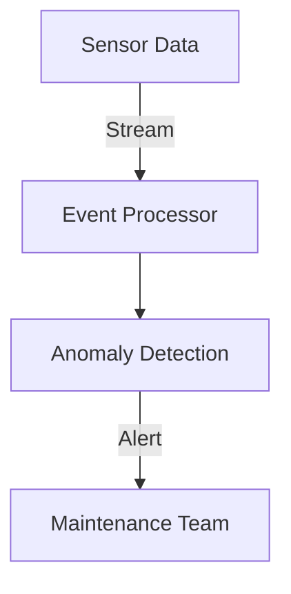

## 1.2.3 Enhanced Responsiveness

In the fast-paced world of modern software development, responsiveness is a critical factor that can make or break user satisfaction and system efficiency. Event-Driven Architecture (EDA) plays a pivotal role in enhancing the responsiveness of systems by enabling real-time processing, improving user experience, reducing latency, fostering proactive system behavior, and supporting reactive programming paradigms. This section delves into these aspects, providing insights into how EDA can transform the responsiveness of your applications.

### Real-Time Processing

One of the hallmark features of Event-Driven Architecture is its ability to process events as they occur, enabling real-time insights and actions. In traditional architectures, systems often rely on batch processing, which can introduce significant delays between the occurrence of an event and the system's response. EDA, on the other hand, allows systems to react immediately to events, providing up-to-the-moment data and actions.

#### Practical Example: Real-Time Stock Trading

Consider a stock trading platform where prices fluctuate rapidly. Using EDA, the system can process incoming market data events in real-time, allowing traders to make informed decisions instantly. Here's a simple Java example using Kafka to handle real-time stock price updates:

```java
import org.apache.kafka.clients.consumer.ConsumerConfig;
import org.apache.kafka.clients.consumer.KafkaConsumer;
import org.apache.kafka.clients.consumer.ConsumerRecords;
import org.apache.kafka.clients.consumer.ConsumerRecord;
import java.util.Properties;
import java.util.Collections;

public class RealTimeStockConsumer {
    public static void main(String[] args) {
        Properties props = new Properties();
        props.put(ConsumerConfig.BOOTSTRAP_SERVERS_CONFIG, "localhost:9092");
        props.put(ConsumerConfig.GROUP_ID_CONFIG, "stock-consumer-group");
        props.put(ConsumerConfig.KEY_DESERIALIZER_CLASS_CONFIG, "org.apache.kafka.common.serialization.StringDeserializer");
        props.put(ConsumerConfig.VALUE_DESERIALIZER_CLASS_CONFIG, "org.apache.kafka.common.serialization.StringDeserializer");

        KafkaConsumer<String, String> consumer = new KafkaConsumer<>(props);
        consumer.subscribe(Collections.singletonList("stock-prices"));

        while (true) {
            ConsumerRecords<String, String> records = consumer.poll(100);
            for (ConsumerRecord<String, String> record : records) {
                System.out.printf("Received stock update: %s = %s%n", record.key(), record.value());
                // Process stock update in real-time
            }
        }
    }
}
```

In this example, a Kafka consumer listens to a topic named "stock-prices" and processes each incoming stock price update in real-time, allowing the system to react instantly to market changes.

### Improved User Experience

Responsive systems deliver faster feedback to users, significantly enhancing overall user satisfaction. In an EDA system, events trigger immediate responses, minimizing the time users spend waiting for actions to complete. This immediacy is crucial in applications where user interaction is frequent and time-sensitive.

#### Real-World Scenario: Interactive Web Applications

In interactive web applications, such as online gaming or collaborative tools, EDA can be employed to ensure that user actions are reflected in real-time across all clients. By using WebSockets or Server-Sent Events (SSE), developers can push updates to users as soon as they occur, creating a seamless and engaging user experience.

```javascript
// Example of using WebSockets in a JavaScript client
const socket = new WebSocket('ws://example.com/socket');

socket.onmessage = function(event) {
    const data = JSON.parse(event.data);
    console.log('Received update:', data);
    // Update UI with new data
};
```

### Reduced Latency

Latency is a critical factor in system performance, and EDA excels in reducing it through asynchronous processing and efficient event routing. By decoupling event producers and consumers, EDA allows systems to handle events independently, avoiding bottlenecks and ensuring swift responses.

#### Technical Insight: Asynchronous Processing

Asynchronous processing is a core principle of EDA, where events are processed independently of the main application flow. This decoupling allows systems to handle multiple events concurrently, reducing wait times and improving overall throughput.

```java
// Example of asynchronous processing in Java using CompletableFuture
import java.util.concurrent.CompletableFuture;

public class AsynchronousExample {
    public static void main(String[] args) {
        CompletableFuture.runAsync(() -> {
            // Simulate event processing
            System.out.println("Processing event asynchronously");
        });

        System.out.println("Main thread continues execution");
    }
}
```

### Proactive System Behavior

EDA enables systems to anticipate and react to events proactively, enhancing system intelligence and adaptability. By continuously monitoring event streams, systems can identify patterns and trends, allowing them to make informed decisions and take preemptive actions.

#### Use Case: Predictive Maintenance

In industrial settings, EDA can be used for predictive maintenance by analyzing sensor data in real-time. By detecting anomalies or trends in equipment performance, systems can schedule maintenance before failures occur, reducing downtime and costs.



### Support for Reactive Programming

EDA aligns seamlessly with reactive programming paradigms, which focus on building systems that are responsive, resilient, and elastic. Reactive programming emphasizes non-blocking operations and event-driven interactions, making it a natural fit for EDA.

#### Framework Example: Spring WebFlux

Spring WebFlux is a framework that supports reactive programming in Java, allowing developers to build non-blocking, event-driven applications. By leveraging EDA, developers can create highly responsive systems that efficiently handle large volumes of events.

```java
import org.springframework.web.reactive.function.server.RouterFunction;
import org.springframework.web.reactive.function.server.ServerResponse;
import static org.springframework.web.reactive.function.server.RouterFunctions.route;
import static org.springframework.web.reactive.function.server.RequestPredicates.GET;

public class ReactiveRouter {
    public RouterFunction<ServerResponse> route() {
        return route(GET("/events"), request ->
            ServerResponse.ok().bodyValue("Handling events reactively"));
    }
}
```

### Conclusion

Enhanced responsiveness is a cornerstone of Event-Driven Architecture, offering significant advantages in real-time processing, user experience, latency reduction, proactive behavior, and support for reactive programming. By adopting EDA, developers can build systems that are not only responsive but also intelligent and adaptable, meeting the demands of modern applications.

## Quiz Time!



### What is a key benefit of real-time processing in EDA?

- [x] Immediate system response to events
- [ ] Delayed batch processing
- [ ] Increased system downtime
- [ ] Reduced event throughput

> **Explanation:** Real-time processing allows systems to respond immediately to events, providing up-to-the-moment data and actions.

### How does EDA improve user experience?

- [x] By delivering faster feedback to users
- [ ] By increasing system complexity
- [ ] By reducing system responsiveness
- [ ] By limiting user interactions

> **Explanation:** EDA improves user experience by providing faster feedback, minimizing wait times, and enhancing engagement.

### What role does asynchronous processing play in EDA?

- [x] It reduces latency by decoupling event producers and consumers
- [ ] It increases latency by coupling event producers and consumers
- [ ] It simplifies synchronous processing
- [ ] It limits event handling capabilities

> **Explanation:** Asynchronous processing reduces latency by allowing events to be handled independently, avoiding bottlenecks.

### How does EDA enable proactive system behavior?

- [x] By continuously monitoring event streams for patterns
- [ ] By ignoring event patterns
- [ ] By delaying event processing
- [ ] By limiting system intelligence

> **Explanation:** EDA enables proactive behavior by analyzing event streams in real-time, allowing systems to anticipate and react to events.

### What is a benefit of aligning EDA with reactive programming?

- [x] Building responsive, resilient, and elastic systems
- [ ] Increasing system blocking operations
- [ ] Reducing system responsiveness
- [ ] Limiting event-driven interactions

> **Explanation:** EDA aligns with reactive programming to build systems that are responsive, resilient, and elastic, handling events efficiently.

### Which Java framework supports reactive programming in EDA?

- [x] Spring WebFlux
- [ ] Spring MVC
- [ ] Hibernate
- [ ] Struts

> **Explanation:** Spring WebFlux is a framework that supports reactive programming, allowing developers to build non-blocking, event-driven applications.

### What is a common use case for proactive system behavior in EDA?

- [x] Predictive maintenance
- [ ] Batch processing
- [ ] Delayed response systems
- [ ] Static data analysis

> **Explanation:** Predictive maintenance is a common use case where EDA analyzes real-time data to anticipate and prevent equipment failures.

### How does EDA contribute to reduced latency?

- [x] Through asynchronous processing and efficient event routing
- [ ] By increasing synchronous processing
- [ ] By delaying event handling
- [ ] By reducing event throughput

> **Explanation:** EDA reduces latency by decoupling event handling through asynchronous processing and efficient routing.

### What is a key feature of real-time processing in EDA?

- [x] Immediate insights and actions
- [ ] Delayed batch processing
- [ ] Increased system downtime
- [ ] Reduced event throughput

> **Explanation:** Real-time processing provides immediate insights and actions, enabling systems to respond quickly to events.

### True or False: EDA can enhance system intelligence by enabling proactive behavior.

- [x] True
- [ ] False

> **Explanation:** True. EDA enhances system intelligence by allowing systems to anticipate and react to events proactively.


