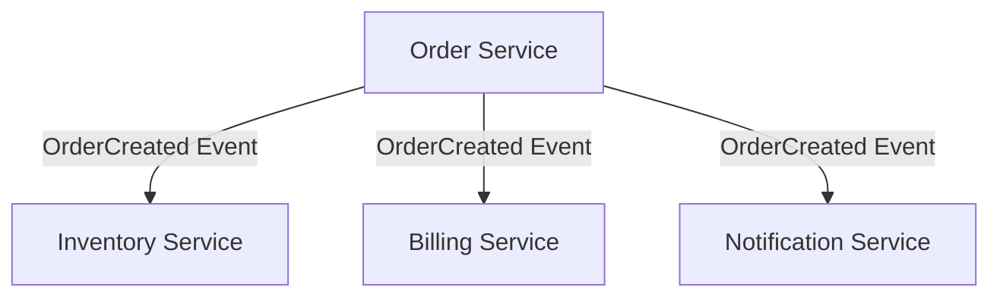
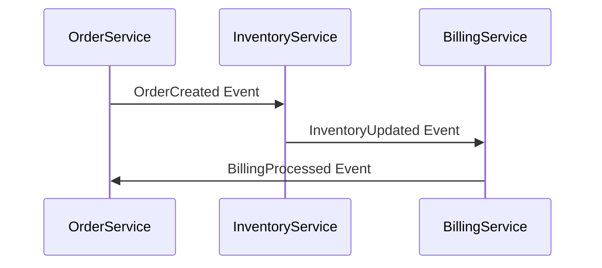

## 1.3.1 Microservices Architectures

Microservices architecture has become a cornerstone of modern software development, enabling organizations to build scalable, flexible, and maintainable systems. When combined with Event-Driven Architecture (EDA), microservices can achieve even greater levels of efficiency and responsiveness. In this section, we'll explore how EDA facilitates inter-service communication, supports service autonomy, enables complex workflows, maintains data consistency, and enhances resilience in microservices architectures.

### Inter-Service Communication

In a microservices architecture, services need to communicate with each other to perform complex operations. Traditional approaches often rely on synchronous communication methods, such as HTTP REST APIs, which can lead to tight coupling and increased latency. EDA offers a compelling alternative through asynchronous event-based communication.

#### Asynchronous Events

Asynchronous events allow microservices to communicate without waiting for a response, thereby reducing latency and improving system responsiveness. When a service emits an event, it doesn't need to know which services will consume it, promoting loose coupling.

**Java Example:**

```java
import org.springframework.kafka.core.KafkaTemplate;
import org.springframework.beans.factory.annotation.Autowired;
import org.springframework.stereotype.Service;

@Service
public class OrderService {

    @Autowired
    private KafkaTemplate<String, String> kafkaTemplate;

    public void createOrder(Order order) {
        // Business logic to create an order
        // ...

        // Publish an event to notify other services
        kafkaTemplate.send("order-events", "OrderCreated", order.toString());
    }
}
```

In this example, the `OrderService` publishes an `OrderCreated` event to a Kafka topic. Other services interested in this event can subscribe to the topic and react accordingly, without the `OrderService` needing to know about them.

#### Benefits of Asynchronous Communication

- **Decoupling:** Services can evolve independently without affecting others.
- **Scalability:** Services can scale independently based on their load.
- **Fault Tolerance:** If a consumer service is down, the event can be processed later when the service is back up.

### Service Autonomy

Service autonomy is a key principle of microservices architecture, allowing each service to operate independently. EDA enhances this autonomy by decoupling services through events.

#### Independence and Scalability

Each microservice can be developed, deployed, and scaled independently. EDA supports this by ensuring that services communicate through events rather than direct calls.

**Diagram:**



In this diagram, the `Order Service` emits an `OrderCreated` event that is consumed by multiple services, each handling its own logic independently.

#### Benefits of Service Autonomy

- **Flexibility:** Teams can choose the best technology stack for each service.
- **Resilience:** Failures in one service do not directly impact others.
- **Faster Development:** Teams can work on different services simultaneously without waiting for dependencies.

### Event-Driven Workflows

Complex workflows often require coordination between multiple services. EDA enables these workflows by chaining events together, allowing services to react to changes in the system state.

#### Implementing Workflows

Workflows can be implemented by defining a series of events that trigger actions in different services. This approach allows for dynamic and flexible workflows that can adapt to changing business requirements.

**Java Example:**

```java
@Service
public class ShippingService {

    @KafkaListener(topics = "order-events", groupId = "shipping")
    public void handleOrderCreated(String message) {
        // Parse the message and extract order details
        Order order = parseOrder(message);

        // Business logic to prepare shipping
        // ...

        // Emit an event to notify that the order is ready for shipping
        kafkaTemplate.send("shipping-events", "OrderReadyForShipping", order.toString());
    }
}
```

In this example, the `ShippingService` listens for `OrderCreated` events and, upon processing, emits an `OrderReadyForShipping` event. This event can trigger further actions in other services, such as updating the order status or notifying the customer.

#### Benefits of Event-Driven Workflows

- **Flexibility:** Easily modify workflows by adding or removing event handlers.
- **Scalability:** Each step in the workflow can be scaled independently.
- **Resilience:** Failures in one step do not halt the entire workflow.

### Data Consistency Across Services

Maintaining data consistency in a distributed microservices environment is challenging. EDA helps achieve eventual consistency through event sourcing and event-driven updates.

#### Eventual Consistency

In EDA, services maintain their own data stores and update them based on events. This approach allows services to remain consistent over time, even if temporary discrepancies occur.

**Diagram:**



This sequence diagram illustrates how events propagate through services to maintain consistency. Each service updates its state based on received events and emits new events as needed.

#### Benefits of Eventual Consistency

- **Scalability:** Services can scale independently without a central database bottleneck.
- **Resilience:** Services can recover from failures by replaying events.
- **Flexibility:** Services can evolve their data models independently.

### Resilience and Fault Isolation

Resilience is critical in microservices architectures to ensure that failures in one service do not cascade to others. EDA enhances resilience by isolating failures through asynchronous communication.

#### Fault Isolation

When services communicate asynchronously, failures in one service do not immediately impact others. Events can be retried or handled later, allowing the system to degrade gracefully.

**Java Example:**

```java
@Service
public class PaymentService {

    @KafkaListener(topics = "order-events", groupId = "payment")
    public void handleOrderCreated(String message) {
        try {
            // Business logic to process payment
            // ...
        } catch (Exception e) {
            // Log the error and retry later
            log.error("Payment processing failed, retrying...", e);
            // Implement retry logic or send to a dead-letter queue
        }
    }
}
```

In this example, the `PaymentService` handles failures by logging errors and potentially retrying the operation. This approach prevents failures from propagating to other services.

#### Benefits of Resilience

- **Fault Tolerance:** Services can handle failures gracefully without affecting others.
- **Improved Availability:** The system remains operational even if some services are down.
- **Error Recovery:** Failed operations can be retried or compensated.

### Conclusion

By integrating Event-Driven Architecture with microservices, organizations can build systems that are more scalable, flexible, and resilient. EDA facilitates communication between services, supports their autonomy, enables complex workflows, maintains data consistency, and enhances resilience. As you design and implement microservices architectures, consider leveraging EDA to maximize these benefits.

## Quiz Time!



### How does Event-Driven Architecture (EDA) facilitate communication between microservices?

- [x] Through asynchronous events
- [ ] Through synchronous HTTP calls
- [ ] By sharing a common database
- [ ] By using shared memory

> **Explanation:** EDA facilitates communication between microservices through asynchronous events, allowing services to communicate without waiting for a response.

### What is a key benefit of service autonomy in microservices?

- [x] Services can be developed and deployed independently
- [ ] Services must use the same technology stack
- [ ] Services are tightly coupled
- [ ] Services cannot scale independently

> **Explanation:** Service autonomy allows each microservice to be developed, deployed, and scaled independently, enhancing flexibility and resilience.

### How does EDA enable complex workflows in microservices?

- [x] By chaining events together
- [ ] By using a monolithic architecture
- [ ] By centralizing all business logic
- [ ] By using synchronous communication

> **Explanation:** EDA enables complex workflows by chaining events together, allowing services to react to changes in the system state dynamically.

### What is a benefit of eventual consistency in EDA?

- [x] Services can scale independently
- [ ] Services must always be consistent
- [ ] Services cannot recover from failures
- [ ] Services require a central database

> **Explanation:** Eventual consistency allows services to scale independently and recover from failures by replaying events, even if temporary discrepancies occur.

### How does EDA enhance resilience in microservices?

- [x] By isolating failures through asynchronous communication
- [ ] By tightly coupling services
- [ ] By using synchronous communication
- [ ] By centralizing error handling

> **Explanation:** EDA enhances resilience by isolating failures through asynchronous communication, preventing cascading issues across services.

### In EDA, what happens when a service emits an event?

- [x] Other services can consume the event without the emitter knowing them
- [ ] The event is ignored if no service is listening
- [ ] The emitter waits for a response from all consumers
- [ ] The event is stored in a central database

> **Explanation:** When a service emits an event, other services can consume it without the emitter needing to know about them, promoting loose coupling.

### What is a common challenge when maintaining data consistency across microservices?

- [x] Ensuring eventual consistency
- [ ] Using a single database for all services
- [ ] Avoiding the use of events
- [ ] Implementing synchronous communication

> **Explanation:** Ensuring eventual consistency is a common challenge in distributed systems, but EDA helps achieve it through event-driven updates.

### How can EDA support service autonomy?

- [x] By allowing services to communicate through events
- [ ] By requiring all services to use the same database
- [ ] By centralizing all business logic
- [ ] By enforcing synchronous communication

> **Explanation:** EDA supports service autonomy by allowing services to communicate through events, enabling them to operate independently.

### What is a benefit of using asynchronous communication in microservices?

- [x] Reduced latency and improved responsiveness
- [ ] Increased coupling between services
- [ ] Immediate response required from all services
- [ ] Centralized error handling

> **Explanation:** Asynchronous communication reduces latency and improves responsiveness by allowing services to communicate without waiting for a response.

### True or False: EDA requires all microservices to be developed using the same programming language.

- [ ] True
- [x] False

> **Explanation:** False. EDA allows microservices to be developed using different programming languages, as services communicate through events rather than direct calls.


