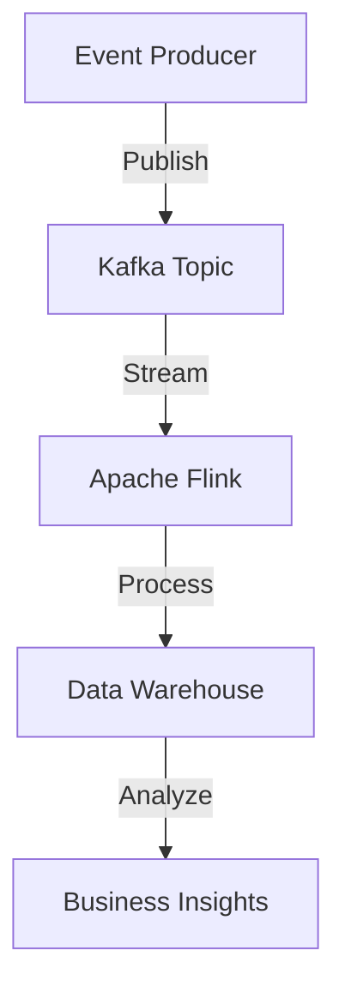

## 1.3.2 Real-Time Data Processing

In today's fast-paced digital world, the ability to process data in real-time is crucial for many applications. Event-Driven Architecture (EDA) plays a pivotal role in enabling systems to handle data as it is generated, providing immediate insights and responses. This section explores various aspects of real-time data processing within the context of EDA, including streaming data applications, event analytics, monitoring and alerting systems, data transformation, and integration with big data technologies.

### Streaming Data Applications

Streaming data applications are designed to handle continuous flows of data, often in large volumes and at high velocity. These applications are prevalent in industries where timely data processing is critical.

#### Financial Trading Platforms

In financial markets, trading platforms must process vast amounts of data in real-time to make informed decisions. Stock prices, market trends, and transaction data are continuously streamed and analyzed. EDA enables these platforms to react instantly to market changes, executing trades based on predefined rules and strategies.

```java
import org.apache.kafka.clients.consumer.ConsumerConfig;
import org.apache.kafka.clients.consumer.KafkaConsumer;
import org.apache.kafka.clients.consumer.ConsumerRecords;
import org.apache.kafka.clients.consumer.ConsumerRecord;
import java.util.Properties;
import java.util.Collections;

public class FinancialTradingConsumer {
    public static void main(String[] args) {
        Properties props = new Properties();
        props.put(ConsumerConfig.BOOTSTRAP_SERVERS_CONFIG, "localhost:9092");
        props.put(ConsumerConfig.GROUP_ID_CONFIG, "trading-group");
        props.put(ConsumerConfig.KEY_DESERIALIZER_CLASS_CONFIG, "org.apache.kafka.common.serialization.StringDeserializer");
        props.put(ConsumerConfig.VALUE_DESERIALIZER_CLASS_CONFIG, "org.apache.kafka.common.serialization.StringDeserializer");

        KafkaConsumer<String, String> consumer = new KafkaConsumer<>(props);
        consumer.subscribe(Collections.singletonList("stock-prices"));

        while (true) {
            ConsumerRecords<String, String> records = consumer.poll(100);
            for (ConsumerRecord<String, String> record : records) {
                System.out.printf("Received stock price update: %s%n", record.value());
                // Process the stock price update
            }
        }
    }
}
```

In this Java example, a Kafka consumer is set up to listen for stock price updates. The consumer processes each message as it arrives, allowing the trading platform to react in real-time.

#### Social Media Analytics

Social media platforms generate enormous volumes of data every second. Analyzing this data in real-time can provide valuable insights into user behavior, trending topics, and sentiment analysis. EDA facilitates the continuous processing of social media streams, enabling platforms to deliver up-to-date analytics and personalized content.

### Event Analytics

Event analytics involves processing and analyzing events as they occur, providing immediate insights and enabling proactive decision-making.

#### Real-Time Analytics

EDA allows systems to perform real-time analytics by processing events as they are generated. This capability is essential for applications that require instant feedback, such as fraud detection systems, where suspicious activities must be identified and acted upon immediately.

```java
import org.apache.flink.streaming.api.environment.StreamExecutionEnvironment;
import org.apache.flink.streaming.api.datastream.DataStream;
import org.apache.flink.streaming.api.windowing.time.Time;

public class RealTimeAnalytics {
    public static void main(String[] args) throws Exception {
        StreamExecutionEnvironment env = StreamExecutionEnvironment.getExecutionEnvironment();
        DataStream<String> eventStream = env.socketTextStream("localhost", 9999);

        eventStream
            .keyBy(event -> event)
            .timeWindow(Time.seconds(10))
            .sum(1)
            .print();

        env.execute("Real-Time Event Analytics");
    }
}
```

In this example, Apache Flink is used to perform real-time analytics on a stream of events. Events are grouped and aggregated over a time window, providing insights into event patterns and trends.

### Monitoring and Alerting Systems

Monitoring systems are essential for maintaining the health and performance of applications. EDA enhances these systems by enabling real-time monitoring and alerting based on event thresholds.

#### Responsive Monitoring

By leveraging EDA, monitoring systems can respond to events as they occur, triggering alerts when specific conditions are met. This approach ensures that issues are detected and addressed promptly, minimizing downtime and improving system reliability.

```java
import java.util.concurrent.Executors;
import java.util.concurrent.ScheduledExecutorService;
import java.util.concurrent.TimeUnit;

public class MonitoringSystem {
    private static final ScheduledExecutorService scheduler = Executors.newScheduledThreadPool(1);

    public static void main(String[] args) {
        scheduler.scheduleAtFixedRate(() -> {
            // Simulate event monitoring
            boolean alertCondition = checkSystemHealth();
            if (alertCondition) {
                System.out.println("Alert: System health check failed!");
            }
        }, 0, 5, TimeUnit.SECONDS);
    }

    private static boolean checkSystemHealth() {
        // Logic to check system health
        return Math.random() > 0.8; // Simulate a random alert condition
    }
}
```

This Java code demonstrates a simple monitoring system that checks system health at regular intervals and triggers an alert if a condition is met.

### Data Transformation and Enrichment

Raw event data often requires transformation and enrichment to become meaningful insights. EDA supports real-time data processing, enabling the transformation of data as it flows through the system.

#### Transforming Raw Data

Data transformation involves converting raw event data into a structured format that can be easily analyzed. This process may include filtering, aggregating, and enriching data with additional context.

```java
import org.apache.kafka.streams.KafkaStreams;
import org.apache.kafka.streams.StreamsBuilder;
import org.apache.kafka.streams.kstream.KStream;
import org.apache.kafka.streams.kstream.KTable;
import org.apache.kafka.streams.kstream.Materialized;

public class DataTransformation {
    public static void main(String[] args) {
        StreamsBuilder builder = new StreamsBuilder();
        KStream<String, String> rawData = builder.stream("raw-events");

        KTable<String, Long> transformedData = rawData
            .groupBy((key, value) -> value)
            .count(Materialized.as("counts"));

        transformedData.toStream().to("transformed-events");

        KafkaStreams streams = new KafkaStreams(builder.build(), new Properties());
        streams.start();
    }
}
```

In this example, Kafka Streams is used to transform raw event data into a count of occurrences, enriching the data with aggregated insights.

### Integration with Big Data Technologies

EDA seamlessly integrates with big data platforms, enabling scalable and efficient data processing.

#### Apache Kafka, Spark, and Flink

Technologies like Apache Kafka, Spark, and Flink are commonly used in conjunction with EDA to handle large-scale data processing. Kafka serves as a reliable message broker, while Spark and Flink provide powerful stream processing capabilities.



This diagram illustrates a typical architecture where events are published to a Kafka topic, processed by Apache Flink, and stored in a data warehouse for analysis.

### Conclusion

Real-time data processing is a cornerstone of modern applications, enabling systems to react instantly to changes and deliver timely insights. Event-Driven Architecture provides the foundation for building responsive, scalable, and efficient real-time data processing systems. By leveraging EDA, organizations can harness the power of continuous data streams, perform real-time analytics, and integrate seamlessly with big data technologies.

## Quiz Time!



### What is a key benefit of using EDA for real-time data processing?

- [x] Immediate insights and responses
- [ ] Reduced data storage requirements
- [ ] Simplified data models
- [ ] Lower development costs

> **Explanation:** EDA allows systems to process data as it is generated, providing immediate insights and responses.

### Which technology is commonly used for real-time stream processing in EDA?

- [ ] Apache Hadoop
- [x] Apache Flink
- [ ] MySQL
- [ ] Redis

> **Explanation:** Apache Flink is a popular choice for real-time stream processing in EDA.

### How does EDA enhance monitoring systems?

- [x] By enabling real-time monitoring and alerting
- [ ] By reducing the number of events
- [ ] By simplifying system architecture
- [ ] By eliminating the need for alerts

> **Explanation:** EDA allows monitoring systems to respond to events as they occur, triggering alerts based on event thresholds.

### What is the role of Kafka in a real-time data processing system?

- [x] Message broker for event streams
- [ ] Data storage solution
- [ ] User interface framework
- [ ] Security provider

> **Explanation:** Kafka acts as a message broker, facilitating the flow of event streams in real-time data processing systems.

### What is an example of a streaming data application?

- [x] Financial trading platform
- [ ] Static website
- [ ] Batch processing system
- [ ] Offline data analysis tool

> **Explanation:** Financial trading platforms are streaming data applications that require real-time data processing.

### What is the purpose of data transformation in EDA?

- [x] Converting raw event data into meaningful insights
- [ ] Reducing the size of data
- [ ] Encrypting data for security
- [ ] Archiving old data

> **Explanation:** Data transformation involves converting raw event data into a structured format for analysis.

### Which of the following is a benefit of integrating EDA with big data technologies?

- [x] Scalable data processing
- [ ] Reduced network traffic
- [ ] Simplified user interfaces
- [ ] Lower hardware costs

> **Explanation:** Integrating EDA with big data technologies enables scalable and efficient data processing.

### What is a common use case for event analytics in EDA?

- [x] Fraud detection systems
- [ ] Static reporting
- [ ] Manual data entry
- [ ] Offline data storage

> **Explanation:** Event analytics is used in fraud detection systems to identify suspicious activities in real-time.

### How does EDA support real-time analytics?

- [x] By processing events as they are generated
- [ ] By storing events for later analysis
- [ ] By reducing the number of events
- [ ] By simplifying event schemas

> **Explanation:** EDA supports real-time analytics by processing events as they occur, providing immediate insights.

### True or False: EDA can only be used for real-time data processing.

- [ ] True
- [x] False

> **Explanation:** EDA is versatile and can be used for various applications, not just real-time data processing.


