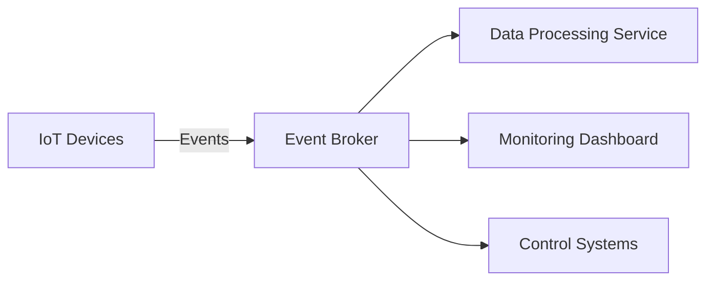

---

linkTitle: "1.3.3 Internet of Things (IoT) Systems"
title: "Internet of Things (IoT) Systems in Event-Driven Architecture"
description: "Explore how Event-Driven Architecture (EDA) enhances Internet of Things (IoT) systems through efficient device communication, real-time monitoring, scalability, edge computing integration, and security management."
categories:
- Software Architecture
- Internet of Things
- Event-Driven Systems
tags:
- Event-Driven Architecture
- IoT
- Real-Time Monitoring
- Scalability
- Edge Computing
- Security
date: 2024-10-25
type: docs
nav_weight: 1330

---

## 1.3.3 Internet of Things (IoT) Systems

The Internet of Things (IoT) represents a paradigm shift in how devices interact with each other and with backend systems. With billions of devices expected to be connected in the coming years, managing communication, scalability, and security becomes paramount. Event-Driven Architecture (EDA) offers a robust framework to address these challenges, enabling efficient device communication, real-time monitoring, and enhanced security. This section explores how EDA can be leveraged to build scalable, responsive, and secure IoT systems.

### Device Communication

In IoT systems, devices often need to communicate with backend systems to send data, receive commands, or update their status. EDA facilitates this communication through events, which act as messages that convey information about changes or actions.

#### How EDA Manages Communication

In an event-driven IoT system, devices act as event producers, generating events whenever a significant change occurs, such as a sensor reading or a status update. These events are then transmitted to an event broker, which routes them to interested consumers, such as data processing services or control systems.

**Java Code Example:**

```java
import org.apache.kafka.clients.producer.KafkaProducer;
import org.apache.kafka.clients.producer.ProducerRecord;
import java.util.Properties;

public class IoTDevice {
    private KafkaProducer<String, String> producer;
    private String topic;

    public IoTDevice(String broker, String topic) {
        Properties props = new Properties();
        props.put("bootstrap.servers", broker);
        props.put("key.serializer", "org.apache.kafka.common.serialization.StringSerializer");
        props.put("value.serializer", "org.apache.kafka.common.serialization.StringSerializer");
        this.producer = new KafkaProducer<>(props);
        this.topic = topic;
    }

    public void sendEvent(String key, String value) {
        ProducerRecord<String, String> record = new ProducerRecord<>(topic, key, value);
        producer.send(record);
    }

    public void close() {
        producer.close();
    }
}
```

In this example, an IoT device uses Apache Kafka to send events to a specified topic. Each event consists of a key-value pair, where the key might represent the device ID and the value the sensor data.

### Real-Time Monitoring and Control

Real-time monitoring and control are critical components of IoT systems, enabling immediate response to changes in the environment or device status. EDA supports these capabilities by allowing systems to react to events as they occur.

#### Implementation of Real-Time Systems

Event-driven systems can be designed to trigger actions based on specific events. For example, a temperature sensor might send an event when the temperature exceeds a threshold, prompting a cooling system to activate.

**Java Code Example:**

```java
import org.apache.kafka.clients.consumer.ConsumerRecord;
import org.apache.kafka.clients.consumer.ConsumerRecords;
import org.apache.kafka.clients.consumer.KafkaConsumer;
import java.util.Collections;
import java.util.Properties;

public class TemperatureMonitor {
    private KafkaConsumer<String, String> consumer;

    public TemperatureMonitor(String broker, String topic) {
        Properties props = new Properties();
        props.put("bootstrap.servers", broker);
        props.put("group.id", "temperature-monitor");
        props.put("key.deserializer", "org.apache.kafka.common.serialization.StringDeserializer");
        props.put("value.deserializer", "org.apache.kafka.common.serialization.StringDeserializer");
        this.consumer = new KafkaConsumer<>(props);
        consumer.subscribe(Collections.singletonList(topic));
    }

    public void monitor() {
        while (true) {
            ConsumerRecords<String, String> records = consumer.poll(100);
            for (ConsumerRecord<String, String> record : records) {
                double temperature = Double.parseDouble(record.value());
                if (temperature > 30.0) {
                    System.out.println("Temperature too high! Activating cooling system.");
                    // Code to activate cooling system
                }
            }
        }
    }
}
```

This example demonstrates a simple consumer that monitors temperature events and activates a cooling system if the temperature exceeds a certain threshold.

### Scalability for Massive Device Deployments

IoT systems often involve large numbers of devices, each generating a continuous stream of events. EDA is inherently scalable, making it well-suited for handling such massive deployments.

#### Supporting Scalability

EDA supports scalability through the decoupling of event producers and consumers. This allows systems to scale independently, adding more consumers as needed to handle increased event loads.

**Mermaid Diagram:**



In this diagram, IoT devices send events to an event broker, which distributes them to various consumers. This architecture allows each component to scale independently, ensuring the system can handle a large number of devices.

### Edge Computing Integration

Edge computing involves processing data closer to where it is generated, reducing latency and bandwidth usage. EDA can be integrated with edge computing to process events at the edge, providing faster response times and reducing the load on central systems.

#### Role of EDA in Edge Computing

By processing events at the edge, IoT systems can make decisions locally, only sending critical data to central systems. This reduces the amount of data transmitted over the network and improves response times.

**Java Code Example:**

```java
public class EdgeProcessor {
    public void processEvent(String event) {
        // Parse the event
        // Perform local processing
        System.out.println("Processing event at the edge: " + event);
        // Optionally send important data to central systems
    }
}
```

This code snippet represents a simple edge processor that handles events locally, demonstrating how EDA can be used to implement edge computing solutions.

### Security and Event Management

Security is a significant concern in IoT systems, where devices are often deployed in untrusted environments. EDA can enhance security by monitoring and reacting to security-related events in real-time.

#### Enhancing Security with EDA

By using EDA, IoT systems can detect and respond to security threats as they occur. For example, an event might be generated when a device detects an unauthorized access attempt, triggering an alert or a security protocol.

**Java Code Example:**

```java
public class SecurityMonitor {
    public void handleSecurityEvent(String event) {
        if (event.contains("unauthorized")) {
            System.out.println("Security alert: Unauthorized access detected!");
            // Code to handle security breach
        }
    }
}
```

This example shows a security monitor that listens for security-related events and takes action when an unauthorized access attempt is detected.

### Conclusion

Event-Driven Architecture provides a powerful framework for building IoT systems that are scalable, responsive, and secure. By leveraging events, IoT systems can efficiently manage device communication, enable real-time monitoring and control, scale to handle massive deployments, integrate with edge computing, and enhance security. As IoT continues to grow, EDA will play a crucial role in enabling the next generation of connected devices.

## Quiz Time!



### How does EDA facilitate communication between IoT devices and backend systems?

- [x] Through events that act as messages conveying information
- [ ] By using direct device-to-device communication
- [ ] By storing data in a centralized database
- [ ] By using synchronous HTTP requests

> **Explanation:** EDA uses events to convey information between IoT devices and backend systems, allowing for asynchronous and decoupled communication.

### What is a key benefit of using EDA for real-time monitoring in IoT systems?

- [x] Immediate response to changes in the environment
- [ ] Reduced need for data storage
- [ ] Increased complexity in system design
- [ ] Slower processing times

> **Explanation:** EDA enables immediate response to changes by triggering actions based on events, which is essential for real-time monitoring.

### How does EDA support scalability in IoT systems?

- [x] By decoupling event producers and consumers
- [ ] By requiring more powerful hardware
- [ ] By centralizing data processing
- [ ] By limiting the number of connected devices

> **Explanation:** EDA supports scalability by decoupling event producers and consumers, allowing each component to scale independently.

### What role does EDA play in edge computing for IoT?

- [x] It processes events at the edge to reduce latency
- [ ] It centralizes all data processing
- [ ] It increases network bandwidth usage
- [ ] It eliminates the need for local processing

> **Explanation:** EDA processes events at the edge, reducing latency and bandwidth usage by making decisions locally.

### How can EDA enhance security in IoT systems?

- [x] By monitoring and reacting to security-related events in real-time
- [ ] By storing all data in a secure cloud
- [ ] By using only encrypted communication channels
- [ ] By limiting device connectivity

> **Explanation:** EDA enhances security by allowing systems to monitor and react to security-related events as they occur.

### What is an example of an event in an IoT system?

- [x] A temperature sensor reading
- [ ] A database query
- [ ] A user login attempt
- [ ] A file download

> **Explanation:** In IoT systems, events can include sensor readings, such as a temperature sensor reading.

### Why is edge computing important in IoT systems?

- [x] It reduces latency and bandwidth usage
- [ ] It increases the complexity of the system
- [ ] It centralizes data processing
- [ ] It eliminates the need for backend systems

> **Explanation:** Edge computing reduces latency and bandwidth usage by processing data closer to where it is generated.

### What is a common challenge in IoT systems that EDA helps address?

- [x] Scalability for massive device deployments
- [ ] Lack of device connectivity
- [ ] High power consumption
- [ ] Limited data storage

> **Explanation:** EDA helps address the challenge of scalability by allowing systems to handle massive device deployments efficiently.

### How does EDA improve response times in IoT systems?

- [x] By enabling local processing of events
- [ ] By increasing network latency
- [ ] By centralizing all data processing
- [ ] By reducing the number of connected devices

> **Explanation:** EDA improves response times by enabling local processing of events, reducing the need to send all data to central systems.

### EDA is essential for IoT systems because it allows for asynchronous and decoupled communication between devices and backend systems.

- [x] True
- [ ] False

> **Explanation:** EDA is essential for IoT systems because it facilitates asynchronous and decoupled communication, which is crucial for managing large numbers of devices efficiently.


