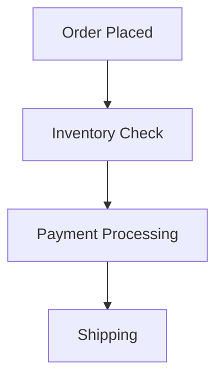

## 1.4.1 Complexity Management

Event-Driven Architecture (EDA) offers numerous benefits, such as scalability, flexibility, and responsiveness. However, these advantages come with the challenge of increased complexity. Managing this complexity is crucial for the successful implementation and operation of EDA systems. In this section, we will explore the various aspects of complexity management in EDA, including architectural layers, distributed system challenges, event lifecycle management, coordination between components, and the importance of documentation.

### Increased Architectural Complexity

EDA introduces additional layers and components that can make the architecture more complex compared to traditional systems. These layers include event producers, consumers, brokers, and channels, each with its own responsibilities and interactions. The decoupling of components, while beneficial for scalability and flexibility, adds to the architectural complexity as it requires careful design and management to ensure seamless communication and coordination.

#### Key Challenges:

- **Component Interactions:** Each component in an EDA system interacts with others through events, which requires a well-defined protocol for event exchange. This can lead to a complex web of interactions that must be managed effectively.
- **Event Flow Management:** Understanding and managing the flow of events through the system is crucial. This involves defining clear event paths and ensuring that events are processed in a timely and efficient manner.

#### Example:

Consider a retail system where an order placed by a customer triggers a series of events: inventory check, payment processing, and shipping. Each of these events may be handled by different services, requiring careful orchestration to ensure the order is fulfilled correctly.

```java
public class OrderService {

    private final EventBroker eventBroker;

    public OrderService(EventBroker eventBroker) {
        this.eventBroker = eventBroker;
    }

    public void placeOrder(Order order) {
        // Publish an event to the broker
        eventBroker.publish(new OrderPlacedEvent(order));
    }
}

public class InventoryService {

    public void onOrderPlaced(OrderPlacedEvent event) {
        // Check inventory and publish an event
        if (checkInventory(event.getOrder())) {
            eventBroker.publish(new InventoryCheckedEvent(event.getOrder()));
        }
    }
}
```

### Distributed System Challenges

EDA systems are inherently distributed, which introduces challenges related to network reliability, consistency, and latency. These challenges can affect the performance and reliability of the system if not managed properly.

#### Key Challenges:

- **Network Reliability:** Distributed systems rely on network communication, which can be unreliable. Network failures can lead to message loss or delays, impacting the system's responsiveness.
- **Consistency:** Ensuring data consistency across distributed components is challenging, especially when dealing with eventual consistency models.

#### Strategies:

- **Redundancy and Failover:** Implement redundancy and failover mechanisms to handle network failures and ensure system reliability.
- **Consistency Models:** Choose appropriate consistency models based on the system's requirements. For example, use eventual consistency for systems where immediate consistency is not critical.

### Managing Event Lifecycles

Tracking the lifecycle of events from creation to consumption is a complex task in EDA systems. It involves ensuring that events are processed in the correct order and that all necessary actions are taken based on the event's state.

#### Key Challenges:

- **Event Ordering:** Maintaining the correct order of events is crucial, especially in systems where the sequence of events affects the outcome.
- **Event State Management:** Keeping track of the state of each event and ensuring that it is processed correctly by all relevant components.

#### Example:

In a banking system, a transaction event must be processed in the correct order to ensure account balances are updated accurately.

```java
public class TransactionService {

    private final Map<String, TransactionState> transactionStates = new ConcurrentHashMap<>();

    public void processTransaction(TransactionEvent event) {
        // Check the state of the transaction
        TransactionState state = transactionStates.get(event.getTransactionId());
        if (state == TransactionState.PENDING) {
            // Process the transaction
            updateAccountBalance(event);
            transactionStates.put(event.getTransactionId(), TransactionState.COMPLETED);
        }
    }
}
```

### Coordination Between Components

Ensuring proper coordination and communication between decoupled components is a significant challenge in EDA systems. Each component must be aware of the events it needs to handle and the actions it must take in response.

#### Key Challenges:

- **Event Routing:** Determining which components should receive which events and ensuring that events are routed correctly.
- **Component Synchronization:** Synchronizing the actions of different components to achieve a coherent system behavior.

#### Strategies:

- **Event Routing Patterns:** Use patterns such as publish-subscribe or point-to-point messaging to manage event routing effectively.
- **Orchestration and Choreography:** Choose between orchestration and choreography based on the system's needs. Orchestration involves a central controller managing interactions, while choreography relies on components coordinating independently.

### Documentation and Understanding

Comprehensive documentation is essential for managing and understanding the intricate event flows in EDA systems. It helps developers and operators understand the system's architecture, event flows, and interactions between components.

#### Key Challenges:

- **Maintaining Up-to-Date Documentation:** Keeping documentation current with the system's evolution is challenging but necessary for effective management.
- **Understanding Event Flows:** Providing clear documentation of event flows and interactions helps in troubleshooting and optimizing the system.

#### Best Practices:

- **Automated Documentation Tools:** Use tools that automatically generate documentation from code and configuration files.
- **Visual Representations:** Create diagrams and flowcharts to visually represent event flows and component interactions.



### Conclusion

Managing complexity in Event-Driven Architectures is a multifaceted challenge that requires careful planning and execution. By understanding the architectural layers, addressing distributed system challenges, managing event lifecycles, ensuring coordination between components, and maintaining comprehensive documentation, organizations can effectively harness the power of EDA while mitigating its complexities.

## Quiz Time!



### Which of the following is a key challenge in managing architectural complexity in EDA?

- [x] Component Interactions
- [ ] Lack of scalability
- [ ] Single point of failure
- [ ] Centralized control

> **Explanation:** Component interactions in EDA systems can become complex due to the decoupled nature of the architecture, requiring careful management to ensure seamless communication.

### What is a common strategy to handle network reliability issues in distributed EDA systems?

- [x] Implementing redundancy and failover mechanisms
- [ ] Using a single server for all components
- [ ] Ignoring network failures
- [ ] Centralizing all data processing

> **Explanation:** Implementing redundancy and failover mechanisms helps ensure system reliability in the face of network failures.

### Why is event ordering important in EDA systems?

- [x] It ensures that events are processed in the correct sequence, affecting the outcome.
- [ ] It reduces the number of events in the system.
- [ ] It simplifies the architecture.
- [ ] It eliminates the need for documentation.

> **Explanation:** Event ordering is crucial because the sequence in which events are processed can significantly impact the system's behavior and outcomes.

### What is a challenge in coordinating between decoupled components in EDA?

- [x] Event Routing
- [ ] Centralized control
- [ ] Lack of scalability
- [ ] Single point of failure

> **Explanation:** Event routing is a challenge because it involves determining which components should receive which events and ensuring correct routing.

### Which of the following is a best practice for maintaining documentation in EDA systems?

- [x] Using automated documentation tools
- [ ] Relying solely on developer memory
- [ ] Avoiding documentation to save time
- [ ] Documenting only the initial design

> **Explanation:** Automated documentation tools help keep documentation up-to-date with the system's evolution, which is crucial for effective management.

### What is a benefit of using visual representations in EDA documentation?

- [x] They help in understanding event flows and component interactions.
- [ ] They eliminate the need for written documentation.
- [ ] They reduce the complexity of the system.
- [ ] They centralize all system components.

> **Explanation:** Visual representations like diagrams and flowcharts make it easier to understand complex event flows and interactions.

### How can event lifecycle management be improved in EDA systems?

- [x] By maintaining event state and ensuring correct processing order
- [ ] By ignoring event states
- [ ] By centralizing all events in a single component
- [ ] By reducing the number of events

> **Explanation:** Managing event state and ensuring correct processing order are crucial for effective event lifecycle management.

### What is a common challenge in distributed EDA systems?

- [x] Ensuring data consistency
- [ ] Lack of scalability
- [ ] Centralized control
- [ ] Single point of failure

> **Explanation:** Ensuring data consistency across distributed components is a common challenge due to the nature of distributed systems.

### Which pattern can be used for effective event routing in EDA?

- [x] Publish-Subscribe
- [ ] Centralized control
- [ ] Single point of failure
- [ ] Monolithic architecture

> **Explanation:** The publish-subscribe pattern is effective for managing event routing by allowing components to subscribe to relevant events.

### True or False: Documentation is not necessary for managing complexity in EDA systems.

- [ ] True
- [x] False

> **Explanation:** Documentation is essential for managing complexity in EDA systems as it helps in understanding and troubleshooting event flows and component interactions.


