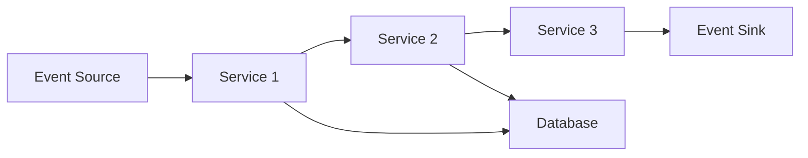

## 1.4.3 Monitoring and Debugging

In the realm of Event-Driven Architectures (EDA), monitoring and debugging are crucial yet challenging tasks. The inherent complexity of distributed systems, combined with the asynchronous nature of event flows, necessitates robust strategies and tools to ensure system reliability and performance. This section delves into the key challenges associated with monitoring and debugging in EDA, providing insights and practical solutions to overcome them.

### Visibility into Event Flows

One of the primary challenges in EDA is achieving end-to-end visibility into event flows. Unlike traditional architectures where operations are often linear and predictable, EDA involves multiple components communicating asynchronously, making it difficult to track the journey of an event from start to finish.

#### Challenges

- **Distributed Nature**: Events can traverse multiple services, each potentially running on different nodes or even different geographical locations. This distribution complicates the task of maintaining a coherent view of the system's state.
- **Asynchronous Communication**: Events are often processed asynchronously, meaning there is no straightforward call stack to follow, which makes it harder to trace the flow of events.

#### Solutions

- **Centralized Logging**: Implement centralized logging systems that aggregate logs from all services. Tools like ELK Stack (Elasticsearch, Logstash, Kibana) can be used to collect and visualize logs, providing insights into event flows.
- **Tracing Systems**: Utilize distributed tracing tools such as OpenTelemetry or Jaeger. These tools help in visualizing the path of an event across services, offering a clear picture of the event flow.

```java
// Example of using OpenTelemetry in a Java application
import io.opentelemetry.api.GlobalOpenTelemetry;
import io.opentelemetry.api.trace.Span;
import io.opentelemetry.api.trace.Tracer;

public class EventProcessor {
    private static final Tracer tracer = GlobalOpenTelemetry.getTracer("event-processor");

    public void processEvent(Event event) {
        Span span = tracer.spanBuilder("processEvent").startSpan();
        try {
            // Process the event
        } finally {
            span.end();
        }
    }
}
```

### Identifying and Tracing Events

Tracking and tracing individual events through a complex system is another significant challenge. Events may be transformed, enriched, or split into multiple sub-events, making it difficult to maintain a consistent trace.

#### Challenges

- **Event Transformation**: As events pass through various services, they may undergo transformations, which can obscure their original identity.
- **Event Splitting and Aggregation**: Events might be split into multiple parts or aggregated with other events, complicating the tracing process.

#### Solutions

- **Unique Identifiers**: Assign unique identifiers to events at the source. These identifiers should be propagated through all services to maintain traceability.
- **Correlation IDs**: Use correlation IDs to link related events. This is particularly useful in scenarios where events are split or aggregated.

```java
// Example of assigning a unique identifier to an event
import java.util.UUID;

public class Event {
    private final String id;
    private final String payload;

    public Event(String payload) {
        this.id = UUID.randomUUID().toString();
        this.payload = payload;
    }

    public String getId() {
        return id;
    }

    public String getPayload() {
        return payload;
    }
}
```

### Latency and Performance Bottlenecks

Latency and performance bottlenecks can significantly impact the responsiveness of an event-driven system. Identifying and addressing these issues is crucial for maintaining optimal performance.

#### Challenges

- **Variable Latency**: The asynchronous nature of EDA can introduce variable latency, making it difficult to pinpoint performance issues.
- **Resource Contention**: Shared resources, such as databases or message brokers, can become bottlenecks if not properly managed.

#### Solutions

- **Performance Monitoring Tools**: Use tools like Prometheus and Grafana to monitor system performance metrics, such as latency, throughput, and error rates.
- **Load Testing**: Conduct regular load testing to identify potential bottlenecks and optimize resource allocation.



### Tooling and Observability Solutions

Robust monitoring and observability tools are essential for managing the complexities of EDA systems. These tools provide the necessary insights to maintain system health and performance.

#### Challenges

- **Tool Integration**: Integrating various monitoring tools into a cohesive observability platform can be challenging.
- **Data Overload**: The sheer volume of data generated by monitoring tools can be overwhelming, making it difficult to extract actionable insights.

#### Solutions

- **Unified Observability Platforms**: Consider using platforms like Datadog or New Relic, which offer comprehensive observability solutions that integrate metrics, logs, and traces.
- **Alerting and Dashboards**: Set up alerting mechanisms and dashboards to visualize key performance indicators (KPIs) and quickly identify issues.

### Debugging Asynchronous Processes

Debugging asynchronous processes in EDA can be complex due to the lack of a linear execution path. Traditional debugging techniques often fall short in such environments.

#### Challenges

- **Non-Deterministic Execution**: Asynchronous processes may not execute in a predictable order, complicating the debugging process.
- **State Management**: Maintaining and inspecting the state of distributed components can be challenging.

#### Solutions

- **Event Replay**: Implement event replay mechanisms to reproduce issues by replaying events in a controlled environment.
- **State Inspection Tools**: Use tools that allow for the inspection of the state of distributed components, such as service meshes or stateful inspection tools.

```java
// Example of a simple event replay mechanism
public class EventReplayer {
    private final EventStore eventStore;

    public EventReplayer(EventStore eventStore) {
        this.eventStore = eventStore;
    }

    public void replayEvents() {
        List<Event> events = eventStore.getAllEvents();
        for (Event event : events) {
            // Replay the event
        }
    }
}
```

### Conclusion

Monitoring and debugging in Event-Driven Architectures require a strategic approach and the right set of tools. By implementing robust monitoring solutions, leveraging unique identifiers and correlation IDs, and employing advanced debugging techniques, developers can effectively manage the complexities of EDA systems. As these systems continue to evolve, staying informed about the latest tools and best practices is essential for maintaining system reliability and performance.

## Quiz Time!



### What is a primary challenge in gaining visibility into event flows in EDA?

- [x] The distributed nature of the system
- [ ] The use of synchronous communication
- [ ] The simplicity of event processing
- [ ] The lack of event identifiers

> **Explanation:** The distributed nature of the system makes it difficult to track events across multiple services and nodes.

### Which tool is commonly used for distributed tracing in EDA?

- [x] OpenTelemetry
- [ ] Jenkins
- [ ] Docker
- [ ] Git

> **Explanation:** OpenTelemetry is a popular tool for distributed tracing, helping visualize the path of events across services.

### How can unique identifiers help in event tracing?

- [x] They maintain traceability of events across services
- [ ] They increase the size of the payload
- [ ] They simplify the event processing logic
- [ ] They reduce the need for logging

> **Explanation:** Unique identifiers help maintain traceability by allowing events to be tracked across different services.

### What is a common tool for centralized logging?

- [x] ELK Stack
- [ ] Kubernetes
- [ ] Ansible
- [ ] Jenkins

> **Explanation:** ELK Stack (Elasticsearch, Logstash, Kibana) is commonly used for centralized logging and visualization.

### What is a benefit of using correlation IDs?

- [x] They link related events
- [ ] They reduce system latency
- [x] They simplify debugging
- [ ] They eliminate the need for tracing

> **Explanation:** Correlation IDs link related events, simplifying debugging and tracing processes.

### What challenge does variable latency pose in EDA?

- [x] It makes pinpointing performance issues difficult
- [ ] It simplifies the debugging process
- [ ] It reduces the need for monitoring
- [ ] It increases system throughput

> **Explanation:** Variable latency can obscure performance issues, making it challenging to identify bottlenecks.

### Which tool is used for performance monitoring in EDA?

- [x] Prometheus
- [ ] GitHub
- [x] Grafana
- [ ] Docker

> **Explanation:** Prometheus and Grafana are used for monitoring system performance metrics like latency and throughput.

### What is a key feature of unified observability platforms?

- [x] Integration of metrics, logs, and traces
- [ ] Reduction of system complexity
- [ ] Elimination of the need for debugging
- [ ] Increase in event processing speed

> **Explanation:** Unified observability platforms integrate metrics, logs, and traces to provide comprehensive insights.

### How does event replay help in debugging?

- [x] It reproduces issues by replaying events
- [ ] It simplifies the event processing logic
- [ ] It reduces the need for logging
- [ ] It increases system latency

> **Explanation:** Event replay allows developers to reproduce issues by replaying events in a controlled environment.

### True or False: Asynchronous processes in EDA execute in a predictable order.

- [ ] True
- [x] False

> **Explanation:** Asynchronous processes do not execute in a predictable order, which complicates debugging.


