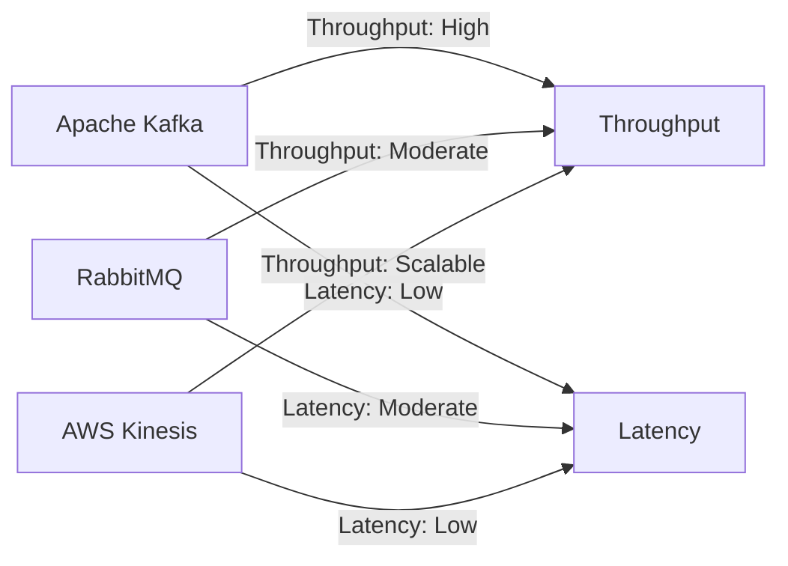

## 10.2.1 Performance Benchmarks

In the realm of Event-Driven Architecture (EDA), performance benchmarks are crucial for evaluating and selecting the right tools and technologies. This section delves into the key performance metrics, the methodology for conducting controlled benchmark tests, and a comparative analysis of various EDA tools. We will explore throughput, latency, fault tolerance, scalability, and resource efficiency, providing insights to help you make informed decisions.

### Key Performance Metrics

Understanding the critical performance metrics is the first step in evaluating EDA tools. These metrics provide a quantitative basis for comparison and include:

- **Throughput:** Measured in messages per second, throughput indicates the volume of events a system can handle. High throughput is essential for systems with large-scale data processing needs.
  
- **Latency:** This metric measures the delay in processing events, crucial for real-time applications where timely responses are necessary.
  
- **Resource Utilization:** This includes CPU, memory, and storage usage, reflecting the efficiency of a tool in using system resources.

- **Fault Tolerance and Reliability:** These metrics assess a system's ability to handle failures gracefully, ensuring message persistence and automatic recovery.

- **Scalability:** This measures how well a system maintains performance as the load increases, indicating its ability to grow with demand.

### Conducting Controlled Benchmark Testing

To ensure accurate and consistent performance measurements, controlled benchmark testing is essential. This involves setting up a standardized environment where variables are tightly controlled. Here are the steps to conduct effective benchmark testing:

1. **Define the Test Environment:** Use identical hardware and software configurations across tests to eliminate discrepancies.

2. **Establish Baseline Metrics:** Measure the system's performance under normal conditions to establish a baseline for comparison.

3. **Simulate Real-World Loads:** Use tools to generate event streams that mimic real-world usage patterns, ensuring the tests are relevant.

4. **Monitor and Record Metrics:** Utilize monitoring tools to capture throughput, latency, and resource utilization data during the tests.

5. **Repeat Tests for Consistency:** Conduct multiple iterations to ensure results are consistent and reliable.

### Comparing Throughput Capabilities

Throughput is a critical factor in determining an EDA tool's ability to handle high-volume event streams. Let's compare some popular tools:

- **Apache Kafka:** Known for its high throughput, Kafka can handle millions of messages per second, making it ideal for large-scale data pipelines.

- **RabbitMQ:** While offering robust features, RabbitMQ's throughput is generally lower than Kafka, but it excels in scenarios requiring complex routing.

- **AWS Kinesis:** Designed for real-time data streaming, Kinesis provides scalable throughput, suitable for cloud-based applications.

### Evaluating Latency Performance

Latency is vital for applications requiring real-time processing. Here's how different tools perform:

- **Apache Kafka:** Offers low latency, typically in the milliseconds range, making it suitable for time-sensitive applications.

- **RabbitMQ:** Provides moderate latency, which can be optimized with tuning but may not match Kafka's performance in high-speed scenarios.

- **AWS Kinesis:** Offers low latency, especially when integrated with AWS services, providing seamless real-time processing.

### Analyzing Fault Tolerance and Reliability

Fault tolerance ensures system reliability in the face of failures. Here's a comparison:

- **Apache Kafka:** Provides strong fault tolerance with features like replication and automatic failover, ensuring message durability.

- **RabbitMQ:** Offers reliable message delivery with persistent queues and acknowledgments, though it may require manual intervention for complex failover scenarios.

- **AWS Kinesis:** Ensures reliability with built-in redundancy and automatic scaling, though it may incur additional costs for high availability.

### Measuring Scalability

Scalability is crucial for systems expected to grow. Here's how the tools stack up:

- **Apache Kafka:** Highly scalable, Kafka can handle increasing loads by adding more brokers and partitions.

- **RabbitMQ:** Scales well for moderate loads but may require architectural changes for massive scaling.

- **AWS Kinesis:** Provides seamless scalability with AWS infrastructure, automatically adjusting to handle varying loads.

### Reviewing Resource Efficiency

Resource efficiency impacts cost-effectiveness. Here's a comparison:

- **Apache Kafka:** Efficient in resource usage, though it may require tuning for optimal performance in resource-constrained environments.

- **RabbitMQ:** Generally consumes more resources due to its rich feature set, but offers flexibility in deployment.

- **AWS Kinesis:** Resource usage is managed by AWS, offering a pay-as-you-go model that can be cost-effective for variable workloads.

### Presenting Benchmark Results Visually

Visual representation of benchmark results aids in decision-making. Below is a sample chart comparing throughput and latency across different tools:

### Conclusion

Performance benchmarks are indispensable for evaluating EDA tools. By understanding key metrics and conducting controlled tests, you can make informed decisions that align with your system's needs. Apache Kafka, RabbitMQ, and AWS Kinesis each offer unique strengths, and your choice should reflect your specific requirements for throughput, latency, fault tolerance, scalability, and resource efficiency.

## Quiz Time!



### Which metric measures the volume of events a system can handle?

- [x] Throughput
- [ ] Latency
- [ ] Resource Utilization
- [ ] Fault Tolerance

> **Explanation:** Throughput is measured in messages per second and indicates the volume of events a system can handle.

### What is the importance of conducting controlled benchmark testing?

- [x] To ensure accurate and consistent performance measurements
- [ ] To increase system latency
- [ ] To reduce resource utilization
- [ ] To improve fault tolerance

> **Explanation:** Controlled benchmark testing ensures accurate and consistent performance measurements by eliminating discrepancies.

### Which tool is known for its high throughput capabilities?

- [x] Apache Kafka
- [ ] RabbitMQ
- [ ] AWS Kinesis
- [ ] Azure Event Grid

> **Explanation:** Apache Kafka is known for its high throughput, capable of handling millions of messages per second.

### What does latency measure in an EDA system?

- [ ] The volume of events processed
- [x] The delay in processing events
- [ ] The resource consumption
- [ ] The fault tolerance

> **Explanation:** Latency measures the delay in processing events, crucial for real-time applications.

### Which tool offers strong fault tolerance with features like replication and automatic failover?

- [x] Apache Kafka
- [ ] RabbitMQ
- [ ] AWS Kinesis
- [ ] Google Cloud Pub/Sub

> **Explanation:** Apache Kafka provides strong fault tolerance with features like replication and automatic failover.

### How does AWS Kinesis ensure reliability?

- [ ] By using manual failover
- [x] With built-in redundancy and automatic scaling
- [ ] By reducing throughput
- [ ] By increasing latency

> **Explanation:** AWS Kinesis ensures reliability with built-in redundancy and automatic scaling.

### Which tool is highly scalable and can handle increasing loads by adding more brokers and partitions?

- [x] Apache Kafka
- [ ] RabbitMQ
- [ ] AWS Kinesis
- [ ] Azure Event Hub

> **Explanation:** Apache Kafka is highly scalable and can handle increasing loads by adding more brokers and partitions.

### What is the impact of resource efficiency on an EDA system?

- [x] It affects cost-effectiveness
- [ ] It increases latency
- [ ] It reduces throughput
- [ ] It decreases fault tolerance

> **Explanation:** Resource efficiency impacts cost-effectiveness by determining how efficiently a tool uses system resources.

### Which tool provides a pay-as-you-go model that can be cost-effective for variable workloads?

- [ ] Apache Kafka
- [ ] RabbitMQ
- [x] AWS Kinesis
- [ ] Google Cloud Pub/Sub

> **Explanation:** AWS Kinesis provides a pay-as-you-go model that can be cost-effective for variable workloads.

### True or False: Visual representation of benchmark results aids in decision-making.

- [x] True
- [ ] False

> **Explanation:** Visual representation of benchmark results, such as charts and graphs, facilitates easier comparison and decision-making.


