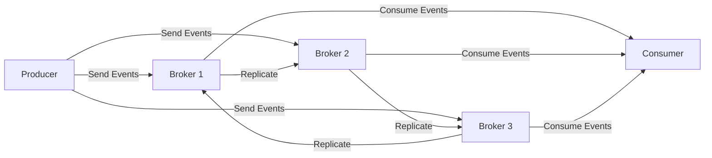

## 10.2.2 Scalability and Flexibility in Event-Driven Architectures

In the realm of Event-Driven Architectures (EDA), scalability and flexibility are paramount to building systems that can handle varying loads and adapt to changing requirements. This section delves into how different tools and platforms support these crucial aspects, ensuring robust and responsive event-driven systems.

### Assessing Horizontal and Vertical Scalability

Scalability is a core requirement for any event-driven system, as it must efficiently handle increasing volumes of events without degradation in performance. There are two primary forms of scalability:

- **Horizontal Scalability:** This involves adding more instances of a service or component to distribute the load. Tools that support horizontal scalability allow for seamless scaling out, which is particularly beneficial for cloud-native applications. For instance, Apache Kafka, a popular event streaming platform, can scale horizontally by adding more brokers to a cluster, thereby increasing its capacity to handle more partitions and throughput.

- **Vertical Scalability:** This entails increasing the resources (CPU, memory, etc.) of existing instances. While this can be effective for certain workloads, it has limitations due to hardware constraints. Tools like RabbitMQ can benefit from vertical scaling by enhancing the performance of individual nodes, but this approach is often less flexible than horizontal scaling.

#### Java Code Example: Horizontal Scaling with Kafka

```java
import org.apache.kafka.clients.producer.KafkaProducer;
import org.apache.kafka.clients.producer.ProducerRecord;
import java.util.Properties;

public class KafkaProducerExample {
    public static void main(String[] args) {
        Properties props = new Properties();
        props.put("bootstrap.servers", "localhost:9092,localhost:9093,localhost:9094"); // Multiple brokers for horizontal scaling
        props.put("key.serializer", "org.apache.kafka.common.serialization.StringSerializer");
        props.put("value.serializer", "org.apache.kafka.common.serialization.StringSerializer");

        KafkaProducer<String, String> producer = new KafkaProducer<>(props);
        for (int i = 0; i < 100; i++) {
            producer.send(new ProducerRecord<>("my-topic", Integer.toString(i), "message-" + i));
        }
        producer.close();
    }
}
```

### Evaluating Elasticity Features

Elasticity refers to the ability of a system to automatically adjust its resources based on the current load. This feature is crucial for maintaining performance while optimizing costs. Many cloud-based EDA tools, such as AWS EventBridge and Azure Event Grid, offer built-in elasticity, allowing systems to scale resources up or down dynamically.

#### Real-World Scenario: Elastic Scaling in Cloud Environments

Consider an e-commerce platform that experiences fluctuating traffic due to seasonal sales. By leveraging the elasticity features of cloud-based event brokers, the platform can automatically scale its event processing capabilities during peak times and reduce resources during off-peak periods, ensuring cost-efficiency and optimal performance.

### Reviewing Modular and Extensible Architectures

Modularity and extensibility are key to building flexible systems that can evolve over time. Tools that support modular architectures allow developers to add or remove components as needed, while extensibility through plugins or APIs enables the integration of new features without disrupting existing functionality.

- **Apache Kafka:** Offers a rich ecosystem of connectors and plugins through Kafka Connect, allowing seamless integration with various data sources and sinks.
- **RabbitMQ:** Provides a plugin architecture that enables the addition of custom features, such as new authentication mechanisms or message routing strategies.

### Analyzing Support for Distributed Systems

Distributed systems are integral to modern EDA, providing resilience and scalability across multiple nodes and geographic locations. Tools that support distributed architectures facilitate multi-node deployments, data replication, and geo-distribution, ensuring high availability and fault tolerance.

#### Diagram: Distributed Kafka Cluster



### Considering Integration with Microservices

Microservices architectures benefit greatly from event-driven systems, as they enable loose coupling and asynchronous communication between services. Tools that integrate well with microservices provide seamless event handling and communication across services, enhancing the overall system's responsiveness and agility.

- **Spring Cloud Stream:** A framework that simplifies the development of event-driven microservices by providing abstractions over messaging systems like Kafka and RabbitMQ.

#### Java Code Example: Spring Cloud Stream Integration

```java
import org.springframework.cloud.stream.annotation.EnableBinding;
import org.springframework.cloud.stream.messaging.Source;
import org.springframework.messaging.support.MessageBuilder;
import org.springframework.beans.factory.annotation.Autowired;
import org.springframework.web.bind.annotation.PostMapping;
import org.springframework.web.bind.annotation.RestController;

@RestController
@EnableBinding(Source.class)
public class EventController {

    @Autowired
    private Source source;

    @PostMapping("/sendEvent")
    public String sendEvent() {
        source.output().send(MessageBuilder.withPayload("Hello, World!").build());
        return "Event sent!";
    }
}
```

### Examining Configuration Flexibility

Configuration flexibility is essential for tailoring tools to specific application requirements. Tools that offer extensive configuration options allow developers to fine-tune performance, security, and other aspects to meet their unique needs.

- **Kafka:** Provides a wide range of configuration settings for producers, consumers, and brokers, enabling precise control over aspects like batch size, compression, and replication.

### Evaluating Multi-Tenancy Support

Multi-tenancy allows multiple users or applications to share the same infrastructure without interference. Tools that support multi-tenancy provide isolation and resource management features, ensuring that each tenant's data and operations remain secure and independent.

- **Apache Kafka:** Supports multi-tenancy through topic-level access controls and quotas, enabling different applications to coexist within the same cluster.

### Exploring the Use of APIs and SDKs

APIs and SDKs are crucial for integrating event-driven tools with various programming languages and systems. Robust APIs and SDKs enhance flexibility by providing developers with the means to interact with the system programmatically, facilitating automation and integration.

- **Kafka Streams API:** Offers a powerful DSL for building real-time stream processing applications, enabling developers to process and analyze data streams with ease.

#### Java Code Example: Kafka Streams API

```java
import org.apache.kafka.streams.KafkaStreams;
import org.apache.kafka.streams.StreamsBuilder;
import org.apache.kafka.streams.kstream.KStream;
import org.apache.kafka.streams.kstream.KTable;
import org.apache.kafka.streams.kstream.Materialized;
import org.apache.kafka.streams.kstream.Produced;

public class KafkaStreamsExample {
    public static void main(String[] args) {
        StreamsBuilder builder = new StreamsBuilder();
        KStream<String, String> textLines = builder.stream("input-topic");
        KTable<String, Long> wordCounts = textLines
            .flatMapValues(value -> Arrays.asList(value.toLowerCase().split("\\W+")))
            .groupBy((key, word) -> word)
            .count(Materialized.as("counts-store"));

        wordCounts.toStream().to("output-topic", Produced.with(Serdes.String(), Serdes.Long()));

        KafkaStreams streams = new KafkaStreams(builder.build(), new Properties());
        streams.start();
    }
}
```

### Conclusion

Scalability and flexibility are critical components of effective event-driven architectures. By understanding and leveraging the capabilities of various tools, developers can build systems that are not only robust and responsive but also adaptable to future demands. Whether through horizontal scaling, modular architectures, or seamless integration with microservices, the right choice of tools can significantly enhance the performance and agility of event-driven systems.

## Quiz Time!



### Which type of scalability involves adding more instances to distribute load?

- [x] Horizontal Scalability
- [ ] Vertical Scalability
- [ ] Elastic Scalability
- [ ] Modular Scalability

> **Explanation:** Horizontal scalability involves adding more instances of a service or component to distribute the load.

### What is the primary benefit of elasticity in event-driven systems?

- [ ] Increased complexity
- [x] Dynamic resource adjustment
- [ ] Reduced security
- [ ] Fixed resource allocation

> **Explanation:** Elasticity allows systems to automatically adjust resources based on current load, optimizing performance and cost.

### Which tool is known for its modular and extensible architecture through plugins?

- [ ] Apache Kafka
- [x] RabbitMQ
- [ ] AWS EventBridge
- [ ] Azure Event Grid

> **Explanation:** RabbitMQ provides a plugin architecture that enables the addition of custom features.

### What is the advantage of using APIs and SDKs in event-driven architectures?

- [ ] Increased latency
- [ ] Reduced flexibility
- [x] Enhanced integration
- [ ] Limited language support

> **Explanation:** APIs and SDKs enhance flexibility by allowing integration with various programming languages and systems.

### How does Apache Kafka support multi-tenancy?

- [ ] By using separate clusters for each tenant
- [x] Through topic-level access controls and quotas
- [ ] By restricting the number of consumers
- [ ] By limiting the number of producers

> **Explanation:** Apache Kafka supports multi-tenancy through topic-level access controls and quotas.

### Which of the following is a feature of distributed systems in EDA?

- [ ] Single-node deployment
- [ ] Lack of data replication
- [x] Multi-node deployments
- [ ] Centralized processing

> **Explanation:** Distributed systems in EDA facilitate multi-node deployments, data replication, and geo-distribution.

### What is the role of Spring Cloud Stream in microservices?

- [ ] To provide database management
- [x] To simplify the development of event-driven microservices
- [ ] To handle user authentication
- [ ] To manage file storage

> **Explanation:** Spring Cloud Stream simplifies the development of event-driven microservices by providing abstractions over messaging systems.

### Which scalability type is limited by hardware constraints?

- [x] Vertical Scalability
- [ ] Horizontal Scalability
- [ ] Elastic Scalability
- [ ] Modular Scalability

> **Explanation:** Vertical scalability is limited by hardware constraints as it involves increasing resources of existing instances.

### What is a key feature of Kafka Streams API?

- [ ] Batch processing
- [x] Real-time stream processing
- [ ] Static data analysis
- [ ] File-based processing

> **Explanation:** Kafka Streams API offers a powerful DSL for building real-time stream processing applications.

### True or False: Elasticity in EDA ensures fixed resource allocation.

- [ ] True
- [x] False

> **Explanation:** Elasticity in EDA allows for dynamic resource adjustment based on current load, not fixed allocation.


