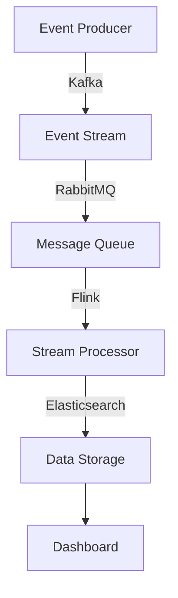

## 10.3.1 Best of Breed Approaches

In the realm of Event-Driven Architecture (EDA), the "Best of Breed" strategy stands out as a powerful approach for building robust, scalable, and efficient systems. This strategy involves selecting the best tool for each specific function within the EDA, rather than relying on a single monolithic platform. By leveraging specialized tools that excel in particular areas, organizations can optimize performance, enhance flexibility, and ensure that each component of their architecture is finely tuned to meet specific requirements.

### Defining Best of Breed Strategy

The Best of Breed strategy is about choosing the most effective and efficient tool for each task or function in your architecture. Instead of using a one-size-fits-all solution, this approach allows for the integration of various specialized tools, each excelling in its domain. This can lead to better performance, more features, and greater adaptability to changing requirements.

#### Key Benefits:
- **Specialization:** Each tool is optimized for its specific function, leading to better performance and reliability.
- **Flexibility:** Organizations can mix and match tools as needed, adapting to new challenges and technologies.
- **Innovation:** By using the latest and most advanced tools, organizations can stay at the forefront of technology.

### Identifying Core Functionalities

To effectively implement a Best of Breed strategy, it's crucial to first identify the core functionalities required in your EDA. These typically include:

- **Event Streaming:** Managing the flow of events in real-time.
- **Message Queuing:** Ensuring reliable delivery of messages between components.
- **Stream Processing:** Analyzing and processing data streams in real-time.
- **Data Storage:** Efficiently storing and retrieving event data.

### Research and Select Optimal Tools

Once the core functionalities are identified, the next step is to research and select the most effective tools for each functionality. Here are some considerations:

- **Performance:** Evaluate the tool's ability to handle your expected load and throughput.
- **Reliability:** Consider the tool's track record for uptime and fault tolerance.
- **Community and Support:** A strong community and support system can be invaluable for troubleshooting and learning.

#### Example Tools:
- **Event Streaming:** Apache Kafka is renowned for its high throughput and fault tolerance.
- **Message Queuing:** RabbitMQ offers robust message queuing capabilities with support for multiple messaging protocols.
- **Stream Processing:** Apache Flink provides powerful stream processing capabilities with low-latency and high-throughput.
- **Data Storage:** Elasticsearch is a popular choice for storing and querying large volumes of data efficiently.

### Ensuring Compatibility and Interoperability

A critical aspect of the Best of Breed strategy is ensuring that the selected tools can seamlessly integrate and communicate with each other. This involves:

- **APIs and SDKs:** Leveraging the APIs and SDKs provided by each tool to facilitate integration.
- **Connectors:** Using connectors to bridge different systems and ensure smooth data flow.
- **Standardized Protocols:** Adopting standardized communication protocols like HTTP, gRPC, or AMQP to ensure compatibility.

### Leveraging APIs and Connectors

APIs and connectors play a vital role in enhancing integration capabilities. They simplify communication between different technologies and allow for:

- **Data Exchange:** Seamless data exchange between components.
- **Process Orchestration:** Coordinating processes across different tools.
- **Extensibility:** Easily adding new functionalities or tools as needed.

#### Example Java Code for Kafka Producer:
```java
import org.apache.kafka.clients.producer.KafkaProducer;
import org.apache.kafka.clients.producer.ProducerRecord;
import java.util.Properties;

public class KafkaEventProducer {
    public static void main(String[] args) {
        Properties props = new Properties();
        props.put("bootstrap.servers", "localhost:9092");
        props.put("key.serializer", "org.apache.kafka.common.serialization.StringSerializer");
        props.put("value.serializer", "org.apache.kafka.common.serialization.StringSerializer");

        KafkaProducer<String, String> producer = new KafkaProducer<>(props);
        ProducerRecord<String, String> record = new ProducerRecord<>("events", "key", "value");

        producer.send(record, (metadata, exception) -> {
            if (exception == null) {
                System.out.println("Record sent with key " + "key" + " to partition " + metadata.partition()
                        + " with offset " + metadata.offset());
            } else {
                exception.printStackTrace();
            }
        });

        producer.close();
    }
}
```
*This code snippet demonstrates a simple Kafka producer in Java, sending a message to a Kafka topic.*

### Implement Consistent Data Schemas

To maintain compatibility and ensure data consistency across integrated tools, it's essential to implement consistent data schemas. This involves:

- **Schema Definition:** Clearly defining data structures and formats.
- **Versioning:** Managing schema versions to handle changes over time.
- **Validation:** Ensuring data conforms to the defined schema before processing.

### Plan for Unified Monitoring and Management

With multiple tools in play, developing a unified monitoring and management strategy is crucial. This can be achieved through:

- **Centralized Dashboards:** Using tools like Grafana or Kibana to visualize metrics from all components.
- **Alerting Systems:** Setting up alerts for key performance indicators (KPIs) to quickly identify and address issues.
- **Logging and Tracing:** Implementing comprehensive logging and tracing to monitor data flow and diagnose problems.

### Example Best of Breed Implementation

Consider an organization that uses the following setup:

- **Apache Kafka** for event streaming, handling high-throughput data ingestion.
- **RabbitMQ** for message queuing, ensuring reliable message delivery between services.
- **Apache Flink** for stream processing, performing real-time analytics and transformations.
- **Elasticsearch** for data storage, enabling fast search and retrieval of event data.

#### Workflow Diagram:


*This diagram illustrates the flow of events through a Best of Breed EDA setup, highlighting the role of each tool.*

### Conclusion

The Best of Breed approach in Event-Driven Architecture allows organizations to leverage the strengths of specialized tools, resulting in a more efficient and adaptable system. By carefully selecting, integrating, and managing these tools, businesses can build robust architectures that meet their specific needs and scale with their growth.

For further exploration, consider diving into the official documentation of the tools mentioned, such as [Apache Kafka](https://kafka.apache.org/), [RabbitMQ](https://www.rabbitmq.com/), [Apache Flink](https://flink.apache.org/), and [Elasticsearch](https://www.elastic.co/elasticsearch/).

## Quiz Time!



### What is the Best of Breed strategy in EDA?

- [x] Selecting the best tool for each specific function within the EDA
- [ ] Using a single monolithic platform for all functions
- [ ] Prioritizing cost over performance when selecting tools
- [ ] Avoiding the use of APIs and connectors

> **Explanation:** The Best of Breed strategy involves selecting the best tool for each specific function, rather than relying on a single platform.

### Which of the following is NOT a core functionality in EDA?

- [ ] Event Streaming
- [ ] Message Queuing
- [ ] Stream Processing
- [x] User Authentication

> **Explanation:** User Authentication is not a core functionality specific to EDA; it is a general system requirement.

### What is a key benefit of using the Best of Breed approach?

- [x] Specialization in specific functions
- [ ] Reduced need for integration
- [ ] Simplified architecture
- [ ] Lower initial setup cost

> **Explanation:** Specialization allows each tool to excel in its specific function, leading to better performance.

### Which tool is commonly used for event streaming in a Best of Breed setup?

- [x] Apache Kafka
- [ ] RabbitMQ
- [ ] Apache Flink
- [ ] Elasticsearch

> **Explanation:** Apache Kafka is widely used for event streaming due to its high throughput and fault tolerance.

### What role do APIs and connectors play in a Best of Breed architecture?

- [x] Facilitate integration and communication between tools
- [ ] Increase the complexity of the system
- [ ] Limit the choice of tools
- [ ] Reduce system performance

> **Explanation:** APIs and connectors are crucial for ensuring seamless integration and communication between different tools.

### Why is it important to implement consistent data schemas in EDA?

- [x] To maintain compatibility and ensure data consistency
- [ ] To increase the complexity of data management
- [ ] To limit the flexibility of the system
- [ ] To reduce data processing speed

> **Explanation:** Consistent data schemas help maintain compatibility and ensure data consistency across integrated tools.

### What is a common tool used for message queuing in a Best of Breed setup?

- [ ] Apache Kafka
- [x] RabbitMQ
- [ ] Apache Flink
- [ ] Elasticsearch

> **Explanation:** RabbitMQ is commonly used for message queuing due to its robust capabilities and support for multiple protocols.

### What is the purpose of a centralized dashboard in a Best of Breed architecture?

- [x] To visualize metrics from all components
- [ ] To increase the complexity of monitoring
- [ ] To limit the visibility of system performance
- [ ] To reduce the need for logging

> **Explanation:** Centralized dashboards help visualize metrics from all components, aiding in monitoring and management.

### Which tool is used for stream processing in the example Best of Breed implementation?

- [ ] Apache Kafka
- [ ] RabbitMQ
- [x] Apache Flink
- [ ] Elasticsearch

> **Explanation:** Apache Flink is used for stream processing due to its powerful real-time analytics capabilities.

### True or False: The Best of Breed approach simplifies the architecture by reducing the number of tools used.

- [ ] True
- [x] False

> **Explanation:** The Best of Breed approach involves using multiple specialized tools, which can increase complexity but offers better performance and flexibility.


