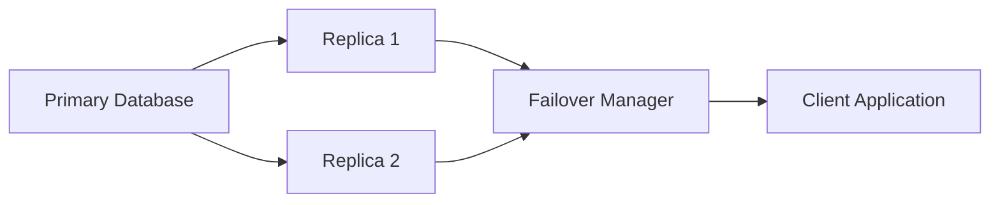
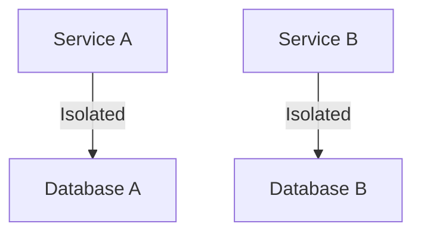
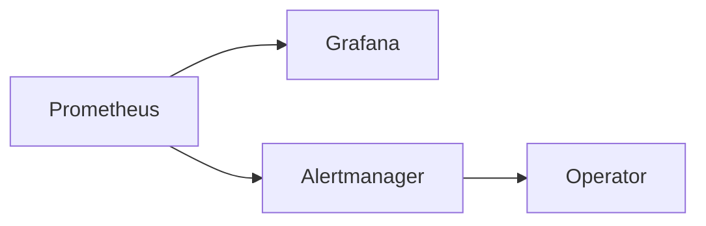

## 11.2.1 Fault Tolerance Techniques

In the realm of event-driven architectures (EDA), building resilient systems is paramount to ensure continuous operation and reliability. Fault tolerance techniques are essential to handle unexpected failures gracefully and maintain service availability. This section delves into various strategies and patterns that can be employed to enhance the fault tolerance of event-driven systems.

### Redundancy Implementation

Redundancy is a fundamental principle in fault-tolerant design. By duplicating critical components, such as servers and databases, systems can continue to operate even when individual components fail. Redundancy ensures that there are backup resources available to take over in case of a failure, minimizing downtime and service disruption.

#### Practical Example: Server Redundancy

Consider a scenario where a web application is hosted on multiple servers. By distributing the load across these servers, the system can handle the failure of one server without affecting the overall availability. Load balancers play a crucial role in managing traffic and directing requests to healthy servers.

```java
// Example of a simple load balancer configuration using Spring Cloud
@Bean
public IRule loadBalancingRule() {
    return new RoundRobinRule(); // Distributes requests evenly across available servers
}
```

In this Java example, the `RoundRobinRule` is used to distribute incoming requests evenly across a pool of servers, ensuring redundancy and fault tolerance.

### Failover Mechanisms

Failover mechanisms are designed to automatically detect failures and switch operations to backup components without human intervention. This seamless transition is critical for minimizing downtime and maintaining service continuity.

#### Automatic Failover with Database Clusters

In database systems, failover can be implemented using clusters where a primary database is backed by one or more replicas. If the primary database fails, a replica can be promoted to take over as the new primary.



In this diagram, the failover manager monitors the primary database and promotes a replica to primary status in case of failure, ensuring continuous data availability.

### Data Replication

Data replication is a strategy to ensure data availability and consistency across multiple locations. It involves copying data from one location to another, allowing systems to access the same data even if one location becomes unavailable.

#### Master-Slave and Master-Master Configurations

- **Master-Slave Replication:** In this configuration, the master database handles all write operations, while one or more slave databases replicate the data for read operations. This setup improves read performance and provides redundancy.

- **Master-Master Replication:** Both databases can handle read and write operations, synchronizing changes between them. This configuration offers higher availability and load balancing but requires conflict resolution mechanisms.

```java
// Example configuration for a master-slave replication setup
@Configuration
public class DataSourceConfig {

    @Bean
    public DataSource dataSource() {
        return DataSourceBuilder.create()
                .url("jdbc:mysql://master-db:3306/mydb")
                .username("user")
                .password("password")
                .build();
    }

    @Bean
    public DataSource slaveDataSource() {
        return DataSourceBuilder.create()
                .url("jdbc:mysql://slave-db:3306/mydb")
                .username("user")
                .password("password")
                .build();
    }
}
```

### Circuit Breaker Pattern

The Circuit Breaker pattern is a technique to prevent cascading failures by temporarily blocking calls to a failing service. It allows the system to recover by giving the failing service time to heal before resuming operations.

#### Implementing Circuit Breaker with Resilience4j

Resilience4j is a popular library for implementing the Circuit Breaker pattern in Java applications.

```java
// Example of a Circuit Breaker configuration using Resilience4j
CircuitBreakerConfig circuitBreakerConfig = CircuitBreakerConfig.custom()
    .failureRateThreshold(50)
    .waitDurationInOpenState(Duration.ofMillis(1000))
    .build();

CircuitBreakerRegistry circuitBreakerRegistry = CircuitBreakerRegistry.of(circuitBreakerConfig);

CircuitBreaker circuitBreaker = circuitBreakerRegistry.circuitBreaker("myService");

Supplier<String> decoratedSupplier = CircuitBreaker.decorateSupplier(circuitBreaker, () -> myService.call());
```

In this example, the circuit breaker opens if the failure rate exceeds 50%, preventing further calls to the service and allowing it to recover.

### Graceful Degradation

Graceful degradation allows systems to continue operating with reduced functionality during partial outages. By maintaining core services and temporarily disabling non-essential features, systems can provide a basic level of service even under failure conditions.

#### Example: E-commerce Platform

In an e-commerce platform, if the recommendation engine fails, the system can still allow users to browse and purchase products without personalized recommendations. This approach ensures that critical operations remain available.

### Bulkheads Design

The Bulkheads design principle involves isolating different parts of the system to contain failures within specific components. This prevents a failure in one component from affecting the entire system.

#### Bulkheads in Microservices

In a microservices architecture, each service can be isolated with its own resources, such as database connections and thread pools. This isolation ensures that a failure in one service does not impact others.



In this diagram, each service has its own dedicated database, preventing failures in one service from affecting the other.

### Retry Policies

Implementing intelligent retry policies is crucial for recovering from transient failures without overwhelming the system. Retry policies should be designed to handle temporary issues, such as network glitches, while avoiding excessive load on the system.

#### Exponential Backoff Strategy

Exponential backoff is a common retry strategy where the wait time between retries increases exponentially. This approach reduces the risk of overwhelming the system with repeated requests.

```java
// Example of an exponential backoff retry policy
RetryConfig retryConfig = RetryConfig.custom()
    .maxAttempts(5)
    .waitDuration(Duration.ofMillis(500))
    .intervalFunction(IntervalFunction.ofExponentialBackoff())
    .build();

RetryRegistry retryRegistry = RetryRegistry.of(retryConfig);

Retry retry = retryRegistry.retry("myService");
```

### Monitoring and Alerting for Faults

Setting up comprehensive monitoring and alerting systems is essential for quickly detecting and responding to faults. These systems provide insights into system health and performance, enabling rapid recovery and maintaining stability.

#### Monitoring Tools and Techniques

- **Prometheus and Grafana:** These tools can be used to collect and visualize metrics from various components, providing real-time insights into system performance.

- **Alerting Systems:** Configure alerts for critical metrics, such as response times and error rates, to notify operators of potential issues.



In this diagram, Prometheus collects metrics, Grafana visualizes them, and Alertmanager sends alerts to operators for quick response.

### Conclusion

Implementing fault tolerance techniques is crucial for building resilient event-driven systems. By incorporating redundancy, failover mechanisms, data replication, and other strategies, systems can handle failures gracefully and maintain service availability. These techniques, combined with effective monitoring and alerting, ensure that systems remain robust and reliable even in the face of unexpected challenges.

## Quiz Time!



### What is the primary purpose of redundancy in fault-tolerant systems?

- [x] To ensure continued operation during component failures
- [ ] To increase system complexity
- [ ] To reduce system costs
- [ ] To simplify system architecture

> **Explanation:** Redundancy ensures that there are backup resources available to take over in case of a failure, minimizing downtime and service disruption.

### How does a failover mechanism benefit an event-driven system?

- [x] It automatically switches operations to backup components without human intervention
- [ ] It reduces the need for data replication
- [ ] It simplifies the system architecture
- [ ] It eliminates the need for monitoring

> **Explanation:** Failover mechanisms detect failures and switch operations to backup components automatically, minimizing downtime and maintaining service continuity.

### Which data replication configuration allows both databases to handle read and write operations?

- [ ] Master-Slave Replication
- [x] Master-Master Replication
- [ ] Single-Node Replication
- [ ] Asynchronous Replication

> **Explanation:** In Master-Master Replication, both databases can handle read and write operations, synchronizing changes between them.

### What is the main function of the Circuit Breaker pattern?

- [x] To prevent cascading failures by temporarily blocking calls to a failing service
- [ ] To increase the number of service calls
- [ ] To simplify service architecture
- [ ] To enhance data replication

> **Explanation:** The Circuit Breaker pattern temporarily blocks calls to a failing service, allowing it time to recover and preventing cascading failures.

### How does graceful degradation help maintain service availability?

- [x] By continuing to operate with reduced functionality during partial outages
- [ ] By completely shutting down non-essential services
- [ ] By increasing system complexity
- [ ] By eliminating the need for redundancy

> **Explanation:** Graceful degradation allows systems to maintain core services while temporarily disabling non-essential features during partial outages.

### What is the purpose of the Bulkheads design principle?

- [x] To isolate different parts of the system to contain failures within specific components
- [ ] To increase system complexity
- [ ] To reduce system costs
- [ ] To simplify system architecture

> **Explanation:** The Bulkheads design principle isolates different parts of the system, preventing a failure in one component from affecting the entire system.

### What is the benefit of using exponential backoff in retry policies?

- [x] It reduces the risk of overwhelming the system with repeated requests
- [ ] It increases the number of retries
- [ ] It simplifies the retry logic
- [ ] It eliminates the need for monitoring

> **Explanation:** Exponential backoff increases the wait time between retries exponentially, reducing the risk of overwhelming the system.

### Which tools are commonly used for monitoring and visualizing metrics in event-driven systems?

- [x] Prometheus and Grafana
- [ ] Jenkins and Docker
- [ ] Kubernetes and Helm
- [ ] Ansible and Terraform

> **Explanation:** Prometheus and Grafana are commonly used to collect and visualize metrics, providing real-time insights into system performance.

### What role does Alertmanager play in a monitoring system?

- [x] It sends alerts to operators for quick response
- [ ] It collects metrics from various components
- [ ] It visualizes metrics in real-time
- [ ] It simplifies system architecture

> **Explanation:** Alertmanager is responsible for sending alerts to operators based on critical metrics, enabling quick response to potential issues.

### True or False: Implementing fault tolerance techniques is optional for building resilient event-driven systems.

- [ ] True
- [x] False

> **Explanation:** Implementing fault tolerance techniques is essential for building resilient event-driven systems to handle failures gracefully and maintain service availability.


