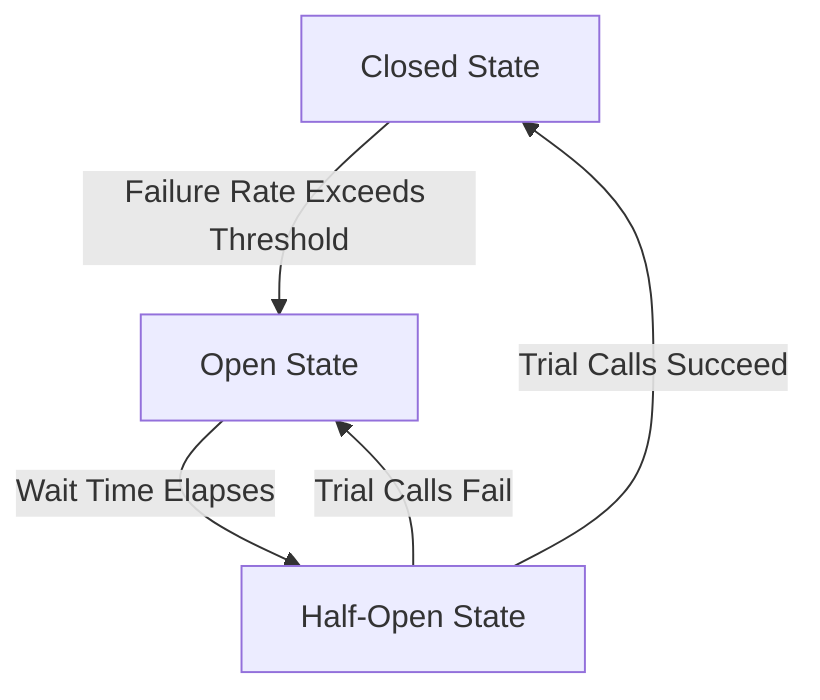

## 11.2.2 Circuit Breakers and Retries

In the realm of event-driven architecture, ensuring system resilience is paramount. Two critical patterns that contribute to resilience are the Circuit Breaker and Retry mechanisms. These patterns help manage failures gracefully, ensuring that systems remain robust and responsive even when external services falter. This section delves into these patterns, providing insights, best practices, and practical implementations using Java and Spring Boot.

### Circuit Breaker Pattern

The Circuit Breaker pattern is a design mechanism that detects failures in external services and stops further attempts to communicate with them until they recover. This pattern is inspired by electrical circuit breakers, which protect circuits from damage by interrupting the flow of electricity when a fault is detected.

#### Components of a Circuit Breaker

A Circuit Breaker typically operates in three states: Closed, Open, and Half-Open. Understanding these states is crucial for implementing an effective Circuit Breaker.

- **Closed State:** 
  - In the Closed state, the Circuit Breaker allows requests to pass through to the service and monitors for failures. If the failure rate exceeds a predefined threshold, the Circuit Breaker transitions to the Open state.
  
- **Open State:**
  - When in the Open state, the Circuit Breaker stops all attempts to call the failing service, immediately returning errors to the caller. This prevents further strain on the service and gives it time to recover.
  
- **Half-Open State:**
  - After a specified period, the Circuit Breaker transitions to the Half-Open state, allowing a limited number of trial calls to check if the external service has recovered. If successful, it transitions back to the Closed state; otherwise, it returns to the Open state.



### Implementing Circuit Breakers

To integrate Circuit Breakers into your application architecture, you can use popular libraries like Hystrix, Resilience4j, or Spring Cloud Circuit Breaker. Here, we'll focus on Resilience4j, a lightweight and easy-to-use library for implementing Circuit Breakers in Java applications.

#### Step-by-Step Implementation with Resilience4j

1. **Add Dependencies:**
   Include the Resilience4j dependencies in your `pom.xml` if you're using Maven:

   ```xml
   <dependency>
       <groupId>io.github.resilience4j</groupId>
       <artifactId>resilience4j-spring-boot2</artifactId>
       <version>1.7.1</version>
   </dependency>
   <dependency>
       <groupId>org.springframework.boot</groupId>
       <artifactId>spring-boot-starter-aop</artifactId>
   </dependency>
   ```

2. **Configure Circuit Breaker:**
   Define your Circuit Breaker configuration in `application.yml`:

   ```yaml
   resilience4j.circuitbreaker:
     instances:
       myService:
         registerHealthIndicator: true
         slidingWindowSize: 10
         minimumNumberOfCalls: 5
         failureRateThreshold: 50
         waitDurationInOpenState: 10000
         permittedNumberOfCallsInHalfOpenState: 3
   ```

3. **Annotate Service Methods:**
   Use the `@CircuitBreaker` annotation to wrap your service calls:

   ```java
   import io.github.resilience4j.circuitbreaker.annotation.CircuitBreaker;
   import org.springframework.stereotype.Service;

   @Service
   public class MyService {

       @CircuitBreaker(name = "myService", fallbackMethod = "fallback")
       public String callExternalService() {
           // Logic to call external service
           return "Service Response";
       }

       public String fallback(Throwable t) {
           return "Fallback Response";
       }
   }
   ```

### Configuring Thresholds and Timeouts

Setting appropriate thresholds for failure rates, timeouts for requests, and durations for open states is crucial to balance resilience and availability. Here are some guidelines:

- **Failure Rate Threshold:** Set a threshold that reflects acceptable failure rates for your application. A common starting point is 50%.
- **Timeouts:** Define timeouts based on the expected response times of your services. Ensure they are not too short to avoid unnecessary failures.
- **Open State Duration:** Determine how long the Circuit Breaker should remain open before transitioning to the Half-Open state. This duration should allow the service to recover.

### Best Practices for Circuit Breakers

- **Keep Circuit Breakers Simple:** Avoid overcomplicating configurations. Start with basic settings and adjust as needed.
- **Avoid Overuse:** Use Circuit Breakers judiciously, focusing on critical service calls that are prone to failure.
- **Ensure Proper State Transition Handling:** Implement robust logic for transitioning between states to prevent erratic behavior.
- **Combine with Other Patterns:** Use Circuit Breakers alongside other resilience patterns like bulkheads to enhance system robustness.

### Retry Policies

Retry policies are essential for handling transient failures, allowing systems to attempt failed operations a specified number of times before giving up. This approach can significantly improve resilience, especially for temporary network glitches or service hiccups.

#### Implementing Exponential Backoff

Exponential backoff is a strategy where the wait time between retry attempts increases exponentially. This approach prevents overwhelming failing services and allows them time to recover.

```java
import org.springframework.retry.annotation.Backoff;
import org.springframework.retry.annotation.Retryable;
import org.springframework.stereotype.Service;

@Service
public class RetryService {

    @Retryable(
      value = { Exception.class },
      maxAttempts = 5,
      backoff = @Backoff(delay = 2000, multiplier = 2))
    public String retryableMethod() {
        // Logic that might fail
        return "Success";
    }
}
```

### Combining Circuit Breakers and Retries

Integrating Circuit Breakers with retry mechanisms enhances system resilience by preventing continuous retry attempts against failing services and enabling quicker recovery. The Circuit Breaker can stop retries when a service is down, while the retry mechanism can handle transient failures when the Circuit Breaker is closed.

### Monitoring and Logging

Monitoring Circuit Breaker states and retry attempts is crucial for troubleshooting and performance tuning. Ensure that you log relevant information, such as state transitions and retry attempts, to aid in diagnosing issues and optimizing configurations.

### Example Implementation

Let's implement a Circuit Breaker and retry mechanism in a Spring Boot application using Resilience4j.

1. **Setup Spring Boot Application:**
   Create a Spring Boot application and add the necessary dependencies for Resilience4j and Spring Retry.

2. **Define Service with Circuit Breaker and Retry:**

   ```java
   import io.github.resilience4j.circuitbreaker.annotation.CircuitBreaker;
   import org.springframework.retry.annotation.Backoff;
   import org.springframework.retry.annotation.Retryable;
   import org.springframework.stereotype.Service;

   @Service
   public class ExternalService {

       @CircuitBreaker(name = "externalService", fallbackMethod = "fallback")
       @Retryable(
         value = { Exception.class },
         maxAttempts = 3,
         backoff = @Backoff(delay = 1000, multiplier = 1.5))
       public String callExternalService() {
           // Simulate external service call
           if (Math.random() > 0.5) {
               throw new RuntimeException("Service failure");
           }
           return "Service Response";
       }

       public String fallback(Throwable t) {
           return "Fallback Response";
       }
   }
   ```

3. **Test the Implementation:**
   Create a simple REST controller to test the service and observe the behavior of the Circuit Breaker and retry mechanism.

   ```java
   import org.springframework.web.bind.annotation.GetMapping;
   import org.springframework.web.bind.annotation.RestController;

   @RestController
   public class TestController {

       private final ExternalService externalService;

       public TestController(ExternalService externalService) {
           this.externalService = externalService;
       }

       @GetMapping("/test")
       public String testService() {
           return externalService.callExternalService();
       }
   }
   ```

By following these steps, you can effectively implement Circuit Breakers and retry mechanisms in your applications, enhancing their resilience and ability to handle failures gracefully.

## Quiz Time!



### What is the primary purpose of the Circuit Breaker pattern?

- [x] To detect failures and stop further attempts to communicate with failing services
- [ ] To enhance the speed of service calls
- [ ] To increase the number of service calls
- [ ] To reduce the cost of service calls

> **Explanation:** The Circuit Breaker pattern is designed to detect failures in external services and stop further attempts to communicate with them until they recover, thus preventing system overload and allowing time for recovery.

### Which state allows a Circuit Breaker to test if a service has recovered?

- [ ] Closed State
- [ ] Open State
- [x] Half-Open State
- [ ] Full-Open State

> **Explanation:** The Half-Open state allows a Circuit Breaker to send a limited number of trial calls to check if the external service has recovered.

### What is a key benefit of using exponential backoff in retry mechanisms?

- [x] It prevents overwhelming failing services by gradually increasing wait times between retries
- [ ] It decreases the complexity of the retry logic
- [ ] It ensures immediate retry success
- [ ] It reduces the number of retries needed

> **Explanation:** Exponential backoff helps prevent overwhelming failing services by gradually increasing the wait time between successive retry attempts, allowing services time to recover.

### In which state does a Circuit Breaker immediately return errors to the caller?

- [ ] Closed State
- [x] Open State
- [ ] Half-Open State
- [ ] Full-Open State

> **Explanation:** In the Open state, the Circuit Breaker stops all attempts to call the failing service and immediately returns errors to the caller.

### What is a common starting point for setting a failure rate threshold in a Circuit Breaker?

- [ ] 10%
- [ ] 25%
- [x] 50%
- [ ] 75%

> **Explanation:** A common starting point for setting a failure rate threshold in a Circuit Breaker is 50%, which balances resilience and availability.

### Which library is recommended for implementing Circuit Breakers in Java applications?

- [ ] Hystrix
- [x] Resilience4j
- [ ] Spring Retry
- [ ] Apache Commons

> **Explanation:** Resilience4j is a lightweight and easy-to-use library recommended for implementing Circuit Breakers in Java applications.

### What should be monitored to aid in troubleshooting Circuit Breaker configurations?

- [x] State transitions and retry attempts
- [ ] Only successful service calls
- [ ] Only failed service calls
- [ ] Network latency

> **Explanation:** Monitoring state transitions and retry attempts is crucial for troubleshooting and optimizing Circuit Breaker configurations.

### Which annotation is used in Spring Boot to implement retry logic with exponential backoff?

- [ ] @CircuitBreaker
- [x] @Retryable
- [ ] @Transactional
- [ ] @Scheduled

> **Explanation:** The `@Retryable` annotation in Spring Boot is used to implement retry logic with exponential backoff.

### How can Circuit Breakers and retries be combined effectively?

- [x] By using Circuit Breakers to stop retries when a service is down, and retries to handle transient failures
- [ ] By using retries to replace Circuit Breakers
- [ ] By using Circuit Breakers to increase retry attempts
- [ ] By using retries to decrease Circuit Breaker thresholds

> **Explanation:** Circuit Breakers can stop retries when a service is down, while retries can handle transient failures, making them effective when combined.

### True or False: Circuit Breakers should be used for every service call in an application.

- [ ] True
- [x] False

> **Explanation:** Circuit Breakers should be used judiciously, focusing on critical service calls that are prone to failure, rather than for every service call.


