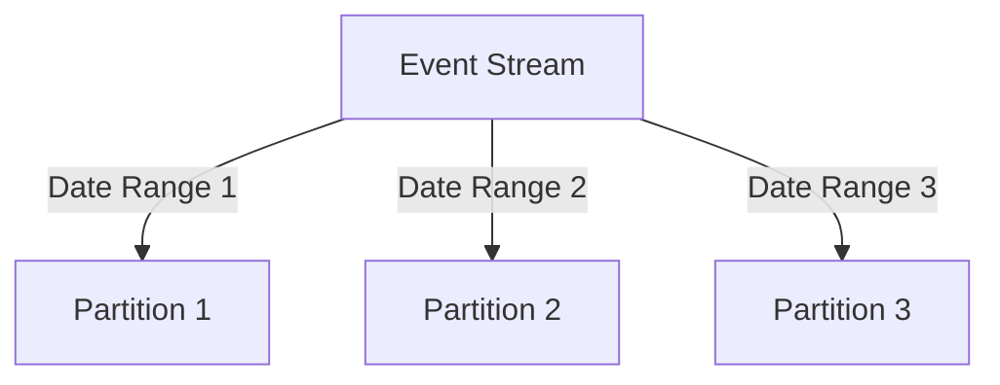

## 11.3.1 Strategies for Partitioning Events

In the realm of event-driven architectures, data partitioning plays a crucial role in enhancing scalability, performance, and resilience. By dividing data into manageable subsets or partitions, systems can efficiently handle large volumes of events while maintaining data consistency and integrity. This section delves into various strategies for partitioning events, providing insights into their applications and benefits.

### Defining Data Partitioning

Data partitioning is the process of dividing a dataset into smaller, distinct subsets, known as partitions. This approach is pivotal in distributed systems, where it enables parallel processing, reduces contention, and optimizes resource utilization. By distributing the workload across multiple partitions, systems can achieve higher throughput and lower latency, essential for handling real-time event streams.

### Event Key-Based Partitioning

Event key-based partitioning involves using a specific attribute or key, such as a user ID or transaction ID, to determine the partition for an event. This strategy ensures that related events are processed together, preserving data consistency and integrity. For instance, in a user-centric application, all events related to a particular user can be routed to the same partition, facilitating coherent processing and state management.

**Java Example:**

```java
import org.apache.kafka.clients.producer.KafkaProducer;
import org.apache.kafka.clients.producer.ProducerRecord;

import java.util.Properties;

public class KeyBasedPartitioningExample {
    public static void main(String[] args) {
        Properties props = new Properties();
        props.put("bootstrap.servers", "localhost:9092");
        props.put("key.serializer", "org.apache.kafka.common.serialization.StringSerializer");
        props.put("value.serializer", "org.apache.kafka.common.serialization.StringSerializer");

        KafkaProducer<String, String> producer = new KafkaProducer<>(props);

        String topic = "user-events";
        String userId = "user123"; // Partition key
        String event = "User logged in";

        ProducerRecord<String, String> record = new ProducerRecord<>(topic, userId, event);
        producer.send(record);

        producer.close();
    }
}
```

In this example, events are partitioned based on the `userId`, ensuring that all events for a specific user are directed to the same partition.

### Hash-Based Partitioning

Hash-based partitioning employs a hash function to assign events to partitions. This method promotes an even distribution of events across partitions, preventing load imbalances and ensuring efficient resource utilization. By hashing a key attribute, such as an order ID, events can be evenly distributed, reducing the risk of hotspots.

**Java Example:**

```java
import java.util.HashMap;
import java.util.Map;

public class HashBasedPartitioning {
    private static final int PARTITION_COUNT = 10;

    public static int getPartition(String key) {
        return Math.abs(key.hashCode()) % PARTITION_COUNT;
    }

    public static void main(String[] args) {
        String orderId = "order456";
        int partition = getPartition(orderId);
        System.out.println("Order ID " + orderId + " is assigned to partition " + partition);
    }
}
```

This code snippet demonstrates how a hash function can be used to determine the partition for an event based on its key.

### Range-Based Partitioning

Range-based partitioning divides events into partitions based on predefined ranges of values. This approach is particularly useful for time-series data or sequential processing, where events are naturally ordered. For example, events can be partitioned by date ranges, allowing for efficient time-based queries and analytics.

**Mermaid Diagram:**



### Load-Aware Partitioning

Load-aware partitioning dynamically assigns events to partitions based on the current load or processing capacity. This strategy ensures optimal resource utilization by balancing the workload across available partitions. It is particularly beneficial in environments with fluctuating loads, where static partitioning might lead to inefficiencies.

### Geographical Partitioning

Geographical partitioning divides data based on geographical regions, reducing latency for region-specific processing and ensuring compliance with data residency requirements. This approach is ideal for applications with a global user base, where data locality can significantly impact performance.

### Temporal Partitioning

Temporal partitioning organizes events into partitions based on time intervals, such as hourly or daily. This method facilitates time-based processing and analytics, enabling efficient handling of time-sensitive data.

### Hybrid Partitioning Approaches

Hybrid partitioning combines multiple strategies to address complex data distribution needs, enhancing flexibility and performance. For instance, a system might use key-based partitioning for user-specific data while employing temporal partitioning for time-series analytics.

### Best Practices for Event Partitioning

- **Select Appropriate Partition Keys:** Choose keys that ensure a uniform distribution of events across partitions.
- **Avoid Hotspots:** Prevent skewed data distribution by avoiding keys that lead to uneven partitioning.
- **Monitor Partition Performance:** Regularly assess partition load and adjust strategies as needed to maintain balance.
- **Leverage Monitoring Tools:** Utilize tools to track partition performance and identify potential bottlenecks.

### Example Implementation: Hash-Based Partitioning in E-Commerce

Consider an e-commerce system where order events need to be partitioned based on order ID. Using hash-based partitioning ensures that all events related to a single order are processed within the same partition, maintaining consistency.

**Java Example:**

```java
import org.apache.kafka.clients.producer.KafkaProducer;
import org.apache.kafka.clients.producer.ProducerRecord;

import java.util.Properties;

public class ECommercePartitioning {
    public static void main(String[] args) {
        Properties props = new Properties();
        props.put("bootstrap.servers", "localhost:9092");
        props.put("key.serializer", "org.apache.kafka.common.serialization.StringSerializer");
        props.put("value.serializer", "org.apache.kafka.common.serialization.StringSerializer");

        KafkaProducer<String, String> producer = new KafkaProducer<>(props);

        String topic = "order-events";
        String orderId = "order789"; // Partition key
        String event = "Order placed";

        ProducerRecord<String, String> record = new ProducerRecord<>(topic, orderId, event);
        producer.send(record);

        producer.close();
    }
}
```

In this implementation, the order ID serves as the partition key, ensuring that all events for a specific order are routed to the same partition.

### Conclusion

Partitioning events effectively is a cornerstone of scalable and resilient event-driven architectures. By employing strategies such as key-based, hash-based, and hybrid partitioning, systems can achieve optimal performance and resource utilization. As you design your event-driven systems, consider these strategies to enhance scalability and resilience, ensuring your architecture can handle the demands of modern applications.

## Quiz Time!



### What is data partitioning?

- [x] The process of dividing data into distinct subsets or partitions to improve manageability, performance, and scalability.
- [ ] The process of combining multiple datasets into a single partition.
- [ ] The process of encrypting data for security purposes.
- [ ] The process of compressing data to save storage space.

> **Explanation:** Data partitioning involves dividing data into smaller, manageable subsets to enhance performance and scalability.

### What is the primary benefit of event key-based partitioning?

- [x] Ensures related events are processed together, maintaining data consistency and integrity.
- [ ] Distributes events evenly across all partitions.
- [ ] Reduces the size of each event.
- [ ] Increases the speed of event processing.

> **Explanation:** Event key-based partitioning groups related events, ensuring they are processed together, which is crucial for maintaining consistency.

### How does hash-based partitioning promote even distribution of events?

- [x] By using a hash function to assign events to partitions.
- [ ] By assigning events randomly to partitions.
- [ ] By using a round-robin scheduling algorithm.
- [ ] By grouping events based on their size.

> **Explanation:** Hash-based partitioning uses a hash function to evenly distribute events across partitions, preventing load imbalances.

### What is a key advantage of range-based partitioning?

- [x] It is useful for time-series data or sequential processing.
- [ ] It ensures all events are processed in parallel.
- [ ] It minimizes the number of partitions needed.
- [ ] It encrypts data for security.

> **Explanation:** Range-based partitioning is ideal for time-series data, allowing efficient processing of sequential events.

### What is load-aware partitioning?

- [x] Dynamically assigning partitions based on current load or processing capacity.
- [ ] Assigning partitions based on the geographical location of the data.
- [ ] Using a fixed number of partitions regardless of load.
- [ ] Assigning partitions based on the size of the data.

> **Explanation:** Load-aware partitioning adjusts partition assignments based on current load, optimizing resource utilization.

### Why is geographical partitioning beneficial?

- [x] It reduces latency for region-specific processing and ensures compliance with data residency requirements.
- [ ] It increases the number of partitions available.
- [ ] It simplifies the partitioning process.
- [ ] It encrypts data for security.

> **Explanation:** Geographical partitioning reduces latency by processing data closer to its source and complies with regional data laws.

### What is the purpose of temporal partitioning?

- [x] Organizing events into partitions based on time intervals for time-based processing and analytics.
- [ ] Grouping events by their size.
- [ ] Encrypting events for security.
- [ ] Compressing events to save space.

> **Explanation:** Temporal partitioning organizes events by time, facilitating efficient time-based processing and analysis.

### What is a hybrid partitioning approach?

- [x] Combining multiple partitioning strategies to address complex data distribution needs.
- [ ] Using a single partitioning strategy for all data.
- [ ] Avoiding partitioning altogether.
- [ ] Encrypting partitions for security.

> **Explanation:** Hybrid partitioning combines different strategies to meet complex requirements, enhancing flexibility and performance.

### What is a common pitfall in event partitioning?

- [x] Creating hotspots by using skewed partition keys.
- [ ] Using too many partitions.
- [ ] Encrypting all partitions.
- [ ] Using a single partition for all events.

> **Explanation:** Skewed partition keys can lead to hotspots, causing uneven distribution and performance issues.

### True or False: Hash-based partitioning always guarantees perfect load balancing.

- [ ] True
- [x] False

> **Explanation:** While hash-based partitioning aims to distribute events evenly, perfect load balancing is not always guaranteed due to variations in event sizes and processing times.


