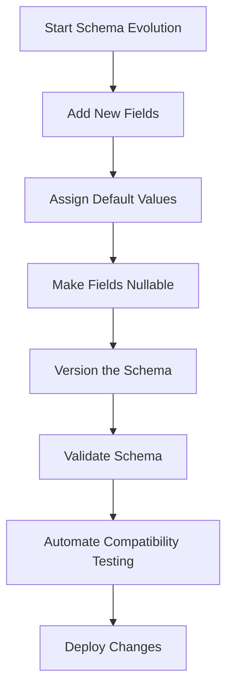

---

linkTitle: "12.1.1 Avoiding Breaking Changes"
title: "Avoiding Breaking Changes in Event Schema Evolution"
description: "Learn how to manage event schema evolution effectively to avoid breaking changes in event-driven architectures, ensuring backward compatibility and seamless integration."
categories:
- Software Architecture
- Event-Driven Systems
- Schema Management
tags:
- Event-Driven Architecture
- Schema Evolution
- Backward Compatibility
- Java
- Kafka
date: 2024-10-25
type: docs
nav_weight: 1211000
---

## 12.1.1 Avoiding Breaking Changes

In the dynamic world of event-driven architectures (EDA), managing schema evolution is crucial to ensure that changes in data structures do not disrupt existing systems. As systems evolve, so do the data structures they rely on. This section delves into strategies for avoiding breaking changes during schema evolution, ensuring that your event-driven systems remain robust and adaptable.

### Understanding Schema Evolution

Schema evolution refers to the process of modifying the structure of data over time to accommodate new requirements while maintaining compatibility with existing systems. In an event-driven architecture, events are often serialized into a specific format (e.g., JSON, Avro, Protobuf) and consumed by various services. As these events evolve, it's vital to ensure that changes do not break existing consumers.

### Implementing Backward Compatibility

Backward compatibility is a cornerstone of schema evolution. It ensures that new versions of a schema can be processed by older consumers without errors. This is particularly important in distributed systems where different services may be updated at different times.

#### Key Strategies for Backward Compatibility:

1. **Additive Changes:** Add new fields instead of modifying or removing existing ones. This allows older consumers to ignore unknown fields while newer consumers can utilize them.

2. **Default Values:** Assign default values to new fields. This ensures that when older consumers encounter these fields, they can still process the event without errors.

3. **Nullable Fields:** Make new fields optional or nullable. This prevents older consumers from failing due to missing data.

### Using Default Values

Default values are a powerful tool in schema evolution. By providing default values for new fields, you ensure that older consumers can continue to process events without requiring changes to their code.

```java
// Example of using default values in a Java class
public class UserEvent {
    private String userId;
    private String userName;
    private String email;
    private String phoneNumber; // New field

    // Constructor with default value for phoneNumber
    public UserEvent(String userId, String userName, String email) {
        this.userId = userId;
        this.userName = userName;
        this.email = email;
        this.phoneNumber = "N/A"; // Default value
    }

    // Getters and setters
    // ...
}
```

### Avoid Removing Fields

Removing or renaming fields can lead to breaking changes, as existing consumers may rely on these fields. Instead of removing fields, consider deprecating them. This allows you to signal to developers that a field is no longer recommended for use without immediately breaking existing functionality.

### Utilizing Nullable Fields

Making fields nullable is another strategy to maintain backward compatibility. This approach allows older consumers to handle events without requiring values for new fields.

```java
// Example of using nullable fields in Java
public class OrderEvent {
    private String orderId;
    private String product;
    private Integer quantity; // Nullable field

    public OrderEvent(String orderId, String product, Integer quantity) {
        this.orderId = orderId;
        this.product = product;
        this.quantity = quantity; // Can be null
    }

    // Getters and setters
    // ...
}
```

### Versioning Schemas

Adopting a clear versioning strategy is essential for managing schema changes. Semantic versioning is a popular approach, where version numbers convey the nature of changes (e.g., major, minor, patch). This helps developers understand the impact of changes and plan updates accordingly.

### Schema Validation

Schema validation is a critical step in ensuring compatibility. By validating schemas during both production and consumption, you can catch incompatible changes early in the development cycle. This proactive approach helps prevent issues from reaching production environments.

### Automated Testing for Compatibility

Incorporating automated tests to verify both backward and forward compatibility is a best practice. These tests ensure that schema updates do not introduce breaking changes and that new consumers can process older events.

```java
// Example of a simple compatibility test in Java
import static org.junit.Assert.assertEquals;
import org.junit.Test;

public class SchemaCompatibilityTest {

    @Test
    public void testBackwardCompatibility() {
        // Simulate processing an event with an older schema
        UserEvent oldEvent = new UserEvent("123", "John Doe", "john@example.com");
        assertEquals("N/A", oldEvent.getPhoneNumber()); // Default value check
    }

    @Test
    public void testForwardCompatibility() {
        // Simulate processing an event with a newer schema
        UserEvent newEvent = new UserEvent("123", "John Doe", "john@example.com", "555-1234");
        assertEquals("555-1234", newEvent.getPhoneNumber());
    }
}
```

### Real-World Scenario: Evolving a User Profile Schema

Consider a user profile service that initially stores user ID, name, and email. Over time, the need arises to include a phone number. By following the strategies outlined above, you can introduce this change without breaking existing consumers.

1. **Add the phone number field with a default value.**
2. **Ensure the field is nullable for flexibility.**
3. **Version the schema to indicate a minor update.**
4. **Validate the schema during development to catch issues early.**
5. **Test compatibility to ensure seamless integration.**

### Diagram: Schema Evolution Workflow



### Conclusion

Avoiding breaking changes in event schema evolution is a critical aspect of maintaining a resilient and adaptable event-driven architecture. By implementing backward compatibility, using default and nullable fields, and adopting a robust versioning strategy, you can ensure that your systems evolve smoothly without disrupting existing consumers. Incorporating schema validation and automated testing further strengthens your ability to manage changes effectively.

### Further Reading and Resources

- [Apache Avro Documentation](https://avro.apache.org/docs/current/)
- [Protobuf Language Guide](https://developers.google.com/protocol-buffers/docs/overview)
- [JSON Schema Documentation](https://json-schema.org/)

## Quiz Time!



### What is schema evolution in the context of event-driven architectures?

- [x] The process of modifying data structures over time while maintaining compatibility.
- [ ] The process of removing old schemas and replacing them with new ones.
- [ ] The practice of keeping data structures static to avoid changes.
- [ ] The method of converting all data to a single schema format.

> **Explanation:** Schema evolution involves modifying data structures over time while ensuring compatibility with existing systems.

### Why is backward compatibility important in schema evolution?

- [x] It ensures that new schema versions can be processed by older consumers without errors.
- [ ] It allows for the removal of old fields without consequences.
- [ ] It enables the immediate adoption of new technologies.
- [ ] It simplifies the process of renaming fields.

> **Explanation:** Backward compatibility ensures that changes do not disrupt existing consumers, allowing them to process new schema versions without errors.

### Which strategy helps maintain backward compatibility when adding new fields?

- [x] Assigning default values to new fields.
- [ ] Removing old fields.
- [ ] Renaming existing fields.
- [ ] Changing data types of existing fields.

> **Explanation:** Assigning default values to new fields ensures that older consumers can process events without errors.

### What is the benefit of using nullable fields in schema evolution?

- [x] It allows older consumers to handle events without requiring values for new fields.
- [ ] It forces all consumers to update immediately.
- [ ] It simplifies the schema validation process.
- [ ] It eliminates the need for versioning.

> **Explanation:** Nullable fields enable older consumers to process events without needing values for new fields, maintaining compatibility.

### What is a recommended strategy for versioning schemas?

- [x] Semantic versioning.
- [ ] Random versioning.
- [ ] Incremental numbering.
- [ ] Alphabetical versioning.

> **Explanation:** Semantic versioning is a systematic approach that conveys the nature of changes, helping developers understand the impact.

### How does schema validation help in schema evolution?

- [x] It catches incompatible changes early in the development cycle.
- [ ] It eliminates the need for automated testing.
- [ ] It allows for immediate deployment of changes.
- [ ] It simplifies the process of adding new fields.

> **Explanation:** Schema validation helps identify incompatible changes early, preventing issues from reaching production.

### What is the purpose of automated compatibility testing?

- [x] To verify both backward and forward compatibility of schema changes.
- [ ] To replace manual testing entirely.
- [ ] To simplify the schema validation process.
- [ ] To eliminate the need for versioning.

> **Explanation:** Automated compatibility testing ensures that schema updates do not introduce breaking changes and that new consumers can process older events.

### Which of the following is a common pitfall in schema evolution?

- [x] Removing or renaming existing fields.
- [ ] Adding new fields with default values.
- [ ] Making fields nullable.
- [ ] Versioning schemas.

> **Explanation:** Removing or renaming fields can lead to breaking changes, as existing consumers may rely on these fields.

### What is the role of default values in schema evolution?

- [x] To ensure older consumers can process events without errors.
- [ ] To force consumers to update immediately.
- [ ] To simplify the schema validation process.
- [ ] To eliminate the need for nullable fields.

> **Explanation:** Default values allow older consumers to process events without errors, even when new fields are added.

### True or False: Schema evolution is only necessary when adding new fields.

- [ ] True
- [x] False

> **Explanation:** Schema evolution is necessary for any changes to data structures, including adding, modifying, or removing fields.


