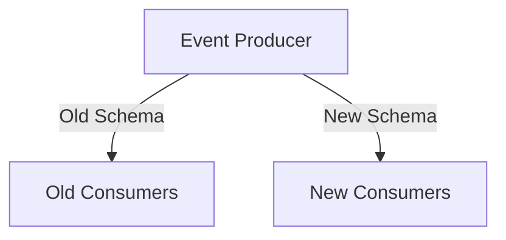
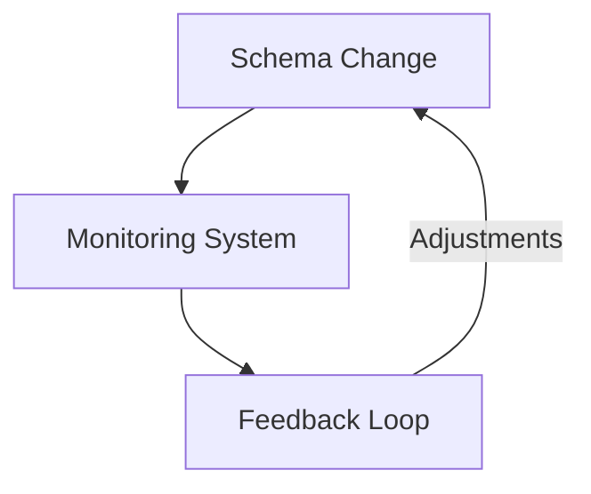

## 12.1.2 Facilitating Smooth Upgrades

In the dynamic world of Event-Driven Architecture (EDA), managing event schema evolution is crucial to maintaining system integrity and ensuring seamless communication between components. As systems evolve, schemas must adapt to new requirements, but these changes can disrupt consumers if not handled carefully. This section explores strategies to facilitate smooth upgrades, ensuring that schema changes are implemented with minimal impact on existing systems.

### Plan Schema Changes Strategically

Strategic planning is the cornerstone of successful schema evolution. By developing a roadmap for schema changes, you can align updates with release cycles and minimize disruptions. This involves:

- **Assessing Impact:** Evaluate how changes will affect existing consumers and identify potential risks.
- **Prioritizing Changes:** Determine which schema changes are critical and which can be deferred.
- **Scheduling Updates:** Align schema changes with major releases to leverage existing deployment processes.

**Example:** Consider a retail system where the product schema needs to include a new field for product ratings. Planning this change involves assessing how current consumers use the product schema and ensuring that the addition of the new field does not disrupt their operations.

### Incremental Rollouts

Deploying schema changes incrementally allows consumers to adapt gradually, reducing the risk of abrupt transitions. This approach involves:

- **Phased Deployment:** Introduce changes in stages, starting with a subset of consumers and gradually expanding.
- **Testing in Production:** Use canary releases to test changes in a controlled environment before full deployment.

**Java Code Example:**

```java
public class ProductEvent {
    private String productId;
    private String name;
    private String description;
    // New field for incremental rollout
    private Double rating; // Initially optional

    // Getters and setters
}
```

In this example, the `rating` field is introduced as optional, allowing consumers to ignore it until they are ready to handle it.

### Dual Publishing Strategy

During the transition period, temporarily publish events using both the old and new schemas. This supports both old and new consumers, ensuring compatibility.

- **Parallel Streams:** Maintain two versions of the event stream, allowing consumers to choose which version to process.
- **Versioning:** Clearly label events with schema version information.

**Mermaid Diagram:**



This diagram illustrates how an event producer can simultaneously publish events in both old and new schemas, catering to different consumer groups.

### Deprecation Policies

Establishing clear deprecation policies for outdated schema versions is essential. This includes:

- **Timelines:** Define when support for old schemas will be phased out.
- **Notifications:** Inform consumers well in advance about upcoming deprecations.

**Example Policy:** "Schema version 1.0 will be deprecated six months after the release of version 2.0. Consumers are encouraged to migrate to the new version within this period."

### Communication with Stakeholders

Effective communication with stakeholders, including developers and consumers, is vital for coordinating schema changes. This involves:

- **Regular Updates:** Provide updates on schema changes and timelines.
- **Feedback Channels:** Establish channels for stakeholders to provide feedback and report issues.

**Practical Tip:** Use collaboration tools like Slack or Microsoft Teams to maintain open lines of communication with your development and consumer teams.

### Utilize Feature Flags

Feature flags allow you to toggle between different schemas or payload formats, enabling controlled testing and rollout of schema updates.

- **Controlled Rollout:** Gradually enable new schema features for specific consumer groups.
- **Rollback Capability:** Quickly revert to the old schema if issues arise.

**Java Code Example:**

```java
public class FeatureToggle {
    private boolean newSchemaEnabled;

    public void processEvent(Event event) {
        if (newSchemaEnabled) {
            // Process with new schema
        } else {
            // Process with old schema
        }
    }
}
```

In this example, a feature flag (`newSchemaEnabled`) determines which schema version to use for processing events.

### Backward-Compatible Data Transformations

Implement data transformation layers that can convert data between old and new schema versions, ensuring compatibility during the upgrade process.

- **Adapters:** Use adapter patterns to handle schema transformations.
- **Middleware:** Employ middleware to intercept and transform events as needed.

**Example:** A middleware service that transforms events from the old schema to the new schema format before forwarding them to consumers.

### Monitoring and Feedback Loops

Continuously monitor the impact of schema changes and gather feedback from consumers to identify and address any issues promptly.

- **Metrics:** Track key performance indicators (KPIs) related to schema changes.
- **Feedback Mechanisms:** Use surveys or direct feedback channels to gather consumer insights.

**Mermaid Diagram:**



This diagram shows a feedback loop where schema changes are monitored, and feedback is used to make necessary adjustments.

### Conclusion

Facilitating smooth upgrades in event schema evolution requires careful planning, strategic deployment, and effective communication. By employing techniques such as incremental rollouts, dual publishing, and backward-compatible transformations, you can ensure that schema changes are implemented with minimal disruption. Continuous monitoring and feedback loops further enhance the process, allowing for timely adjustments and improvements.

## Quiz Time!



### What is the primary goal of planning schema changes strategically?

- [x] To align updates with release cycles and minimize disruptions
- [ ] To introduce as many changes as possible at once
- [ ] To ensure that all consumers are forced to update immediately
- [ ] To avoid any communication with stakeholders

> **Explanation:** Strategic planning aims to align schema changes with release cycles and minimize disruptions to consumers.

### How does incremental rollout help in schema evolution?

- [x] It allows consumers to adapt gradually to changes
- [ ] It forces all consumers to update at the same time
- [ ] It eliminates the need for testing
- [ ] It makes schema changes invisible to consumers

> **Explanation:** Incremental rollout allows consumers to adapt gradually, reducing the risk of abrupt transitions.

### What is the purpose of a dual publishing strategy?

- [x] To support both old and new consumers during schema transitions
- [ ] To publish events twice for redundancy
- [ ] To confuse consumers with multiple versions
- [ ] To eliminate the need for versioning

> **Explanation:** Dual publishing supports both old and new consumers by providing events in both schema versions during transitions.

### What should a deprecation policy include?

- [x] Timelines for phasing out old schema versions
- [ ] Immediate removal of old schemas
- [ ] A requirement for consumers to update without notice
- [ ] A list of all possible schema changes

> **Explanation:** Deprecation policies should include timelines for phasing out old schema versions, allowing consumers to prepare.

### Why is communication with stakeholders important during schema changes?

- [x] To coordinate changes effectively and gather feedback
- [ ] To keep changes secret from consumers
- [ ] To ensure that only developers know about the changes
- [ ] To avoid any feedback from consumers

> **Explanation:** Communication with stakeholders ensures effective coordination and allows for feedback, improving the schema change process.

### How do feature flags assist in schema upgrades?

- [x] By enabling controlled testing and rollout of schema updates
- [ ] By permanently locking in schema changes
- [ ] By eliminating the need for testing
- [ ] By forcing all consumers to use the new schema immediately

> **Explanation:** Feature flags allow for controlled testing and rollout, enabling gradual adoption of schema updates.

### What role do backward-compatible data transformations play in schema evolution?

- [x] They ensure compatibility between old and new schema versions
- [ ] They permanently change all data to the new schema
- [ ] They eliminate the need for versioning
- [ ] They force consumers to update immediately

> **Explanation:** Backward-compatible transformations ensure compatibility between old and new schema versions, facilitating smooth transitions.

### What is the benefit of monitoring and feedback loops during schema changes?

- [x] They help identify and address issues promptly
- [ ] They make schema changes permanent
- [ ] They eliminate the need for testing
- [ ] They prevent any consumer feedback

> **Explanation:** Monitoring and feedback loops help identify issues and allow for timely adjustments, improving the schema change process.

### What is an example of a tool that can be used for communication with stakeholders?

- [x] Slack or Microsoft Teams
- [ ] A secret internal memo
- [ ] A public announcement on social media
- [ ] A hidden feature in the application

> **Explanation:** Tools like Slack or Microsoft Teams facilitate open communication with stakeholders, enhancing coordination and feedback.

### True or False: Dual publishing means permanently maintaining two versions of the schema.

- [ ] True
- [x] False

> **Explanation:** Dual publishing is a temporary strategy used during schema transitions to support both old and new consumers.


