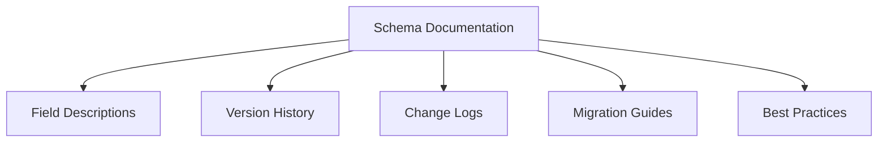

## 12.4.3 Documentation and Communication

In the realm of Event-Driven Architecture (EDA), managing event schema evolution is a critical task that requires meticulous documentation and effective communication. As systems grow and evolve, schemas must adapt to new requirements, making it essential to maintain clear and comprehensive documentation. This section explores best practices for documenting schemas and communicating changes effectively, ensuring that all stakeholders are informed and aligned.

### Maintain Comprehensive Schema Documentation

Comprehensive schema documentation serves as the foundation for understanding and utilizing event schemas effectively. It should include:

- **Field Descriptions:** Clearly describe each field, its purpose, and its data type. This helps developers understand how to use the schema correctly.
- **Intended Use Cases:** Document the scenarios in which the schema is intended to be used, providing context for its application.
- **Examples:** Provide examples of valid schema instances to illustrate correct usage.

#### Example Schema Documentation

Consider a simple event schema for a user registration event:

```json
{
  "eventType": "UserRegistered",
  "timestamp": "2023-10-25T14:48:00.000Z",
  "userId": "12345",
  "userName": "johndoe",
  "email": "johndoe@example.com"
}
```

**Documentation:**

- **eventType:** (String) The type of event. Example: "UserRegistered".
- **timestamp:** (ISO 8601 String) The time at which the event occurred.
- **userId:** (String) Unique identifier for the user.
- **userName:** (String) The username of the registered user.
- **email:** (String) The email address of the user.

### Version History and Change Logs

Maintaining a version history and change logs is crucial for tracking schema evolution. This documentation should include:

- **Version Numbers:** Assign a unique version number to each schema iteration.
- **Change Descriptions:** Clearly describe what was added, modified, or deprecated in each version.
- **Rationale:** Provide reasons for changes to help stakeholders understand the evolution process.

#### Example Change Log

| Version | Date       | Changes                                      | Rationale                                      |
|---------|------------|----------------------------------------------|------------------------------------------------|
| 1.0     | 2023-01-01 | Initial schema definition                    | Initial release                                |
| 1.1     | 2023-03-15 | Added `phoneNumber` field                    | To support SMS notifications                   |
| 1.2     | 2023-06-10 | Deprecated `userName`, added `firstName` and `lastName` | To support separate first and last name fields |

### Communicate Changes Effectively

Effective communication is key to ensuring that all stakeholders are aware of schema changes. Consider the following strategies:

- **Email Updates:** Send regular email updates to notify stakeholders of upcoming changes.
- **Team Meetings:** Discuss schema changes in team meetings to ensure alignment.
- **Communication Platforms:** Use platforms like Slack or Microsoft Teams for real-time updates and discussions.

### Provide Migration Guides

Migration guides are essential for helping consumers transition to new schema versions smoothly. These guides should include:

- **Step-by-Step Instructions:** Clearly outline the steps required to migrate to the new schema version.
- **Code Examples:** Provide code snippets to illustrate how to handle the new schema.
- **Backward Compatibility:** Highlight any backward compatibility considerations.

#### Example Migration Guide

**Migrating from Version 1.1 to 1.2:**

1. **Update Schema Usage:**
   - Replace `userName` with `firstName` and `lastName`.
   
   ```java
   // Old Code
   String userName = event.getUserName();
   
   // New Code
   String firstName = event.getFirstName();
   String lastName = event.getLastName();
   ```

2. **Test Changes:**
   - Run unit and integration tests to ensure compatibility.

3. **Deploy Updates:**
   - Deploy the updated code to production.

### Host Training Sessions

Training sessions and workshops can help team members understand schema management best practices. These sessions should cover:

- **Schema Versioning:** Explain the importance of versioning and how to implement it.
- **Compatibility:** Discuss strategies for maintaining backward and forward compatibility.
- **Tools and Techniques:** Introduce tools and techniques for managing schemas effectively.

### Create a Centralized Documentation Repository

A centralized documentation repository ensures that all schema-related documentation is easily accessible. Consider using tools like:

- **Confluence:** For creating and managing documentation pages.
- **GitHub Wikis:** For version-controlled documentation alongside code.
- **Internal Platforms:** Custom solutions tailored to organizational needs.

### Encourage Collaborative Schema Design

Collaboration is key to designing schemas that meet the needs of all stakeholders. Encourage feedback and contributions from:

- **Developers:** To ensure technical feasibility and alignment with system architecture.
- **Consumers:** To understand how schemas are used in practice and identify potential improvements.

### Implement Feedback Loops

Feedback loops enable continuous improvement of schema management practices. Set up mechanisms for:

- **Issue Reporting:** Allow consumers to report issues or suggest improvements.
- **Regular Reviews:** Conduct regular reviews of schema documentation and processes.

### Example Documentation Practices

To illustrate effective documentation practices, consider the following example of a well-documented schema repository:

- **Schema Definitions:** Detailed JSON or YAML files with field descriptions and examples.
- **Change Logs:** Comprehensive logs documenting the history of schema changes.
- **Migration Guides:** Step-by-step guides for transitioning between schema versions.
- **Best Practice Guidelines:** Documentation outlining best practices for schema design and management.

### Best Practices for Documentation

To ensure that documentation is effective, consider the following guidelines:

- **Clarity and Conciseness:** Ensure that documentation is clear, concise, and free of jargon.
- **Regular Updates:** Review and update documentation regularly to keep it current.
- **Visual Aids:** Use diagrams and charts to enhance understanding.
- **Structured Organization:** Organize documentation logically to facilitate ease of access and navigation.

#### Example Diagram



### Conclusion

Effective documentation and communication are vital components of managing event schema evolution in Event-Driven Architecture. By maintaining comprehensive documentation, communicating changes effectively, and fostering collaboration, organizations can ensure that their schemas evolve smoothly and meet the needs of all stakeholders. Implementing these best practices will lead to more robust and adaptable systems, capable of handling the complexities of modern software development.

## Quiz Time!



### What is the primary purpose of maintaining comprehensive schema documentation?

- [x] To facilitate better understanding and usage by developers and consumers
- [ ] To increase the complexity of the system
- [ ] To make the documentation process more challenging
- [ ] To reduce the number of stakeholders involved

> **Explanation:** Comprehensive schema documentation helps developers and consumers understand and use schemas effectively, ensuring clarity and proper implementation.

### Why is it important to maintain a version history and change logs for schemas?

- [x] To provide transparency and traceability for schema evolution
- [ ] To make the documentation more complex
- [ ] To confuse stakeholders
- [ ] To reduce the number of schema versions

> **Explanation:** Version history and change logs provide transparency and traceability, helping stakeholders understand the evolution of schemas over time.

### Which communication platform can be used for real-time updates and discussions about schema changes?

- [x] Slack
- [ ] Email
- [ ] Confluence
- [ ] GitHub

> **Explanation:** Slack is a communication platform that allows for real-time updates and discussions, making it suitable for notifying stakeholders about schema changes.

### What should a migration guide include to help consumers transition to new schema versions?

- [x] Step-by-step instructions and code examples
- [ ] Only a list of changes
- [ ] A summary of the old schema
- [ ] A list of stakeholders

> **Explanation:** Migration guides should include step-by-step instructions and code examples to help consumers transition smoothly to new schema versions.

### What is the benefit of hosting training sessions on schema management?

- [x] To educate team members on best practices and ensure compatibility
- [ ] To increase the workload of the team
- [ ] To create confusion about schema changes
- [ ] To limit the number of people involved in schema management

> **Explanation:** Training sessions educate team members on best practices, ensuring they understand the importance of compatibility and proper versioning.

### Which tool can be used to create a centralized documentation repository?

- [x] Confluence
- [ ] Microsoft Word
- [ ] Slack
- [ ] Email

> **Explanation:** Confluence is a tool that can be used to create and manage a centralized documentation repository, making schema-related documentation easily accessible.

### How can feedback loops improve schema management practices?

- [x] By enabling continuous refinement through issue reporting and regular reviews
- [ ] By increasing the complexity of the schema
- [ ] By limiting stakeholder involvement
- [ ] By reducing the number of schema versions

> **Explanation:** Feedback loops enable continuous refinement of schema management practices by allowing for issue reporting and regular reviews.

### What is a key guideline for ensuring effective documentation?

- [x] Ensuring clarity and conciseness
- [ ] Making the documentation as detailed as possible
- [ ] Using complex language
- [ ] Limiting access to the documentation

> **Explanation:** Effective documentation should be clear and concise, avoiding unnecessary complexity and jargon.

### Which of the following is an example of a visual aid that can enhance understanding in documentation?

- [x] Diagrams and charts
- [ ] Long paragraphs
- [ ] Complex equations
- [ ] Extensive tables

> **Explanation:** Diagrams and charts are visual aids that can enhance understanding by providing a visual representation of concepts.

### True or False: Collaborative schema design involves only developers and excludes consumers.

- [ ] True
- [x] False

> **Explanation:** Collaborative schema design involves both developers and consumers, ensuring that schemas meet the needs of all stakeholders.


