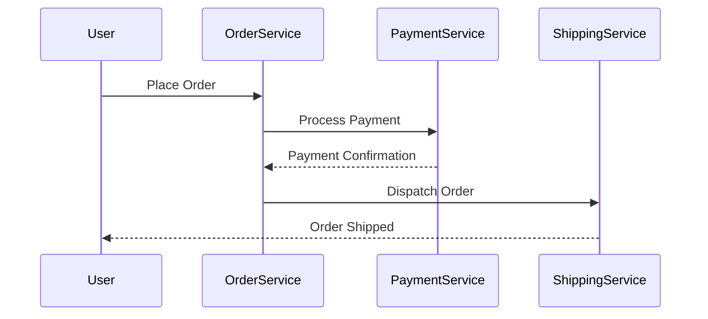

---

linkTitle: "13.3.1 Importance of Order in Events"
title: "Importance of Order in Events: Ensuring Consistency and Reliability in Event-Driven Systems"
description: "Explore the critical role of event ordering in maintaining data consistency, supporting workflows, and enhancing user experience in event-driven architectures."
categories:
- Software Architecture
- Event-Driven Systems
- Data Consistency
tags:
- Event Ordering
- Data Integrity
- Workflow Management
- Event-Driven Architecture
- Java
date: 2024-10-25
type: docs
nav_weight: 13310

---

## 13.3.1 Importance of Order in Events

In the realm of event-driven architecture (EDA), the sequence in which events are processed—known as event ordering—plays a pivotal role in ensuring the consistency and reliability of systems. This section delves into the significance of maintaining event order, exploring its impact on state transitions, workflows, analytics, and user experience. We will also provide practical examples and Java code snippets to illustrate these concepts.

### Defining Event Ordering

Event ordering refers to the sequence in which events are processed by a system. In an event-driven architecture, events are the primary means of communication between components, and their order can significantly affect the system's behavior and state. Ensuring that events are processed in the correct order is crucial for maintaining data consistency and system state integrity.

#### Why Event Ordering Matters

1. **Maintain Consistent State Transitions:**
   - Preserving the correct order of events ensures that state transitions occur logically and predictably. For instance, if a "payment received" event is processed before an "order placed" event, it could lead to inconsistencies and errors in the system's state.

2. **Support Sequential Workflows:**
   - Many workflows depend on a specific sequence of actions. Consider a financial transaction system where debits must occur before credits. If events are processed out of order, it could result in incorrect balances and financial discrepancies.

3. **Ensure Accurate Analytics:**
   - Event ordering is vital for accurate data analysis and reporting. Sequential processing affects aggregations and trends, and any deviation from the correct order can lead to misleading insights.

4. **Facilitate Dependency Management:**
   - Some events depend on the outcomes of previous events. For example, a "shipment dispatched" event should only occur after an "order fulfilled" event. Correct ordering ensures that dependencies are respected, achieving the desired results.

5. **Prevent Data Anomalies:**
   - Out-of-order event processing can lead to data anomalies such as race conditions, conflicting updates, and corrupted data states. Ensuring proper order helps mitigate these risks.

6. **Improve User Experience:**
   - Maintaining event order can enhance user experience by ensuring that actions appear to occur in a logical and expected manner. For example, a user should see a "payment successful" notification only after the payment has been processed.

### Example Scenarios

Let's explore some scenarios where event ordering is crucial:

- **Order Processing System:**
  - In an e-commerce platform, events such as "order created," "payment processed," and "order shipped" must occur in a specific sequence to ensure a smooth transaction flow.

- **Audit Logging:**
  - Maintaining audit logs in chronological order is essential for tracking system activities and ensuring compliance with regulations.

- **Inventory Management:**
  - Inventory updates must be processed in the correct order to prevent stock discrepancies. For example, "item sold" should be processed before "item restocked."

### Practical Java Example

Let's consider a simple Java example using a message broker like Apache Kafka to illustrate event ordering in an order processing system.

```java
import org.apache.kafka.clients.consumer.ConsumerConfig;
import org.apache.kafka.clients.consumer.KafkaConsumer;
import org.apache.kafka.clients.consumer.ConsumerRecords;
import org.apache.kafka.clients.consumer.ConsumerRecord;
import org.apache.kafka.common.serialization.StringDeserializer;

import java.util.Collections;
import java.util.Properties;

public class OrderProcessor {

    private static final String TOPIC = "order-events";
    private static final String BOOTSTRAP_SERVERS = "localhost:9092";
    private static final String GROUP_ID = "order-processor-group";

    public static void main(String[] args) {
        Properties properties = new Properties();
        properties.put(ConsumerConfig.BOOTSTRAP_SERVERS_CONFIG, BOOTSTRAP_SERVERS);
        properties.put(ConsumerConfig.GROUP_ID_CONFIG, GROUP_ID);
        properties.put(ConsumerConfig.KEY_DESERIALIZER_CLASS_CONFIG, StringDeserializer.class.getName());
        properties.put(ConsumerConfig.VALUE_DESERIALIZER_CLASS_CONFIG, StringDeserializer.class.getName());
        properties.put(ConsumerConfig.ENABLE_AUTO_COMMIT_CONFIG, "true");

        KafkaConsumer<String, String> consumer = new KafkaConsumer<>(properties);
        consumer.subscribe(Collections.singletonList(TOPIC));

        try {
            while (true) {
                ConsumerRecords<String, String> records = consumer.poll(100);
                for (ConsumerRecord<String, String> record : records) {
                    processEvent(record.value());
                }
            }
        } finally {
            consumer.close();
        }
    }

    private static void processEvent(String event) {
        // Simulate event processing
        System.out.println("Processing event: " + event);
        // Implement logic to ensure events are processed in order
    }
}
```

In this example, a Kafka consumer subscribes to an "order-events" topic and processes events in the order they are received. The `processEvent` method should include logic to handle events in the correct sequence, ensuring that state transitions and dependencies are respected.

### Diagrams and Visualizations

To further illustrate the importance of event ordering, consider the following sequence diagram that depicts an order processing workflow:



This diagram highlights the sequential nature of the order processing workflow, emphasizing the need for correct event ordering to ensure a smooth transaction.

### Best Practices for Managing Event Ordering

- **Use Partitioning:**
  - Leverage partitioning in message brokers like Kafka to ensure that related events are processed in order. Each partition maintains a strict order of events.

- **Implement Idempotency:**
  - Design event handlers to be idempotent, allowing them to handle duplicate events gracefully without affecting the system's state.

- **Utilize Timestamps:**
  - Include timestamps in event payloads to help determine the correct order of processing, especially in distributed systems where network delays can occur.

- **Monitor and Debug:**
  - Implement monitoring and logging to track event processing and identify any ordering issues. Use tools like Kafka's offset management to ensure events are consumed in the correct sequence.

### Conclusion

Event ordering is a fundamental aspect of event-driven architecture that ensures data consistency, supports sequential workflows, and enhances user experience. By understanding and implementing strategies to maintain event order, developers can build robust and reliable systems that meet the demands of modern applications.

## Quiz Time!



### What is event ordering in the context of event-driven architecture?

- [x] The sequence in which events are processed by a system.
- [ ] The process of generating events in a system.
- [ ] The method of storing events in a database.
- [ ] The technique of filtering events based on priority.

> **Explanation:** Event ordering refers to the sequence in which events are processed, which is crucial for maintaining data consistency and system state integrity.

### Why is maintaining event order important for state transitions?

- [x] It ensures that state transitions occur logically and predictably.
- [ ] It allows for faster processing of events.
- [ ] It reduces the number of events generated.
- [ ] It simplifies the event generation process.

> **Explanation:** Preserving the correct order of events ensures that state transitions occur logically and predictably, preventing inconsistencies and errors.

### How does event ordering support sequential workflows?

- [x] By ensuring actions occur in a specific sequence.
- [ ] By reducing the number of events needed.
- [ ] By increasing the speed of event processing.
- [ ] By simplifying the workflow design.

> **Explanation:** Ordered events are essential for workflows that depend on a specific sequence of actions, such as financial transactions or inventory updates.

### What role does event ordering play in data analytics?

- [x] It ensures accurate data analysis and reporting.
- [ ] It reduces the complexity of data models.
- [ ] It speeds up data processing.
- [ ] It eliminates the need for data aggregation.

> **Explanation:** Event ordering is important for accurate data analysis and reporting, where sequential processing can affect aggregations and trends.

### How can event ordering prevent data anomalies?

- [x] By ensuring events are processed in the correct sequence.
- [ ] By reducing the number of events generated.
- [ ] By simplifying event processing logic.
- [ ] By eliminating the need for data validation.

> **Explanation:** Out-of-order event processing can lead to data anomalies, such as race conditions, conflicting updates, and corrupted data states.

### What is a practical example of event ordering in an e-commerce platform?

- [x] Processing "order created" before "payment processed."
- [ ] Generating events for every user action.
- [ ] Storing events in a central database.
- [ ] Filtering events based on user preferences.

> **Explanation:** In an e-commerce platform, events such as "order created," "payment processed," and "order shipped" must occur in a specific sequence to ensure a smooth transaction flow.

### How can partitioning help manage event ordering?

- [x] By ensuring related events are processed in order.
- [ ] By reducing the number of events generated.
- [ ] By simplifying event processing logic.
- [ ] By eliminating the need for event handlers.

> **Explanation:** Leveraging partitioning in message brokers like Kafka ensures that related events are processed in order, maintaining the correct sequence.

### What is the benefit of implementing idempotency in event handlers?

- [x] It allows handling duplicate events gracefully.
- [ ] It speeds up event processing.
- [ ] It reduces the number of events generated.
- [ ] It simplifies event generation logic.

> **Explanation:** Designing event handlers to be idempotent allows them to handle duplicate events gracefully without affecting the system's state.

### Why are timestamps important in event payloads?

- [x] They help determine the correct order of processing.
- [ ] They reduce the size of event payloads.
- [ ] They simplify event processing logic.
- [ ] They eliminate the need for event handlers.

> **Explanation:** Including timestamps in event payloads helps determine the correct order of processing, especially in distributed systems where network delays can occur.

### True or False: Maintaining event order is only important for financial systems.

- [ ] True
- [x] False

> **Explanation:** Maintaining event order is important for various systems, not just financial ones, as it ensures data consistency, supports workflows, and enhances user experience across different domains.


