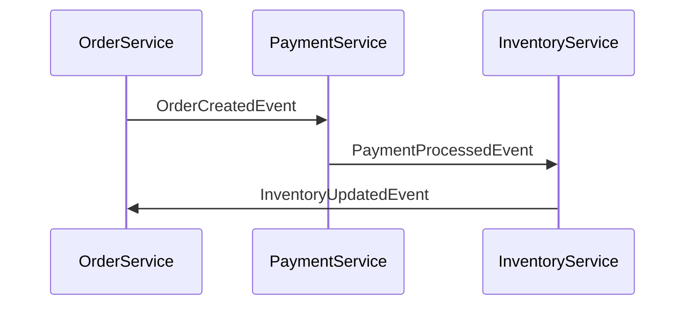
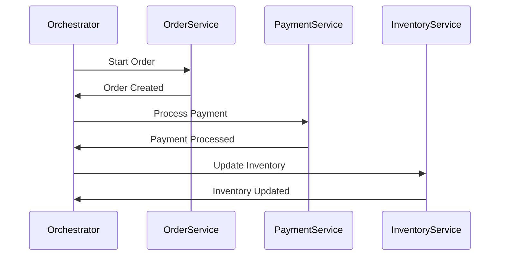

## 13.4.3 Sagas and Transaction Management

In the realm of event-driven architectures, managing distributed transactions across multiple services is a complex challenge. Traditional transaction models, such as ACID transactions, are not suitable for distributed systems due to their need for strong consistency and locking mechanisms. Instead, we turn to sagas, a pattern that allows for managing distributed transactions in a more flexible and resilient manner.

### Understanding Sagas

Sagas are a sequence of local transactions where each transaction updates a single service and publishes events to trigger the next transaction in the sequence. This approach allows for eventual consistency across distributed systems without the need for a global lock or a centralized transaction manager.

#### Saga Types

There are two primary types of sagas: choreographed sagas and orchestrated sagas. Each type has its own approach to managing the flow of transactions and handling failures.

##### Choreographed Sagas

In choreographed sagas, each service involved in the saga listens for specific events and triggers subsequent events based on predefined business logic. This decentralized approach allows services to operate independently, reacting to events as they occur.

**Advantages:**
- Simplicity: Each service only needs to know about the events it listens to and the events it publishes.
- Loose Coupling: Services remain decoupled, promoting flexibility and scalability.

**Challenges:**
- Complexity in Coordination: As the number of services increases, coordinating the flow of events can become complex.
- Difficulty in Error Handling: Without a central coordinator, managing compensating transactions and error handling can be challenging.

**Example:**

Consider an e-commerce order processing system where the order service, payment service, and inventory service are involved. Each service listens for events and triggers the next step:



##### Orchestrated Sagas

Orchestrated sagas involve a central orchestrator that manages the saga's workflow. The orchestrator directs services to perform specific actions and handles compensating transactions in case of failures.

**Advantages:**
- Centralized Control: The orchestrator has a complete view of the saga, making it easier to manage complex workflows and error handling.
- Simplified Error Management: The orchestrator can implement retry mechanisms and compensating transactions more effectively.

**Challenges:**
- Single Point of Failure: The orchestrator can become a bottleneck or a single point of failure if not designed for high availability.
- Increased Complexity: The orchestrator needs to manage the state and flow of the entire saga, which can be complex.

**Example:**

In the same e-commerce order processing system, an orchestrator manages the sequence of transactions:



### Implementing Sagas for Transaction Management

Implementing sagas involves designing a workflow that ensures the system remains consistent even when parts of the transaction fail. This requires careful planning of compensating transactions and error handling mechanisms.

#### Compensating Transactions

Compensating transactions are actions that undo the effects of previous transactions in the saga when a failure occurs. They are crucial for maintaining system integrity and ensuring eventual consistency.

**Designing Compensating Transactions:**
- Identify Reversible Actions: Ensure that each transaction in the saga has a corresponding compensating action.
- Implement Idempotency: Compensating transactions should be idempotent to handle repeated execution without adverse effects.
- Consider Business Logic: Compensating actions should align with business requirements and not just reverse technical changes.

**Example:**

In the order processing system, if the payment fails after the order is created, a compensating transaction might cancel the order:

```java
public class OrderService {
    public void createOrder(Order order) {
        // Logic to create order
        publishEvent(new OrderCreatedEvent(order));
    }

    public void cancelOrder(Order order) {
        // Logic to cancel order
        publishEvent(new OrderCancelledEvent(order));
    }
}
```

#### Saga Orchestrators

The role of a saga orchestrator is to manage the sequence of transactions, handle failures, and coordinate compensations to ensure the saga completes successfully. The orchestrator must be capable of:

- Tracking the state of each transaction.
- Initiating compensating transactions when necessary.
- Implementing retry mechanisms for transient failures.
- Logging and alerting to facilitate timely recovery and resolution.

**Error Handling in Sagas:**

Sagas handle errors and failures at each step through various mechanisms:

- **Retry Mechanisms:** Automatically retrying failed transactions can resolve transient issues.
- **Timeouts:** Define appropriate timeouts for each transaction to prevent indefinite waiting.
- **Logging and Alerting:** Capture detailed logs and alerts to facilitate debugging and recovery.

**Saga Durations and Timeouts:**

Defining appropriate durations and timeouts for sagas is crucial to balance between long-running processes and resource utilization. Considerations include:

- **Resource Constraints:** Long-running sagas can tie up resources, so timeouts help release them.
- **Business Requirements:** Some processes may inherently take longer and require extended durations.

**Monitoring Saga Progress:**

Monitoring the progress and health of sagas is essential for ensuring successful completions. Use tools and dashboards to track ongoing transactions, detect failures, and provide insights into system performance.

**Example Implementations:**

Let's consider a practical example of using sagas for transaction management in a multi-service order processing workflow:

1. **Order Creation:** The order service creates an order and publishes an `OrderCreatedEvent`.
2. **Payment Processing:** The payment service listens for the event, processes the payment, and publishes a `PaymentProcessedEvent`.
3. **Inventory Update:** The inventory service updates the stock and publishes an `InventoryUpdatedEvent`.

If the payment fails, the orchestrator triggers compensating transactions to cancel the order and revert any inventory changes.

```java
public class SagaOrchestrator {
    public void handleOrderCreated(OrderCreatedEvent event) {
        try {
            // Process payment
            PaymentService.processPayment(event.getOrder());
        } catch (PaymentException e) {
            // Compensate by canceling the order
            OrderService.cancelOrder(event.getOrder());
        }
    }
}
```

### Conclusion

Sagas provide a robust framework for managing distributed transactions in event-driven architectures. By leveraging choreographed or orchestrated sagas, developers can ensure system consistency and resilience in the face of failures. Implementing compensating transactions, monitoring saga progress, and handling errors effectively are key to successful saga implementations. As you design your event-driven systems, consider the unique requirements and challenges of your domain to choose the appropriate saga pattern and implementation strategy.

## Quiz Time!



### What is a saga in the context of event-driven architectures?

- [x] A sequence of local transactions where each transaction updates a single service and publishes events to trigger the next transaction.
- [ ] A centralized transaction manager that locks resources across services.
- [ ] A mechanism for ensuring strong consistency in distributed systems.
- [ ] A pattern for designing monolithic applications.

> **Explanation:** Sagas are a sequence of local transactions that allow for eventual consistency across distributed systems by triggering subsequent transactions through events.

### What is the main advantage of choreographed sagas?

- [x] Simplicity and loose coupling between services.
- [ ] Centralized control and error management.
- [ ] Reduced complexity in coordinating events.
- [ ] Easier implementation of compensating transactions.

> **Explanation:** Choreographed sagas promote simplicity and loose coupling as each service only needs to know about the events it listens to and publishes.

### In orchestrated sagas, what is the role of the orchestrator?

- [x] To manage the saga's workflow, direct services, and handle compensating transactions.
- [ ] To act as a message broker between services.
- [ ] To ensure strong consistency by locking resources.
- [ ] To simplify the implementation of event listeners.

> **Explanation:** The orchestrator manages the saga's workflow, directing services to perform actions and handling compensating transactions in case of failures.

### What is a compensating transaction?

- [x] An action that undoes the effects of a previous transaction in a saga when a failure occurs.
- [ ] A transaction that ensures strong consistency across services.
- [ ] A mechanism for retrying failed transactions.
- [ ] A transaction that locks resources across distributed systems.

> **Explanation:** Compensating transactions are designed to undo the effects of previous transactions in a saga to maintain system integrity.

### Which of the following is a challenge of choreographed sagas?

- [x] Complexity in coordinating the flow of events.
- [ ] Centralized control and error management.
- [x] Difficulty in error handling without a central coordinator.
- [ ] Simplified implementation of compensating transactions.

> **Explanation:** Choreographed sagas can become complex to coordinate as the number of services increases, and error handling is challenging without a central coordinator.

### How do sagas handle errors and failures?

- [x] Through retry mechanisms, logging, and alerting.
- [ ] By locking resources across services.
- [ ] By ensuring strong consistency through global transactions.
- [ ] By simplifying the implementation of event listeners.

> **Explanation:** Sagas handle errors through retry mechanisms, logging, and alerting to facilitate timely recovery and resolution.

### Why are timeouts important in sagas?

- [x] To balance between long-running processes and resource utilization.
- [ ] To ensure strong consistency across distributed systems.
- [ ] To simplify the implementation of compensating transactions.
- [ ] To lock resources across services.

> **Explanation:** Timeouts help balance between long-running processes and resource utilization, preventing indefinite resource tying.

### What is the main benefit of monitoring saga progress?

- [x] To track ongoing transactions, detect failures, and ensure successful completions.
- [ ] To ensure strong consistency across services.
- [ ] To simplify the implementation of event listeners.
- [ ] To lock resources across distributed systems.

> **Explanation:** Monitoring saga progress helps track ongoing transactions, detect failures, and ensure successful completions.

### In a multi-service order processing workflow, what happens if the payment fails?

- [x] The orchestrator triggers compensating transactions to cancel the order and revert any inventory changes.
- [ ] The order is processed without payment.
- [ ] The inventory is updated regardless of payment status.
- [ ] The system locks resources until payment is successful.

> **Explanation:** If the payment fails, the orchestrator triggers compensating transactions to maintain system integrity by canceling the order and reverting inventory changes.

### True or False: Sagas can ensure strong consistency across distributed systems.

- [ ] True
- [x] False

> **Explanation:** Sagas provide eventual consistency, not strong consistency, across distributed systems by managing distributed transactions through local transactions and events.


