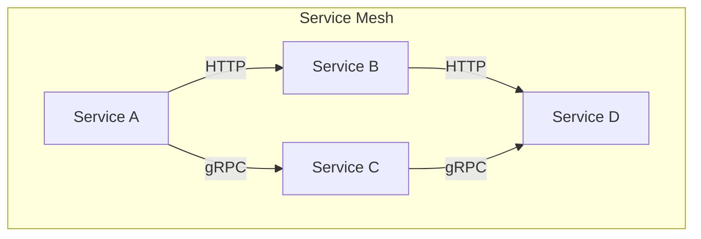

---

linkTitle: "14.1.2 Common Integration Patterns"
title: "Common Integration Patterns in Microservices and Event-Driven Architecture"
description: "Explore the common integration patterns in microservices using event-driven architecture, including event-driven messaging, request-reply, publish-subscribe, event sourcing, CQRS, service mesh integration, saga pattern, and facade services."
categories:
- Microservices
- Event-Driven Architecture
- Software Engineering
tags:
- Microservices
- Event-Driven Architecture
- Kafka
- RabbitMQ
- CQRS
- Saga Pattern
date: 2024-10-25
type: docs
nav_weight: 1412000
---

## 14.1.2 Common Integration Patterns

In the realm of microservices, Event-Driven Architecture (EDA) plays a pivotal role in enabling seamless communication and interaction between distributed components. This section explores the common integration patterns that leverage EDA principles to enhance microservices' capabilities, focusing on decoupling, scalability, and real-time processing.

### Event-Driven Messaging

Event-driven messaging is a cornerstone of EDA, facilitating asynchronous communication between microservices. This pattern employs message brokers like Apache Kafka and RabbitMQ to manage the flow of events across services, enabling real-time processing and decoupled interactions.

#### Using Message Brokers

Message brokers act as intermediaries that handle the transmission of messages between producers and consumers. They provide a robust infrastructure for managing event streams, ensuring that messages are delivered reliably and efficiently.

- **Apache Kafka**: Known for its high throughput and fault tolerance, Kafka is ideal for handling large volumes of streaming data. It organizes messages into topics, allowing multiple consumers to process events concurrently.

- **RabbitMQ**: This broker excels in scenarios requiring complex routing and message acknowledgment. Its support for various messaging protocols makes it versatile for different use cases.

**Java Example with Kafka:**

```java
import org.apache.kafka.clients.producer.KafkaProducer;
import org.apache.kafka.clients.producer.ProducerRecord;
import java.util.Properties;

public class EventProducer {
    public static void main(String[] args) {
        Properties props = new Properties();
        props.put("bootstrap.servers", "localhost:9092");
        props.put("key.serializer", "org.apache.kafka.common.serialization.StringSerializer");
        props.put("value.serializer", "org.apache.kafka.common.serialization.StringSerializer");

        KafkaProducer<String, String> producer = new KafkaProducer<>(props);
        ProducerRecord<String, String> record = new ProducerRecord<>("events", "key", "event data");

        producer.send(record, (metadata, exception) -> {
            if (exception == null) {
                System.out.println("Event sent to topic " + metadata.topic());
            } else {
                exception.printStackTrace();
            }
        });

        producer.close();
    }
}
```

This example demonstrates a simple Kafka producer that sends an event to a specified topic, showcasing the ease of integrating Kafka into a microservices architecture.

### Request-Reply Pattern

While EDA emphasizes asynchronous communication, there are scenarios where synchronous interactions are necessary. The request-reply pattern addresses this need by allowing services to request information and receive immediate responses.

#### Scenarios for Synchronous Communication

- **Data Retrieval**: When a service requires specific data to proceed with processing, a synchronous request-reply interaction ensures timely access to the needed information.

- **User Interactions**: In user-facing applications, immediate feedback is crucial. Request-reply enables services to provide real-time responses to user actions.

**Java Example with REST API:**

```java
import org.springframework.web.bind.annotation.GetMapping;
import org.springframework.web.bind.annotation.RestController;
import org.springframework.web.client.RestTemplate;

@RestController
public class RequestReplyController {

    @GetMapping("/getData")
    public String getData() {
        RestTemplate restTemplate = new RestTemplate();
        String response = restTemplate.getForObject("http://external-service/data", String.class);
        return "Received data: " + response;
    }
}
```

This Spring Boot example illustrates a simple REST API that performs a synchronous request to an external service, highlighting the request-reply pattern in action.

### Publish-Subscribe Mechanism

The publish-subscribe mechanism is a powerful pattern that allows services to broadcast events to multiple subscribers. This approach supports reactive workflows by enabling services to react to changes in real-time.

#### Broadcasting Information

In a publish-subscribe setup, services publish events to topics, and interested subscribers consume these events. This decouples the producers from the consumers, allowing for scalable and flexible architectures.

**Java Example with Kafka:**

```java
import org.apache.kafka.clients.consumer.ConsumerRecord;
import org.apache.kafka.clients.consumer.KafkaConsumer;
import org.apache.kafka.clients.consumer.ConsumerRecords;
import java.util.Collections;
import java.util.Properties;

public class EventConsumer {
    public static void main(String[] args) {
        Properties props = new Properties();
        props.put("bootstrap.servers", "localhost:9092");
        props.put("group.id", "event-consumers");
        props.put("key.deserializer", "org.apache.kafka.common.serialization.StringDeserializer");
        props.put("value.deserializer", "org.apache.kafka.common.serialization.StringDeserializer");

        KafkaConsumer<String, String> consumer = new KafkaConsumer<>(props);
        consumer.subscribe(Collections.singletonList("events"));

        while (true) {
            ConsumerRecords<String, String> records = consumer.poll(100);
            for (ConsumerRecord<String, String> record : records) {
                System.out.println("Received event: " + record.value());
            }
        }
    }
}
```

This consumer example demonstrates how to subscribe to a Kafka topic and process incoming events, showcasing the publish-subscribe pattern's effectiveness in distributing information.

### Event Sourcing

Event sourcing is a pattern where state changes are stored as a sequence of events. This approach allows microservices to reconstruct their state from event logs, enhancing auditability and consistency.

#### Benefits of Event Sourcing

- **Auditability**: Every state change is recorded as an event, providing a complete history of changes for auditing purposes.

- **Consistency**: Services can rebuild their state by replaying events, ensuring consistency across distributed systems.

**Java Example of Event Sourcing:**

```java
import java.util.ArrayList;
import java.util.List;

class Event {
    private String type;
    private String data;

    public Event(String type, String data) {
        this.type = type;
        this.data = data;
    }

    // Getters and toString() method
}

class EventStore {
    private List<Event> events = new ArrayList<>();

    public void addEvent(Event event) {
        events.add(event);
    }

    public List<Event> getEvents() {
        return events;
    }
}

public class EventSourcingExample {
    public static void main(String[] args) {
        EventStore eventStore = new EventStore();
        eventStore.addEvent(new Event("UserCreated", "User data"));
        eventStore.addEvent(new Event("UserUpdated", "Updated user data"));

        for (Event event : eventStore.getEvents()) {
            System.out.println(event);
        }
    }
}
```

This example illustrates a simple event store that records events, demonstrating how event sourcing can be implemented to track state changes.

### Command Query Responsibility Segregation (CQRS)

CQRS is a pattern that separates read and write operations within microservices, optimizing performance and scalability by tailoring each side to specific needs.

#### Benefits of CQRS

- **Performance Optimization**: By separating commands (writes) from queries (reads), each side can be optimized independently, improving overall system performance.

- **Scalability**: CQRS allows for scaling read and write operations separately, accommodating different load requirements.

**Java Example with CQRS:**

```java
// Command Model
class CreateOrderCommand {
    private String orderId;
    private String product;

    public CreateOrderCommand(String orderId, String product) {
        this.orderId = orderId;
        this.product = product;
    }

    // Getters and setters
}

// Query Model
class OrderQuery {
    private String orderId;

    public OrderQuery(String orderId) {
        this.orderId = orderId;
    }

    // Getters and setters
}

public class CqrsExample {
    public static void main(String[] args) {
        CreateOrderCommand command = new CreateOrderCommand("123", "Laptop");
        OrderQuery query = new OrderQuery("123");

        // Process command and query
    }
}
```

This example demonstrates the separation of command and query models, illustrating how CQRS can be implemented to optimize microservices.

### Service Mesh Integration

Service meshes like Istio and Linkerd provide a robust infrastructure for managing communication, security, and observability between microservices. They complement EDA by offering advanced features such as traffic management, security policies, and telemetry.

#### Benefits of Service Meshes

- **Traffic Management**: Service meshes enable fine-grained control over traffic routing and load balancing, enhancing the reliability of microservices.

- **Security**: They provide built-in security features like mutual TLS, ensuring secure communication between services.

- **Observability**: With comprehensive telemetry and tracing capabilities, service meshes offer deep insights into service interactions and performance.

**Diagram: Service Mesh Architecture**



This diagram illustrates a service mesh architecture, highlighting how services communicate through the mesh, benefiting from its features.

### Saga Pattern for Distributed Transactions

The saga pattern is a method for managing complex transactions across multiple microservices, ensuring data consistency and reliability in an event-driven environment.

#### Types of Sagas

- **Choreography-Based Sagas**: Each service involved in the transaction publishes events and listens for events from other services to complete the transaction.

- **Orchestration-Based Sagas**: A central orchestrator manages the transaction, coordinating the execution of each step.

**Java Example of Choreography-Based Saga:**

```java
class OrderService {
    public void createOrder() {
        // Publish OrderCreated event
    }
}

class PaymentService {
    public void processPayment() {
        // Listen for OrderCreated event and process payment
        // Publish PaymentProcessed event
    }
}

class ShippingService {
    public void shipOrder() {
        // Listen for PaymentProcessed event and ship order
    }
}
```

This example demonstrates a simple choreography-based saga, where services communicate through events to complete a distributed transaction.

### Facade and Gateway Services

Facade or API gateway services play a crucial role in aggregating and routing events or requests to appropriate microservices. They simplify client interactions and enhance security by providing a single entry point to the system.

#### Benefits of Facade Services

- **Simplified Client Interactions**: Clients interact with a single API gateway, reducing the complexity of managing multiple service endpoints.

- **Security**: Gateways can enforce security policies, such as authentication and rate limiting, protecting backend services.

**Java Example with Spring Cloud Gateway:**

```java
import org.springframework.cloud.gateway.route.RouteLocator;
import org.springframework.cloud.gateway.route.builder.RouteLocatorBuilder;
import org.springframework.context.annotation.Bean;
import org.springframework.context.annotation.Configuration;

@Configuration
public class GatewayConfig {

    @Bean
    public RouteLocator routes(RouteLocatorBuilder builder) {
        return builder.routes()
                .route("order_route", r -> r.path("/orders/**")
                        .uri("http://order-service"))
                .route("payment_route", r -> r.path("/payments/**")
                        .uri("http://payment-service"))
                .build();
    }
}
```

This configuration example shows how to set up routes in a Spring Cloud Gateway, directing requests to the appropriate microservices.

### Conclusion

Integrating microservices with event-driven architecture patterns offers numerous benefits, including enhanced scalability, flexibility, and real-time processing capabilities. By leveraging these common integration patterns, developers can build robust, efficient, and responsive microservices systems.

## Quiz Time!



### What is the primary role of message brokers like Kafka in microservices?

- [x] Facilitate asynchronous communication between microservices
- [ ] Provide synchronous communication between microservices
- [ ] Store microservices' state permanently
- [ ] Manage microservices' deployment

> **Explanation:** Message brokers like Kafka facilitate asynchronous communication by handling the transmission of messages between producers and consumers, enabling real-time event processing.

### In which scenario is the request-reply pattern most suitable?

- [x] When immediate responses are required
- [ ] For broadcasting messages to multiple consumers
- [ ] For storing state changes as events
- [ ] For separating read and write operations

> **Explanation:** The request-reply pattern is suitable when immediate responses are required, such as in user interactions or data retrieval scenarios.

### What is a key benefit of the publish-subscribe mechanism?

- [x] It allows multiple subscribers to consume events from a single publisher
- [ ] It ensures synchronous communication between services
- [ ] It stores state changes as a sequence of events
- [ ] It separates read and write operations

> **Explanation:** The publish-subscribe mechanism allows multiple subscribers to consume events from a single publisher, supporting reactive workflows and broadcasting information.

### How does event sourcing enhance auditability?

- [x] By storing every state change as an event
- [ ] By separating read and write operations
- [ ] By providing immediate responses to requests
- [ ] By managing complex transactions across services

> **Explanation:** Event sourcing enhances auditability by storing every state change as an event, providing a complete history of changes.

### What is the main advantage of using CQRS in microservices?

- [x] It optimizes performance by separating read and write operations
- [ ] It ensures synchronous communication between services
- [ ] It allows for broadcasting messages to multiple consumers
- [ ] It stores state changes as a sequence of events

> **Explanation:** CQRS optimizes performance by separating read and write operations, allowing each side to be tailored to specific needs.

### How do service meshes complement EDA in microservices?

- [x] By managing communication, security, and observability
- [ ] By storing state changes as events
- [ ] By separating read and write operations
- [ ] By providing synchronous communication

> **Explanation:** Service meshes complement EDA by managing communication, security, and observability, providing robust infrastructure support for microservices.

### What is the role of the saga pattern in microservices?

- [x] Managing complex transactions across multiple services
- [ ] Providing synchronous communication between services
- [ ] Broadcasting messages to multiple consumers
- [ ] Separating read and write operations

> **Explanation:** The saga pattern manages complex transactions across multiple services, ensuring data consistency and reliability in an event-driven environment.

### How do facade services enhance security in microservices?

- [x] By enforcing security policies at a single entry point
- [ ] By storing state changes as events
- [ ] By separating read and write operations
- [ ] By providing synchronous communication

> **Explanation:** Facade services enhance security by enforcing security policies at a single entry point, protecting backend services.

### What is a key benefit of using an API gateway in microservices?

- [x] It simplifies client interactions by providing a single entry point
- [ ] It ensures synchronous communication between services
- [ ] It stores state changes as a sequence of events
- [ ] It separates read and write operations

> **Explanation:** An API gateway simplifies client interactions by providing a single entry point, reducing the complexity of managing multiple service endpoints.

### True or False: Event sourcing allows microservices to reconstruct state from event logs.

- [x] True
- [ ] False

> **Explanation:** True. Event sourcing allows microservices to reconstruct state from event logs, enhancing auditability and consistency.


