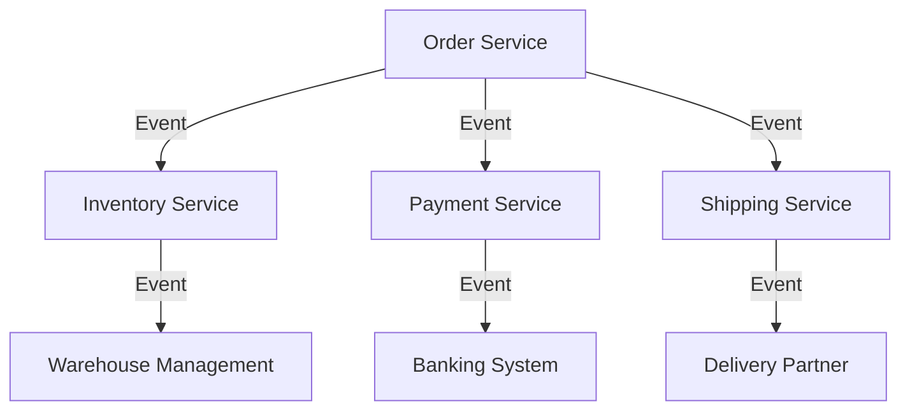

## 14.2.1 Service Boundaries and Responsibilities

In the realm of event-driven microservices, defining clear service boundaries and responsibilities is crucial for building scalable, maintainable, and efficient systems. This section delves into the principles and practices that guide the design of microservices with well-defined boundaries, emphasizing the importance of aligning these boundaries with business capabilities and domain-driven design (DDD) principles.

### Define Clear Service Boundaries

The foundation of a robust microservices architecture lies in the clear definition of service boundaries. Each microservice should encapsulate a specific business capability, ensuring that it has a single responsibility. This approach not only simplifies the architecture but also enhances the system's ability to evolve independently.

#### Identify Core Responsibilities

Identifying and assigning core responsibilities to each microservice is a critical step in the design process. This involves understanding the business domain and decomposing it into distinct services, each responsible for a specific aspect of the business logic. Avoiding overlaps in responsibilities ensures that services remain focused and manageable.

**Example:**

Consider an e-commerce platform. Core responsibilities might be divided as follows:

- **Order Service:** Manages order creation, updates, and status tracking.
- **Inventory Service:** Handles stock levels, product availability, and inventory updates.
- **Payment Service:** Processes payments, manages transactions, and handles refunds.
- **Shipping Service:** Coordinates shipping logistics, tracking, and delivery updates.

By clearly defining these responsibilities, each service can operate independently and efficiently.

### Decouple by Functionality

Decoupling services by functionality is essential for achieving scalability and flexibility. Functionally independent services can evolve and scale without impacting other parts of the system, allowing for more agile development and deployment.

**Practical Example:**

In a retail application, the Inventory Service should be able to update stock levels without affecting the Order Service. This decoupling allows each service to scale independently based on demand, such as during a sales event where inventory updates are frequent.

### Align with Business Domains

Aligning service boundaries with specific business domains or subdomains facilitates better understanding and collaboration among teams. This alignment ensures that each team can focus on a particular domain, leveraging domain knowledge to enhance service design and implementation.

**Domain-Driven Design (DDD) Integration:**

Domain-driven design provides a framework for aligning service boundaries with business domains. By identifying bounded contexts within the business, teams can define services that encapsulate specific domain logic, reducing complexity and enhancing cohesion.

### Encapsulate Data Ownership

In an event-driven architecture, it is vital that each microservice owns and manages its own data. This encapsulation prevents data silos and enhances data integrity, as services are responsible for maintaining their own state and data consistency.

**Data Ownership Example:**

The Order Service should own all data related to orders, including customer details, order items, and status. This ownership ensures that the service can handle all operations related to orders without relying on external data sources.

### Implement Bounded Contexts

Bounded contexts, a key concept from DDD, help in defining the scope within which a microservice operates. Each service should function within a well-defined context, reducing complexity and enhancing cohesion.

**Mermaid Diagram:**

In this diagram, each service operates within its bounded context, interacting with others through events.

### Use API Contracts

Defining clear API contracts for each service is essential for ensuring interoperability. These contracts specify event formats, protocols, and interaction patterns, allowing services to communicate effectively.

**API Contract Example:**

For the Order Service, an API contract might specify that order creation events include fields such as `orderId`, `customerId`, `orderItems`, and `orderTotal`. This contract ensures that consuming services, like the Inventory Service, can process these events correctly.

### Example Service Boundary Definitions

To illustrate the concept of service boundaries, consider a retail platform where services are defined as follows:

- **Order Service:** Responsible for order lifecycle management, from creation to fulfillment.
- **Inventory Service:** Manages product stock levels and availability.
- **Payment Service:** Handles payment processing and transaction management.
- **Shipping Service:** Coordinates logistics and delivery tracking.

Each service has distinct responsibilities and interacts with others through well-defined events, ensuring a cohesive and efficient system.

### Conclusion

Defining clear service boundaries and responsibilities is a cornerstone of successful event-driven microservices architecture. By aligning services with business domains, encapsulating data ownership, and implementing bounded contexts, architects can create systems that are scalable, maintainable, and resilient. The use of API contracts further ensures that services can communicate effectively, fostering a robust and interoperable ecosystem.

By following these principles, developers and architects can design microservices that not only meet current business needs but also adapt to future challenges and opportunities.

## Quiz Time!



### What is the primary benefit of defining clear service boundaries in microservices?

- [x] It simplifies the architecture and enhances scalability.
- [ ] It increases the complexity of the system.
- [ ] It reduces the need for communication between services.
- [ ] It allows for more centralized data management.

> **Explanation:** Clear service boundaries simplify the architecture by ensuring each service has a single responsibility, which enhances scalability and maintainability.

### How does aligning service boundaries with business domains benefit a microservices architecture?

- [x] It facilitates better understanding and collaboration among teams.
- [ ] It increases the number of services required.
- [ ] It complicates the deployment process.
- [ ] It centralizes data management.

> **Explanation:** Aligning service boundaries with business domains ensures that teams can focus on specific areas, leveraging domain knowledge to enhance service design and implementation.

### What is the role of bounded contexts in microservices?

- [x] They define the scope within which a microservice operates.
- [ ] They increase the complexity of service interactions.
- [ ] They centralize data management across services.
- [ ] They reduce the need for API contracts.

> **Explanation:** Bounded contexts help define the scope of a microservice, reducing complexity and enhancing cohesion by ensuring each service operates within a well-defined context.

### Why is data ownership important in an event-driven architecture?

- [x] It prevents data silos and enhances data integrity.
- [ ] It centralizes data management across services.
- [ ] It complicates data access for other services.
- [ ] It reduces the need for event-driven communication.

> **Explanation:** Data ownership ensures that each service is responsible for its own data, preventing silos and enhancing data integrity within the architecture.

### What is the purpose of API contracts in microservices?

- [x] To specify event formats, protocols, and interaction patterns.
- [ ] To centralize data management across services.
- [ ] To increase the complexity of service interactions.
- [ ] To reduce the need for clear service boundaries.

> **Explanation:** API contracts define how services communicate, specifying event formats, protocols, and interaction patterns to ensure interoperability.

### Which of the following is an example of a core responsibility for a Payment Service in a retail platform?

- [x] Processing payments and managing transactions.
- [ ] Managing product stock levels.
- [ ] Coordinating shipping logistics.
- [ ] Handling order creation and updates.

> **Explanation:** The Payment Service is responsible for processing payments and managing transactions, distinct from other services like Inventory or Shipping.

### How does decoupling services by functionality benefit a microservices architecture?

- [x] It allows services to evolve and scale independently.
- [ ] It increases the complexity of service interactions.
- [ ] It centralizes data management across services.
- [ ] It reduces the need for bounded contexts.

> **Explanation:** Decoupling services by functionality allows them to evolve and scale independently, enhancing flexibility and scalability.

### What is a key concept from domain-driven design that helps define service boundaries?

- [x] Bounded contexts.
- [ ] Centralized data management.
- [ ] API contracts.
- [ ] Monolithic architecture.

> **Explanation:** Bounded contexts from domain-driven design help define the scope within which a microservice operates, reducing complexity and enhancing cohesion.

### Why should each microservice manage its own data?

- [x] To ensure data integrity and prevent data silos.
- [ ] To centralize data management across services.
- [ ] To increase the complexity of data access.
- [ ] To reduce the need for event-driven communication.

> **Explanation:** Managing its own data ensures that each microservice maintains data integrity and prevents data silos, which is crucial in an event-driven architecture.

### True or False: Aligning service boundaries with business domains complicates the microservices architecture.

- [ ] True
- [x] False

> **Explanation:** Aligning service boundaries with business domains simplifies the architecture by ensuring that services are aligned with specific business capabilities, enhancing understanding and collaboration.


