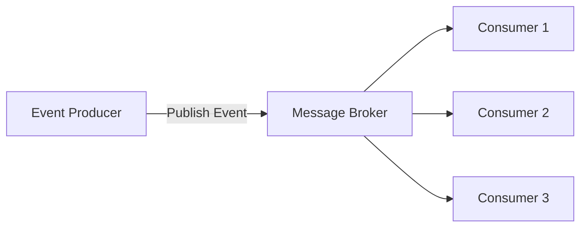
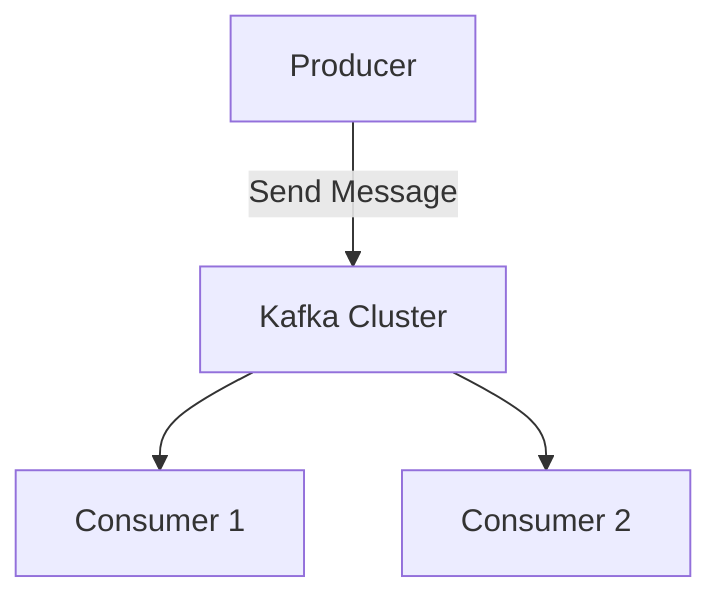

## 14.2.2 Communication Strategies

In the realm of microservices, communication strategies are pivotal to building scalable, responsive, and resilient systems. Event-Driven Architecture (EDA) plays a crucial role in facilitating these strategies by enabling services to interact in a loosely coupled manner. This section delves into various communication strategies that leverage EDA principles, providing insights into their implementation and benefits.

### Asynchronous Messaging

Asynchronous messaging is a cornerstone of event-driven microservices, allowing services to communicate without blocking each other. This approach enhances scalability and responsiveness by decoupling the sender and receiver, enabling them to operate independently.

#### Benefits of Asynchronous Messaging

- **Scalability:** Services can handle messages at their own pace, allowing for better resource utilization and scaling.
- **Resilience:** Systems can continue to function even if some services are temporarily unavailable, as messages can be queued for later processing.
- **Decoupling:** Services are not tightly bound to each other, reducing dependencies and increasing flexibility.

#### Protocols and Tools

Common protocols for asynchronous messaging include AMQP (Advanced Message Queuing Protocol) and MQTT (Message Queuing Telemetry Transport). These protocols are designed to handle high-throughput, low-latency communication, making them ideal for microservices.

**Example:**

```java
import org.springframework.amqp.rabbit.core.RabbitTemplate;
import org.springframework.beans.factory.annotation.Autowired;
import org.springframework.stereotype.Service;

@Service
public class MessageProducer {

    @Autowired
    private RabbitTemplate rabbitTemplate;

    public void sendMessage(String message) {
        rabbitTemplate.convertAndSend("exchangeName", "routingKey", message);
    }
}
```

In this example, a `MessageProducer` service uses Spring AMQP to send messages to a RabbitMQ broker, demonstrating asynchronous communication.

### Event-Driven Communication

Event-driven communication involves services publishing and subscribing to events via message brokers. This pattern facilitates real-time data flow and decoupled interactions, allowing services to react to changes as they occur.

#### Implementing Event-Driven Communication

- **Publish-Subscribe Model:** Services publish events to a broker, and interested services subscribe to these events to receive updates.
- **Real-Time Processing:** Enables immediate processing of events, supporting reactive workflows.

**Example:**

```java
import org.springframework.kafka.core.KafkaTemplate;
import org.springframework.beans.factory.annotation.Autowired;
import org.springframework.stereotype.Service;

@Service
public class EventPublisher {

    @Autowired
    private KafkaTemplate<String, String> kafkaTemplate;

    public void publishEvent(String topic, String event) {
        kafkaTemplate.send(topic, event);
    }
}
```

Here, an `EventPublisher` service uses Kafka to publish events, allowing multiple consumers to subscribe and react to these events.

### Synchronous API Calls

While asynchronous communication is preferred, there are scenarios where synchronous API calls are necessary for immediate responses. These calls can be integrated with EDA principles by limiting their use to essential interactions.

#### When to Use Synchronous API Calls

- **Immediate Feedback:** When a service needs an immediate response to proceed with its operation.
- **Critical Operations:** For operations that require confirmation before proceeding.

**Example:**

```java
import org.springframework.web.client.RestTemplate;
import org.springframework.stereotype.Service;

@Service
public class ApiService {

    private final RestTemplate restTemplate = new RestTemplate();

    public String fetchData(String url) {
        return restTemplate.getForObject(url, String.class);
    }
}
```

In this example, `ApiService` uses `RestTemplate` to make a synchronous API call, fetching data from another service.

### Publish-Subscribe Mechanism

The publish-subscribe pattern is a powerful mechanism in EDA, enabling the broadcasting of events to multiple consumers. This supports reactive workflows and ensures data synchronization across services.

#### Advantages of Publish-Subscribe

- **Broadcasting:** Allows a single event to trigger multiple actions across different services.
- **Decoupling:** Services are not aware of each other, only of the events they need to process.

**Example:**



In this diagram, an event producer publishes an event to a message broker, which then distributes it to multiple consumers.

### Command Query Responsibility Segregation (CQRS)

CQRS is a pattern that separates read and write communication patterns, optimizing each for specific use cases and improving overall system performance.

#### Implementing CQRS

- **Command Model:** Handles write operations, ensuring data consistency.
- **Query Model:** Optimized for read operations, often using different data stores for efficiency.

**Example:**

```java
public class OrderCommandService {

    public void createOrder(Order order) {
        // Logic to handle order creation
    }
}

public class OrderQueryService {

    public Order getOrderById(String orderId) {
        // Logic to retrieve order details
    }
}
```

In this example, `OrderCommandService` and `OrderQueryService` separate the responsibilities of handling commands and queries, respectively.

### Service Mesh for Communication Management

A service mesh is an infrastructure layer that manages microservice-to-microservice communication, providing features like load balancing, retries, and circuit breaking to enhance reliability.

#### Benefits of Using a Service Mesh

- **Traffic Management:** Controls the flow of requests between services.
- **Security:** Provides secure communication channels and access control.
- **Observability:** Offers insights into service interactions and performance.

**Example:**

Istio is a popular service mesh that can be used to manage communication in a microservices architecture. It provides features like traffic routing, fault injection, and observability.

### Decentralized Messaging Systems

Decentralized messaging systems, such as Kafka and RabbitMQ, distribute messages across a distributed architecture, reducing single points of failure and improving fault tolerance.

#### Advantages of Decentralized Messaging

- **Scalability:** Easily scale to handle large volumes of messages.
- **Fault Tolerance:** Continue operating even if some nodes fail.

**Example:**



This diagram illustrates a Kafka cluster receiving messages from a producer and distributing them to multiple consumers.

### Example Communication Flow

To illustrate these concepts, consider a scenario where an e-commerce platform uses an event-driven approach to process orders.

1. **Order Service**: When a new order is placed, the Order Service publishes an `OrderCreated` event to a message broker.
2. **Inventory Service**: Subscribes to the `OrderCreated` event and updates the inventory accordingly.
3. **Payment Service**: Also subscribes to the `OrderCreated` event to initiate payment processing.
4. **Notification Service**: Listens for `OrderProcessed` events to send confirmation emails to customers.

**Example Code:**

```java
// Order Service
public class OrderService {

    @Autowired
    private KafkaTemplate<String, String> kafkaTemplate;

    public void createOrder(Order order) {
        // Logic to create order
        kafkaTemplate.send("order-topic", "OrderCreated", order.toString());
    }
}

// Inventory Service
@KafkaListener(topics = "order-topic", groupId = "inventory-group")
public void handleOrderCreated(String order) {
    // Logic to update inventory
}

// Payment Service
@KafkaListener(topics = "order-topic", groupId = "payment-group")
public void processPayment(String order) {
    // Logic to process payment
}

// Notification Service
@KafkaListener(topics = "order-topic", groupId = "notification-group")
public void sendConfirmation(String order) {
    // Logic to send confirmation email
}
```

This example demonstrates how different services interact through events, maintaining data consistency and enabling reactive workflows.

### Conclusion

Communication strategies in event-driven microservices are essential for building scalable, responsive, and resilient systems. By leveraging asynchronous messaging, event-driven communication, and patterns like CQRS, developers can create systems that are both flexible and robust. Service meshes and decentralized messaging systems further enhance these architectures by providing additional layers of reliability and fault tolerance.

## Quiz Time!



### What is a key benefit of asynchronous messaging in microservices?

- [x] It allows services to communicate without blocking each other.
- [ ] It ensures immediate responses for all requests.
- [ ] It requires less infrastructure than synchronous communication.
- [ ] It simplifies the overall architecture.

> **Explanation:** Asynchronous messaging enables services to communicate without blocking, enhancing scalability and responsiveness.

### Which protocol is commonly used for asynchronous messaging in microservices?

- [ ] HTTP
- [x] AMQP
- [ ] FTP
- [ ] SMTP

> **Explanation:** AMQP is a protocol designed for asynchronous messaging, commonly used in microservices.

### What is the main advantage of using a publish-subscribe mechanism?

- [ ] It ensures messages are processed in order.
- [x] It allows broadcasting events to multiple consumers.
- [ ] It simplifies message routing.
- [ ] It reduces the need for message brokers.

> **Explanation:** The publish-subscribe mechanism enables broadcasting events to multiple consumers, supporting reactive workflows.

### In which scenario are synchronous API calls necessary?

- [ ] When services need to operate independently.
- [x] When immediate feedback is required.
- [ ] When processing high volumes of data.
- [ ] When decoupling services.

> **Explanation:** Synchronous API calls are necessary when immediate feedback is required for operations.

### What does CQRS stand for?

- [ ] Command Query Responsibility System
- [x] Command Query Responsibility Segregation
- [ ] Command Queue Response System
- [ ] Command Queue Responsibility Segregation

> **Explanation:** CQRS stands for Command Query Responsibility Segregation, a pattern that separates read and write operations.

### What is a service mesh used for in microservices?

- [ ] To store service data
- [ ] To manage service databases
- [x] To manage microservice-to-microservice communication
- [ ] To deploy services

> **Explanation:** A service mesh is used to manage communication between microservices, providing features like load balancing and retries.

### Which of the following is a decentralized messaging system?

- [ ] HTTP
- [ ] REST
- [x] Kafka
- [ ] SOAP

> **Explanation:** Kafka is a decentralized messaging system used to distribute messages across a distributed architecture.

### What is the role of a message broker in event-driven communication?

- [x] To facilitate the distribution of events between services
- [ ] To store service data
- [ ] To execute service logic
- [ ] To manage service databases

> **Explanation:** A message broker facilitates the distribution of events between services in event-driven communication.

### Which of the following is a benefit of using decentralized messaging systems?

- [ ] They require less infrastructure.
- [ ] They simplify service logic.
- [x] They reduce single points of failure.
- [ ] They ensure immediate message processing.

> **Explanation:** Decentralized messaging systems reduce single points of failure, improving fault tolerance.

### True or False: Event-driven communication always requires synchronous API calls.

- [ ] True
- [x] False

> **Explanation:** Event-driven communication primarily relies on asynchronous messaging, not synchronous API calls.


