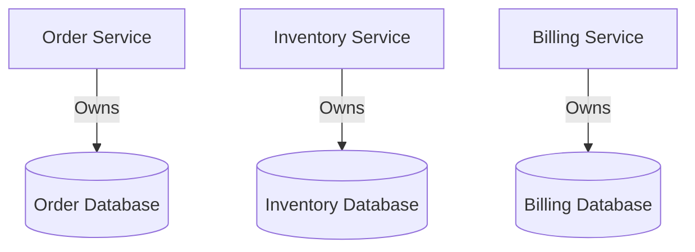
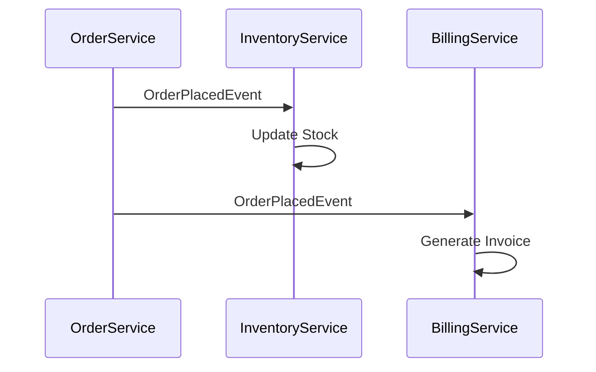

## 14.2.3 Data Management in Microservices

In the realm of microservices, data management is a critical component that directly influences the scalability, resilience, and flexibility of the system. This section delves into various strategies and patterns for managing data in microservices, particularly within an event-driven architecture (EDA). We will explore decentralized data ownership, event-driven data synchronization, and advanced patterns like CQRS and event sourcing, providing practical examples and code snippets to illustrate these concepts.

### Decentralized Data Ownership

One of the foundational principles of microservices architecture is decentralized data ownership. Each microservice should own its data, managing its database or storage independently. This approach prevents tight coupling between services, enhances data integrity, and allows each service to evolve independently.

#### Benefits of Decentralized Data Ownership

- **Isolation and Independence:** Each service can choose the most suitable database technology for its needs, whether it's a relational database, NoSQL store, or even a file system.
- **Scalability:** Services can scale independently based on their specific data and processing needs.
- **Resilience:** A failure in one service's database does not directly impact others, reducing the risk of cascading failures.

#### Example

Consider a simple e-commerce application with separate services for orders, inventory, and billing. Each service manages its own data:

- **Order Service:** Manages order data in a relational database.
- **Inventory Service:** Uses a NoSQL database to handle inventory levels.
- **Billing Service:** Stores billing information in a secure, compliant database.

### Event-Driven Data Synchronization

In an event-driven architecture, services communicate through events to synchronize data across different microservices. This ensures that each service has the necessary data without direct access to another service's database.

#### How It Works

When a significant change occurs within a service, it publishes an event. Other services subscribe to these events and update their data accordingly. This decouples services and allows them to react to changes asynchronously.

#### Example

Continuing with the e-commerce application, when an order is placed, the Order Service publishes an `OrderPlaced` event. The Inventory Service listens for this event and updates its stock levels, while the Billing Service generates an invoice.

```java
// Order Service publishes an event
public class OrderService {
    private final EventPublisher eventPublisher;

    public void placeOrder(Order order) {
        // Save order to database
        // ...
        // Publish event
        eventPublisher.publish(new OrderPlacedEvent(order.getId(), order.getItems()));
    }
}

// Inventory Service listens for the event
public class InventoryService {
    @EventListener
    public void handleOrderPlaced(OrderPlacedEvent event) {
        // Update inventory based on order items
        // ...
    }
}
```

### Database per Service Pattern

The database per service pattern is a cornerstone of microservices architecture, where each microservice has its own database. This pattern promotes isolation and scalability, allowing each service to optimize its data storage independently.

#### Advantages

- **Data Isolation:** Services are isolated from each other's data changes, reducing the risk of accidental data corruption.
- **Technology Flexibility:** Each service can use the most appropriate database technology for its needs.

#### Diagram



### CQRS for Optimized Data Access

Command Query Responsibility Segregation (CQRS) is a pattern that separates the read and write data stores, optimizing each for specific performance and scalability requirements.

#### Implementation

- **Command Model:** Handles data modifications (writes).
- **Query Model:** Optimized for data retrieval (reads).

#### Example

In a CQRS setup, the Order Service might use a relational database for writes and a NoSQL store for fast reads.

```java
// Command Model
public class OrderCommandService {
    public void createOrder(Order order) {
        // Write to relational database
        // ...
    }
}

// Query Model
public class OrderQueryService {
    public Order getOrderById(String orderId) {
        // Read from NoSQL database
        // ...
    }
}
```

### Implementing Event Sourcing

Event sourcing is a technique where state changes are stored as a sequence of immutable events. This allows microservices to reconstruct their state from event logs, providing a reliable audit trail and ensuring consistency.

#### Benefits

- **Auditability:** Every state change is recorded, providing a complete history.
- **Consistency:** Services can rebuild their state from the event log, ensuring data consistency.

#### Example

An Order Service using event sourcing might store events like `OrderCreated`, `OrderShipped`, and `OrderCancelled`.

```java
public class OrderEventStore {
    private final List<OrderEvent> events = new ArrayList<>();

    public void saveEvent(OrderEvent event) {
        events.add(event);
    }

    public List<OrderEvent> getEventsForOrder(String orderId) {
        return events.stream()
                     .filter(event -> event.getOrderId().equals(orderId))
                     .collect(Collectors.toList());
    }
}
```

### Data Replication and Caching

Data replication and caching strategies are crucial for improving data access speed and availability across services. Technologies like Redis or replicated SQL databases can be leveraged to enhance performance.

#### Strategies

- **Caching:** Use in-memory caches like Redis to store frequently accessed data.
- **Replication:** Replicate databases across multiple nodes to improve availability and fault tolerance.

#### Example

The Inventory Service might cache product details in Redis to reduce database load.

```java
public class InventoryService {
    private final RedisTemplate<String, Product> redisTemplate;

    public Product getProductById(String productId) {
        // Check cache first
        Product product = redisTemplate.opsForValue().get(productId);
        if (product == null) {
            // Load from database and cache it
            product = loadProductFromDatabase(productId);
            redisTemplate.opsForValue().set(productId, product);
        }
        return product;
    }
}
```

### Handling Data Consistency

Maintaining data consistency in distributed systems is challenging. Techniques such as eventual consistency, distributed transactions, and saga patterns can be employed to coordinate state changes.

#### Techniques

- **Eventual Consistency:** Accept that data will be consistent eventually, allowing for temporary discrepancies.
- **Saga Patterns:** Use sagas to manage distributed transactions, ensuring all-or-nothing execution across services.

#### Example

In our e-commerce application, the saga pattern might be used to ensure that an order is only marked as completed if both the inventory is updated and the payment is processed.

### Example Data Management Strategies

Let's consider a practical example of how different microservices handle data management:

- **Order Service:** Manages its own order database and publishes events like `OrderPlaced` and `OrderCancelled`.
- **Inventory Service:** Listens to order events to update stock levels and caches frequently accessed product data.
- **Billing Service:** Generates invoices based on order events and ensures compliance with financial regulations.

#### Diagram



### Conclusion

Data management in microservices is a multifaceted challenge that requires careful consideration of patterns and strategies to ensure scalability, resilience, and consistency. By embracing decentralized data ownership, leveraging event-driven synchronization, and employing advanced patterns like CQRS and event sourcing, developers can build robust microservices architectures that meet the demands of modern applications.

For further exploration, consider diving into resources such as "Building Microservices" by Sam Newman and "Domain-Driven Design" by Eric Evans, which provide deeper insights into microservices architecture and data management strategies.

## Quiz Time!



### What is a key benefit of decentralized data ownership in microservices?

- [x] Isolation and Independence
- [ ] Centralized Data Management
- [ ] Increased Coupling
- [ ] Reduced Scalability

> **Explanation:** Decentralized data ownership allows each microservice to manage its own data independently, promoting isolation and independence.

### How do microservices synchronize data using events?

- [x] By publishing and subscribing to events
- [ ] By directly accessing each other's databases
- [ ] By using a shared database
- [ ] By polling for changes

> **Explanation:** Microservices use events to publish changes and subscribe to updates, allowing for asynchronous data synchronization without direct database access.

### What is the database per service pattern?

- [x] Each microservice has its own database
- [ ] All microservices share a single database
- [ ] Databases are centralized in a data warehouse
- [ ] Microservices use in-memory databases only

> **Explanation:** The database per service pattern ensures each microservice manages its own database, promoting isolation and scalability.

### What does CQRS stand for?

- [x] Command Query Responsibility Segregation
- [ ] Centralized Query Resource System
- [ ] Command Queue Resource Segmentation
- [ ] Continuous Query Response System

> **Explanation:** CQRS stands for Command Query Responsibility Segregation, a pattern that separates read and write data stores.

### Which pattern involves storing state changes as immutable events?

- [x] Event Sourcing
- [ ] CQRS
- [ ] Data Replication
- [ ] Caching

> **Explanation:** Event sourcing involves storing state changes as immutable events, allowing services to reconstruct their state from event logs.

### What technology is commonly used for caching in microservices?

- [x] Redis
- [ ] MySQL
- [ ] Apache Kafka
- [ ] MongoDB

> **Explanation:** Redis is commonly used for caching in microservices due to its speed and efficiency.

### How does eventual consistency work in distributed systems?

- [x] Data becomes consistent over time
- [ ] Data is always consistent
- [ ] Data is never consistent
- [ ] Data is consistent only during transactions

> **Explanation:** Eventual consistency allows for temporary discrepancies, with data becoming consistent over time.

### What is a saga pattern used for?

- [x] Managing distributed transactions
- [ ] Centralizing data management
- [ ] Ensuring immediate consistency
- [ ] Reducing database load

> **Explanation:** The saga pattern is used to manage distributed transactions, ensuring coordinated state changes across services.

### What is a key advantage of using event-driven data synchronization?

- [x] Decoupling services
- [ ] Increasing direct database access
- [ ] Reducing event usage
- [ ] Centralizing data management

> **Explanation:** Event-driven data synchronization decouples services, allowing them to react to changes asynchronously.

### True or False: In microservices, each service should directly access other services' databases for data consistency.

- [ ] True
- [x] False

> **Explanation:** In microservices, each service should manage its own database independently, using events for data synchronization rather than direct database access.


