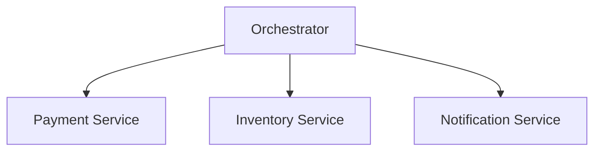
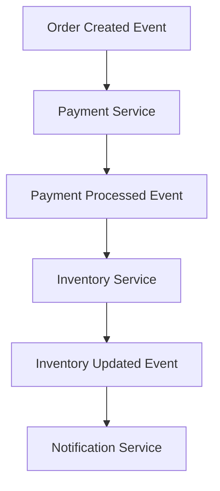

## 14.3.1 Understanding the Differences

In the realm of microservices architecture, managing workflows and interactions between services is crucial for achieving business objectives. Two primary approaches to managing these interactions are orchestration and choreography. Each has its unique characteristics, advantages, and challenges. Understanding these differences is essential for architects and developers to design effective event-driven systems.

### Define Orchestration

Orchestration refers to a centralized control mechanism where a single orchestrator service manages the workflow. This orchestrator coordinates interactions between microservices to achieve a business process. The orchestrator is responsible for invoking services, managing data flow, and handling exceptions.

**Key Characteristics of Orchestration:**
- **Centralized Control:** The orchestrator acts as a central authority, directing the sequence of operations.
- **Workflow Management:** It defines the order in which services are called and manages dependencies.
- **Error Handling:** The orchestrator can implement complex error handling and compensation logic.

**Example:**
Consider a billing process where multiple steps must occur in a specific sequence, such as verifying payment details, charging a credit card, and sending a confirmation email. An orchestrator can manage this sequence, ensuring each step completes successfully before proceeding to the next.

### Define Choreography

Choreography, in contrast, is a decentralized approach where microservices independently listen for events and react accordingly. Each service knows what to do when a particular event occurs, forming a collaborative event-driven workflow without a central coordinator.

**Key Characteristics of Choreography:**
- **Decentralized Control:** Each service operates independently, reacting to events as they occur.
- **Event-Driven:** Services communicate by emitting and consuming events.
- **Loose Coupling:** Services are loosely coupled, promoting autonomy and flexibility.

**Example:**
In a user registration workflow, multiple microservices might be involved, such as sending a welcome email, creating a user profile, and granting access to resources. Each service listens for a "UserRegistered" event and performs its task independently.

### Control Flow Differences

The control flow in orchestration and choreography differs significantly:

- **Orchestration:** Involves a top-down control flow managed by the orchestrator. The orchestrator explicitly defines the sequence of service calls and manages the entire workflow.
  
  ```java
  // Example of an orchestrator using Spring Boot
  @Service
  public class OrderOrchestrator {
      @Autowired
      private PaymentService paymentService;
      
      @Autowired
      private InventoryService inventoryService;
      
      @Autowired
      private NotificationService notificationService;
      
      public void processOrder(Order order) {
          paymentService.processPayment(order);
          inventoryService.updateInventory(order);
          notificationService.sendConfirmation(order);
      }
  }
  ```

- **Choreography:** Relies on a bottom-up approach with microservices autonomously handling events. Each service listens for specific events and acts upon them without a central authority.

  ```java
  // Example of a service in a choreographed system
  @Service
  public class PaymentService {
      @EventListener
      public void handleOrderCreated(OrderCreatedEvent event) {
          // Process payment
          // Emit PaymentProcessedEvent
      }
  }
  ```

### Complexity Management

- **Orchestration:** Can simplify complex workflows by centralizing control. The orchestrator manages the entire process, reducing the complexity within individual services. However, the orchestrator itself can become complex as it handles more logic.

- **Choreography:** Distributes responsibilities across services, reducing complexity within the orchestrator. Each service handles its logic, which can simplify individual service design but may increase overall system complexity due to the lack of a central control point.

### Scalability Considerations

- **Orchestration:** May become a bottleneck if not properly managed. The orchestrator must handle all interactions, which can limit scalability. Load balancing and failover strategies are essential to prevent bottlenecks.

- **Choreography:** Inherently supports better horizontal scalability through decentralized control. Each service can scale independently, reacting to events as needed without relying on a central orchestrator.

### Fault Tolerance and Resilience

- **Orchestration:** Requires robust failover mechanisms to handle orchestrator failures. The orchestrator is a single point of failure, so redundancy and backup strategies are crucial.

- **Choreography:** Offers better resilience by eliminating single points of failure. Since services operate independently, the failure of one service does not necessarily impact others, enhancing overall system resilience.

### Maintainability and Flexibility

- **Choreography:** Enhances maintainability by promoting loose coupling and service autonomy. Each service can evolve independently, making it easier to update and maintain.

- **Orchestration:** Provides easier visibility and management of overall workflows. The orchestrator offers a clear view of the process, making it easier to monitor and manage but potentially harder to adapt to changes.

### Example Scenarios

- **Orchestration:** Suitable for processes requiring strict sequence and transaction management, such as billing or order processing. The orchestrator ensures each step is completed in order and manages complex error handling.

- **Choreography:** Ideal for workflows involving multiple independent microservices, such as user registration or content publishing. Each service reacts to events, allowing for flexibility and scalability.

### Practical Java Code Example

Let's consider a practical example of implementing both orchestration and choreography in a microservices architecture using Java and Spring Boot.

**Orchestration Example:**

```java
@Service
public class OrderOrchestrator {
    @Autowired
    private PaymentService paymentService;
    
    @Autowired
    private InventoryService inventoryService;
    
    @Autowired
    private NotificationService notificationService;
    
    public void processOrder(Order order) {
        try {
            paymentService.processPayment(order);
            inventoryService.updateInventory(order);
            notificationService.sendConfirmation(order);
        } catch (Exception e) {
            // Handle errors and compensation logic
        }
    }
}
```

**Choreography Example:**

```java
@Service
public class PaymentService {
    @EventListener
    public void handleOrderCreated(OrderCreatedEvent event) {
        // Process payment
        // Emit PaymentProcessedEvent
    }
}

@Service
public class InventoryService {
    @EventListener
    public void handlePaymentProcessed(PaymentProcessedEvent event) {
        // Update inventory
        // Emit InventoryUpdatedEvent
    }
}

@Service
public class NotificationService {
    @EventListener
    public void handleInventoryUpdated(InventoryUpdatedEvent event) {
        // Send confirmation
    }
}
```

### Diagrams

To visually represent these concepts, consider the following diagrams:





### Conclusion

Understanding the differences between orchestration and choreography is crucial for designing effective microservices architectures. Each approach has its strengths and weaknesses, and the choice depends on the specific requirements of the business process. By leveraging the right approach, architects can build scalable, resilient, and maintainable systems that meet the demands of modern applications.

## Quiz Time!



### What is orchestration in microservices?

- [x] A centralized control mechanism where a single orchestrator service manages the workflow.
- [ ] A decentralized approach where microservices independently listen for events.
- [ ] A method for scaling microservices horizontally.
- [ ] A technique for managing database transactions.

> **Explanation:** Orchestration involves a centralized control mechanism where a single orchestrator service manages the workflow, coordinating interactions between microservices.

### What is choreography in microservices?

- [ ] A centralized control mechanism where a single orchestrator service manages the workflow.
- [x] A decentralized approach where microservices independently listen for events.
- [ ] A method for scaling microservices horizontally.
- [ ] A technique for managing database transactions.

> **Explanation:** Choreography is a decentralized approach where microservices independently listen for events and react accordingly, forming a collaborative event-driven workflow.

### Which approach involves a top-down control flow?

- [x] Orchestration
- [ ] Choreography
- [ ] Both
- [ ] Neither

> **Explanation:** Orchestration involves a top-down control flow managed by the orchestrator, which explicitly defines the sequence of service calls.

### Which approach is more suitable for processes requiring strict sequence and transaction management?

- [x] Orchestration
- [ ] Choreography
- [ ] Both
- [ ] Neither

> **Explanation:** Orchestration is suitable for processes requiring strict sequence and transaction management, as the orchestrator ensures each step is completed in order.

### Which approach inherently supports better horizontal scalability?

- [ ] Orchestration
- [x] Choreography
- [ ] Both
- [ ] Neither

> **Explanation:** Choreography inherently supports better horizontal scalability through decentralized control, allowing each service to scale independently.

### Which approach can simplify complex workflows by centralizing control?

- [x] Orchestration
- [ ] Choreography
- [ ] Both
- [ ] Neither

> **Explanation:** Orchestration can simplify complex workflows by centralizing control, with the orchestrator managing the entire process.

### Which approach promotes loose coupling and service autonomy?

- [ ] Orchestration
- [x] Choreography
- [ ] Both
- [ ] Neither

> **Explanation:** Choreography promotes loose coupling and service autonomy, allowing each service to evolve independently.

### Which approach requires robust failover mechanisms to handle orchestrator failures?

- [x] Orchestration
- [ ] Choreography
- [ ] Both
- [ ] Neither

> **Explanation:** Orchestration requires robust failover mechanisms to handle orchestrator failures, as the orchestrator is a single point of failure.

### Which approach offers better resilience by eliminating single points of failure?

- [ ] Orchestration
- [x] Choreography
- [ ] Both
- [ ] Neither

> **Explanation:** Choreography offers better resilience by eliminating single points of failure, as services operate independently.

### True or False: Orchestration provides easier visibility and management of overall workflows.

- [x] True
- [ ] False

> **Explanation:** True. Orchestration provides easier visibility and management of overall workflows, as the orchestrator offers a clear view of the process.


