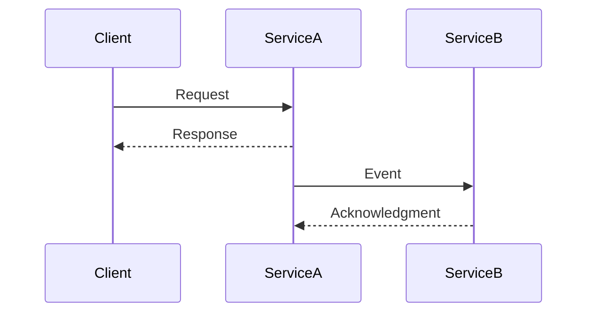
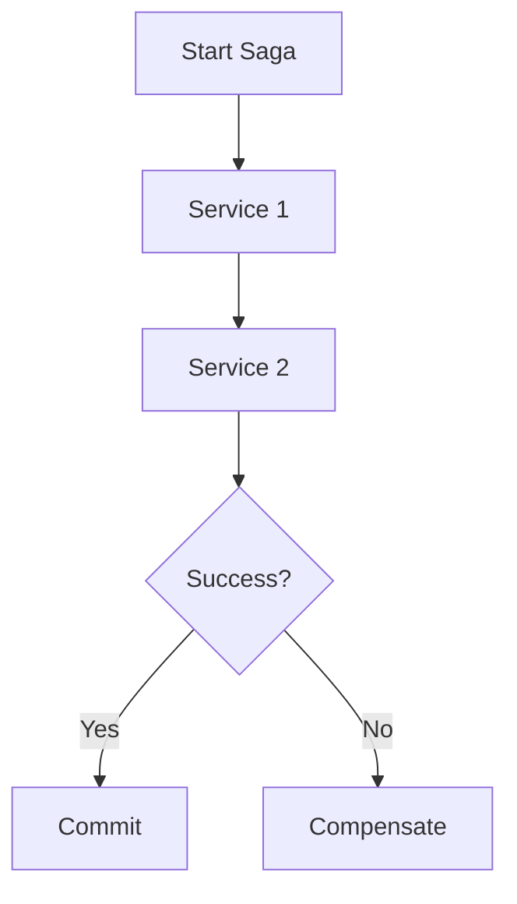

## 14.4.2 Lessons Learned from Microservices EDA

Implementing Event-Driven Architecture (EDA) in microservices has become a cornerstone for building scalable, resilient, and responsive systems. However, the journey is fraught with challenges and learning opportunities. This section delves into the critical lessons learned from real-world implementations, providing insights and best practices to guide architects and developers in their EDA endeavors.

### Importance of Clear Service Boundaries

One of the foundational principles in microservices architecture is defining clear service boundaries. Each microservice should encapsulate a single responsibility, adhering to the Single Responsibility Principle (SRP). This clarity prevents overlaps, reduces dependencies, and enhances maintainability.

**Key Considerations:**
- **Domain-Driven Design (DDD):** Utilize DDD to identify bounded contexts and define microservice boundaries. This approach ensures that each service aligns with a specific business capability.
- **Avoiding Overlaps:** Clearly delineate responsibilities to prevent multiple services from handling the same functionality, which can lead to data inconsistencies and increased complexity.

**Example:**
Consider an e-commerce platform where separate services handle inventory, order processing, and payment. Each service should operate independently, with well-defined interfaces for communication.

### Effective Schema Management

Robust schema management is crucial for maintaining data integrity and supporting seamless schema evolution. As microservices evolve, so do their data models, necessitating careful management to avoid breaking changes.

**Best Practices:**
- **Versioning:** Implement schema versioning to manage changes over time. This allows services to evolve independently while maintaining backward compatibility.
- **Compatibility Checks:** Use tools like Apache Avro or JSON Schema to enforce compatibility rules, ensuring that changes do not disrupt existing consumers.

**Java Example:**
```java
// Example of using Avro for schema evolution
Schema.Parser parser = new Schema.Parser();
Schema schemaV1 = parser.parse(new File("schemaV1.avsc"));
Schema schemaV2 = parser.parse(new File("schemaV2.avsc"));

if (schemaV2.isCompatible(schemaV1)) {
    System.out.println("Schemas are compatible.");
} else {
    System.out.println("Schemas are not compatible.");
}
```

### Choosing the Right Communication Patterns

Selecting appropriate communication patterns is vital for efficient service interactions. The choice between event-driven messaging and synchronous APIs depends on the use case and interaction requirements.

**Guidelines:**
- **Event-Driven Messaging:** Ideal for decoupled, asynchronous interactions where services can operate independently. Use message brokers like Kafka for reliable event delivery.
- **Synchronous APIs:** Suitable for real-time, request-response interactions where immediate feedback is required.

**Mermaid Diagram:**


### Ensuring Idempotency and Fault Tolerance

Idempotency and fault tolerance are critical for enhancing system reliability and preventing data inconsistencies. Idempotent operations ensure that repeated events do not lead to unintended side effects.

**Strategies:**
- **Idempotent Handlers:** Design event handlers to be idempotent, ensuring that processing an event multiple times yields the same result.
- **Retry Mechanisms:** Implement retry mechanisms with exponential backoff to handle transient failures gracefully.

**Java Code Example:**
```java
public class OrderService {
    private Set<String> processedOrders = ConcurrentHashMap.newKeySet();

    public void processOrder(Order order) {
        if (processedOrders.contains(order.getId())) {
            return; // Idempotent check
        }
        // Process order
        processedOrders.add(order.getId());
    }
}
```

### Comprehensive Monitoring and Observability

Implementing comprehensive monitoring and observability solutions is essential for gaining visibility into the system’s behavior. This facilitates proactive issue detection and resolution.

**Tools and Techniques:**
- **Distributed Tracing:** Use tools like OpenTelemetry to trace requests across microservices, identifying bottlenecks and latency issues.
- **Metrics and Logging:** Collect metrics and logs using platforms like Prometheus and ELK Stack for real-time monitoring and analysis.

### Scalability through Decoupling

Decoupling microservices through EDA enables independent scaling, allowing the system to handle varying loads efficiently without impacting overall performance.

**Benefits:**
- **Independent Scaling:** Services can be scaled independently based on demand, optimizing resource utilization.
- **Reduced Coupling:** Loose coupling between services minimizes the impact of changes, enhancing system agility.

### Managing Distributed Transactions

Managing distributed transactions in microservices is challenging due to the lack of a global transaction manager. Patterns like sagas are effective in maintaining data consistency and system reliability.

**Saga Pattern:**
- **Choreography:** Each service listens for events and performs local transactions, publishing subsequent events.
- **Orchestration:** A central coordinator manages the saga, invoking services and handling compensations if needed.

**Mermaid Diagram:**


### Continuous Integration and Deployment (CI/CD)

CI/CD pipelines play a pivotal role in automating testing, deployment, and monitoring processes, ensuring consistent and reliable releases in an EDA.

**Key Components:**
- **Automated Testing:** Integrate unit, integration, and end-to-end tests to catch issues early.
- **Deployment Automation:** Use tools like Jenkins or GitLab CI/CD to automate deployment, reducing manual errors.

### Secure Service Interactions

Securing communication between microservices is paramount to protect data and prevent unauthorized access.

**Security Measures:**
- **Encryption:** Use TLS to encrypt data in transit.
- **Authentication and Authorization:** Implement OAuth2 or JWT for secure service interactions.

### Example Lessons and Best Practices

From multiple case studies, several key lessons and best practices emerge:

- **Prioritize Service Autonomy:** Ensure each service can operate independently, reducing dependencies and enhancing resilience.
- **Invest in Robust Schema Management Tools:** Use tools that support schema evolution and compatibility checks.
- **Foster a Culture of Collaboration and Continuous Improvement:** Encourage cross-team collaboration and continuous learning to adapt to evolving requirements and technologies.

### Conclusion

Implementing EDA in microservices offers numerous benefits, from scalability to resilience. By learning from past experiences and adopting best practices, architects and developers can build robust, efficient, and maintainable systems. As you embark on your EDA journey, remember to prioritize clear service boundaries, effective schema management, and comprehensive monitoring to ensure success.

## Quiz Time!



### What is a key benefit of defining clear service boundaries in microservices?

- [x] Enhances maintainability and scalability
- [ ] Increases system complexity
- [ ] Reduces the need for schema management
- [ ] Eliminates the need for monitoring

> **Explanation:** Clear service boundaries enhance maintainability and scalability by ensuring each service has a single responsibility.

### Why is schema versioning important in microservices?

- [x] It allows services to evolve independently while maintaining compatibility.
- [ ] It eliminates the need for schema management tools.
- [ ] It increases the complexity of data models.
- [ ] It prevents any changes to the schema.

> **Explanation:** Schema versioning allows services to evolve independently, ensuring backward compatibility and preventing disruptions.

### Which communication pattern is ideal for decoupled, asynchronous interactions?

- [x] Event-driven messaging
- [ ] Synchronous APIs
- [ ] Remote Procedure Calls (RPC)
- [ ] Direct database access

> **Explanation:** Event-driven messaging is ideal for decoupled, asynchronous interactions, allowing services to operate independently.

### What is the purpose of idempotent operations in EDA?

- [x] To ensure repeated events do not lead to unintended side effects
- [ ] To increase the complexity of event handlers
- [ ] To eliminate the need for retry mechanisms
- [ ] To reduce system reliability

> **Explanation:** Idempotent operations ensure that processing an event multiple times yields the same result, preventing unintended side effects.

### What tool can be used for distributed tracing in microservices?

- [x] OpenTelemetry
- [ ] Jenkins
- [ ] Apache Avro
- [ ] JSON Schema

> **Explanation:** OpenTelemetry is a tool used for distributed tracing, helping identify bottlenecks and latency issues in microservices.

### How does decoupling microservices through EDA enhance scalability?

- [x] It allows services to be scaled independently based on demand.
- [ ] It increases the coupling between services.
- [ ] It reduces resource utilization.
- [ ] It eliminates the need for load balancing.

> **Explanation:** Decoupling allows services to be scaled independently, optimizing resource utilization and handling varying loads efficiently.

### What pattern is effective for managing distributed transactions in microservices?

- [x] Saga pattern
- [ ] Singleton pattern
- [ ] Observer pattern
- [ ] Factory pattern

> **Explanation:** The saga pattern is effective for managing distributed transactions, maintaining data consistency and system reliability.

### What is a key component of CI/CD pipelines in EDA?

- [x] Automated testing
- [ ] Manual deployment
- [ ] Direct database access
- [ ] Static code analysis

> **Explanation:** Automated testing is a key component of CI/CD pipelines, ensuring consistent and reliable releases.

### Which security measure is used to encrypt data in transit between microservices?

- [x] TLS
- [ ] OAuth2
- [ ] JWT
- [ ] JSON Schema

> **Explanation:** TLS is used to encrypt data in transit, protecting communication between microservices.

### True or False: Fostering a culture of collaboration and continuous improvement is essential for successful EDA implementation.

- [x] True
- [ ] False

> **Explanation:** Fostering a culture of collaboration and continuous improvement is essential for adapting to evolving requirements and technologies, ensuring successful EDA implementation.


