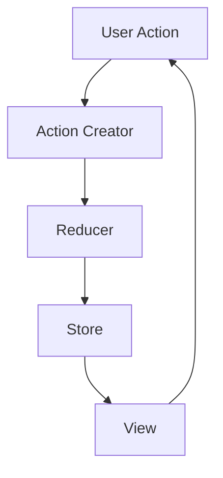

## 15.1.1 Reactive UI Design Principles

In the realm of event-driven architectures, designing user interfaces that are both responsive and reactive is crucial for delivering seamless user experiences. This section delves into the core principles of reactive UI design, emphasizing the importance of asynchronous data handling, reactive programming paradigms, and effective state management. By understanding and implementing these principles, developers can create interfaces that are not only efficient but also scalable and user-friendly.

### Embrace Asynchronous Data Handling

Asynchronous data handling is a cornerstone of reactive UI design. It allows applications to remain responsive while performing background tasks such as data fetching or processing. This approach prevents the UI from freezing or becoming unresponsive, which is critical for maintaining a smooth user experience.

#### JavaScript Example: Fetching Data Asynchronously

```javascript
async function fetchData(url) {
    try {
        const response = await fetch(url);
        const data = await response.json();
        updateUI(data);
    } catch (error) {
        console.error('Error fetching data:', error);
    }
}

function updateUI(data) {
    // Update the UI with the fetched data
    console.log('Data received:', data);
}

fetchData('https://api.example.com/data');
```

In this example, the `fetchData` function retrieves data from an API asynchronously, allowing the UI to remain interactive during the process.

### Utilize Reactive Programming Paradigms

Reactive programming paradigms, supported by frameworks like React, Vue.js, and Angular, enable developers to build UIs that automatically update in response to data changes. These frameworks provide reactive data binding and state management capabilities, making it easier to handle dynamic UI updates.

#### React Example: Reactive Component

```jsx
import React, { useState, useEffect } from 'react';

function DataComponent() {
    const [data, setData] = useState([]);

    useEffect(() => {
        async function fetchData() {
            const response = await fetch('https://api.example.com/data');
            const result = await response.json();
            setData(result);
        }
        fetchData();
    }, []);

    return (
        <ul>
            {data.map(item => (
                <li key={item.id}>{item.name}</li>
            ))}
        </ul>
    );
}

export default DataComponent;
```

This React component uses hooks to manage state and side effects, ensuring that the UI updates automatically when new data is fetched.

### Implement State Management Libraries

State management is crucial for maintaining a consistent and predictable application state, especially in complex UIs driven by events. Libraries like Redux, Vuex, and MobX provide robust solutions for managing state across components.

#### Redux Example: Basic Setup

```javascript
import { createStore } from 'redux';

// Define initial state
const initialState = {
    count: 0
};

// Define a reducer
function counterReducer(state = initialState, action) {
    switch (action.type) {
        case 'INCREMENT':
            return { count: state.count + 1 };
        case 'DECREMENT':
            return { count: state.count - 1 };
        default:
            return state;
    }
}

// Create a Redux store
const store = createStore(counterReducer);

// Dispatch actions
store.dispatch({ type: 'INCREMENT' });
console.log(store.getState()); // { count: 1 }
```

Redux helps manage state changes in a predictable manner, making it easier to debug and maintain complex applications.

### Ensure Unidirectional Data Flow

Unidirectional data flow simplifies state management and debugging by ensuring that data changes propagate in a single direction through the UI components. This pattern is fundamental in frameworks like React and Redux.

#### Diagram: Unidirectional Data Flow



In this diagram, data flows from user actions to the view in a single direction, ensuring a clear and predictable update cycle.

### Optimize Rendering Performance

Performance optimization is key in event-driven interfaces to prevent unnecessary re-renders and ensure a smooth user experience. Techniques such as memoization, `shouldComponentUpdate`, or using React’s `PureComponent` can enhance performance.

#### React Example: Using React.memo

```jsx
import React from 'react';

const ListItem = React.memo(({ item }) => {
    console.log('Rendering:', item.name);
    return <li>{item.name}</li>;
});

export default ListItem;
```

`React.memo` prevents re-rendering of components when their props have not changed, optimizing performance.

### Design for Scalability

Scalability in UI design involves structuring the architecture to accommodate growth, allowing for the addition of new features and components without significant refactoring. This can be achieved through modular and reusable components.

#### Example: Modular Component Design

```jsx
import React from 'react';

function Button({ label, onClick }) {
    return <button onClick={onClick}>{label}</button>;
}

function App() {
    return (
        <div>
            <Button label="Click Me" onClick={() => alert('Button Clicked!')} />
        </div>
    );
}

export default App;
```

By designing components to be modular and reusable, developers can easily extend the application with new features.

### Implement Responsive and Adaptive Layouts

Responsive and adaptive layouts ensure that UIs provide a seamless experience across different devices and orientations. This involves using CSS techniques like media queries and flexible grid layouts.

#### CSS Example: Responsive Design

```css
.container {
    display: flex;
    flex-wrap: wrap;
}

.item {
    flex: 1 1 200px;
    margin: 10px;
}

@media (max-width: 600px) {
    .item {
        flex: 1 1 100%;
    }
}
```

This CSS snippet demonstrates how to create a responsive layout that adapts to different screen sizes.

### Prioritize User Experience (UX)

User experience is paramount in UI design. Event-driven interactions should provide immediate feedback and enhance interactivity, ensuring that users can interact with the application smoothly and efficiently.

#### Example: Immediate Feedback with JavaScript

```javascript
document.querySelector('button').addEventListener('click', function() {
    this.textContent = 'Clicked!';
    setTimeout(() => {
        this.textContent = 'Click Me';
    }, 1000);
});
```

This example provides immediate feedback to the user by changing the button text upon click, enhancing interactivity.

### Conclusion

By embracing these reactive UI design principles, developers can create user interfaces that are not only responsive and efficient but also scalable and user-friendly. These principles provide a solid foundation for building modern, event-driven applications that meet the demands of today's users.

## Quiz Time!



### What is the primary benefit of asynchronous data handling in UI design?

- [x] It keeps the UI responsive while data is processed in the background.
- [ ] It simplifies the codebase by using synchronous operations.
- [ ] It ensures data is always fetched in real-time.
- [ ] It eliminates the need for error handling.

> **Explanation:** Asynchronous data handling allows the UI to remain responsive by processing data in the background, preventing the UI from freezing during data operations.

### Which of the following frameworks supports reactive programming paradigms?

- [x] React
- [x] Vue.js
- [ ] jQuery
- [x] Angular

> **Explanation:** React, Vue.js, and Angular support reactive programming paradigms, enabling automatic UI updates in response to data changes. jQuery does not inherently support reactive programming.

### What is the role of state management libraries like Redux in UI design?

- [x] To maintain a consistent and predictable application state.
- [ ] To directly manipulate the DOM for better performance.
- [ ] To handle asynchronous data fetching.
- [ ] To provide styling capabilities for components.

> **Explanation:** State management libraries like Redux help maintain a consistent and predictable application state, making it easier to manage complex UI interactions.

### What does unidirectional data flow ensure in a UI application?

- [x] Data changes propagate in a single direction through the UI components.
- [ ] Data can be modified from any component at any time.
- [ ] Data flows in multiple directions for flexibility.
- [ ] Data is stored in a central database.

> **Explanation:** Unidirectional data flow ensures that data changes propagate in a single direction, simplifying state management and debugging.

### How can rendering performance be optimized in React?

- [x] Using React.memo to prevent unnecessary re-renders.
- [ ] By avoiding the use of state in components.
- [ ] By using inline styles for faster rendering.
- [ ] By fetching data synchronously.

> **Explanation:** Using `React.memo` helps prevent unnecessary re-renders by memoizing components, optimizing rendering performance.

### What is a key consideration when designing for scalability in UI architecture?

- [x] Using modular and reusable components.
- [ ] Hardcoding component styles for consistency.
- [ ] Avoiding the use of third-party libraries.
- [ ] Implementing synchronous data fetching.

> **Explanation:** Designing with modular and reusable components allows for scalability, enabling the addition of new features without significant refactoring.

### Why are responsive and adaptive layouts important in UI design?

- [x] They ensure a seamless user experience across different devices.
- [ ] They simplify the code by using fixed dimensions.
- [ ] They eliminate the need for media queries.
- [ ] They restrict the UI to desktop devices only.

> **Explanation:** Responsive and adaptive layouts ensure that UIs provide a seamless experience across different devices and orientations, enhancing usability.

### What is the purpose of providing immediate feedback in event-driven interactions?

- [x] To enhance interactivity and user experience.
- [ ] To delay user actions for processing.
- [ ] To reduce the number of events triggered.
- [ ] To simplify the event handling code.

> **Explanation:** Immediate feedback enhances interactivity and user experience by providing users with instant responses to their actions.

### Which CSS technique is commonly used for creating responsive layouts?

- [x] Media queries
- [ ] Inline styles
- [ ] CSS resets
- [ ] Fixed positioning

> **Explanation:** Media queries are commonly used in CSS to create responsive layouts that adapt to different screen sizes.

### True or False: Unidirectional data flow complicates state management in UI applications.

- [ ] True
- [x] False

> **Explanation:** Unidirectional data flow simplifies state management by ensuring that data changes propagate in a single direction, making it easier to track and debug.


