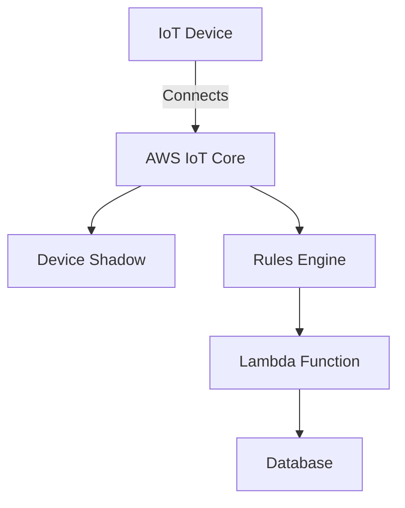

---

linkTitle: "15.2.1 Unique Challenges in IoT EDA"
title: "Unique Challenges in IoT Event-Driven Architecture (EDA)"
description: "Explore the unique challenges faced in implementing Event-Driven Architectures for IoT systems, including data stream management, connectivity issues, and security vulnerabilities."
categories:
- Event-Driven Architecture
- IoT Systems
- Software Engineering
tags:
- EDA
- IoT
- Data Streams
- Connectivity
- Security
date: 2024-10-25
type: docs
nav_weight: 15210

---

## 15.2.1 Unique Challenges in IoT Event-Driven Architecture (EDA)

The integration of Event-Driven Architecture (EDA) with Internet of Things (IoT) systems presents a unique set of challenges. As IoT devices proliferate, generating vast amounts of data, architects and developers must navigate issues related to data volume, connectivity, heterogeneity, latency, security, and more. This section explores these challenges in detail and provides insights into addressing them effectively.

### High Volume of Data Streams

IoT devices continuously generate a massive volume of data streams, often in real-time. Managing and processing these streams efficiently is crucial for maintaining system performance and reliability.

#### Scalable Event Processing Solutions

To handle the high volume of data, scalable event processing solutions are essential. Technologies like Apache Kafka and Apache Flink can be leveraged to build robust data pipelines capable of ingesting, processing, and analyzing large data streams.

```java
import org.apache.kafka.clients.producer.KafkaProducer;
import org.apache.kafka.clients.producer.ProducerRecord;
import java.util.Properties;

public class IoTDataProducer {
    public static void main(String[] args) {
        Properties props = new Properties();
        props.put("bootstrap.servers", "localhost:9092");
        props.put("key.serializer", "org.apache.kafka.common.serialization.StringSerializer");
        props.put("value.serializer", "org.apache.kafka.common.serialization.StringSerializer");

        KafkaProducer<String, String> producer = new KafkaProducer<>(props);
        for (int i = 0; i < 1000; i++) {
            producer.send(new ProducerRecord<>("iot-data", Integer.toString(i), "SensorData" + i));
        }
        producer.close();
    }
}
```

In this Java example, a Kafka producer is used to simulate the generation of IoT data streams. Kafka's distributed architecture ensures that it can scale horizontally to handle increased data loads.

### Intermittent Connectivity

IoT devices often operate in environments with unreliable network connectivity. Designing systems that can handle such conditions is critical.

#### Buffering and Retry Mechanisms

Implementing local buffering on IoT devices allows for temporary storage of events until connectivity is restored. Retry mechanisms can ensure that buffered events are eventually transmitted to the central system.

```java
public class IoTDevice {
    private Queue<String> eventBuffer = new LinkedList<>();

    public void sendData(String data) {
        if (isConnected()) {
            transmit(data);
        } else {
            eventBuffer.add(data);
        }
    }

    private void transmit(String data) {
        // Code to transmit data
    }

    private boolean isConnected() {
        // Check network connectivity
        return true; // Simplified for illustration
    }

    public void retryBufferedEvents() {
        while (!eventBuffer.isEmpty() && isConnected()) {
            transmit(eventBuffer.poll());
        }
    }
}
```

This code snippet demonstrates a simple buffering mechanism where events are stored locally and retried when connectivity is available.

### Data Heterogeneity

IoT devices often use diverse data formats and protocols, posing challenges for consistent data processing.

#### Standardized Data Schemas

Using standardized data schemas, such as JSON or Protocol Buffers, can help manage heterogeneity by providing a common format for data exchange.

```java
// Define a Protocol Buffer schema for IoT data
syntax = "proto3";

message SensorData {
    string id = 1;
    double temperature = 2;
    double humidity = 3;
}
```

By defining a schema, developers can ensure that data from different devices is consistently structured, facilitating easier processing and integration.

### Latency Sensitivity

Many IoT applications, such as autonomous vehicles or industrial automation, require low-latency event processing.

#### Optimizing Event Processing Pipelines

To meet latency requirements, event processing pipelines must be optimized for speed. Techniques such as in-memory processing and efficient data serialization can reduce processing time.

```java
import org.apache.flink.streaming.api.environment.StreamExecutionEnvironment;
import org.apache.flink.streaming.api.datastream.DataStream;

public class RealTimeProcessing {
    public static void main(String[] args) throws Exception {
        StreamExecutionEnvironment env = StreamExecutionEnvironment.getExecutionEnvironment();
        DataStream<String> stream = env.socketTextStream("localhost", 9999);

        stream.map(value -> "Processed: " + value).print();

        env.execute("Real-Time Processing");
    }
}
```

This Flink example illustrates a simple real-time processing pipeline that processes incoming data with minimal latency.

### Security Vulnerabilities

IoT systems are particularly vulnerable to security threats, including unauthorized access and data breaches.

#### Robust Security Measures

Implementing robust security measures, such as encryption and access control, is essential to protect IoT data and devices.

```java
import javax.crypto.Cipher;
import javax.crypto.KeyGenerator;
import javax.crypto.SecretKey;

public class DataEncryption {
    public static void main(String[] args) throws Exception {
        KeyGenerator keyGen = KeyGenerator.getInstance("AES");
        SecretKey secretKey = keyGen.generateKey();

        Cipher cipher = Cipher.getInstance("AES");
        cipher.init(Cipher.ENCRYPT_MODE, secretKey);

        byte[] encryptedData = cipher.doFinal("Sensitive Data".getBytes());
        System.out.println("Encrypted Data: " + new String(encryptedData));
    }
}
```

This Java example demonstrates encrypting sensitive data using AES, ensuring that data remains secure during transmission.

### Device Management and Scalability

Managing a large fleet of IoT devices requires efficient provisioning, monitoring, and updating mechanisms.

#### Scalable Device Management Solutions

Using platforms like AWS IoT or Azure IoT Hub can simplify device management by providing tools for device provisioning, monitoring, and firmware updates.



This diagram illustrates how AWS IoT Core can be used to manage IoT devices, with components for device shadows, rules engine, and integration with AWS Lambda for processing.

### Edge Computing Constraints

Edge computing environments often have limited resources, requiring lightweight and efficient event processing solutions.

#### Lightweight Event Processing

Designing lightweight event processing applications that can run on constrained devices is crucial. This may involve using efficient algorithms and minimizing resource usage.

```java
public class EdgeProcessor {
    public void processEvent(String event) {
        // Lightweight processing logic
        System.out.println("Processed event: " + event);
    }
}
```

This simple Java class represents a lightweight event processor suitable for edge devices.

### Compliance and Data Privacy

IoT systems must comply with data privacy regulations, ensuring that sensitive data is handled appropriately.

#### Data Privacy Compliance

Implementing data privacy measures, such as data anonymization and access controls, can help ensure compliance with regulations like GDPR.

```java
public class DataAnonymizer {
    public String anonymize(String data) {
        // Anonymization logic
        return data.replaceAll("[0-9]", "*");
    }
}
```

This example shows a basic anonymization technique that replaces numeric data with asterisks, helping to protect sensitive information.

### Conclusion

Addressing the unique challenges of IoT EDA requires a comprehensive approach that considers scalability, connectivity, data heterogeneity, latency, security, device management, edge computing, and compliance. By leveraging appropriate technologies and best practices, developers can build robust and efficient IoT systems that harness the power of event-driven architectures.

## Quiz Time!



### What is a primary challenge of managing IoT data streams?

- [x] High volume of data
- [ ] Low data generation
- [ ] Lack of data formats
- [ ] Limited data storage

> **Explanation:** IoT devices generate a high volume of data streams, requiring scalable and efficient processing solutions.

### How can IoT systems handle intermittent connectivity?

- [x] Buffering and retry mechanisms
- [ ] Ignoring connectivity issues
- [ ] Using only wired connections
- [ ] Disabling event generation

> **Explanation:** Buffering events locally and retrying transmission when connectivity is restored helps manage intermittent connectivity.

### What is a common method for managing data heterogeneity in IoT?

- [x] Standardized data schemas
- [ ] Ignoring data formats
- [ ] Using proprietary protocols
- [ ] Manual data conversion

> **Explanation:** Standardized data schemas ensure consistent data processing across diverse IoT devices.

### Why is latency sensitivity important in IoT applications?

- [x] Many applications require real-time processing
- [ ] Latency is irrelevant
- [ ] Devices operate offline
- [ ] Data is processed in batches

> **Explanation:** IoT applications like autonomous vehicles require real-time processing, making latency sensitivity crucial.

### Which security measure is essential for IoT systems?

- [x] Encryption
- [ ] Open access
- [ ] Public data sharing
- [ ] No authentication

> **Explanation:** Encryption is essential to protect data and ensure secure communication in IoT systems.

### What is a key consideration for device management in IoT?

- [x] Scalability
- [ ] Manual updates
- [ ] Single device focus
- [ ] Ignoring device health

> **Explanation:** Efficiently managing a large number of devices requires scalable solutions for provisioning, monitoring, and updates.

### How can edge computing constraints be addressed?

- [x] Lightweight event processing
- [ ] Heavy processing loads
- [ ] Centralized data centers
- [ ] Unlimited resource usage

> **Explanation:** Lightweight event processing solutions are necessary to operate within the limited resources of edge environments.

### What is a strategy for ensuring data privacy compliance?

- [x] Data anonymization
- [ ] Public data access
- [ ] Ignoring regulations
- [ ] Sharing sensitive data

> **Explanation:** Data anonymization helps protect sensitive information and comply with privacy regulations.

### What role does AWS IoT Core play in IoT device management?

- [x] Provides tools for provisioning and monitoring
- [ ] Acts as a physical device
- [ ] Replaces IoT devices
- [ ] Disables device connectivity

> **Explanation:** AWS IoT Core offers tools for managing IoT devices, including provisioning, monitoring, and updates.

### True or False: IoT systems do not need to consider data privacy regulations.

- [ ] True
- [x] False

> **Explanation:** IoT systems must comply with data privacy regulations to protect sensitive data and ensure legal compliance.


