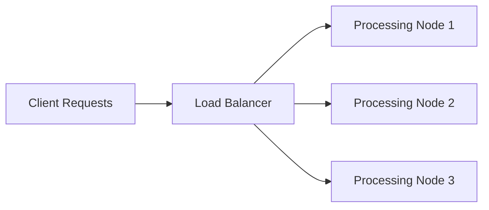

## 15.3.2 Minimizing Bottlenecks

In the realm of Event-Driven Architectures (EDA), minimizing bottlenecks is crucial for achieving low latency and high throughput, especially in systems like user interfaces and IoT applications where real-time responsiveness is paramount. This section delves into strategies for identifying and mitigating bottlenecks, ensuring your event-driven systems operate efficiently under load.

### Identifying Potential Bottlenecks

The first step in minimizing bottlenecks is identifying where they occur. Bottlenecks can arise in various components of an event-driven system, such as message brokers, processing nodes, or data storage systems. Conducting thorough performance profiling and monitoring is essential.

**Performance Profiling and Monitoring:**

1. **Use Profiling Tools:** Employ tools like JProfiler or VisualVM for Java applications to analyze CPU and memory usage, identifying hotspots in your code.
2. **Monitor Message Brokers:** Tools like Kafka Manager or Prometheus can help monitor message throughput and latency in brokers like Apache Kafka.
3. **Analyze Processing Nodes:** Use APM tools like New Relic or Dynatrace to monitor processing nodes, identifying delays in event processing.
4. **Database Monitoring:** Leverage database monitoring tools like pgAdmin for PostgreSQL or MySQL Workbench to track query performance and identify slow queries.

### Scale Bottleneck Components

Once bottlenecks are identified, scaling the affected components can alleviate performance issues. Here are some strategies:

1. **Increase Broker Partitions:** In Kafka, increasing the number of partitions can enhance parallelism, allowing more consumers to process messages simultaneously.
2. **Add Processing Nodes:** For stream processing frameworks like Apache Flink or Kafka Streams, adding more nodes can distribute the processing load.
3. **Scale Database Resources:** Use cloud-based solutions like AWS RDS or Azure SQL Database to dynamically scale database resources based on demand.

### Optimize Processing Logic

Optimizing the logic within your event processing pipeline is another effective way to minimize bottlenecks. Consider the following techniques:

1. **Batch Processing:** Process events in batches to reduce the overhead of handling each event individually.
2. **Aggregation:** Aggregate data where possible to reduce the volume of data processed.
3. **Efficient Algorithms:** Use algorithms with lower computational complexity to enhance processing speed.

**Java Code Example: Batch Processing**

```java
import java.util.List;

public class BatchProcessor {

    public void processEventsInBatch(List<Event> events) {
        // Process events in a batch to reduce overhead
        events.forEach(event -> {
            // Perform processing logic
            processEvent(event);
        });
    }

    private void processEvent(Event event) {
        // Event processing logic
    }
}
```

### Implement Caching Strategies

Caching can significantly reduce the load on downstream systems by storing frequently accessed data or intermediate results.

1. **Use Redis or Memcached:** Implement caching layers to store results of expensive computations or frequently accessed data.
2. **Cache Intermediate Results:** Cache results of intermediate processing stages to avoid redundant computations.

**Java Code Example: Using Redis for Caching**

```java
import redis.clients.jedis.Jedis;

public class CacheManager {

    private Jedis jedis;

    public CacheManager() {
        this.jedis = new Jedis("localhost");
    }

    public void cacheData(String key, String value) {
        jedis.set(key, value);
    }

    public String getCachedData(String key) {
        return jedis.get(key);
    }
}
```

### Tune Configuration Parameters

Optimizing configuration parameters for your messaging brokers, stream processors, and databases can lead to significant performance improvements.

1. **Increase Buffer Sizes:** Adjust buffer sizes in Kafka to handle larger volumes of messages.
2. **Optimize Thread Pools:** Configure thread pools in processing nodes to maximize CPU utilization.
3. **Set Appropriate Timeouts:** Configure timeouts to prevent long-running operations from blocking the system.

### Load Balancing and Distribution

Ensuring that the event processing load is evenly distributed across multiple instances and nodes prevents any single component from becoming overwhelmed.

1. **Use Load Balancers:** Implement load balancers to distribute incoming requests evenly across processing nodes.
2. **Partition Events:** Partition events based on keys to ensure even distribution across consumers.

**Mermaid Diagram: Load Balancing Architecture**



### Implement Asynchronous Processing

Designing event handlers to perform non-blocking, asynchronous operations allows the system to handle higher volumes of events efficiently.

1. **Use CompletableFuture in Java:** Leverage `CompletableFuture` for asynchronous processing.
2. **Non-Blocking I/O:** Use libraries like Netty for non-blocking I/O operations.

**Java Code Example: Asynchronous Processing with CompletableFuture**

```java
import java.util.concurrent.CompletableFuture;

public class AsyncProcessor {

    public CompletableFuture<Void> processEventAsync(Event event) {
        return CompletableFuture.runAsync(() -> {
            // Non-blocking event processing logic
            processEvent(event);
        });
    }

    private void processEvent(Event event) {
        // Event processing logic
    }
}
```

### Example Implementation: Video Streaming Application

Consider a video streaming application where minimizing bottlenecks is crucial for smooth playback under high traffic conditions. Here's how you can apply the discussed strategies:

1. **Load Balancing:** Use a load balancer to distribute incoming video stream requests across multiple streaming servers.
2. **Optimized Processing Logic:** Implement batch processing for video segment encoding to reduce processing time.
3. **Caching:** Use Redis to cache video metadata and frequently accessed video segments.
4. **Configuration Tuning:** Adjust Kafka partition counts and buffer sizes to handle high volumes of video stream events.

By applying these strategies, the video streaming application can efficiently handle high traffic, ensuring low latency and high throughput for users.

### Conclusion

Minimizing bottlenecks in event-driven architectures is essential for maintaining low latency and high throughput, particularly in user interfaces and IoT systems. By identifying potential bottlenecks, scaling components, optimizing processing logic, implementing caching strategies, tuning configurations, ensuring load balancing, and adopting asynchronous processing, you can significantly enhance the performance of your event-driven systems.

## Quiz Time!



### What is the first step in minimizing bottlenecks in an event-driven architecture?

- [x] Identifying where bottlenecks occur
- [ ] Scaling all components
- [ ] Implementing caching strategies
- [ ] Using asynchronous processing

> **Explanation:** The first step is to identify where bottlenecks occur through performance profiling and monitoring.

### Which tool can be used to monitor message throughput and latency in Apache Kafka?

- [ ] JProfiler
- [x] Kafka Manager
- [ ] New Relic
- [ ] pgAdmin

> **Explanation:** Kafka Manager is a tool specifically designed to monitor message throughput and latency in Apache Kafka.

### What is a benefit of increasing the number of partitions in Kafka?

- [x] Enhances parallelism
- [ ] Reduces memory usage
- [ ] Decreases network latency
- [ ] Simplifies configuration

> **Explanation:** Increasing the number of partitions in Kafka enhances parallelism, allowing more consumers to process messages simultaneously.

### Which caching layer can be used to store frequently accessed data?

- [x] Redis
- [ ] Kafka
- [ ] Apache Flink
- [ ] Netty

> **Explanation:** Redis is a caching layer that can be used to store frequently accessed data, reducing the load on downstream systems.

### What is the purpose of using `CompletableFuture` in Java?

- [x] To perform asynchronous processing
- [ ] To increase memory allocation
- [ ] To simplify database queries
- [ ] To enhance security

> **Explanation:** `CompletableFuture` is used in Java for performing asynchronous processing, allowing non-blocking operations.

### Which technique can be used to reduce the overhead of handling each event individually?

- [ ] Asynchronous processing
- [x] Batch processing
- [ ] Load balancing
- [ ] Caching

> **Explanation:** Batch processing reduces the overhead of handling each event individually by processing events in batches.

### What is a key benefit of implementing load balancers in an event-driven system?

- [x] Distributes incoming requests evenly
- [ ] Increases data storage capacity
- [ ] Simplifies code complexity
- [ ] Enhances security

> **Explanation:** Load balancers distribute incoming requests evenly across processing nodes, preventing any single component from becoming overwhelmed.

### Which configuration parameter can be adjusted to handle larger volumes of messages in Kafka?

- [x] Buffer sizes
- [ ] Thread pool size
- [ ] Cache size
- [ ] Security settings

> **Explanation:** Increasing buffer sizes in Kafka can help handle larger volumes of messages.

### What is the purpose of using non-blocking I/O libraries like Netty?

- [x] To perform non-blocking I/O operations
- [ ] To increase memory usage
- [ ] To simplify database queries
- [ ] To enhance security

> **Explanation:** Non-blocking I/O libraries like Netty are used to perform non-blocking I/O operations, allowing higher volumes of events to be handled efficiently.

### True or False: Implementing caching strategies can reduce the load on downstream systems.

- [x] True
- [ ] False

> **Explanation:** Implementing caching strategies can indeed reduce the load on downstream systems by storing frequently accessed data or intermediate results.


