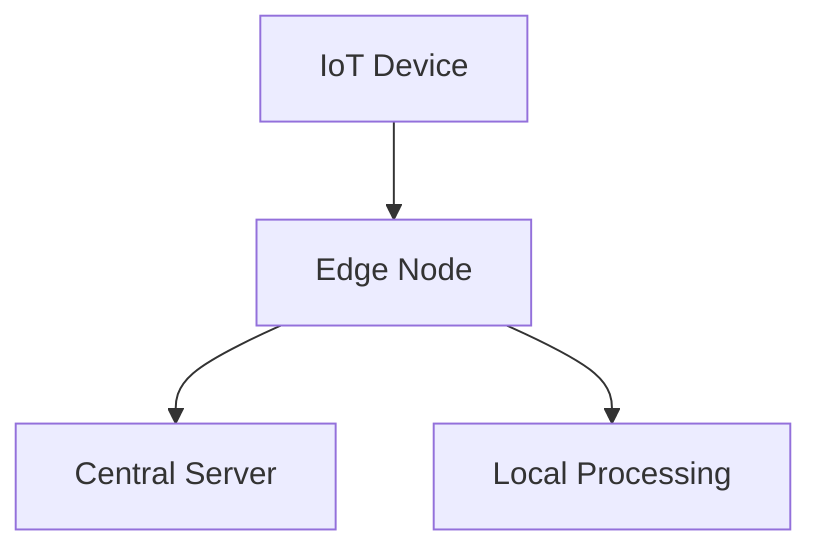
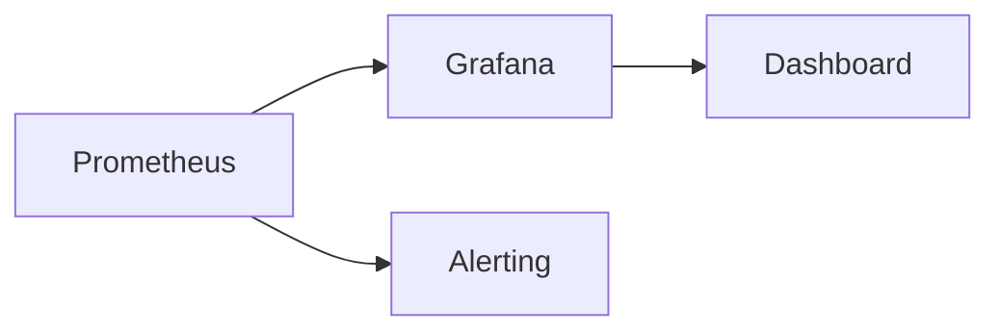

## 15.3.3 Ensuring Real-Time Responsiveness

In today's fast-paced digital landscape, ensuring real-time responsiveness in event-driven architectures (EDA) is crucial for delivering seamless user experiences and maintaining the efficiency of IoT systems. This section explores various strategies and technologies to achieve real-time responsiveness, focusing on implementing real-time processing frameworks, optimizing event handling pipelines, leveraging edge computing, and more.

### Implement Real-Time Processing Frameworks

Real-time processing frameworks are essential for handling events as they occur, ensuring that systems can react instantly. Frameworks like Apache Flink, Kafka Streams, and Spark Streaming provide robust solutions for processing streams of data in real-time.

#### Apache Flink

Apache Flink is a powerful stream processing framework that offers low-latency processing capabilities. It supports complex event processing and stateful computations, making it ideal for real-time applications.

```java
// Example of a simple Flink job
StreamExecutionEnvironment env = StreamExecutionEnvironment.getExecutionEnvironment();
DataStream<String> text = env.socketTextStream("localhost", 9999);

DataStream<Tuple2<String, Integer>> wordCounts = text
    .flatMap(new Tokenizer())
    .keyBy(0)
    .sum(1);

wordCounts.print();
env.execute("Word Count Example");
```

In this example, Flink processes text data from a socket in real-time, performing a word count operation. The framework's ability to handle stateful computations ensures that results are accurate and timely.

#### Kafka Streams

Kafka Streams is another powerful tool for real-time processing, particularly well-suited for applications already using Apache Kafka for messaging.

```java
Properties props = new Properties();
props.put(StreamsConfig.APPLICATION_ID_CONFIG, "streams-wordcount");
props.put(StreamsConfig.BOOTSTRAP_SERVERS_CONFIG, "localhost:9092");
props.put(StreamsConfig.DEFAULT_KEY_SERDE_CLASS_CONFIG, Serdes.String().getClass());
props.put(StreamsConfig.DEFAULT_VALUE_SERDE_CLASS_CONFIG, Serdes.String().getClass());

StreamsBuilder builder = new StreamsBuilder();
KStream<String, String> textLines = builder.stream("TextLinesTopic");
KTable<String, Long> wordCounts = textLines
    .flatMapValues(value -> Arrays.asList(value.toLowerCase().split("\\W+")))
    .groupBy((key, value) -> value)
    .count();

wordCounts.toStream().to("WordsWithCountsTopic", Produced.with(Serdes.String(), Serdes.Long()));

KafkaStreams streams = new KafkaStreams(builder.build(), props);
streams.start();
```

Kafka Streams allows for real-time processing directly within Kafka, reducing the need for additional infrastructure and simplifying the architecture.

### Optimize Event Handling Pipelines

To ensure low latency, it's crucial to design efficient event handling pipelines. This involves minimizing the number of processing steps, simplifying transformation logic, and using efficient data structures.

#### Simplifying Transformation Logic

Complex transformation logic can introduce significant delays. By simplifying these transformations, you can reduce processing time. Consider using functional programming techniques and libraries that optimize data transformations.

#### Efficient Data Structures

Choosing the right data structures can drastically improve performance. For instance, using hash maps for quick lookups or priority queues for managing event processing order can reduce latency.

### Leverage Edge Computing

Edge computing brings computation closer to the data source, reducing the time required to transmit data to centralized systems. This is particularly beneficial in IoT systems where devices generate large volumes of data.

#### Edge Computing in IoT

By deploying edge nodes near IoT devices, initial data processing and filtering can occur locally, reducing the load on central systems and improving responsiveness.



In this diagram, IoT devices send data to nearby edge nodes, which perform initial processing before forwarding relevant information to central servers.

### Use High-Speed Data Stores

Integrating high-speed data stores, such as in-memory databases or SSD-backed storage, is essential for rapid data access and updates. These technologies support real-time data retrieval, ensuring that applications can respond quickly to events.

#### In-Memory Databases

In-memory databases like Redis or Memcached offer fast read and write operations, making them ideal for caching frequently accessed data.

```java
// Example of using Redis for fast data access
Jedis jedis = new Jedis("localhost");
jedis.set("key", "value");
String value = jedis.get("key");
System.out.println("Stored value in Redis: " + value);
```

This Java snippet demonstrates how Redis can be used to store and retrieve data quickly, supporting real-time application needs.

### Implement Priority Queuing

Designing event queues with priority levels ensures that critical events are processed ahead of non-critical ones. This is crucial for maintaining responsiveness in time-sensitive operations.

#### Priority Queue Implementation

Using priority queues allows systems to prioritize events based on their importance or urgency.

```java
PriorityQueue<Event> eventQueue = new PriorityQueue<>(Comparator.comparing(Event::getPriority));

eventQueue.add(new Event("High Priority", 1));
eventQueue.add(new Event("Low Priority", 5));

while (!eventQueue.isEmpty()) {
    Event event = eventQueue.poll();
    processEvent(event);
}
```

In this example, events are processed based on their priority, ensuring that high-priority events receive immediate attention.

### Monitor and Tune System Performance

Continuous monitoring and tuning are vital for maintaining high levels of real-time responsiveness. Key metrics to track include processing latency, event throughput, and resource utilization.

#### Performance Monitoring Tools

Tools like Prometheus and Grafana can be used to monitor system performance, providing insights into potential bottlenecks and areas for optimization.



This diagram illustrates how Prometheus and Grafana work together to provide real-time monitoring and alerting capabilities.

### Design for Low Latency Networking

Optimizing network configurations is essential for minimizing latency in event transmission and processing. Techniques include using dedicated networking paths, low-latency switches, and proximity-based deployment.

#### Network Optimization Strategies

- **Dedicated Networking Paths:** Ensure that critical data flows have dedicated network paths to avoid congestion.
- **Low-Latency Switches:** Use switches designed for low-latency environments to reduce transmission delays.
- **Proximity-Based Deployment:** Deploy services close to data sources to minimize the distance data must travel.

### Example Implementation: Live Sports Analytics Application

Consider a live sports analytics application that provides real-time insights and updates to users. This application can leverage the strategies discussed to ensure real-time responsiveness.

1. **Real-Time Processing Frameworks:** Use Apache Flink to process live game data streams, performing real-time analytics and generating insights.
2. **Edge Computing:** Deploy edge nodes at stadiums to process data locally, reducing transmission time to central servers.
3. **High-Speed Data Stores:** Utilize Redis for caching player statistics and game data, ensuring fast access for the analytics engine.
4. **Priority Queuing:** Implement priority queues to handle critical game events, such as goals or fouls, ensuring they are processed immediately.

By combining these technologies and strategies, the application can deliver timely and accurate insights to users, enhancing their experience and engagement.

### Conclusion

Ensuring real-time responsiveness in event-driven architectures requires a combination of advanced technologies and strategic design choices. By implementing real-time processing frameworks, optimizing event handling pipelines, leveraging edge computing, and using high-speed data stores, developers can build systems that meet the demands of modern applications. Continuous monitoring and tuning further ensure that these systems maintain their performance over time.

## Quiz Time!



### Which framework is known for low-latency stream processing and stateful computations?

- [x] Apache Flink
- [ ] Apache Hadoop
- [ ] Apache Hive
- [ ] Apache Pig

> **Explanation:** Apache Flink is known for its low-latency stream processing capabilities and support for stateful computations, making it ideal for real-time applications.


### What is a key benefit of using edge computing in IoT systems?

- [x] Reduced data transmission time
- [ ] Increased data storage capacity
- [ ] Enhanced data encryption
- [ ] Simplified data modeling

> **Explanation:** Edge computing reduces the time required to transmit data to centralized systems by processing data closer to the source, improving responsiveness.


### Which data store is commonly used for fast read and write operations in real-time applications?

- [x] Redis
- [ ] MySQL
- [ ] PostgreSQL
- [ ] MongoDB

> **Explanation:** Redis is an in-memory data store known for its fast read and write operations, making it suitable for real-time applications.


### What is the purpose of implementing priority queuing in event-driven systems?

- [x] To ensure critical events are processed first
- [ ] To increase data storage capacity
- [ ] To simplify event processing logic
- [ ] To enhance data encryption

> **Explanation:** Priority queuing ensures that critical events are processed ahead of non-critical ones, maintaining responsiveness for time-sensitive operations.


### Which tool is used for monitoring system performance and providing real-time insights?

- [x] Prometheus
- [ ] Jenkins
- [ ] Docker
- [ ] Kubernetes

> **Explanation:** Prometheus is a monitoring tool that provides real-time insights into system performance, helping identify bottlenecks and areas for optimization.


### What is a benefit of using dedicated networking paths in low-latency environments?

- [x] Reduced network congestion
- [ ] Increased data storage capacity
- [ ] Enhanced data encryption
- [ ] Simplified data modeling

> **Explanation:** Dedicated networking paths reduce network congestion by ensuring critical data flows have exclusive access to network resources.


### Which of the following is a real-time processing framework?

- [x] Kafka Streams
- [ ] Apache Hive
- [ ] Apache Pig
- [ ] Apache HBase

> **Explanation:** Kafka Streams is a real-time processing framework that allows for stream processing directly within Apache Kafka.


### What is the role of edge nodes in an IoT architecture?

- [x] To perform initial data processing and filtering
- [ ] To increase data storage capacity
- [ ] To enhance data encryption
- [ ] To simplify data modeling

> **Explanation:** Edge nodes perform initial data processing and filtering close to IoT devices, reducing the load on central systems and improving responsiveness.


### Which technique helps in minimizing latency in event transmission?

- [x] Proximity-based deployment
- [ ] Increased data storage capacity
- [ ] Enhanced data encryption
- [ ] Simplified data modeling

> **Explanation:** Proximity-based deployment minimizes latency by deploying services close to data sources, reducing the distance data must travel.


### True or False: Apache Flink and Kafka Streams can both be used for real-time stream processing.

- [x] True
- [ ] False

> **Explanation:** Both Apache Flink and Kafka Streams are designed for real-time stream processing, offering capabilities to handle data as it is ingested.


