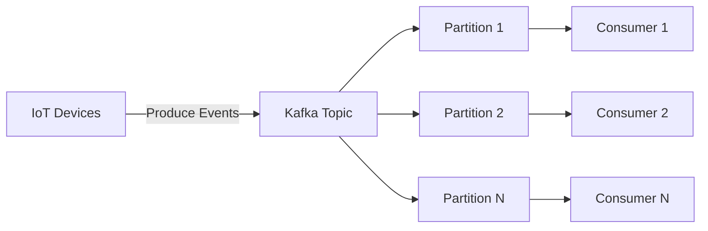
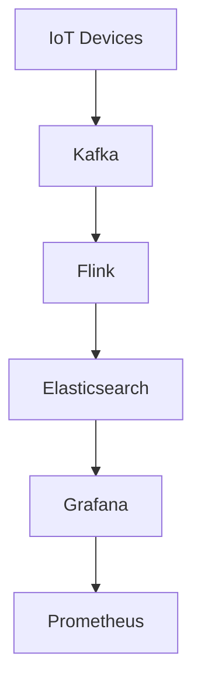

## 15.4.2 Managing High Volume IoT Events

The Internet of Things (IoT) has revolutionized how we interact with the world, enabling a vast network of interconnected devices that generate an enormous volume of data. Managing these high-volume IoT events efficiently is crucial for building scalable and responsive systems. In this section, we will explore strategies and technologies to handle the influx of IoT events using event-driven architecture (EDA) patterns.

### Implement Efficient Event Ingestion Mechanisms

Efficient event ingestion is the cornerstone of managing high-volume IoT data. The goal is to design a robust pipeline that can handle the continuous flow of events from numerous devices without bottlenecks. High-throughput message brokers like Apache Kafka and AWS IoT Core are ideal for this purpose.

**Apache Kafka for Event Ingestion:**

Apache Kafka is a distributed streaming platform that excels at handling high-throughput data streams. It allows you to publish and subscribe to streams of records, store them, and process them in real-time.

```java
import org.apache.kafka.clients.producer.KafkaProducer;
import org.apache.kafka.clients.producer.ProducerRecord;
import java.util.Properties;

public class IoTEventProducer {
    public static void main(String[] args) {
        Properties props = new Properties();
        props.put("bootstrap.servers", "localhost:9092");
        props.put("key.serializer", "org.apache.kafka.common.serialization.StringSerializer");
        props.put("value.serializer", "org.apache.kafka.common.serialization.StringSerializer");

        KafkaProducer<String, String> producer = new KafkaProducer<>(props);
        for (int i = 0; i < 1000; i++) {
            producer.send(new ProducerRecord<>("iot-events", Integer.toString(i), "event-data-" + i));
        }
        producer.close();
    }
}
```

In this example, a simple Kafka producer sends IoT event data to a topic named "iot-events". This setup can be scaled to handle millions of events by distributing the load across multiple producers and Kafka brokers.

### Use Partitioning and Sharding

Partitioning and sharding are techniques used to distribute data across multiple nodes, enabling parallel processing and preventing any single node from becoming a bottleneck.

**Kafka Partitioning:**

Kafka topics are divided into partitions, allowing multiple consumers to read from a topic in parallel. This setup is crucial for scaling the consumption of IoT events.



### Optimize Data Serialization

Efficient data serialization reduces the size of IoT event payloads, minimizing bandwidth usage and improving processing speeds. Formats like Avro and Protobuf are well-suited for this task.

**Using Avro for Serialization:**

Apache Avro is a popular choice for data serialization in Kafka due to its compact binary format and schema evolution support.

```java
import org.apache.avro.Schema;
import org.apache.avro.generic.GenericData;
import org.apache.avro.generic.GenericRecord;
import org.apache.avro.io.DatumWriter;
import org.apache.avro.io.Encoder;
import org.apache.avro.io.EncoderFactory;
import org.apache.avro.specific.SpecificDatumWriter;

import java.io.ByteArrayOutputStream;

public class AvroSerializationExample {
    public static byte[] serializeEvent(String eventName, String eventData) throws Exception {
        String schemaString = "{\"namespace\": \"example.avro\", \"type\": \"record\", \"name\": \"Event\", \"fields\": [{\"name\": \"name\", \"type\": \"string\"}, {\"name\": \"data\", \"type\": \"string\"}]}";
        Schema schema = new Schema.Parser().parse(schemaString);

        GenericRecord event = new GenericData.Record(schema);
        event.put("name", eventName);
        event.put("data", eventData);

        ByteArrayOutputStream out = new ByteArrayOutputStream();
        DatumWriter<GenericRecord> writer = new SpecificDatumWriter<>(schema);
        Encoder encoder = EncoderFactory.get().binaryEncoder(out, null);
        writer.write(event, encoder);
        encoder.flush();
        out.close();

        return out.toByteArray();
    }
}
```

### Implement Aggregation and Filtering

Aggregation and filtering at the ingestion stage can significantly reduce the volume of events that need to be processed downstream. This approach focuses on essential and aggregated data, improving efficiency.

**Example: Aggregating Sensor Data:**

```java
import java.util.List;
import java.util.Map;
import java.util.stream.Collectors;

public class SensorDataAggregator {
    public static Map<String, Double> aggregateSensorData(List<SensorEvent> events) {
        return events.stream()
                .collect(Collectors.groupingBy(SensorEvent::getSensorId,
                        Collectors.averagingDouble(SensorEvent::getValue)));
    }
}
```

This code snippet aggregates sensor data by calculating the average value for each sensor, reducing the number of events that need to be processed further.

### Leverage Stream Processing Frameworks

Stream processing frameworks like Apache Flink and Kafka Streams enable real-time processing and analysis of high-volume IoT events, allowing for rapid detection of patterns and anomalies.

**Apache Flink for Real-Time Processing:**

Apache Flink is a powerful stream processing framework that can process data in real-time with low latency.

```java
import org.apache.flink.api.common.functions.MapFunction;
import org.apache.flink.streaming.api.datastream.DataStream;
import org.apache.flink.streaming.api.environment.StreamExecutionEnvironment;

public class FlinkProcessingExample {
    public static void main(String[] args) throws Exception {
        StreamExecutionEnvironment env = StreamExecutionEnvironment.getExecutionEnvironment();
        DataStream<String> text = env.socketTextStream("localhost", 9999);

        DataStream<String> processed = text.map(new MapFunction<String, String>() {
            @Override
            public String map(String value) {
                return "Processed: " + value;
            }
        });

        processed.print();
        env.execute("Flink IoT Event Processing");
    }
}
```

### Scale Processing Resources

To maintain performance and responsiveness as the volume of IoT events increases, ensure that your processing infrastructure can scale horizontally by adding more processing nodes or instances.

**Horizontal Scaling:**

Horizontal scaling involves adding more instances of processing nodes to handle increased load. This approach is often more cost-effective and flexible than vertical scaling.

### Implement Data Retention Policies

Define data retention policies to manage the storage and lifecycle of high-volume IoT event data. This prevents storage systems from being overwhelmed and ensures compliance with data governance requirements.

**Example Policy:**

- Retain raw event data for 7 days.
- Aggregate data for 30 days.
- Archive essential data indefinitely.

### Monitor and Manage System Health

Continuously monitor the health and performance of your event processing pipelines. Use tools like Prometheus and Grafana to track key metrics and identify issues promptly.

**Monitoring Setup:**



### Example Implementation: Smart City Application

Let's consider a smart city application that manages high-volume IoT events. The system uses Kafka for event ingestion, Flink for real-time processing, and Elasticsearch for storing and querying event data.

1. **Event Ingestion with Kafka:** IoT devices in the city send events to Kafka topics. Each device type has its own topic, allowing for efficient partitioning and parallel processing.

2. **Real-Time Processing with Flink:** Flink processes the incoming events, detecting patterns such as traffic congestion or air quality changes. It aggregates data and triggers alerts when necessary.

3. **Storage and Querying with Elasticsearch:** Processed events are stored in Elasticsearch, enabling fast querying and visualization of data through Kibana dashboards.

This architecture ensures that the system can handle thousands of device-generated events per second without performance degradation, providing real-time insights into the city's operations.

### Conclusion

Managing high-volume IoT events requires a combination of efficient event ingestion, data serialization, stream processing, and scalable infrastructure. By leveraging these strategies and technologies, you can build robust IoT systems capable of handling the demands of modern applications.

## Quiz Time!



### What is the primary role of Apache Kafka in managing high-volume IoT events?

- [x] Efficient event ingestion and distribution
- [ ] Data serialization
- [ ] Real-time processing
- [ ] Data storage

> **Explanation:** Apache Kafka is primarily used for efficient event ingestion and distribution, allowing for high-throughput data streams.

### Which data serialization format is recommended for reducing IoT event payload size?

- [ ] JSON
- [x] Avro
- [ ] XML
- [ ] CSV

> **Explanation:** Avro is recommended due to its compact binary format and support for schema evolution, making it efficient for IoT event serialization.

### How does partitioning in Kafka help manage high-volume IoT events?

- [x] Enables parallel processing
- [ ] Increases data retention
- [ ] Reduces event size
- [ ] Enhances data security

> **Explanation:** Partitioning allows data to be distributed across multiple nodes, enabling parallel processing and preventing bottlenecks.

### What is the benefit of using stream processing frameworks like Apache Flink in IoT systems?

- [ ] Data storage
- [x] Real-time processing and analysis
- [ ] Data serialization
- [ ] Event ingestion

> **Explanation:** Stream processing frameworks like Apache Flink enable real-time processing and analysis of high-volume IoT events.

### What is a key strategy for scaling processing resources in IoT systems?

- [ ] Vertical scaling
- [x] Horizontal scaling
- [ ] Data sharding
- [ ] Data serialization

> **Explanation:** Horizontal scaling involves adding more processing nodes or instances, which is often more cost-effective and flexible than vertical scaling.

### Why is it important to implement data retention policies in IoT systems?

- [ ] To increase event size
- [ ] To enhance data security
- [x] To manage storage and lifecycle of data
- [ ] To improve serialization

> **Explanation:** Data retention policies help manage the storage and lifecycle of high-volume IoT event data, preventing storage systems from being overwhelmed.

### Which tool is commonly used for monitoring the health of event processing pipelines?

- [ ] Avro
- [x] Prometheus
- [ ] Kafka
- [ ] Flink

> **Explanation:** Prometheus is commonly used for monitoring the health and performance of event processing pipelines.

### In the smart city example, what role does Elasticsearch play?

- [ ] Event ingestion
- [ ] Real-time processing
- [x] Data storage and querying
- [ ] Data serialization

> **Explanation:** Elasticsearch is used for storing and querying processed event data, enabling fast access and visualization.

### What is the purpose of event aggregation in IoT systems?

- [ ] To increase event size
- [x] To reduce the volume of events processed
- [ ] To enhance data security
- [ ] To improve serialization

> **Explanation:** Event aggregation reduces the volume of events that need to be processed downstream, improving efficiency.

### True or False: Horizontal scaling is more cost-effective than vertical scaling for IoT systems.

- [x] True
- [ ] False

> **Explanation:** Horizontal scaling is often more cost-effective and flexible than vertical scaling, as it involves adding more instances rather than increasing the capacity of existing ones.


