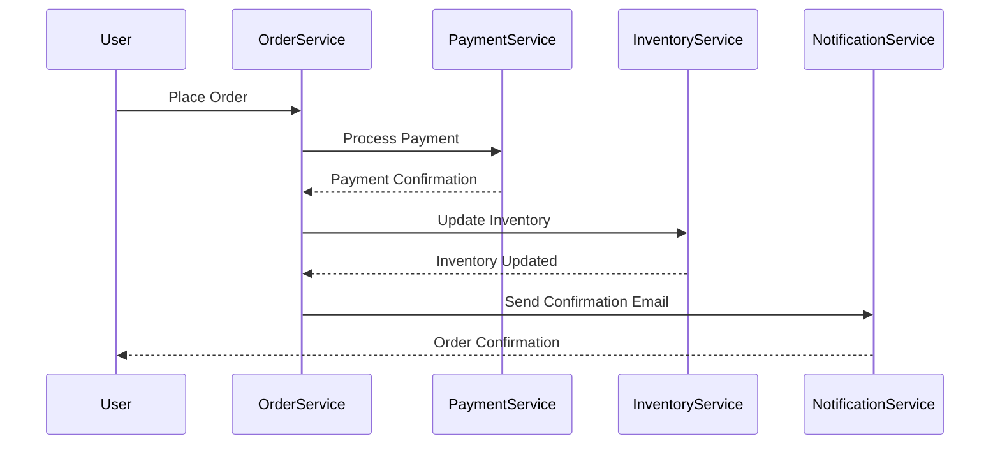

## 16.1.3 End-to-End Testing Scenarios in Event-Driven Architectures

End-to-end (E2E) testing in event-driven architectures (EDA) is crucial for ensuring that complex systems function as intended from start to finish. This involves testing the entire workflow, from event generation to processing and final outcomes, across multiple components and services. In this section, we will delve into the strategies and best practices for designing and implementing comprehensive E2E testing scenarios in EDA.

### Defining Comprehensive Scenarios

End-to-end testing scenarios should encompass the entire lifecycle of events within your system. This includes:

- **Event Generation:** Identifying how events are produced, whether by user actions, system processes, or external systems.
- **Event Processing:** Ensuring that events are correctly consumed, processed, and result in the expected state changes or outputs.
- **Final Outcomes:** Verifying that the final outcomes, such as database updates, notifications, or user interface changes, meet the expected results.

**Example Workflow:**

Consider an e-commerce platform where a user places an order. The E2E test scenario would include:

1. **Order Placement:** Simulate a user placing an order.
2. **Payment Processing:** Ensure the payment service processes the transaction.
3. **Inventory Update:** Verify that the inventory service updates stock levels.
4. **Notification:** Check that the user receives a confirmation email.

### Using Realistic Data

Using realistic and representative data sets in your tests is essential to mimic production conditions accurately. This involves:

- **Data Variety:** Incorporating a range of data types and values that reflect real-world usage.
- **Edge Cases:** Including edge cases and potential anomalies to test system robustness.
- **Data Volume:** Testing with data volumes that match or exceed expected production loads.

**Java Example:**

```java
public class OrderTestData {
    public static Order createSampleOrder() {
        return new Order("user123", Arrays.asList(
            new OrderItem("item001", 2),
            new OrderItem("item002", 1)
        ), "credit-card");
    }
}
```

### Automating Test Pipelines

Integrating E2E tests into your CI/CD pipelines ensures they are executed automatically with each deployment. This helps catch integration issues early and maintain system reliability.

- **Continuous Integration:** Set up automated triggers for E2E tests on code commits and merges.
- **Continuous Deployment:** Ensure tests run before deploying to production environments.

**CI/CD Configuration Example:**

```yaml
name: E2E Tests

on: [push, pull_request]

jobs:
  test:
    runs-on: ubuntu-latest
    steps:
    - uses: actions/checkout@v2
    - name: Set up JDK 11
      uses: actions/setup-java@v1
      with:
        java-version: '11'
    - name: Build with Gradle
      run: ./gradlew build
    - name: Run E2E Tests
      run: ./gradlew e2eTest
```

### Validating System Interactions

Testing the interactions between all system components is crucial to verify that events flow correctly and trigger appropriate responses.

- **Component Communication:** Ensure that services communicate as expected, using message brokers or direct calls.
- **Event Flow:** Validate that events are published, consumed, and processed in the correct order.

**Mermaid Diagram:**



### Checking Data Consistency

Ensuring data consistency across different services and storage systems is vital for maintaining system integrity.

- **Data Validation:** Check that data remains consistent after processing events.
- **State Verification:** Verify that the system's state aligns with expected outcomes.

**Java Code Example:**

```java
@Test
public void testOrderConsistency() {
    Order order = OrderTestData.createSampleOrder();
    orderService.placeOrder(order);

    // Verify payment status
    assertEquals("COMPLETED", paymentService.getPaymentStatus(order.getId()));

    // Verify inventory levels
    assertEquals(8, inventoryService.getStockLevel("item001"));
    assertEquals(9, inventoryService.getStockLevel("item002"));

    // Verify notification
    assertTrue(notificationService.hasSentConfirmation(order.getId()));
}
```

### Measuring Performance Metrics

Incorporating performance measurements within E2E tests helps assess the overall efficiency of the EDA.

- **Processing Latency:** Measure the time taken for events to be processed from start to finish.
- **System Throughput:** Evaluate the number of events the system can handle over a given period.

**Performance Testing Example:**

```java
@Test
public void testOrderProcessingPerformance() {
    long startTime = System.currentTimeMillis();
    orderService.placeOrder(OrderTestData.createSampleOrder());
    long endTime = System.currentTimeMillis();

    long processingTime = endTime - startTime;
    assertTrue("Processing time should be less than 200ms", processingTime < 200);
}
```

### Simulating User Behavior

Emulating user behavior and interactions that generate events is crucial for testing real-time event streams and dynamic workloads.

- **User Simulation:** Use tools to simulate user actions and event generation.
- **Load Testing:** Test the system's ability to handle concurrent user interactions.

**JavaScript Example for User Simulation:**

```javascript
const simulateUserOrder = async () => {
    const response = await fetch('/api/placeOrder', {
        method: 'POST',
        headers: { 'Content-Type': 'application/json' },
        body: JSON.stringify({
            userId: 'user123',
            items: [{ itemId: 'item001', quantity: 2 }]
        })
    });
    return response.json();
};

simulateUserOrder().then(order => console.log('Order placed:', order));
```

### Reviewing Test Results Thoroughly

Analyzing and reviewing E2E test results is essential for identifying and addressing failures, discrepancies, or performance bottlenecks.

- **Result Analysis:** Examine logs, metrics, and outputs to understand test outcomes.
- **Issue Resolution:** Address any identified issues promptly to maintain system reliability.

**Best Practices:**

- **Logging:** Implement comprehensive logging to capture detailed information during tests.
- **Alerts:** Set up alerts for test failures to notify the development team immediately.

### Conclusion

End-to-end testing scenarios in event-driven architectures are vital for ensuring that complex systems operate correctly and efficiently. By defining comprehensive scenarios, using realistic data, automating test pipelines, validating system interactions, checking data consistency, measuring performance metrics, simulating user behavior, and thoroughly reviewing test results, you can maintain the reliability and performance of your EDA systems.

## Quiz Time!



### What is the primary goal of end-to-end testing in event-driven architectures?

- [x] To ensure the entire workflow from event generation to final outcomes functions correctly.
- [ ] To test individual components in isolation.
- [ ] To focus solely on performance metrics.
- [ ] To automate all manual testing processes.

> **Explanation:** End-to-end testing aims to validate the entire workflow, ensuring that all components work together as expected from start to finish.

### Why is using realistic data important in end-to-end testing?

- [x] It closely mimics production conditions for accurate validation.
- [ ] It simplifies the testing process.
- [ ] It reduces the need for edge case testing.
- [ ] It ensures tests run faster.

> **Explanation:** Realistic data helps simulate actual production conditions, providing more accurate validation of system behavior.

### How can end-to-end tests be integrated into CI/CD pipelines?

- [x] By setting up automated triggers for tests on code commits and merges.
- [ ] By manually running tests after each deployment.
- [ ] By focusing only on unit tests in the pipeline.
- [ ] By excluding performance tests from the pipeline.

> **Explanation:** Integrating E2E tests into CI/CD pipelines ensures they run automatically, catching integration issues early.

### What should be validated during system interactions in end-to-end testing?

- [x] That events flow correctly and trigger appropriate responses.
- [ ] That only the UI components are functioning.
- [ ] That the database schema is correct.
- [ ] That the system logs are generated.

> **Explanation:** Validating system interactions ensures that events are processed correctly and trigger the expected outcomes.

### What is a key performance metric to measure in end-to-end tests?

- [x] Processing latency
- [ ] Code coverage
- [ ] UI responsiveness
- [ ] Database size

> **Explanation:** Processing latency is a critical metric to assess the efficiency of event processing in EDA.

### How can user behavior be simulated in end-to-end testing?

- [x] By using tools to simulate user actions and event generation.
- [ ] By manually performing user actions.
- [ ] By focusing on backend processes only.
- [ ] By ignoring user interactions.

> **Explanation:** Simulating user behavior helps test the system's ability to handle real-time event streams and dynamic workloads.

### What is the benefit of reviewing end-to-end test results thoroughly?

- [x] To identify and address failures, discrepancies, or performance bottlenecks.
- [ ] To reduce the number of tests needed.
- [ ] To simplify the testing process.
- [ ] To focus on UI design improvements.

> **Explanation:** Thorough review of test results helps maintain system reliability by addressing any issues promptly.

### What is a common tool used for logging during end-to-end tests?

- [x] Comprehensive logging frameworks
- [ ] UI testing tools
- [ ] Database management systems
- [ ] Code editors

> **Explanation:** Logging frameworks capture detailed information during tests, aiding in result analysis and issue resolution.

### What is the role of alerts in end-to-end testing?

- [x] To notify the development team immediately of test failures.
- [ ] To automate the testing process.
- [ ] To improve UI design.
- [ ] To reduce test execution time.

> **Explanation:** Alerts ensure that the development team is promptly informed of any test failures, facilitating quick resolution.

### End-to-end testing scenarios should include which of the following?

- [x] Event generation, processing, and final outcomes.
- [ ] Only UI components.
- [ ] Only backend services.
- [ ] Only database interactions.

> **Explanation:** Comprehensive E2E testing scenarios cover the entire lifecycle of events, from generation to final outcomes.


