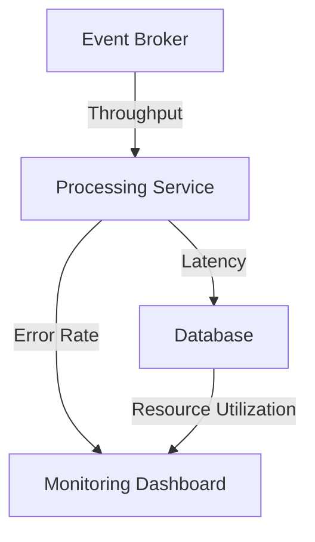

---

linkTitle: "16.3.1 Key Performance Indicators (KPIs)"
title: "Key Performance Indicators (KPIs) for Monitoring Event-Driven Architecture Systems"
description: "Explore essential Key Performance Indicators (KPIs) for monitoring the performance and health of Event-Driven Architecture (EDA) systems, including event throughput, processing latency, error rates, and system resource utilization."
categories:
- Software Architecture
- Event-Driven Systems
- Monitoring
tags:
- KPIs
- Event-Driven Architecture
- System Monitoring
- Performance Metrics
- EDA
date: 2024-10-25
type: docs
nav_weight: 1631000
---

## 16.3.1 Key Performance Indicators (KPIs)

In the realm of Event-Driven Architecture (EDA), monitoring the health and performance of your systems is crucial to ensure they operate efficiently and meet business requirements. Key Performance Indicators (KPIs) serve as vital metrics that provide insights into various aspects of your EDA systems, such as event throughput, processing latency, error rates, and resource utilization. This section delves into the essential KPIs you should monitor, how to track them, and best practices for defining and using these KPIs effectively.

### Defining Relevant KPIs

KPIs are quantifiable measures that help assess the performance and health of your EDA systems. The selection of KPIs should align with your business goals and system architecture. Here are some crucial KPIs to consider:

- **Event Throughput:** The number of events processed per second. This KPI helps assess the capacity and performance of event brokers and processing services.
- **Processing Latency:** The time taken to process events from ingestion to final handling. This is critical for ensuring real-time responsiveness.
- **Error Rates:** The rate of errors or failures in event processing. Monitoring this helps identify patterns or recurring issues.
- **System Resource Utilization:** CPU, memory, disk I/O, and network bandwidth usage across event brokers and processing services.
- **Event Backlogs:** The number of events waiting in queues or partitions, indicating potential processing delays or scalability issues.
- **System Uptime and Availability:** Ensures all components maintain high uptime and availability.
- **SLA Compliance:** Metrics that ensure the system meets agreed-upon performance and reliability standards.

### Monitoring Event Throughput

Event throughput is a critical KPI that measures the number of events processed by the system per second. High throughput indicates a well-performing system capable of handling large volumes of data. To monitor event throughput:

- **Use Metrics from Event Brokers:** Tools like Apache Kafka provide metrics such as `MessagesInPerSec` to track throughput.
- **Implement Custom Metrics:** Use libraries like Micrometer in Java to create custom metrics for your application.

```java
import io.micrometer.core.instrument.MeterRegistry;
import io.micrometer.core.instrument.Timer;

public class EventProcessor {
    private final Timer eventProcessingTimer;

    public EventProcessor(MeterRegistry registry) {
        this.eventProcessingTimer = registry.timer("event.processing.time");
    }

    public void processEvent(Event event) {
        eventProcessingTimer.record(() -> {
            // Process the event
        });
    }
}
```

### Measuring Processing Latency

Processing latency measures the time taken for an event to be processed from ingestion to completion. Low latency is crucial for real-time applications. To measure processing latency:

- **Track Timestamps:** Record timestamps at various stages of event processing and calculate the difference.
- **Use Distributed Tracing:** Tools like OpenTelemetry can help trace the flow of events across distributed systems.

```java
import io.opentelemetry.api.trace.Span;
import io.opentelemetry.api.trace.Tracer;

public class EventService {
    private final Tracer tracer;

    public EventService(Tracer tracer) {
        this.tracer = tracer;
    }

    public void handleEvent(Event event) {
        Span span = tracer.spanBuilder("handleEvent").startSpan();
        try {
            // Event handling logic
        } finally {
            span.end();
        }
    }
}
```

### Tracking Error Rates

Error rates indicate the reliability of your EDA system. High error rates can signal underlying issues that need addressing. To track error rates:

- **Log and Monitor Errors:** Use logging frameworks like Logback or SLF4J to capture errors and monitor them using tools like ELK Stack.
- **Set Alerts for Error Thresholds:** Configure alerts in monitoring tools to notify when error rates exceed acceptable levels.

### Monitoring System Resource Utilization

Efficient resource utilization ensures that your system can handle loads without bottlenecks. Key resources to monitor include CPU, memory, disk I/O, and network bandwidth. Tools like Prometheus and Grafana can help visualize these metrics.

```yaml
scrape_configs:
  - job_name: 'system_metrics'
    static_configs:
      - targets: ['localhost:9100']
```

### Analyzing Event Backlogs

Event backlogs can indicate processing delays or scalability issues. Monitoring the length of queues or partitions helps identify bottlenecks.

- **Use Queue Metrics:** Tools like RabbitMQ provide metrics such as `queue_length` to monitor backlogs.
- **Implement Backpressure Mechanisms:** Use backpressure to control the flow of events and prevent overwhelming the system.

### Assessing System Uptime and Availability

High uptime and availability are crucial for maintaining service reliability. Monitor the availability of all components using tools like Nagios or Zabbix.

### Reviewing SLA Compliance

Ensure your EDA system meets SLA metrics by monitoring performance and reliability standards. Use dashboards to track SLA compliance and identify areas for improvement.

### Example KPIs Dashboard

A well-designed KPI dashboard provides a comprehensive view of your EDA system's performance. Tools like Grafana can be used to create dashboards that display key metrics in real-time.



### Best Practices for Defining KPIs

- **Align with Business Goals:** Ensure KPIs reflect the objectives and priorities of your organization.
- **Focus on Actionable Metrics:** Choose KPIs that provide insights leading to actionable improvements.
- **Regularly Review and Update KPIs:** As your system evolves, periodically reassess KPIs to ensure they remain relevant.

### Conclusion

Monitoring KPIs in your EDA systems is essential for maintaining performance and reliability. By carefully selecting and tracking relevant KPIs, you can gain valuable insights into your system's health and make informed decisions to optimize its operation.

## Quiz Time!



### What is the primary purpose of monitoring event throughput in an EDA system?

- [x] To assess the capacity and performance of event brokers and processing services.
- [ ] To measure the time taken to process events.
- [ ] To track the rate of errors in event processing.
- [ ] To monitor system resource utilization.

> **Explanation:** Monitoring event throughput helps assess the capacity and performance of event brokers and processing services by tracking the number of events processed per second.

### Which tool can be used for distributed tracing in an EDA system?

- [x] OpenTelemetry
- [ ] Logback
- [ ] Nagios
- [ ] RabbitMQ

> **Explanation:** OpenTelemetry is a tool used for distributed tracing, which helps trace the flow of events across distributed systems.

### What does a high error rate in an EDA system indicate?

- [x] Underlying issues that need addressing
- [ ] Efficient resource utilization
- [ ] High event throughput
- [ ] Low processing latency

> **Explanation:** A high error rate indicates underlying issues that need addressing to maintain system reliability.

### Which metric is crucial for ensuring real-time responsiveness in an EDA system?

- [x] Processing Latency
- [ ] Event Throughput
- [ ] Error Rates
- [ ] System Uptime

> **Explanation:** Processing latency measures the time taken to process events, which is crucial for ensuring real-time responsiveness.

### What is the purpose of monitoring system resource utilization?

- [x] To ensure efficient resource allocation and prevent bottlenecks
- [ ] To track the number of events processed per second
- [ ] To measure the time taken to process events
- [ ] To monitor SLA compliance

> **Explanation:** Monitoring system resource utilization helps ensure efficient resource allocation and prevent bottlenecks in the system.

### Which tool is commonly used to visualize KPIs in an EDA system?

- [x] Grafana
- [ ] Logback
- [ ] Nagios
- [ ] RabbitMQ

> **Explanation:** Grafana is commonly used to create dashboards that visualize KPIs in an EDA system.

### What does monitoring event backlogs help identify?

- [x] Potential processing delays or scalability issues
- [ ] High event throughput
- [ ] Low processing latency
- [ ] Efficient resource utilization

> **Explanation:** Monitoring event backlogs helps identify potential processing delays or scalability issues by tracking the number of events waiting in queues or partitions.

### Which KPI ensures that all components of the EDA system maintain high uptime and availability?

- [x] System Uptime and Availability
- [ ] Event Throughput
- [ ] Processing Latency
- [ ] Error Rates

> **Explanation:** System uptime and availability ensure that all components of the EDA system maintain high uptime and availability, minimizing downtime and service disruptions.

### What should KPIs align with to ensure effective monitoring?

- [x] Business goals and system architecture
- [ ] High event throughput
- [ ] Low processing latency
- [ ] Efficient resource utilization

> **Explanation:** KPIs should align with business goals and system architecture to ensure effective monitoring and that they reflect the objectives and priorities of the organization.

### True or False: Regularly reviewing and updating KPIs is unnecessary once they are set.

- [ ] True
- [x] False

> **Explanation:** Regularly reviewing and updating KPIs is necessary to ensure they remain relevant as the system evolves.


