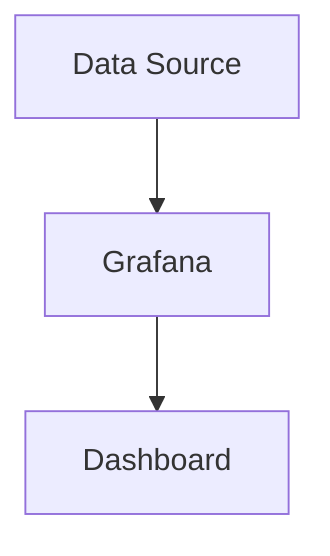

## 16.4.2 Diagnostic Techniques

In the realm of Event-Driven Architectures (EDA), diagnosing issues can be a complex task due to the distributed nature of the systems involved. This section delves into various diagnostic techniques that can be employed to effectively troubleshoot and debug EDA systems, ensuring they operate smoothly and efficiently.

### Examining Broker Logs

Event brokers like Apache Kafka and RabbitMQ are central to EDA systems, acting as intermediaries for message exchange. Broker logs are invaluable for diagnosing issues such as message duplication, loss, or processing errors.

#### Kafka Logs

Kafka logs provide insights into the state of partitions, consumer offsets, and broker health. By examining these logs, you can identify issues like:

- **Message Duplication:** Check for repeated offsets in consumer logs.
- **Message Loss:** Look for gaps in offsets or unacknowledged messages.
- **Processing Errors:** Identify exceptions or errors in the logs related to message handling.

**Example:**

```shell
tail -f /var/log/kafka/server.log
```

#### RabbitMQ Logs

RabbitMQ logs can highlight issues with queue bindings, message acknowledgments, and connection errors.

**Example:**

```shell
tail -f /var/log/rabbitmq/rabbit@hostname.log
```

### Using Distributed Tracing

Distributed tracing tools like Jaeger and Zipkin are essential for tracking the flow of events across services in an EDA. They help pinpoint performance bottlenecks and failure points.

#### Implementing Jaeger

Jaeger provides end-to-end distributed tracing, allowing you to visualize the path of a request through various services.

**Java Example:**

```java
import io.jaegertracing.Configuration;
import io.opentracing.Tracer;

public class TracingExample {
    public static void main(String[] args) {
        Tracer tracer = Configuration.fromEnv().getTracer();
        // Use tracer to start spans and trace requests
    }
}
```

### Monitoring System Metrics

Monitoring system metrics such as CPU usage, memory consumption, disk I/O, and network latency is crucial for identifying resource-related issues that may impact event processing.

#### Key Metrics to Monitor

- **CPU and Memory Usage:** High usage may indicate inefficient processing.
- **Disk I/O:** Bottlenecks can affect message persistence and retrieval.
- **Network Latency:** Delays can impact the timeliness of event processing.

### Implementing Health Checks

Regular health checks ensure that event brokers and processing services are operating correctly. These checks can quickly detect and address any service disruptions.

#### Health Check Example

In a Spring Boot application, you can implement health checks using Actuator:

```java
import org.springframework.boot.actuate.health.Health;
import org.springframework.boot.actuate.health.HealthIndicator;
import org.springframework.stereotype.Component;

@Component
public class CustomHealthIndicator implements HealthIndicator {
    @Override
    public Health health() {
        // Perform health check logic
        return Health.up().build();
    }
}
```

### Leveraging Visualization Dashboards

Visualization dashboards like Grafana and Kibana provide a comprehensive view of system health by visualizing metrics, logs, and traces.

#### Grafana Dashboard

Grafana can be configured to display real-time metrics from various data sources, helping you quickly identify issues.



### Performing Root Cause Analysis (RCA)

Root Cause Analysis is a systematic approach to identifying the underlying causes of recurring issues. It involves:

- **Data Collection:** Gather logs, metrics, and traces.
- **Analysis:** Identify patterns and correlations.
- **Solution Implementation:** Apply fixes to prevent recurrence.

### Utilizing Automated Monitoring Tools

Automated monitoring tools leverage machine learning or pattern recognition to detect anomalies and predict potential failures, enabling proactive troubleshooting.

#### Example Tools

- **Prometheus:** For monitoring and alerting.
- **Datadog:** For comprehensive monitoring and analytics.

### Implementing Alert Fatigue Mitigation

To reduce alert fatigue, refine alerting rules, categorize alerts based on severity, and ensure alerts are actionable and relevant.

#### Strategies

- **Threshold Adjustments:** Set appropriate thresholds to avoid false positives.
- **Alert Grouping:** Group related alerts to reduce noise.

### Example Diagnostic Workflow

Consider a scenario where you experience a latency spike in your EDA. Here's a step-by-step diagnostic workflow:

1. **Examine Broker Logs:** Check Kafka logs for any anomalies in message processing.
2. **Analyze Distributed Traces:** Use Jaeger to trace the flow of events and identify bottlenecks.
3. **Monitor System Metrics:** Check CPU, memory, and network metrics for resource constraints.
4. **Implement Optimizations:** Apply necessary optimizations, such as scaling resources or adjusting configurations.

### Best Practices for Diagnostics

- **Maintain Comprehensive Documentation:** Document system architectures and dependencies.
- **Conduct Regular Drills:** Simulate failures to test diagnostic processes.
- **Foster a Culture of Continuous Improvement:** Encourage regular reviews and updates to diagnostic strategies.
- **Ensure Tool Accessibility:** Make diagnostic tools easily accessible to the team.

By employing these diagnostic techniques, you can effectively troubleshoot and debug event-driven systems, ensuring their reliability and performance.

## Quiz Time!



### Which tool is used for distributed tracing in event-driven architectures?

- [x] Jaeger
- [ ] Grafana
- [ ] Prometheus
- [ ] RabbitMQ

> **Explanation:** Jaeger is a distributed tracing tool that helps track the flow of events across services in an event-driven architecture.

### What is a key benefit of examining broker logs?

- [x] Identifying message duplication or loss
- [ ] Visualizing system metrics
- [ ] Implementing health checks
- [ ] Reducing alert fatigue

> **Explanation:** Broker logs provide insights into message processing, helping identify issues like duplication or loss.

### Which Java library is used in the example for implementing distributed tracing?

- [x] io.jaegertracing.Configuration
- [ ] org.springframework.boot.actuate.health
- [ ] io.prometheus.client
- [ ] com.rabbitmq.client

> **Explanation:** The example uses `io.jaegertracing.Configuration` to implement distributed tracing with Jaeger.

### What is the purpose of implementing health checks in an EDA?

- [x] To ensure services are operating correctly
- [ ] To visualize metrics
- [ ] To perform root cause analysis
- [ ] To reduce network latency

> **Explanation:** Health checks are used to ensure that event brokers and processing services are operating correctly.

### Which tool is mentioned for creating visualization dashboards?

- [x] Grafana
- [ ] Zipkin
- [ ] Kafka
- [ ] Jaeger

> **Explanation:** Grafana is used for creating visualization dashboards to monitor system health.

### What is the first step in the example diagnostic workflow for resolving a latency spike?

- [x] Examine Broker Logs
- [ ] Analyze Distributed Traces
- [ ] Monitor System Metrics
- [ ] Implement Optimizations

> **Explanation:** The first step in the diagnostic workflow is to examine broker logs for anomalies.

### Which strategy is suggested for mitigating alert fatigue?

- [x] Refining alerting rules
- [ ] Increasing alert frequency
- [ ] Disabling alerts
- [ ] Ignoring low-severity alerts

> **Explanation:** Refining alerting rules helps ensure that alerts are actionable and relevant, reducing alert fatigue.

### What is the role of Root Cause Analysis in diagnostics?

- [x] Identifying underlying causes of issues
- [ ] Monitoring system metrics
- [ ] Visualizing logs
- [ ] Implementing health checks

> **Explanation:** Root Cause Analysis is used to identify the underlying causes of recurring issues.

### Which of the following is NOT a system metric mentioned for monitoring?

- [ ] CPU usage
- [ ] Memory consumption
- [ ] Disk I/O
- [x] Message format

> **Explanation:** Message format is not a system metric; it relates to the structure of messages in the system.

### True or False: Automated monitoring tools can use machine learning to predict potential failures.

- [x] True
- [ ] False

> **Explanation:** Automated monitoring tools can leverage machine learning or pattern recognition to detect anomalies and predict potential failures.


