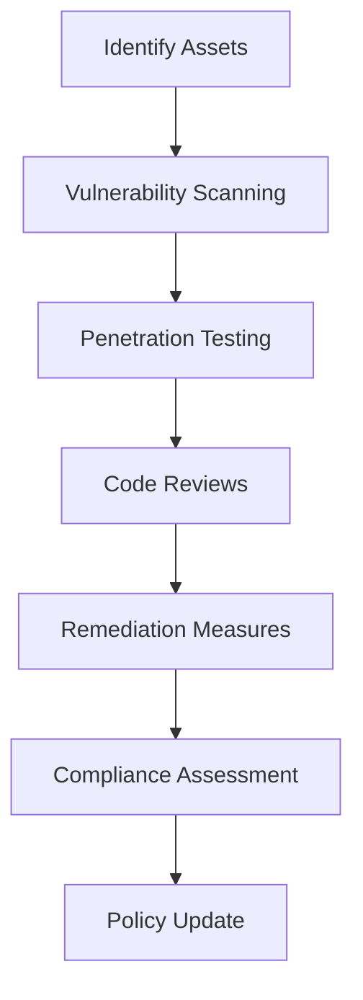

## 17.4.2 Regular Security Assessments

In the realm of Event-Driven Architectures (EDA), ensuring robust security is paramount. Regular security assessments are crucial to identifying vulnerabilities, validating security measures, and maintaining compliance with industry standards. This section delves into various strategies and practices for conducting comprehensive security assessments in EDA systems.

### Conduct Vulnerability Scanning

Vulnerability scanning is the first line of defense in identifying potential security weaknesses within your EDA components. This process involves using automated tools to scan event brokers, processing services, and data stores for known vulnerabilities.

#### Key Steps in Vulnerability Scanning:

1. **Identify Assets:** Catalog all components of your EDA, including event producers, consumers, brokers, and data stores.
2. **Select Tools:** Use tools like Nessus, OpenVAS, or Qualys to perform automated scans.
3. **Schedule Regular Scans:** Implement a schedule for regular scans to ensure continuous monitoring.
4. **Analyze Results:** Review scan reports to identify vulnerabilities and prioritize them based on severity.
5. **Remediate Vulnerabilities:** Develop a plan to address identified vulnerabilities, starting with the most critical.

#### Example Java Code for Vulnerability Scanning:

```java
import java.util.List;
import com.security.vulnscanner.VulnerabilityScanner;

public class EdaVulnerabilityScanner {

    public static void main(String[] args) {
        VulnerabilityScanner scanner = new VulnerabilityScanner();
        List<String> components = List.of("EventBroker", "DataStore", "ProcessingService");

        components.forEach(component -> {
            List<String> vulnerabilities = scanner.scan(component);
            vulnerabilities.forEach(vuln -> System.out.println("Vulnerability found in " + component + ": " + vuln));
        });
    }
}
```

### Perform Penetration Testing

Penetration testing simulates real-world attacks to uncover security gaps in your EDA. This proactive approach helps validate the effectiveness of existing security measures.

#### Steps for Effective Penetration Testing:

1. **Define Scope:** Clearly define the scope of the test, including which components and data flows will be tested.
2. **Select Testing Tools:** Use tools like Metasploit, Burp Suite, or OWASP ZAP.
3. **Conduct Testing:** Perform tests to exploit vulnerabilities and assess the impact.
4. **Document Findings:** Record all vulnerabilities discovered and their potential impact.
5. **Implement Fixes:** Prioritize and remediate vulnerabilities based on risk assessment.

### Implement Code Reviews

Code reviews are essential for identifying security vulnerabilities early in the development lifecycle. A thorough review process ensures that EDA components are built securely from the ground up.

#### Best Practices for Code Reviews:

- **Automate with Tools:** Use static analysis tools like SonarQube or Checkmarx to automate code reviews.
- **Peer Reviews:** Encourage peer reviews to leverage collective expertise.
- **Security Checklists:** Use security checklists to ensure all aspects are covered.
- **Continuous Integration:** Integrate code reviews into the CI/CD pipeline for ongoing security validation.

### Use Security Auditing Tools

Security auditing tools provide continuous assessment of your EDA's security posture. These tools automate the detection of common vulnerabilities and configuration issues.

#### Recommended Tools:

- **OWASP ZAP:** For finding vulnerabilities in web applications.
- **Burp Suite:** For comprehensive web application security testing.
- **Nessus:** For network vulnerability scanning.

### Assess Compliance with Security Standards

Evaluating your EDA against security standards ensures adherence to best practices and regulatory requirements. Standards like ISO 27001, NIST, and SOC 2 provide frameworks for maintaining security.

#### Steps for Compliance Assessment:

1. **Identify Applicable Standards:** Determine which standards apply to your organization.
2. **Conduct Gap Analysis:** Compare current practices against standard requirements.
3. **Implement Controls:** Address gaps by implementing necessary security controls.
4. **Document Compliance:** Maintain documentation to demonstrate compliance.

### Review and Update Security Policies

Regularly reviewing and updating security policies is vital to adapt to evolving threats and lessons learned from assessments.

#### Policy Review Process:

- **Schedule Regular Reviews:** Set a timeline for policy reviews, such as annually or bi-annually.
- **Incorporate Feedback:** Use insights from security assessments to update policies.
- **Communicate Changes:** Ensure all stakeholders are aware of policy updates.

### Implement Automated Security Testing

Integrating automated security testing into the CI/CD pipeline ensures consistent security checks with each deployment or schema update.

#### Steps for Automation:

1. **Select Tools:** Choose tools like OWASP ZAP or Selenium for automated testing.
2. **Integrate with CI/CD:** Configure tools to run automatically during build and deployment processes.
3. **Review Results:** Regularly review automated test results and address any issues.

### Engage External Security Experts

Engaging external security consultants provides an unbiased evaluation of your EDA’s security mechanisms and helps identify advanced threats.

#### Benefits of External Assessments:

- **Fresh Perspective:** External experts can identify issues internal teams might overlook.
- **Advanced Threat Detection:** Leverage expertise in detecting sophisticated threats.
- **Validation of Internal Efforts:** Confirm the effectiveness of internal security measures.

### Example Implementation: Security Assessment for a Retail EDA

Let's explore a detailed example of conducting a security assessment for an EDA in a retail application.

#### Steps Taken:

1. **Vulnerability Scanning:** Used Nessus to scan event brokers and data stores, identifying outdated software and misconfigurations.
2. **Penetration Testing:** Conducted tests using Metasploit to simulate attacks on the payment processing service, uncovering a SQL injection vulnerability.
3. **Code Reviews:** Implemented peer reviews and static analysis with SonarQube, identifying insecure coding practices in the inventory management service.
4. **Remediation Measures:** Updated software, applied patches, and refactored code to address vulnerabilities. Implemented additional security controls such as input validation and encryption.

#### Diagram: Security Assessment Workflow



### Conclusion

Regular security assessments are a cornerstone of maintaining a secure Event-Driven Architecture. By conducting vulnerability scans, penetration tests, code reviews, and compliance assessments, organizations can proactively identify and address security risks. Engaging external experts and automating security testing further enhances the security posture of EDA systems.

## Quiz Time!



### What is the primary purpose of vulnerability scanning in EDA?

- [x] To identify potential security weaknesses in EDA components
- [ ] To simulate real-world attacks on the EDA
- [ ] To automate code reviews
- [ ] To update security policies

> **Explanation:** Vulnerability scanning is used to identify potential security weaknesses in EDA components, such as event brokers and data stores.

### Which tool is commonly used for penetration testing?

- [ ] Nessus
- [x] Metasploit
- [ ] SonarQube
- [ ] Selenium

> **Explanation:** Metasploit is a popular tool used for penetration testing to simulate real-world attacks and uncover security gaps.

### What is a key benefit of conducting code reviews?

- [ ] To automate security testing
- [x] To identify security vulnerabilities early in the development lifecycle
- [ ] To engage external security experts
- [ ] To update security policies

> **Explanation:** Code reviews help identify security vulnerabilities early in the development lifecycle, ensuring that EDA components are built securely.

### Which tool is recommended for continuous assessment of web application security?

- [x] OWASP ZAP
- [ ] Nessus
- [ ] Metasploit
- [ ] SonarQube

> **Explanation:** OWASP ZAP is recommended for continuous assessment of web application security, automating the detection of vulnerabilities.

### What is the purpose of engaging external security experts?

- [x] To gain an unbiased evaluation of the EDA’s security mechanisms
- [ ] To automate code reviews
- [ ] To perform vulnerability scanning
- [ ] To update security policies

> **Explanation:** Engaging external security experts provides an unbiased evaluation of the EDA’s security mechanisms and helps identify advanced threats.

### What should be done after identifying vulnerabilities during a security assessment?

- [ ] Ignore them
- [x] Develop a plan to address them, starting with the most critical
- [ ] Only document them
- [ ] Wait for the next assessment

> **Explanation:** After identifying vulnerabilities, it's crucial to develop a plan to address them, prioritizing the most critical ones.

### Which standard is commonly used for evaluating security compliance?

- [ ] OWASP ZAP
- [ ] Metasploit
- [x] ISO 27001
- [ ] Selenium

> **Explanation:** ISO 27001 is a commonly used standard for evaluating security compliance, providing a framework for maintaining security.

### What is the role of automated security testing in the CI/CD pipeline?

- [x] To ensure consistent security checks with each deployment
- [ ] To replace manual code reviews
- [ ] To engage external security experts
- [ ] To update security policies

> **Explanation:** Automated security testing in the CI/CD pipeline ensures consistent security checks with each deployment or schema update.

### Which tool is used for static code analysis?

- [ ] Metasploit
- [ ] OWASP ZAP
- [x] SonarQube
- [ ] Nessus

> **Explanation:** SonarQube is used for static code analysis, helping to identify security vulnerabilities in code.

### Regular security assessments are essential for maintaining a secure EDA.

- [x] True
- [ ] False

> **Explanation:** Regular security assessments are essential for maintaining a secure EDA, as they help identify and address security risks proactively.


