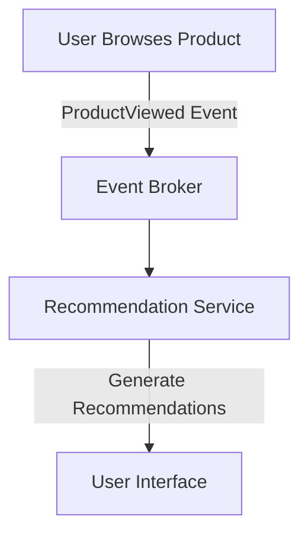

---

linkTitle: "18.1.1 EDA in E-Commerce Platforms"
title: "Event-Driven Architecture in E-Commerce Platforms: Real-World Implementations and Best Practices"
description: "Explore how Event-Driven Architecture (EDA) transforms e-commerce platforms by enhancing real-time processing, scalability, and user experience through practical implementations and strategies."
categories:
- Software Architecture
- E-Commerce
- Event-Driven Systems
tags:
- Event-Driven Architecture
- E-Commerce
- Real-Time Processing
- Scalability
- Kafka
date: 2024-10-25
type: docs
nav_weight: 1811000
---

## 18.1.1 EDA in E-Commerce Platforms

In the fast-paced world of e-commerce, the ability to process events in real-time and respond swiftly to user actions is crucial for maintaining a competitive edge. Event-Driven Architecture (EDA) offers a robust framework for building responsive, scalable, and resilient e-commerce platforms. This section delves into the core components of EDA in e-commerce, explores practical implementations, and highlights best practices for leveraging EDA to enhance user experience and operational efficiency.

### Identifying Core EDA Components

An effective EDA implementation in e-commerce involves several key components:

- **Event Producers:** These are the sources of events, such as user actions (e.g., adding items to a cart), inventory updates, and order placements. Producers emit events that trigger downstream processing.
  
- **Event Brokers:** Middleware solutions like Apache Kafka or RabbitMQ act as intermediaries that manage the flow of events between producers and consumers. They ensure reliable delivery and enable decoupled communication.

- **Event Consumers:** These are services that process events to perform specific actions, such as updating inventory, processing payments, or generating recommendations.

### Defining Event Schemas

Event schemas define the structure of the data contained in events. In an e-commerce context, these schemas must be comprehensive yet flexible to accommodate future changes. Here are examples of typical event schemas:

- **Order Creation Event:**
  ```json
  {
    "eventId": "12345",
    "eventType": "OrderCreated",
    "timestamp": "2024-10-25T14:48:00Z",
    "orderId": "67890",
    "userId": "user123",
    "items": [
      {
        "productId": "prod001",
        "quantity": 2,
        "price": 29.99
      }
    ],
    "totalAmount": 59.98,
    "paymentStatus": "Pending"
  }
  ```

- **Inventory Update Event:**
  ```json
  {
    "eventId": "54321",
    "eventType": "InventoryUpdated",
    "timestamp": "2024-10-25T15:00:00Z",
    "productId": "prod001",
    "quantityChange": -2,
    "newQuantity": 98
  }
  ```

These schemas ensure that all necessary data is encapsulated for processing, while also allowing for schema evolution as business needs change.

### Implementing Real-Time Order Processing

Real-time order processing is a critical component of an e-commerce platform. When a user completes a checkout, an `OrderCreated` event is generated and consumed by various services to handle order fulfillment. Here's a simplified Java example using Spring Boot and Kafka:

```java
@Service
public class OrderService {

    private final KafkaTemplate<String, OrderEvent> kafkaTemplate;

    @Autowired
    public OrderService(KafkaTemplate<String, OrderEvent> kafkaTemplate) {
        this.kafkaTemplate = kafkaTemplate;
    }

    public void createOrder(Order order) {
        OrderEvent orderEvent = new OrderEvent(order);
        kafkaTemplate.send("orders", orderEvent.getOrderId(), orderEvent);
    }
}

@Component
public class InventoryConsumer {

    @KafkaListener(topics = "orders", groupId = "inventory")
    public void consumeOrder(OrderEvent orderEvent) {
        // Update inventory based on order items
        updateInventory(orderEvent.getItems());
    }

    private void updateInventory(List<OrderItem> items) {
        // Logic to update inventory
    }
}
```

In this example, the `OrderService` produces an `OrderEvent`, which is then consumed by the `InventoryConsumer` to update inventory levels.

### Integrating Recommendation Systems

EDA can significantly enhance recommendation engines by processing user interactions in real-time. By consuming events such as `ProductViewed` or `ProductPurchased`, a recommendation service can generate personalized suggestions. Here's a conceptual flow:



This real-time processing allows for immediate updates to recommendations, improving user engagement and sales.

### Enabling Real-Time Analytics

Real-time analytics provide valuable insights into user behavior, sales trends, and inventory levels. By consuming events such as `OrderCreated` or `InventoryUpdated`, analytics services can offer timely data for strategic decisions.

```java
@Component
public class AnalyticsConsumer {

    @KafkaListener(topics = "orders", groupId = "analytics")
    public void consumeOrder(OrderEvent orderEvent) {
        // Analyze order data
        analyzeOrderData(orderEvent);
    }

    private void analyzeOrderData(OrderEvent orderEvent) {
        // Logic for analytics
    }
}
```

### Ensuring Fault Tolerance and High Availability

To ensure reliability, e-commerce platforms must be fault-tolerant and highly available. This can be achieved through:

- **Event Broker Clustering:** Deploying brokers in a cluster to ensure redundancy and failover capabilities.
- **Data Replication:** Replicating data across multiple nodes to prevent data loss.
- **Redundant Consumer Instances:** Running multiple instances of consumers to handle failover and load balancing.

### Optimizing Scalability for Seasonal Peaks

E-commerce platforms often experience traffic spikes during events like Black Friday. To handle these peaks, implement dynamic scaling strategies:

- **Auto-Scaling Consumers:** Automatically adjust the number of consumer instances based on load.
- **Partitioning Events:** Use Kafka partitions to distribute load across multiple consumers.

### Monitoring and Logging Events for Compliance

Comprehensive monitoring and logging are essential for compliance and troubleshooting. Implement tools like Prometheus and Grafana for real-time monitoring, and ensure all events are logged for auditing purposes.

```java
@KafkaListener(topics = "orders", groupId = "monitoring")
public void logOrderEvent(OrderEvent orderEvent) {
    // Log event for compliance
    logger.info("Order event received: {}", orderEvent);
}
```

### Conclusion

Implementing EDA in e-commerce platforms offers numerous benefits, including enhanced real-time processing, scalability, and user experience. By leveraging the core components of EDA, defining robust event schemas, and implementing best practices for fault tolerance and scalability, e-commerce platforms can achieve significant operational efficiencies and competitive advantages.

## Quiz Time!



### What are the core components of an EDA implementation in e-commerce?

- [x] Event Producers, Event Brokers, Event Consumers
- [ ] Event Generators, Event Handlers, Event Processors
- [ ] Data Producers, Data Brokers, Data Consumers
- [ ] Message Senders, Message Brokers, Message Receivers

> **Explanation:** The core components of an EDA implementation in e-commerce include Event Producers, Event Brokers, and Event Consumers, which work together to handle events efficiently.

### Which event broker is commonly used in EDA implementations for e-commerce platforms?

- [x] Apache Kafka
- [ ] MySQL
- [ ] Redis
- [ ] MongoDB

> **Explanation:** Apache Kafka is a popular event broker used in EDA implementations due to its scalability and reliability.

### What is the purpose of defining event schemas in an EDA?

- [x] To encapsulate necessary data for processing events
- [ ] To generate random data for testing
- [ ] To store data in a database
- [ ] To create user interfaces

> **Explanation:** Event schemas define the structure of data in events, ensuring that all necessary information is available for processing.

### How can real-time order processing be implemented in an e-commerce platform using EDA?

- [x] By generating order events upon checkout and consuming them with services like inventory and payment
- [ ] By storing orders in a database and processing them in batches
- [ ] By using a monolithic application to handle all order processing
- [ ] By manually updating inventory and payment systems

> **Explanation:** Real-time order processing in EDA involves generating order events and consuming them with various services to handle fulfillment.

### What role do recommendation systems play in an EDA for e-commerce?

- [x] They process user interactions to generate personalized product suggestions
- [ ] They store user data for future analysis
- [ ] They handle payment processing
- [ ] They manage inventory levels

> **Explanation:** Recommendation systems in EDA process user interactions to provide personalized product suggestions, enhancing user experience.

### How can e-commerce platforms ensure fault tolerance and high availability in EDA?

- [x] By implementing broker clustering, data replication, and redundant consumer instances
- [ ] By using a single server for all processing
- [ ] By manually restarting services after a failure
- [ ] By storing all data in a single database

> **Explanation:** Fault tolerance and high availability are achieved through broker clustering, data replication, and redundant consumer instances.

### What strategies can be used to handle seasonal traffic spikes in e-commerce platforms using EDA?

- [x] Auto-scaling consumers and partitioning events
- [ ] Increasing server capacity manually
- [ ] Reducing the number of consumers
- [ ] Storing all events in a single queue

> **Explanation:** Auto-scaling consumers and partitioning events help manage increased load during seasonal traffic spikes.

### Why is monitoring and logging important in an EDA for e-commerce?

- [x] To ensure compliance and facilitate troubleshooting
- [ ] To increase server load
- [ ] To reduce data storage requirements
- [ ] To simplify user interfaces

> **Explanation:** Monitoring and logging are crucial for compliance, auditing, and troubleshooting in an EDA.

### What is a key benefit of using EDA in e-commerce platforms?

- [x] Enhanced real-time processing and scalability
- [ ] Simplified database management
- [ ] Reduced need for user interfaces
- [ ] Increased manual processing

> **Explanation:** EDA enhances real-time processing and scalability, providing significant benefits for e-commerce platforms.

### True or False: EDA implementations in e-commerce platforms can improve user experience through real-time recommendations.

- [x] True
- [ ] False

> **Explanation:** EDA enables real-time processing of user interactions, allowing for immediate updates to recommendations and improved user experience.


