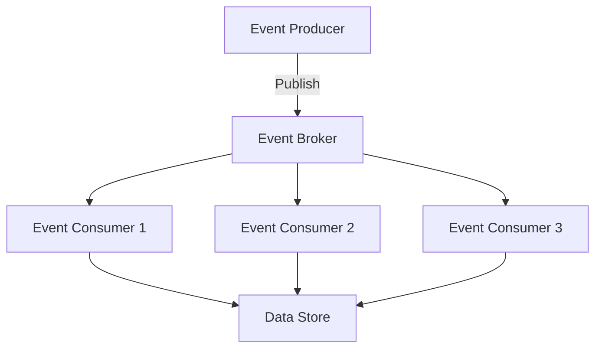

## 18.1.2 EDA in Financial Services

Event-Driven Architecture (EDA) has become a cornerstone in the financial services industry, enabling institutions to process transactions in real-time, detect fraud, ensure compliance, and support high-frequency trading. This section delves into the critical components and implementations of EDA within financial services, providing insights into how these systems are designed and maintained.

### Defining Critical Financial Events

In the context of financial services, events are the lifeblood of the system. They represent significant occurrences that require immediate attention or processing. Key financial events include:

- **Transactions:** These are the most fundamental events, encompassing deposits, withdrawals, transfers, and payments. Each transaction event must be processed accurately and swiftly to ensure customer satisfaction and system integrity.
- **Account Updates:** Changes to account information, such as balance updates or personal information modifications, are critical events that need to be propagated across the system.
- **Fraud Alerts:** Suspicious activities trigger fraud alert events, which require immediate investigation and action to prevent financial loss.
- **Compliance Checks:** Events related to regulatory compliance, such as Know Your Customer (KYC) updates or Anti-Money Laundering (AML) checks, ensure that the institution adheres to legal standards.

### Implementing Event Sourcing for Transaction History

Event sourcing is a powerful pattern in EDA that involves storing all changes to the application state as a sequence of events. This approach is particularly beneficial in financial services for maintaining an immutable transaction history. Here's how it can be implemented:

```java
public class TransactionEvent {
    private final String transactionId;
    private final String accountId;
    private final BigDecimal amount;
    private final LocalDateTime timestamp;
    private final String type; // e.g., DEPOSIT, WITHDRAWAL

    // Constructor, getters, and other methods
}

// Event Store Interface
public interface EventStore {
    void saveEvent(TransactionEvent event);
    List<TransactionEvent> getEventsForAccount(String accountId);
}

// Implementation of Event Store
public class InMemoryEventStore implements EventStore {
    private final Map<String, List<TransactionEvent>> store = new ConcurrentHashMap<>();

    @Override
    public void saveEvent(TransactionEvent event) {
        store.computeIfAbsent(event.getAccountId(), k -> new ArrayList<>()).add(event);
    }

    @Override
    public List<TransactionEvent> getEventsForAccount(String accountId) {
        return store.getOrDefault(accountId, Collections.emptyList());
    }
}
```

By storing each transaction as an event, financial institutions can reconstruct account states at any point in time, facilitating accurate auditing and compliance reporting.

### Deploying Real-Time Fraud Detection

Fraud detection is a critical component of financial services, and EDA enables real-time processing of transaction events to identify fraudulent activities promptly. This can be achieved using machine learning models or rule-based systems:

```java
public class FraudDetectionService {
    private final List<FraudRule> rules;
    private final EventStore eventStore;

    public FraudDetectionService(List<FraudRule> rules, EventStore eventStore) {
        this.rules = rules;
        this.eventStore = eventStore;
    }

    public boolean isFraudulent(TransactionEvent event) {
        return rules.stream().anyMatch(rule -> rule.isFraudulent(event));
    }
}

// Example Rule
public class LargeTransactionRule implements FraudRule {
    private static final BigDecimal THRESHOLD = new BigDecimal("10000");

    @Override
    public boolean isFraudulent(TransactionEvent event) {
        return event.getAmount().compareTo(THRESHOLD) > 0;
    }
}
```

By processing transaction events in real-time, the system can apply these rules or models to detect anomalies and trigger fraud alerts.

### Integrating with Regulatory Compliance Systems

Compliance is non-negotiable in financial services. EDA facilitates seamless integration with regulatory systems to ensure that all necessary compliance checks and reports are automatically generated and transmitted:

```java
public class ComplianceService {
    private final EventStore eventStore;

    public ComplianceService(EventStore eventStore) {
        this.eventStore = eventStore;
    }

    public void generateComplianceReport(String accountId) {
        List<TransactionEvent> events = eventStore.getEventsForAccount(accountId);
        // Process events to generate report
    }
}
```

This integration ensures that financial institutions remain compliant with regulations such as KYC and AML, reducing the risk of legal penalties.

### Enabling High-Frequency Trading (HFT) Support

High-frequency trading requires ultra-low latency in processing market data events. EDA supports this by ensuring that systems can react to events with minimal delay:

```java
public class MarketDataProcessor {
    private final EventStore eventStore;

    public void processMarketDataEvent(MarketDataEvent event) {
        // Process event with minimal latency
        eventStore.saveEvent(event);
    }
}
```

By optimizing event processing pipelines, financial institutions can maintain the speed and reliability required for HFT applications.

### Securing Event Data Transmission and Storage

Security is paramount in financial services. EDA systems must implement robust measures to protect sensitive data:

- **Encryption:** Use encryption protocols such as TLS for data in transit and AES for data at rest.
- **Authentication and Authorization:** Implement secure authentication mechanisms and role-based access controls to prevent unauthorized access.

```java
public class SecureEventStore implements EventStore {
    private final EventStore delegate;

    public SecureEventStore(EventStore delegate) {
        this.delegate = delegate;
    }

    @Override
    public void saveEvent(TransactionEvent event) {
        // Encrypt event data
        delegate.saveEvent(event);
    }

    @Override
    public List<TransactionEvent> getEventsForAccount(String accountId) {
        // Decrypt event data
        return delegate.getEventsForAccount(accountId);
    }
}
```

### Ensuring Scalability for Trading Volumes

Financial systems must scale to handle high volumes of trading data. EDA supports both horizontal and vertical scaling:

- **Horizontal Scaling:** Add more instances of event processors to distribute the load.
- **Vertical Scaling:** Increase the resources of existing instances to handle more data.



This diagram illustrates a horizontally scalable architecture where multiple consumers process events in parallel.

### Monitoring System Performance and Compliance

Monitoring is crucial for maintaining system performance and ensuring compliance. Implement monitoring tools to track key metrics and detect anomalies:

- **Performance Metrics:** Monitor latency, throughput, and error rates.
- **Compliance Monitoring:** Ensure that all regulatory requirements are met.

```java
public class MonitoringService {
    public void trackEventProcessingTime(TransactionEvent event, long processingTime) {
        // Log processing time for monitoring
    }

    public void alertOnAnomaly(String message) {
        // Send alert for detected anomaly
    }
}
```

By establishing robust monitoring and alerting systems, financial institutions can proactively maintain and optimize their EDA systems.

### Conclusion

Event-Driven Architecture provides a robust framework for financial services to process transactions in real-time, detect fraud, ensure compliance, and support high-frequency trading. By implementing the strategies and patterns discussed in this section, financial institutions can enhance their operational efficiency, security, and scalability.

## Quiz Time!



### Which of the following is a critical financial event in EDA?

- [x] Transactions
- [ ] User logins
- [ ] System updates
- [ ] Email notifications

> **Explanation:** Transactions are fundamental events in financial services, requiring immediate processing and accuracy.


### What is the primary benefit of using event sourcing in financial services?

- [x] Maintaining an immutable transaction history
- [ ] Reducing system latency
- [ ] Simplifying user interfaces
- [ ] Enhancing graphic rendering

> **Explanation:** Event sourcing allows financial institutions to maintain an immutable history of transactions, which is crucial for auditing and compliance.


### How can real-time fraud detection be implemented in EDA?

- [x] By processing transaction events with machine learning models or rule-based systems
- [ ] By manually reviewing transaction logs
- [ ] By delaying transaction processing
- [ ] By using static analysis tools

> **Explanation:** Real-time fraud detection involves processing transaction events as they occur, using models or rules to identify suspicious activities.


### What role does encryption play in securing financial event data?

- [x] Protecting data during transmission and storage
- [ ] Increasing data processing speed
- [ ] Simplifying data formats
- [ ] Enhancing user experience

> **Explanation:** Encryption ensures that sensitive financial data is protected from unauthorized access during transmission and storage.


### Which scaling strategy involves adding more instances of event processors?

- [x] Horizontal Scaling
- [ ] Vertical Scaling
- [ ] Diagonal Scaling
- [ ] Circular Scaling

> **Explanation:** Horizontal scaling involves adding more instances to distribute the load across multiple processors.


### What is the purpose of integrating EDA with regulatory compliance systems?

- [x] To automatically generate and transmit necessary compliance reports
- [ ] To increase transaction speed
- [ ] To simplify user interfaces
- [ ] To enhance graphic rendering

> **Explanation:** Integration with compliance systems ensures that all necessary reports and checks are automatically handled, maintaining regulatory adherence.


### How does EDA support high-frequency trading?

- [x] By ensuring ultra-low latency in processing market data events
- [ ] By increasing transaction fees
- [ ] By simplifying trading algorithms
- [ ] By reducing market volatility

> **Explanation:** EDA supports high-frequency trading by minimizing latency, allowing systems to react quickly to market changes.


### What is a key metric to monitor in an EDA system?

- [x] Latency
- [ ] User satisfaction
- [ ] Color schemes
- [ ] Font sizes

> **Explanation:** Monitoring latency is crucial to ensure that the system processes events promptly and efficiently.


### Which of the following is a security measure for EDA systems?

- [x] Role-based access controls
- [ ] Increasing transaction fees
- [ ] Simplifying user interfaces
- [ ] Enhancing graphic rendering

> **Explanation:** Role-based access controls help prevent unauthorized access to sensitive data and operations.


### True or False: Event-Driven Architecture is unsuitable for financial services due to its complexity.

- [ ] True
- [x] False

> **Explanation:** While EDA can be complex, it is highly suitable for financial services due to its ability to handle real-time processing, security, and compliance effectively.


