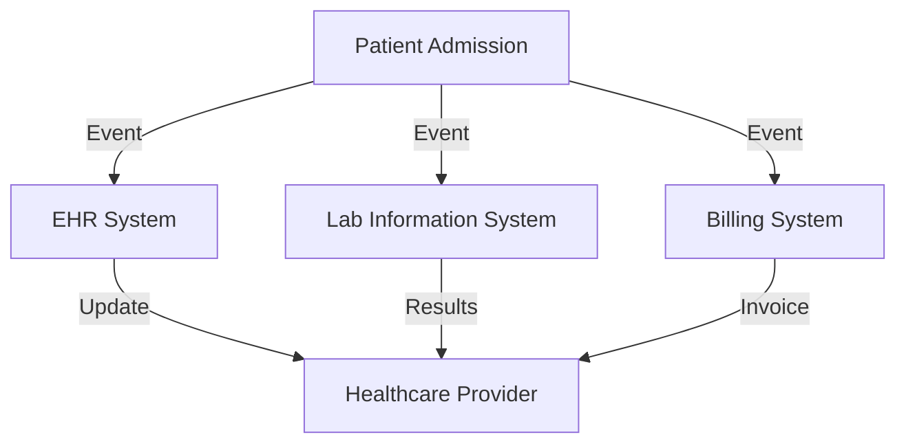

## 18.1.3 EDA in Healthcare Systems

In the rapidly evolving landscape of healthcare, the need for real-time data processing, seamless integration across systems, and stringent compliance with regulations is more critical than ever. Event-Driven Architecture (EDA) offers a robust framework to address these needs, enabling healthcare systems to become more responsive, efficient, and secure. This section explores how EDA can be effectively implemented in healthcare systems, focusing on key areas such as patient data processing, real-time monitoring, compliance, and data integration.

### Defining Healthcare-Specific Events

In a healthcare setting, events are pivotal in capturing and responding to critical data points. These events can be broadly categorized into:

- **Patient Admissions:** Triggered when a patient is admitted to a healthcare facility, this event initiates a series of actions, such as updating the electronic health record (EHR), notifying relevant departments, and scheduling initial assessments.
- **Treatment Updates:** These events occur when there are changes in a patient's treatment plan, such as medication adjustments or therapy sessions, ensuring that all stakeholders are informed and records are updated.
- **Lab Results:** When lab results are available, this event ensures that results are promptly delivered to the healthcare provider and integrated into the patient's EHR for further analysis and decision-making.
- **Discharge Notifications:** Triggered when a patient is discharged, this event coordinates the finalization of medical records, billing processes, and follow-up care instructions.

### Implementing Patient Data Event Processing

Processing patient data events in real-time is crucial for maintaining up-to-date EHRs and ensuring timely interventions. Here's how EDA can be implemented for this purpose:

```java
import org.springframework.kafka.annotation.KafkaListener;
import org.springframework.stereotype.Service;

@Service
public class PatientEventProcessor {

    @KafkaListener(topics = "patient-admissions", groupId = "healthcare-group")
    public void handlePatientAdmission(String event) {
        // Parse the event data
        PatientAdmissionEvent admissionEvent = parseEvent(event);
        
        // Update EHR system
        updateEHR(admissionEvent);
        
        // Notify relevant departments
        notifyDepartments(admissionEvent);
    }

    private PatientAdmissionEvent parseEvent(String event) {
        // Logic to parse event data
        return new PatientAdmissionEvent();
    }

    private void updateEHR(PatientAdmissionEvent event) {
        // Logic to update electronic health records
    }

    private void notifyDepartments(PatientAdmissionEvent event) {
        // Logic to notify departments
    }
}
```

In this example, a Kafka listener is used to process patient admission events. The event data is parsed, and subsequent actions such as updating the EHR and notifying departments are triggered.

### Enabling Real-Time Monitoring and Alerts

Real-time monitoring is essential for tracking patient vitals and treatment progress. EDA facilitates this by enabling immediate alerts for healthcare providers:

```java
import org.springframework.kafka.core.KafkaTemplate;
import org.springframework.scheduling.annotation.Scheduled;
import org.springframework.stereotype.Component;

@Component
public class VitalSignsMonitor {

    private final KafkaTemplate<String, String> kafkaTemplate;

    public VitalSignsMonitor(KafkaTemplate<String, String> kafkaTemplate) {
        this.kafkaTemplate = kafkaTemplate;
    }

    @Scheduled(fixedRate = 5000)
    public void monitorVitals() {
        // Simulate monitoring of patient vitals
        String vitalSignsData = fetchVitalSigns();
        
        // Check for critical conditions
        if (isCritical(vitalSignsData)) {
            kafkaTemplate.send("alerts", "Critical condition detected: " + vitalSignsData);
        }
    }

    private String fetchVitalSigns() {
        // Logic to fetch patient vital signs
        return "Sample Vital Signs Data";
    }

    private boolean isCritical(String data) {
        // Logic to determine if the condition is critical
        return data.contains("Critical");
    }
}
```

This code snippet demonstrates a scheduled task that monitors patient vitals and sends alerts if critical conditions are detected.

### Ensuring Compliance with Healthcare Regulations

Compliance with regulations such as HIPAA is non-negotiable in healthcare. EDA systems must incorporate robust security measures:

- **Data Encryption:** Ensure that all patient data is encrypted both in transit and at rest.
- **Access Controls:** Implement strict access controls to ensure that only authorized personnel can access sensitive data.
- **Audit Logging:** Maintain detailed logs of all data access and modifications for auditing purposes.

### Facilitating Data Integration Across Systems

Healthcare systems often consist of disparate components such as EHRs, laboratory information systems, and billing systems. EDA enables seamless data integration:



This diagram illustrates how a patient admission event can trigger updates across multiple systems, ensuring data consistency and coordination.

### Implementing Insights and Analytics Services

Real-time analytics can provide valuable insights into patient outcomes and operational efficiencies. By integrating analytics services within the EDA, healthcare providers can:

- **Predict Patient Outcomes:** Use predictive analytics to anticipate patient needs and optimize treatment plans.
- **Enhance Operational Efficiency:** Analyze workflow data to identify bottlenecks and improve resource allocation.

### Secure Event Data Storage and Access

Secure storage and access to event data are critical. Implement robust authentication and authorization mechanisms to ensure that only authorized personnel can access sensitive information.

### Monitoring and Logging Healthcare Events for Traceability

Comprehensive monitoring and logging are essential for traceability and troubleshooting. Implement systems to log all healthcare events, supporting auditing and ensuring accountability.

### Conclusion

Implementing EDA in healthcare systems offers numerous benefits, including real-time responsiveness, improved data integration, and enhanced compliance with regulations. By leveraging EDA, healthcare providers can deliver better patient care, optimize operations, and ensure data security. As healthcare continues to evolve, EDA will play an increasingly vital role in shaping the future of healthcare systems.

## Quiz Time!



### What is a key benefit of using EDA in healthcare systems?

- [x] Real-time data processing
- [ ] Reduced data storage requirements
- [ ] Elimination of all manual processes
- [ ] Simplified user interfaces

> **Explanation:** EDA enables real-time data processing, which is crucial for timely updates and interventions in healthcare systems.

### Which event is triggered when a patient is admitted to a healthcare facility?

- [x] Patient Admission
- [ ] Treatment Update
- [ ] Lab Result
- [ ] Discharge Notification

> **Explanation:** A Patient Admission event is triggered when a patient is admitted, initiating updates to EHRs and notifications to relevant departments.

### How does EDA facilitate real-time monitoring in healthcare?

- [x] By enabling immediate alerts for critical conditions
- [ ] By storing data in a centralized database
- [ ] By reducing the number of data sources
- [ ] By simplifying data entry processes

> **Explanation:** EDA facilitates real-time monitoring by enabling immediate alerts for healthcare providers, allowing for prompt interventions.

### What is a critical compliance requirement for healthcare EDA systems?

- [x] Data encryption
- [ ] Open data access
- [ ] Unlimited data retention
- [ ] Simplified user interfaces

> **Explanation:** Data encryption is a critical compliance requirement to protect sensitive patient information in healthcare EDA systems.

### How does EDA enhance data integration across healthcare systems?

- [x] By enabling seamless and real-time data flow between services
- [ ] By consolidating all data into a single system
- [ ] By eliminating the need for data synchronization
- [ ] By reducing the number of data formats

> **Explanation:** EDA enhances data integration by enabling seamless and real-time data flow between disparate healthcare systems.

### What role does real-time analytics play in healthcare EDA?

- [x] Predicting patient outcomes
- [ ] Reducing the number of data sources
- [ ] Simplifying data entry processes
- [ ] Eliminating the need for manual interventions

> **Explanation:** Real-time analytics in healthcare EDA can predict patient outcomes and optimize treatment plans.

### Which mechanism is crucial for ensuring only authorized personnel access sensitive healthcare data?

- [x] Authentication and authorization
- [ ] Open data access
- [ ] Unlimited data retention
- [ ] Simplified user interfaces

> **Explanation:** Authentication and authorization mechanisms are crucial for ensuring that only authorized personnel access sensitive healthcare data.

### What is the purpose of audit logging in healthcare EDA systems?

- [x] Supporting auditing and ensuring accountability
- [ ] Reducing data storage requirements
- [ ] Eliminating manual processes
- [ ] Simplifying user interfaces

> **Explanation:** Audit logging supports auditing and ensures accountability by maintaining detailed logs of data access and modifications.

### What is a common challenge in implementing EDA in healthcare?

- [x] Ensuring compliance with regulations
- [ ] Reducing data storage requirements
- [ ] Eliminating manual processes
- [ ] Simplifying user interfaces

> **Explanation:** Ensuring compliance with stringent healthcare regulations is a common challenge in implementing EDA in healthcare systems.

### True or False: EDA can be used to integrate disparate healthcare systems.

- [x] True
- [ ] False

> **Explanation:** True. EDA can be used to integrate disparate healthcare systems by enabling seamless and real-time data flow between services.


