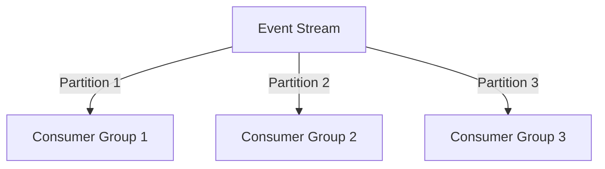

## 18.2.3 Scaling EDA Solutions

Scaling Event-Driven Architecture (EDA) solutions is a critical aspect of ensuring that systems can handle increasing volumes of events and data efficiently. In this section, we will explore strategies and best practices for scaling EDA solutions, leveraging industry insights and practical examples to guide you through the process.

### Plan for Scalability from the Outset

When designing an EDA solution, it's essential to consider scalability from the very beginning. This involves identifying potential growth areas and planning accordingly. By anticipating future demands, you can design your architecture to accommodate increased loads without significant rework.

**Key Considerations:**
- **Identify Growth Areas:** Analyze which parts of your system are likely to experience increased load and plan for their scalability.
- **Design for Flexibility:** Ensure that your architecture can adapt to changes in demand, allowing for seamless scaling.
- **Use Modular Components:** Design your system with modular components that can be scaled independently.

### Implement Scalability Patterns

Scalability patterns are essential for ensuring that your EDA can handle increasing volumes of events and data seamlessly. Here are some common patterns to consider:

#### Horizontal Scaling

Horizontal scaling involves adding more instances of a service or component to handle increased load. This is often more cost-effective and flexible than vertical scaling, which involves adding more resources to a single instance.

```java
// Example of horizontal scaling with Spring Boot and Kubernetes
@SpringBootApplication
public class EventProcessingApplication {

    public static void main(String[] args) {
        SpringApplication.run(EventProcessingApplication.class, args);
    }
}

// Kubernetes Deployment YAML for horizontal scaling
apiVersion: apps/v1
kind: Deployment
metadata:
  name: event-processor
spec:
  replicas: 3  // Scale to 3 instances
  selector:
    matchLabels:
      app: event-processor
  template:
    metadata:
      labels:
        app: event-processor
    spec:
      containers:
      - name: event-processor
        image: event-processor:latest
```

#### Sharding and Partitioning

Sharding and partitioning involve dividing data into smaller, more manageable pieces, allowing for parallel processing and improved performance.



#### Load Balancing

Load balancing distributes incoming requests across multiple instances, ensuring that no single instance is overwhelmed.

### Leverage Cloud-Native Services

Cloud-native services and managed event brokers, such as AWS Kinesis, Azure Event Hubs, and Google Pub/Sub, automatically handle scaling based on usage, reducing operational overhead.

**Benefits:**
- **Automatic Scaling:** These services automatically adjust resources based on demand.
- **Reduced Operational Overhead:** Managed services handle infrastructure concerns, allowing you to focus on application logic.
- **Cost Efficiency:** Pay only for the resources you use, scaling up or down as needed.

### Optimize Event Broker Configurations

Configuring event brokers for optimal scalability is crucial for handling large volumes of events.

**Kafka Configuration Tips:**
- **Increase Partitions:** More partitions allow for greater parallelism and throughput.
- **Manage Consumer Groups:** Ensure that consumer groups are balanced and can handle the load.
- **Tune Broker Settings:** Adjust settings such as buffer sizes and retention policies for optimal performance.

### Scale Processing Services Independently

Scaling event processing services independently of other system components allows for targeted resource allocation based on specific processing needs.

**Example:**
- Use Kubernetes to scale processing services based on CPU or memory usage.
- Implement autoscaling policies to adjust the number of instances dynamically.

### Use Microservices for Scalable Components

Decomposing the EDA into microservices enables each service to scale independently, aligning with specific event processing requirements.

**Advantages:**
- **Independent Scaling:** Scale each microservice based on its load and performance needs.
- **Improved Fault Isolation:** Issues in one service do not affect others.
- **Flexibility in Technology Choices:** Use the best technology for each service.

### Implement Caching and Data Optimization

Caching mechanisms and data optimization techniques reduce the load on processing services and databases, improving overall system scalability and responsiveness.

**Techniques:**
- **In-Memory Caching:** Use tools like Redis or Memcached to cache frequently accessed data.
- **Data Compression:** Compress data to reduce storage and transmission costs.
- **Efficient Data Structures:** Use data structures that optimize for speed and memory usage.

### Monitor and Adjust Scalability Measures

Continuously monitor the performance and load of the EDA, adjusting scalability measures as needed to accommodate changing workload patterns and ensure consistent performance.

**Monitoring Tools:**
- **Prometheus and Grafana:** For real-time monitoring and alerting.
- **Elasticsearch and Kibana:** For log analysis and visualization.

### Example Implementation: Scaling a Healthcare Application

Let's explore a detailed example of scaling an EDA-based healthcare application. This example demonstrates how to use Kubernetes for service scaling, Kafka partitioning for increased event throughput, and Elasticsearch scaling for handling large volumes of event data.

**Scenario:**
- A healthcare application processes patient data in real-time, requiring high throughput and low latency.

**Implementation Steps:**
1. **Deploy Kafka with Multiple Partitions:**
   - Configure Kafka with multiple partitions to increase throughput.
   - Use consumer groups to distribute load across multiple instances.

2. **Scale Services with Kubernetes:**
   - Deploy processing services in Kubernetes, using Horizontal Pod Autoscaler to adjust the number of pods based on CPU usage.

3. **Optimize Elasticsearch for Data Storage:**
   - Use Elasticsearch for storing and querying large volumes of patient data.
   - Scale Elasticsearch nodes based on query load and data size.

```yaml
apiVersion: autoscaling/v1
kind: HorizontalPodAutoscaler
metadata:
  name: healthcare-processor
spec:
  scaleTargetRef:
    apiVersion: apps/v1
    kind: Deployment
    name: healthcare-processor
  minReplicas: 2
  maxReplicas: 10
  targetCPUUtilizationPercentage: 75
```

### Best Practices for Scaling EDA

To ensure successful scaling of your EDA solutions, consider the following best practices:

- **Regularly Review Scalability Requirements:** Continuously assess your system's scalability needs and adjust your architecture accordingly.
- **Leverage Automation for Scaling Tasks:** Use tools and scripts to automate scaling processes, reducing manual intervention.
- **Optimize Resource Usage:** Ensure that resources are used efficiently, minimizing waste and cost.
- **Align Scaling Strategies with Business Objectives:** Ensure that your scaling strategies support your organization's goals and priorities.

By following these strategies and best practices, you can effectively scale your EDA solutions to meet the demands of modern, data-intensive applications.

## Quiz Time!



### What is the primary benefit of planning for scalability from the outset in EDA solutions?

- [x] It allows for seamless adaptation to increased loads without significant rework.
- [ ] It reduces the initial development time.
- [ ] It eliminates the need for future scalability considerations.
- [ ] It guarantees cost savings.

> **Explanation:** Planning for scalability from the outset ensures that the architecture can adapt to increased loads without requiring significant rework, making future scaling efforts more efficient.

### Which scalability pattern involves adding more instances of a service to handle increased load?

- [x] Horizontal Scaling
- [ ] Vertical Scaling
- [ ] Sharding
- [ ] Partitioning

> **Explanation:** Horizontal scaling involves adding more instances of a service or component to handle increased load, providing flexibility and cost-effectiveness.

### What is a key advantage of using cloud-native services for EDA?

- [x] Automatic scaling based on demand
- [ ] Manual configuration of resources
- [ ] Increased operational overhead
- [ ] Fixed resource allocation

> **Explanation:** Cloud-native services automatically scale resources based on demand, reducing operational overhead and allowing for flexible resource allocation.

### How can Kafka be optimized for scalability?

- [x] By increasing the number of partitions
- [ ] By reducing the number of consumer groups
- [ ] By using a single broker
- [ ] By disabling retention policies

> **Explanation:** Increasing the number of partitions in Kafka allows for greater parallelism and throughput, optimizing it for scalability.

### What is the benefit of scaling event processing services independently?

- [x] Targeted resource allocation based on specific needs
- [ ] Uniform resource allocation across all services
- [ ] Reduced flexibility in scaling
- [ ] Increased dependency on other components

> **Explanation:** Scaling event processing services independently allows for targeted resource allocation based on specific processing needs, improving efficiency.

### Which tool can be used for in-memory caching to improve scalability?

- [x] Redis
- [ ] Elasticsearch
- [ ] Kafka
- [ ] Kubernetes

> **Explanation:** Redis is a popular tool for in-memory caching, which can improve scalability by reducing load on processing services and databases.

### What is a common monitoring tool for real-time monitoring and alerting in EDA?

- [x] Prometheus
- [ ] Kafka
- [ ] Redis
- [ ] Kubernetes

> **Explanation:** Prometheus is commonly used for real-time monitoring and alerting, providing insights into system performance and load.

### What is the role of a Horizontal Pod Autoscaler in Kubernetes?

- [x] It adjusts the number of pods based on resource usage.
- [ ] It manages network configurations.
- [ ] It handles data storage.
- [ ] It provides security features.

> **Explanation:** The Horizontal Pod Autoscaler in Kubernetes adjusts the number of pods based on resource usage, allowing for dynamic scaling of services.

### Why is it important to align scaling strategies with business objectives?

- [x] To ensure that scaling efforts support organizational goals
- [ ] To reduce the need for technical expertise
- [ ] To eliminate the need for monitoring
- [ ] To guarantee immediate cost savings

> **Explanation:** Aligning scaling strategies with business objectives ensures that scaling efforts support the organization's goals and priorities, maximizing their impact.

### True or False: Vertical scaling involves adding more resources to a single instance.

- [x] True
- [ ] False

> **Explanation:** Vertical scaling involves adding more resources, such as CPU or memory, to a single instance, as opposed to horizontal scaling, which adds more instances.


