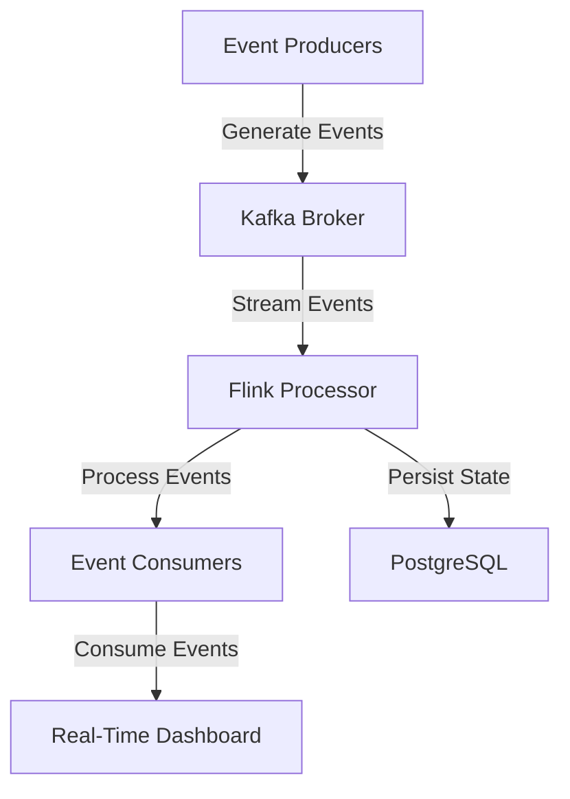

---

linkTitle: "18.3.1 Project Overview and Requirements"
title: "Project Overview and Requirements for Building a Sample Event-Driven System"
description: "Explore the comprehensive project overview and requirements for building a sample event-driven architecture system, focusing on real-time data processing, scalability, and resilience."
categories:
- Software Architecture
- Event-Driven Systems
- Real-Time Processing
tags:
- Event-Driven Architecture
- Real-Time Systems
- Scalability
- System Design
- Java
date: 2024-10-25
type: docs
nav_weight: 18310

---

## 18.3.1 Project Overview and Requirements

In this section, we will delve into the comprehensive overview and requirements for building a sample Event-Driven Architecture (EDA) system. This project aims to illustrate the practical implementation of EDA principles, focusing on real-time data processing, scalability, and resilience. We will define project goals, identify key stakeholders, gather functional and non-functional requirements, select an appropriate technology stack, define event schemas, plan the system architecture, and establish a project timeline with milestones.

### Define Project Goals

The primary objectives of our sample EDA project are as follows:

1. **Achieve Real-Time Data Processing:** The system should be capable of processing data in real-time, allowing for immediate insights and actions based on incoming events.

2. **Ensure Scalability:** The architecture must support horizontal scaling to handle increasing loads and accommodate future growth without significant re-engineering.

3. **Enhance System Resilience:** The system should be designed to withstand failures and recover gracefully, ensuring high availability and reliability.

4. **Enable Seamless Service Interactions:** Services within the system should interact efficiently, with minimal latency and maximum throughput, to provide a cohesive user experience.

### Identify Key Stakeholders

Key stakeholders involved in the project include:

- **Developers:** Responsible for implementing the system, writing code, and integrating components.
- **Architects:** Design the overall system architecture, ensuring alignment with project goals and best practices.
- **Operations Teams:** Manage the deployment, monitoring, and maintenance of the system, ensuring it runs smoothly in production.
- **End-Users:** The ultimate beneficiaries of the system, relying on its functionality for real-time insights and actions.

### Gather Functional Requirements

The functional requirements for the EDA system include:

- **Event Generation:** The system must support the generation of events from various sources, such as user actions, system logs, and external APIs.
- **Event Processing:** Events should be processed in real-time, with support for complex event processing and pattern detection.
- **Event Storage:** A reliable storage mechanism is required to persist events for auditing, replay, and analysis purposes.
- **Event Consumption:** The system must allow multiple consumers to subscribe to and process events, supporting different use cases and business logic.

### Determine Non-Functional Requirements

Non-functional requirements are critical for ensuring the system meets performance and operational standards:

- **Performance Metrics:** The system should achieve a throughput of at least 10,000 events per second with a latency of less than 100 milliseconds.
- **Scalability Needs:** The architecture must support scaling to accommodate 10x growth in event volume without degradation in performance.
- **Security Standards:** Data encryption, secure communication channels, and access controls must be implemented to protect sensitive information.
- **Compliance Obligations:** The system must adhere to relevant regulations, such as GDPR, ensuring data privacy and protection.

### Select Technology Stack

The technology stack for building the EDA system includes:

- **Kafka:** For event streaming and message brokering, providing a scalable and fault-tolerant platform for handling high-throughput data streams.
- **Flink:** For stream processing, enabling real-time analytics and complex event processing with low latency.
- **PostgreSQL:** For state storage, offering a robust and reliable database solution for persisting event data.
- **Terraform:** For infrastructure as code, facilitating automated and repeatable deployment of cloud resources.

### Define Event Schemas

Event schemas define the structure and data elements of each event type. For example, an event schema for a user purchase might include:

```json
{
  "eventType": "UserPurchase",
  "timestamp": "2024-10-25T14:30:00Z",
  "userId": "12345",
  "productId": "98765",
  "amount": 49.99,
  "currency": "USD"
}
```

These schemas must be designed to meet the needs of all event consumers and support future schema evolution.

### Plan System Architecture

The high-level system architecture is illustrated below, showing the interaction between components:



- **Event Producers:** Generate events from various sources.
- **Kafka Broker:** Streams events to consumers and processors.
- **Flink Processor:** Performs real-time event processing and analytics.
- **Event Consumers:** Subscribe to processed events for further action.
- **PostgreSQL:** Stores event data for auditing and analysis.

### Establish Project Timeline and Milestones

A detailed project timeline with specific milestones and deliverables is crucial for guiding the project's progress:

1. **Phase 1: Requirements Gathering and Design (2 weeks)**
   - Complete functional and non-functional requirements.
   - Finalize system architecture and event schemas.

2. **Phase 2: Development (4 weeks)**
   - Implement event producers, processors, and consumers.
   - Integrate Kafka, Flink, and PostgreSQL.

3. **Phase 3: Testing and Optimization (2 weeks)**
   - Conduct unit, integration, and performance testing.
   - Optimize system for scalability and resilience.

4. **Phase 4: Deployment and Monitoring (2 weeks)**
   - Deploy system to production environment.
   - Set up monitoring and alerting for ongoing operations.

### Example Project Description

Let's consider a hypothetical example of a sample EDA project: a real-time analytics dashboard for an online retail platform. The goals are to provide real-time insights into customer behavior, optimize inventory management, and enhance the shopping experience. The system will process events such as user clicks, purchases, and inventory updates, providing actionable insights to stakeholders.

By following the outlined project overview and requirements, you can effectively design and implement an EDA system that meets the needs of your organization and stakeholders.

## Quiz Time!



### What is the primary goal of the sample EDA project?

- [x] Achieve real-time data processing
- [ ] Reduce system costs
- [ ] Simplify user interfaces
- [ ] Minimize code complexity

> **Explanation:** The primary goal is to achieve real-time data processing, allowing for immediate insights and actions based on incoming events.

### Who are the key stakeholders in the EDA project?

- [x] Developers
- [x] Architects
- [x] Operations Teams
- [x] End-Users

> **Explanation:** All listed roles are key stakeholders involved in the project, each playing a crucial part in its success.

### Which technology is selected for event streaming in the project?

- [x] Kafka
- [ ] RabbitMQ
- [ ] ActiveMQ
- [ ] ZeroMQ

> **Explanation:** Kafka is selected for event streaming due to its scalability and fault-tolerant capabilities.

### What is the expected throughput performance metric for the EDA system?

- [x] 10,000 events per second
- [ ] 1,000 events per second
- [ ] 100,000 events per second
- [ ] 500 events per second

> **Explanation:** The system should achieve a throughput of at least 10,000 events per second.

### Which tool is used for infrastructure as code in the project?

- [x] Terraform
- [ ] Ansible
- [ ] Chef
- [ ] Puppet

> **Explanation:** Terraform is used for infrastructure as code, facilitating automated deployment of cloud resources.

### What is the purpose of defining event schemas?

- [x] To define the structure and data elements of each event type
- [ ] To reduce system latency
- [ ] To simplify code complexity
- [ ] To enhance user interfaces

> **Explanation:** Event schemas define the structure and data elements of each event type, ensuring clarity and consistency.

### What is the role of Flink in the technology stack?

- [x] Stream processing
- [ ] Event storage
- [ ] Message brokering
- [ ] Infrastructure management

> **Explanation:** Flink is used for stream processing, enabling real-time analytics and complex event processing.

### Which component is responsible for storing event data?

- [x] PostgreSQL
- [ ] Kafka
- [ ] Flink
- [ ] Terraform

> **Explanation:** PostgreSQL is used for state storage, providing a reliable database solution for persisting event data.

### What is the latency requirement for the EDA system?

- [x] Less than 100 milliseconds
- [ ] Less than 10 milliseconds
- [ ] Less than 1 second
- [ ] Less than 500 milliseconds

> **Explanation:** The system should achieve a latency of less than 100 milliseconds.

### True or False: The project timeline includes a phase for testing and optimization.

- [x] True
- [ ] False

> **Explanation:** The project timeline includes a phase for testing and optimization to ensure the system meets performance and operational standards.


