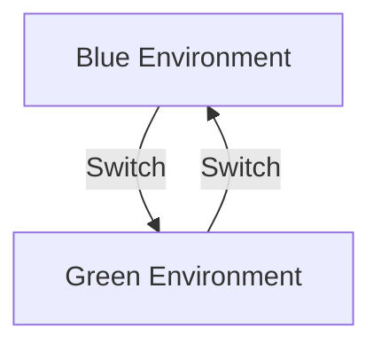

## 18.3.3 Testing and Deployment

In the realm of Event-Driven Architecture (EDA), testing and deployment are pivotal processes that ensure the reliability, scalability, and security of systems. This section delves into the methodologies and best practices for automating testing, setting up CI/CD pipelines, and deploying EDA systems efficiently and securely.

### Automate Testing Processes

Automated testing is the backbone of a robust EDA system. It ensures that changes do not introduce defects and that the system behaves as expected. Here’s how to implement automated testing effectively:

#### Unit Testing

Unit tests validate individual components, such as event handlers or message processors, in isolation. In Java, frameworks like JUnit and Mockito are commonly used.

```java
import org.junit.jupiter.api.Test;
import static org.mockito.Mockito.*;

public class EventHandlerTest {

    @Test
    public void testHandleEvent() {
        Event event = new Event("testEvent");
        EventHandler handler = mock(EventHandler.class);

        handler.handle(event);

        verify(handler).handle(event);
    }
}
```

#### Integration Testing

Integration tests ensure that different components of the EDA system work together seamlessly. This often involves testing interactions with message brokers like Kafka.

```java
import org.springframework.kafka.test.context.EmbeddedKafka;
import org.springframework.boot.test.context.SpringBootTest;

@SpringBootTest
@EmbeddedKafka(partitions = 1, topics = { "testTopic" })
public class KafkaIntegrationTest {

    @Test
    public void testKafkaMessageProcessing() {
        // Code to send and verify messages in Kafka
    }
}
```

#### End-to-End Testing

End-to-end tests simulate real-world scenarios, validating the entire workflow from event production to consumption. Tools like Selenium or Cypress can be used for UI-driven EDA systems.

### Use CI/CD Pipelines

Continuous Integration and Continuous Deployment (CI/CD) pipelines automate the build, test, and deployment processes, enabling rapid and reliable delivery of EDA systems.

#### Setting Up a CI/CD Pipeline

1. **Choose a CI/CD Tool:** Jenkins, GitHub Actions, and GitLab CI are popular choices.
2. **Define Pipeline Stages:** Typically include build, test, and deploy stages.
3. **Automate Testing:** Integrate automated tests into the pipeline to catch issues early.
4. **Deploy Automatically:** Use scripts or tools like Ansible or Terraform for deployment.

```yaml
name: CI/CD Pipeline

on: [push]

jobs:
  build:
    runs-on: ubuntu-latest
    steps:
      - uses: actions/checkout@v2
      - name: Set up JDK 11
        uses: actions/setup-java@v1
        with:
          java-version: '11'
      - name: Build with Maven
        run: mvn clean install

  deploy:
    runs-on: ubuntu-latest
    needs: build
    steps:
      - name: Deploy to Production
        run: ./deploy.sh
```

### Implement Grey/Gateway Deployments

Deployment strategies like canary releases, blue-green deployments, and feature toggles help mitigate risks associated with new releases.

#### Canary Releases

Deploy updates to a small subset of users before a full rollout. This allows for monitoring and feedback before wider deployment.

#### Blue-Green Deployments

Maintain two identical environments (blue and green). Deploy to one while the other serves production traffic, then switch.



### Monitor Deployment Health

Monitoring is crucial for detecting and resolving issues during and after deployment. Use tools like Prometheus, Grafana, or ELK Stack for real-time insights.

#### Key Metrics to Monitor

- **Latency and Throughput:** Measure event processing times and rates.
- **Error Rates:** Track failed events or messages.
- **Resource Utilization:** Monitor CPU, memory, and network usage.

### Rollback Mechanisms

Establishing rollback mechanisms ensures that you can revert to a stable state if a deployment fails.

#### Rollback Strategies

- **Version Control:** Use Git to revert code changes.
- **Database Backups:** Ensure data can be restored to a previous state.
- **Automated Scripts:** Use scripts to automate the rollback process.

### Automate Infrastructure Provisioning

Infrastructure as Code (IaC) tools like Terraform and AWS CloudFormation automate the provisioning and configuration of infrastructure, ensuring consistency across environments.

```hcl
resource "aws_instance" "web" {
  ami           = "ami-0c55b159cbfafe1f0"
  instance_type = "t2.micro"
}
```

### Ensure Security in Deployment

Security must be integrated into the deployment process to protect the EDA system from vulnerabilities.

#### Security Measures

- **Vulnerability Scanning:** Use tools like OWASP ZAP or Snyk.
- **Access Controls:** Implement role-based access controls.
- **Encryption:** Ensure data is encrypted in transit and at rest.

### Document Deployment Procedures

Comprehensive documentation ensures that deployment processes are repeatable and consistent.

#### Key Documentation Elements

- **Step-by-Step Guides:** Detailed instructions for each deployment step.
- **Troubleshooting Tips:** Common issues and solutions.
- **Configuration Instructions:** Details on environment-specific configurations.

### Example Deployment Processes

To illustrate these concepts, let’s walk through deploying a sample EDA system to a cloud environment using AWS and Jenkins.

1. **Set Up Jenkins Pipeline:** Configure Jenkins to automate build and deployment.
2. **Provision Infrastructure with Terraform:** Use Terraform scripts to set up AWS resources.
3. **Deploy Application:** Use Jenkins to deploy the application to AWS.
4. **Monitor Deployment:** Use CloudWatch for monitoring and alerts.

### Best Practices for Testing and Deployment

- **Maintain Automated Test Suites:** Ensure tests are comprehensive and up-to-date.
- **Use Reliable Deployment Tools:** Choose tools that integrate well with your tech stack.
- **Ensure Security Compliance:** Regularly review and update security practices.
- **Foster Collaboration:** Encourage communication between development and operations teams.

By following these guidelines, you can ensure that your EDA system is robust, scalable, and secure, ready to meet the demands of modern applications.

## Quiz Time!



### What is the primary purpose of automated testing in EDA?

- [x] To ensure the system remains reliable and free of defects
- [ ] To increase the complexity of the system
- [ ] To replace manual testing entirely
- [ ] To reduce the need for documentation

> **Explanation:** Automated testing helps maintain system reliability by catching defects early in the development process.

### Which CI/CD tool is NOT mentioned in the article?

- [ ] Jenkins
- [ ] GitHub Actions
- [ ] GitLab CI
- [x] CircleCI

> **Explanation:** CircleCI is a popular CI/CD tool, but it was not mentioned in the article.

### What is a key benefit of canary releases?

- [x] They allow for monitoring and feedback before a full rollout
- [ ] They require less infrastructure
- [ ] They eliminate the need for testing
- [ ] They are faster than other deployment strategies

> **Explanation:** Canary releases help identify issues by deploying updates to a small user subset before a full rollout.

### What tool can be used for infrastructure provisioning?

- [x] Terraform
- [ ] Jenkins
- [ ] Prometheus
- [ ] Selenium

> **Explanation:** Terraform is used for automating infrastructure provisioning.

### Which of the following is a rollback strategy?

- [x] Version Control
- [ ] Continuous Deployment
- [ ] Canary Releases
- [ ] Feature Toggles

> **Explanation:** Version control allows reverting code changes as a rollback strategy.

### What is the role of monitoring in deployment?

- [x] To detect and resolve issues during and after deployment
- [ ] To automate the deployment process
- [ ] To replace manual testing
- [ ] To increase system complexity

> **Explanation:** Monitoring helps identify and resolve issues that arise during and after deployment.

### Which tool is used for vulnerability scanning?

- [x] OWASP ZAP
- [ ] Terraform
- [ ] Jenkins
- [ ] Grafana

> **Explanation:** OWASP ZAP is a tool used for vulnerability scanning.

### What is the benefit of Infrastructure as Code (IaC)?

- [x] Ensures consistency across environments
- [ ] Increases manual configuration
- [ ] Reduces the need for monitoring
- [ ] Eliminates the need for documentation

> **Explanation:** IaC ensures consistency and repeatability across different environments.

### Which of the following is NOT a key metric to monitor?

- [ ] Latency and Throughput
- [ ] Error Rates
- [ ] Resource Utilization
- [x] Code Complexity

> **Explanation:** Code complexity is not a key metric for monitoring deployment health.

### True or False: Security should be integrated into the deployment process.

- [x] True
- [ ] False

> **Explanation:** Integrating security into the deployment process helps protect the system from vulnerabilities.


