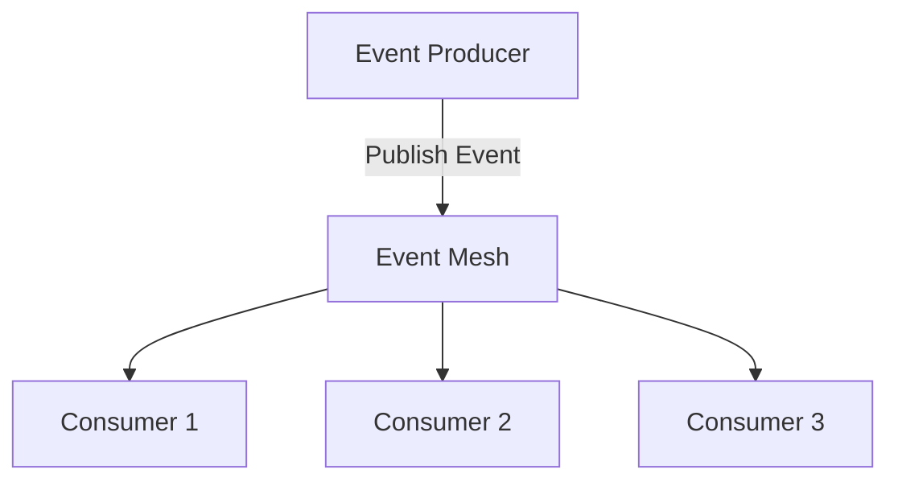

## 18.4.1 Emerging Trends in Event-Driven Architecture

As the landscape of software architecture continues to evolve, Event-Driven Architecture (EDA) is at the forefront of innovation, adapting to meet the demands of modern applications. This section explores the emerging trends in EDA, highlighting how these advancements are shaping the future of reactive systems.

### Adoption of Event Meshes

Event meshes are gaining traction as a decentralized, scalable, and flexible event routing infrastructure. They enable seamless event flow across multi-cloud and hybrid environments, addressing the need for distributed systems to communicate efficiently.

#### What is an Event Mesh?

An event mesh is a network of interconnected event brokers that dynamically route events between producers and consumers, regardless of their location. This architecture supports real-time event distribution across different environments, such as on-premises, cloud, and edge.

#### Benefits of Event Meshes

- **Scalability:** Event meshes can scale horizontally, accommodating growing event volumes without a single point of failure.
- **Flexibility:** They provide a flexible infrastructure that adapts to changing business needs, supporting diverse event-driven applications.
- **Decentralization:** By decentralizing event routing, event meshes eliminate bottlenecks and improve system resilience.

#### Practical Example

Consider a global e-commerce platform that uses an event mesh to synchronize inventory updates across multiple regions. As products are sold, events are routed through the mesh to update stock levels in real-time, ensuring consistency and availability.



### Integration with AI and ML

Integrating Artificial Intelligence (AI) and Machine Learning (ML) into EDA enhances the system's capabilities by automating event classification, predictive analytics, and intelligent event processing.

#### AI and ML in EDA

- **Event Classification:** AI models can classify events based on patterns, enabling automated decision-making.
- **Predictive Analytics:** ML algorithms analyze historical event data to predict future trends and anomalies.
- **Intelligent Processing:** AI-driven systems can process events in real-time, optimizing workflows and resource allocation.

#### Java Code Example: Predictive Analytics

```java
import org.apache.kafka.clients.consumer.ConsumerRecord;
import org.apache.kafka.clients.consumer.KafkaConsumer;
import org.apache.kafka.clients.consumer.ConsumerRecords;
import java.util.Collections;
import java.util.Properties;

public class PredictiveAnalyticsConsumer {
    public static void main(String[] args) {
        Properties props = new Properties();
        props.put("bootstrap.servers", "localhost:9092");
        props.put("group.id", "analytics-group");
        props.put("enable.auto.commit", "true");
        props.put("key.deserializer", "org.apache.kafka.common.serialization.StringDeserializer");
        props.put("value.deserializer", "org.apache.kafka.common.serialization.StringDeserializer");

        KafkaConsumer<String, String> consumer = new KafkaConsumer<>(props);
        consumer.subscribe(Collections.singletonList("events"));

        while (true) {
            ConsumerRecords<String, String> records = consumer.poll(100);
            for (ConsumerRecord<String, String> record : records) {
                // Process event and apply predictive analytics
                String eventData = record.value();
                // Assume processEvent is a method that applies ML models
                processEvent(eventData);
            }
        }
    }

    private static void processEvent(String eventData) {
        // Implement ML model logic here
        System.out.println("Processing event for predictive insights: " + eventData);
    }
}
```

### Serverless Architectures

The shift towards serverless architectures in EDA is transforming how event-driven workloads are processed, offering automatic scaling, reduced operational overhead, and cost efficiency.

#### Advantages of Serverless EDA

- **Automatic Scaling:** Serverless platforms automatically scale resources based on demand, ensuring optimal performance.
- **Reduced Overhead:** Developers focus on writing code without managing infrastructure, reducing operational complexity.
- **Cost Efficiency:** Pay-per-use pricing models minimize costs, as resources are allocated only when needed.

#### Real-World Scenario

A financial services company uses serverless functions to process transaction events. As the volume of transactions fluctuates, the serverless platform scales automatically, maintaining performance and minimizing costs.

### Enhanced Security Practices

As EDA systems become more complex, enhanced security practices are essential to address evolving threat landscapes. This includes zero-trust architectures, automated security tooling, and advanced encryption methods.

#### Key Security Enhancements

- **Zero-Trust Architecture:** Enforces strict identity verification for every event, ensuring secure access.
- **Automated Security Tooling:** Integrates security checks into the development pipeline, detecting vulnerabilities early.
- **Advanced Encryption:** Protects event data in transit and at rest, safeguarding sensitive information.

### Real-Time Analytics and BI Integration

The integration of EDA with real-time analytics and business intelligence (BI) tools allows organizations to derive actionable insights and make data-driven decisions instantly.

#### Benefits of Real-Time Analytics

- **Immediate Insights:** Access to real-time data enables quick decision-making and responsiveness to market changes.
- **Enhanced BI Capabilities:** Seamless integration with BI tools provides comprehensive data analysis and visualization.

### Edge and Fog Computing Enhancements

Enhancements in edge and fog computing are driving the evolution of EDA by enabling more distributed and efficient event processing closer to data sources and devices.

#### Advantages of Edge and Fog Computing

- **Reduced Latency:** Processing events at the edge minimizes latency, improving response times.
- **Efficient Resource Utilization:** Distributes processing workloads, optimizing resource usage and reducing bandwidth.

### Interoperability and Standardization

Interoperability and the adoption of standardized event formats and protocols are crucial for seamless integration between diverse EDA components and platforms.

#### Importance of Standardization

- **Facilitates Integration:** Standardized protocols ensure compatibility between different systems and technologies.
- **Promotes Innovation:** Encourages the development of interoperable solutions, fostering innovation and collaboration.

### Event Streaming as a Service

The rise of managed event streaming services provides scalable, secure, and fully managed EDA solutions, simplifying the adoption and maintenance of event-driven systems.

#### Benefits of Event Streaming Services

- **Scalability:** Managed services handle scaling, allowing organizations to focus on application logic.
- **Security:** Built-in security features protect data and ensure compliance with regulations.
- **Ease of Use:** Simplifies setup and management, reducing the barrier to entry for EDA adoption.

### Example Future Trends

Leading organizations are adopting these emerging trends to enhance their EDA systems. For instance, a logistics company leverages event meshes for real-time tracking, while a healthcare provider uses AI-driven analytics to improve patient outcomes.

### Conclusion

The future of Event-Driven Architecture is bright, with emerging trends offering new opportunities for innovation and efficiency. By embracing these advancements, organizations can build more responsive, scalable, and intelligent systems, positioning themselves for success in a rapidly changing technological landscape.

## Quiz Time!



### What is an event mesh?

- [x] A network of interconnected event brokers for dynamic event routing
- [ ] A centralized event processing system
- [ ] A type of database for storing events
- [ ] A programming language for event-driven applications

> **Explanation:** An event mesh is a network of interconnected event brokers that dynamically route events between producers and consumers, supporting real-time distribution across different environments.

### How can AI and ML enhance EDA?

- [x] By automating event classification
- [x] By providing predictive analytics
- [ ] By reducing event size
- [ ] By eliminating the need for event brokers

> **Explanation:** AI and ML can automate event classification and provide predictive analytics, enhancing the capabilities of EDA systems.

### What is a key advantage of serverless architectures in EDA?

- [x] Automatic scaling
- [ ] Manual resource allocation
- [ ] Increased operational overhead
- [ ] Fixed pricing models

> **Explanation:** Serverless architectures offer automatic scaling, reducing operational overhead and providing cost-efficient processing.

### What is a zero-trust architecture?

- [x] A security model that enforces strict identity verification
- [ ] A network protocol for event routing
- [ ] A method for optimizing event storage
- [ ] A type of encryption algorithm

> **Explanation:** Zero-trust architecture enforces strict identity verification for every event, ensuring secure access.

### What is the benefit of integrating EDA with real-time analytics?

- [x] Immediate insights for quick decision-making
- [ ] Delayed data processing
- [ ] Increased latency
- [ ] Reduced data accuracy

> **Explanation:** Integrating EDA with real-time analytics provides immediate insights, enabling quick decision-making and responsiveness to market changes.

### How does edge computing enhance EDA?

- [x] By reducing latency through local event processing
- [ ] By centralizing event processing
- [ ] By increasing bandwidth usage
- [ ] By eliminating the need for cloud services

> **Explanation:** Edge computing enhances EDA by reducing latency through local event processing, improving response times.

### Why is interoperability important in EDA?

- [x] It facilitates integration between diverse systems
- [ ] It increases system complexity
- [ ] It limits the use of standardized protocols
- [ ] It reduces innovation

> **Explanation:** Interoperability facilitates integration between diverse systems, ensuring compatibility and promoting innovation.

### What is a benefit of event streaming as a service?

- [x] Simplified setup and management
- [ ] Increased operational complexity
- [ ] Manual scaling requirements
- [ ] Lack of security features

> **Explanation:** Event streaming as a service simplifies setup and management, providing scalable and secure EDA solutions.

### Which of the following is an example of a managed event streaming service?

- [x] AWS Kinesis
- [ ] Apache Kafka (self-managed)
- [ ] MySQL
- [ ] Redis

> **Explanation:** AWS Kinesis is an example of a managed event streaming service, offering scalable and secure solutions.

### True or False: Event meshes are centralized systems.

- [ ] True
- [x] False

> **Explanation:** Event meshes are decentralized systems that provide scalable and flexible event routing infrastructure.


