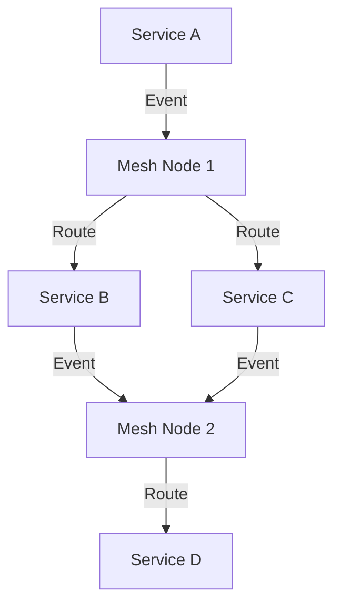

## 19.1.2 Highlights of Architectural Patterns

In the realm of Event-Driven Architecture (EDA), several architectural patterns have emerged as foundational elements for building robust, scalable, and responsive systems. These patterns not only address specific challenges but also enhance the overall architecture by promoting best practices and efficient design principles. This section delves into the key architectural patterns that have been instrumental in shaping modern event-driven systems.

### Event Sourcing

Event Sourcing is a powerful pattern that captures all changes to an application's state as a sequence of events. This approach offers several advantages:

- **Complete Audit Trails:** By storing every state change as an event, Event Sourcing provides a comprehensive audit trail. This is particularly beneficial in industries where compliance and traceability are critical, such as finance and healthcare.

- **State Reconstruction:** The ability to reconstruct the current state of an application by replaying events is a significant advantage. This allows for easy debugging and testing, as well as the ability to "time travel" to past states for analysis.

- **Flexibility and Adaptability:** Event Sourcing decouples the state from the application logic, enabling flexibility in how the state is interpreted and used. This can facilitate easier refactoring and adaptation to new requirements.

Here's a simple Java example using a hypothetical Event Sourcing library:

```java
public class Account {
    private List<Event> changes = new ArrayList<>();

    public void deposit(double amount) {
        applyChange(new MoneyDepositedEvent(amount));
    }

    public void withdraw(double amount) {
        applyChange(new MoneyWithdrawnEvent(amount));
    }

    private void applyChange(Event event) {
        changes.add(event);
        // Apply the event to the current state
        // ...
    }

    public List<Event> getChanges() {
        return changes;
    }
}
```

In this example, each operation on the `Account` results in an event being recorded, which can later be replayed to reconstruct the account's state.

### CQRS (Command Query Responsibility Segregation)

CQRS is a pattern that separates the command (write) and query (read) responsibilities of a system. This separation offers several benefits:

- **Optimized Performance:** By segregating read and write operations, CQRS allows each to be optimized independently. This can lead to significant performance improvements, especially in systems with high read-to-write ratios.

- **Scalability:** CQRS enables the independent scaling of query and command models, allowing systems to handle large volumes of data and requests more efficiently.

- **Flexibility in Data Models:** Different data models can be used for reading and writing, allowing for more efficient data structures tailored to specific use cases.

Here's a basic example illustrating CQRS in Java:

```java
// Command Model
public class CreateOrderCommand {
    private String orderId;
    private List<String> items;
    // Constructor, getters, and setters
}

// Query Model
public class OrderQueryService {
    public OrderDetails getOrderDetails(String orderId) {
        // Retrieve order details from the read database
        return new OrderDetails();
    }
}
```

In this example, the `CreateOrderCommand` is used to handle write operations, while the `OrderQueryService` is responsible for read operations.

### Saga Pattern

The Saga Pattern is essential for managing distributed transactions across microservices. It breaks down a transaction into a series of smaller, local transactions, each with its own compensating action in case of failure. This ensures data consistency without the need for a traditional two-phase commit.

- **Data Consistency:** Sagas ensure that all involved services reach a consistent state, even in the event of failures.

- **Resilience:** By handling failures through compensating actions, Sagas enhance the resilience of distributed systems.

- **Scalability:** Sagas allow distributed transactions to scale across multiple services without bottlenecking on a central coordinator.

Consider this example of a Saga in a travel booking system:

```java
public class TravelBookingSaga {
    public void bookTrip() {
        try {
            bookFlight();
            bookHotel();
            bookCarRental();
        } catch (Exception e) {
            compensate();
        }
    }

    private void bookFlight() {
        // Flight booking logic
    }

    private void bookHotel() {
        // Hotel booking logic
    }

    private void bookCarRental() {
        // Car rental booking logic
    }

    private void compensate() {
        // Compensating actions to undo bookings
    }
}
```

In this example, if any part of the trip booking fails, the `compensate` method is called to roll back the changes.

### Publish-Subscribe

The Publish-Subscribe pattern decouples services by allowing multiple subscribers to react to published events. This pattern is foundational in EDA, facilitating flexible and scalable event handling.

- **Decoupling:** Publishers and subscribers are loosely coupled, allowing for independent development and deployment.

- **Scalability:** Multiple subscribers can process events concurrently, enhancing system scalability.

- **Flexibility:** New subscribers can be added without modifying existing publishers.

Here's a simple Java example using a publish-subscribe mechanism:

```java
public interface EventListener {
    void onEvent(Event event);
}

public class EventPublisher {
    private List<EventListener> listeners = new ArrayList<>();

    public void subscribe(EventListener listener) {
        listeners.add(listener);
    }

    public void publish(Event event) {
        for (EventListener listener : listeners) {
            listener.onEvent(event);
        }
    }
}
```

In this example, `EventPublisher` allows multiple `EventListener` instances to subscribe and react to published events.

### Event Mesh

The Event Mesh pattern is an emerging concept that provides a decentralized, dynamic event routing infrastructure. It enhances flexibility and scalability across multi-cloud and hybrid environments.

- **Dynamic Routing:** Events can be routed dynamically based on content, context, or other criteria.

- **Decentralization:** Unlike traditional centralized brokers, an Event Mesh can operate across distributed environments.

- **Interoperability:** Supports seamless communication across different platforms and technologies.

Here's a conceptual diagram of an Event Mesh:



### Domain-Driven Design (DDD)

Domain-Driven Design (DDD) aligns service boundaries with business domains, ensuring that each microservice encapsulates specific business capabilities within the EDA.

- **Business Alignment:** Services are designed around business concepts, leading to clearer and more maintainable architectures.

- **Bounded Contexts:** DDD emphasizes the use of bounded contexts to manage complexity and ensure consistency within each domain.

- **Ubiquitous Language:** Promotes a common language between developers and business stakeholders, reducing misunderstandings.

### Stream Processing

Stream Processing frameworks like Apache Flink and Kafka Streams are crucial for handling real-time event data, enabling immediate analysis and action.

- **Real-Time Processing:** Allows for the processing of data as it arrives, enabling timely insights and actions.

- **Scalability:** Stream processing frameworks are designed to handle large volumes of data efficiently.

- **Complex Event Processing:** Supports advanced operations like windowing, aggregations, and joins.

Here's a basic example using Kafka Streams in Java:

```java
StreamsBuilder builder = new StreamsBuilder();
KStream<String, String> stream = builder.stream("input-topic");
KStream<String, String> transformedStream = stream.mapValues(value -> value.toUpperCase());
transformedStream.to("output-topic");
KafkaStreams streams = new KafkaStreams(builder.build(), new Properties());
streams.start();
```

In this example, a Kafka Streams application reads from an input topic, transforms the data, and writes to an output topic.

### Security Patterns

Security is paramount in EDA, and several patterns are implemented to ensure secure and compliant event processing:

- **Encryption:** Protects event data both in transit and at rest.

- **Authentication and Authorization:** Ensures that only authorized entities can publish or consume events.

- **Audit Logging:** Provides a record of all events and actions, supporting compliance and forensic analysis.

Implementing these security measures requires careful planning and execution to balance security with performance and usability.

## Quiz Time!



### What is a primary benefit of Event Sourcing?

- [x] Complete audit trails and state reconstruction
- [ ] Simplified data models
- [ ] Reduced storage requirements
- [ ] Faster query performance

> **Explanation:** Event Sourcing captures all changes to application state as events, providing a complete audit trail and enabling state reconstruction.

### How does CQRS improve system performance?

- [x] By separating read and write operations
- [ ] By using a single database for all operations
- [ ] By reducing the number of services
- [ ] By combining command and query models

> **Explanation:** CQRS separates read and write operations, allowing each to be optimized independently, improving performance.

### What is the role of the Saga Pattern?

- [x] Managing distributed transactions with local transactions and compensating actions
- [ ] Simplifying data storage
- [ ] Enhancing user interfaces
- [ ] Reducing network latency

> **Explanation:** The Saga Pattern manages distributed transactions by breaking them into local transactions with compensating actions to ensure consistency.

### What is a key feature of the Publish-Subscribe pattern?

- [x] Decoupling services by allowing multiple subscribers to react to published events
- [ ] Centralizing event processing
- [ ] Reducing the number of events
- [ ] Simplifying service deployment

> **Explanation:** Publish-Subscribe decouples services, allowing multiple subscribers to react to events, enhancing flexibility and scalability.

### What does the Event Mesh pattern provide?

- [x] A decentralized, dynamic event routing infrastructure
- [ ] A centralized event processing hub
- [ ] A simplified data model
- [ ] A single point of failure

> **Explanation:** The Event Mesh pattern provides a decentralized, dynamic event routing infrastructure, enhancing flexibility and scalability.

### How does Domain-Driven Design (DDD) benefit EDA?

- [x] By aligning service boundaries with business domains
- [ ] By reducing the number of services
- [ ] By centralizing data storage
- [ ] By simplifying user interfaces

> **Explanation:** DDD aligns service boundaries with business domains, ensuring each microservice encapsulates specific business capabilities.

### What is a key advantage of stream processing frameworks?

- [x] Real-time processing of event data
- [ ] Simplified data storage
- [ ] Reduced network traffic
- [ ] Centralized event management

> **Explanation:** Stream processing frameworks enable real-time processing of event data, allowing for immediate analysis and action.

### Which security measure is crucial for protecting event data?

- [x] Encryption
- [ ] Reducing the number of events
- [ ] Simplifying data models
- [ ] Centralizing event processing

> **Explanation:** Encryption is crucial for protecting event data both in transit and at rest, ensuring secure processing.

### What is a benefit of using bounded contexts in DDD?

- [x] Managing complexity and ensuring consistency within each domain
- [ ] Reducing the number of services
- [ ] Centralizing data storage
- [ ] Simplifying user interfaces

> **Explanation:** Bounded contexts help manage complexity and ensure consistency within each domain, aligning with business concepts.

### True or False: The Saga Pattern requires a traditional two-phase commit to ensure consistency.

- [ ] True
- [x] False

> **Explanation:** False. The Saga Pattern manages distributed transactions without a traditional two-phase commit, using local transactions and compensating actions instead.


