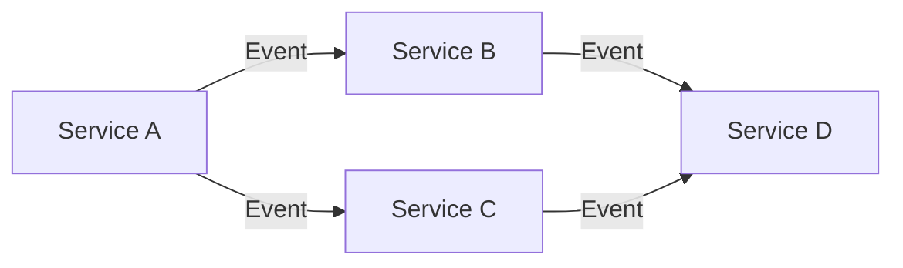

## 19.1.3 Essential Best Practices

In the realm of Event-Driven Architecture (EDA), adhering to best practices is crucial for building systems that are not only scalable and efficient but also secure and maintainable. This section delves into the essential best practices that form the backbone of successful EDA implementations. By following these guidelines, architects and developers can ensure that their systems are robust, flexible, and capable of handling the complexities of modern software environments.

### Design for Scalability

Scalability is a cornerstone of EDA, enabling systems to handle increasing loads without compromising performance. Here are key strategies to achieve scalability:

- **Microservices Architecture**: Break down applications into smaller, independent services that can be developed, deployed, and scaled independently. This approach allows for targeted scaling of specific services based on demand.

- **Partitioned Event Brokers**: Use partitioned message brokers like Apache Kafka to distribute event processing across multiple nodes. This setup enhances throughput and ensures that the system can handle high volumes of events efficiently.

- **Distributed Processing**: Leverage distributed processing frameworks such as Apache Flink or Kafka Streams to process events in parallel across a cluster of machines. This approach maximizes resource utilization and reduces processing time.

#### Example: Scaling with Kafka

```java
import org.apache.kafka.clients.producer.KafkaProducer;
import org.apache.kafka.clients.producer.ProducerConfig;
import org.apache.kafka.clients.producer.ProducerRecord;
import org.apache.kafka.common.serialization.StringSerializer;

import java.util.Properties;

public class KafkaEventProducer {
    public static void main(String[] args) {
        Properties props = new Properties();
        props.put(ProducerConfig.BOOTSTRAP_SERVERS_CONFIG, "localhost:9092");
        props.put(ProducerConfig.KEY_SERIALIZER_CLASS_CONFIG, StringSerializer.class.getName());
        props.put(ProducerConfig.VALUE_SERIALIZER_CLASS_CONFIG, StringSerializer.class.getName());

        KafkaProducer<String, String> producer = new KafkaProducer<>(props);

        for (int i = 0; i < 1000; i++) {
            ProducerRecord<String, String> record = new ProducerRecord<>("my-topic", "key-" + i, "value-" + i);
            producer.send(record);
        }

        producer.close();
    }
}
```

In this Java example, a Kafka producer is configured to send a large number of events to a Kafka topic. By partitioning the topic, Kafka can distribute the load across multiple brokers, enhancing scalability.

### Ensure Idempotency

Idempotency is critical in EDA to ensure that duplicate events do not lead to inconsistent states or unintended side effects. Here’s how to design idempotent systems:

- **Idempotent Event Handlers**: Design event handlers to produce the same result regardless of how many times they process the same event. This can be achieved by checking if an event has already been processed before applying any changes.

- **Unique Identifiers**: Use unique identifiers for events to track their processing status. This allows the system to recognize and ignore duplicate events.

#### Example: Idempotent Event Handler

```java
import java.util.HashSet;
import java.util.Set;

public class IdempotentHandler {
    private Set<String> processedEventIds = new HashSet<>();

    public void handleEvent(Event event) {
        if (processedEventIds.contains(event.getId())) {
            return; // Event already processed
        }
        // Process the event
        processedEventIds.add(event.getId());
    }
}
```

In this example, a simple Java class uses a `Set` to track processed event IDs, ensuring that each event is handled only once.

### Maintain Loose Coupling

Loose coupling between components is essential for flexibility and independent evolution of services. Here’s how to achieve it:

- **Event-Driven Communication**: Use events as the primary means of communication between services. This decouples the sender and receiver, allowing them to evolve independently.

- **Service Interfaces**: Define clear interfaces for services to interact with each other. This abstraction layer helps in minimizing dependencies and facilitates easier changes.

#### Diagram: Loose Coupling in EDA



This diagram illustrates how services communicate through events, maintaining loose coupling and allowing independent scaling and updates.

### Implement Robust Security Measures

Security is paramount in EDA to protect sensitive data and ensure system integrity. Key practices include:

- **Encryption**: Encrypt event data both in transit and at rest to prevent unauthorized access.

- **Authentication and Authorization**: Implement strong authentication mechanisms and enforce role-based access control to ensure that only authorized entities can produce or consume events.

- **Continuous Monitoring**: Use monitoring tools to detect and respond to security threats in real-time.

### Utilize Schema Management

Effective schema management is crucial for maintaining data consistency and supporting schema evolution:

- **Versioning**: Use versioned schemas to manage changes over time without breaking existing consumers.

- **Compatibility Checks**: Ensure backward and forward compatibility of schemas to prevent disruptions during updates.

- **Centralized Schema Registry**: Use a centralized schema registry to manage and distribute schemas across services.

#### Example: Schema Management with Avro

```java
import org.apache.avro.Schema;
import org.apache.avro.SchemaBuilder;

public class AvroSchemaExample {
    public static void main(String[] args) {
        Schema schema = SchemaBuilder.record("User")
                .fields()
                .requiredString("name")
                .optionalInt("age")
                .endRecord();

        System.out.println("Schema: " + schema.toString(true));
    }
}
```

This Java example demonstrates how to define an Avro schema for a `User` record, supporting both required and optional fields.

### Leverage Real-Time Monitoring and Observability

Monitoring and observability are critical for maintaining system health and performance:

- **Key Performance Metrics**: Track metrics such as event throughput, latency, and error rates to ensure optimal performance.

- **Real-Time Monitoring Tools**: Use tools like Prometheus and Grafana to visualize and alert on key metrics.

- **Proactive Troubleshooting**: Implement logging and tracing to quickly identify and resolve issues.

### Adhere to Event Sourcing and CQRS Principles

Event Sourcing and CQRS provide a robust framework for managing data consistency and performance:

- **Event Sourcing**: Store all changes to application state as a sequence of events, enabling full auditability and state reconstruction.

- **CQRS**: Separate read and write operations to optimize performance and scalability.

#### Example: Event Sourcing with Java

```java
import java.util.ArrayList;
import java.util.List;

public class EventSourcedEntity {
    private List<Event> eventStore = new ArrayList<>();

    public void applyEvent(Event event) {
        eventStore.add(event);
        // Apply event to current state
    }

    public List<Event> getEventStore() {
        return eventStore;
    }
}
```

This Java example shows a simple event-sourced entity that stores events and applies them to maintain state.

### Foster Continuous Improvement

Continuous improvement is vital for adapting to changing requirements and technologies:

- **Regular Reviews**: Conduct regular reviews of EDA implementations to identify areas for improvement.

- **Stay Updated**: Keep abreast of emerging trends and technologies in EDA to incorporate new capabilities.

- **Incorporate Feedback**: Use feedback from monitoring and testing to refine and enhance system performance.

By adhering to these best practices, architects and developers can build event-driven systems that are not only efficient and scalable but also secure and adaptable to future needs.

## Quiz Time!



### What is a key benefit of using microservices in an event-driven architecture?

- [x] Independent scaling of services
- [ ] Increased complexity
- [ ] Reduced security
- [ ] Tight coupling of components

> **Explanation:** Microservices allow independent scaling of services, which is a key benefit in an event-driven architecture.

### How can idempotency be achieved in event handlers?

- [x] By using unique identifiers for events
- [ ] By processing events multiple times
- [ ] By ignoring event order
- [ ] By storing events in a database

> **Explanation:** Idempotency can be achieved by using unique identifiers to track processed events, ensuring each event is handled only once.

### What is the purpose of using a centralized schema registry?

- [x] To manage and distribute schemas across services
- [ ] To increase system complexity
- [ ] To store event data
- [ ] To enforce security policies

> **Explanation:** A centralized schema registry is used to manage and distribute schemas, ensuring consistency across services.

### Which tool can be used for real-time monitoring of event-driven systems?

- [x] Prometheus
- [ ] Apache Kafka
- [ ] Java
- [ ] Avro

> **Explanation:** Prometheus is a tool used for real-time monitoring of systems, including event-driven architectures.

### What is a key principle of CQRS?

- [x] Separating read and write operations
- [ ] Combining read and write operations
- [ ] Storing data in a single database
- [ ] Using synchronous communication

> **Explanation:** CQRS separates read and write operations to optimize performance and scalability.

### Why is encryption important in event-driven architectures?

- [x] To protect event data from unauthorized access
- [ ] To increase processing speed
- [ ] To simplify schema management
- [ ] To enhance idempotency

> **Explanation:** Encryption is important to protect event data from unauthorized access, ensuring data security.

### What is the benefit of using partitioned event brokers like Kafka?

- [x] Enhanced throughput and scalability
- [ ] Simplified schema management
- [ ] Reduced event processing
- [ ] Increased latency

> **Explanation:** Partitioned event brokers like Kafka enhance throughput and scalability by distributing event processing across multiple nodes.

### How can loose coupling be achieved in event-driven systems?

- [x] By using events as the primary means of communication
- [ ] By tightly integrating services
- [ ] By using synchronous communication
- [ ] By sharing databases

> **Explanation:** Loose coupling is achieved by using events for communication, allowing services to evolve independently.

### What is a key advantage of event sourcing?

- [x] Full auditability and state reconstruction
- [ ] Increased complexity
- [ ] Reduced performance
- [ ] Synchronous processing

> **Explanation:** Event sourcing provides full auditability and allows for state reconstruction, which are key advantages.

### True or False: Continuous improvement in EDA involves staying updated with emerging trends.

- [x] True
- [ ] False

> **Explanation:** Continuous improvement involves staying updated with emerging trends to incorporate new capabilities and improve system performance.


