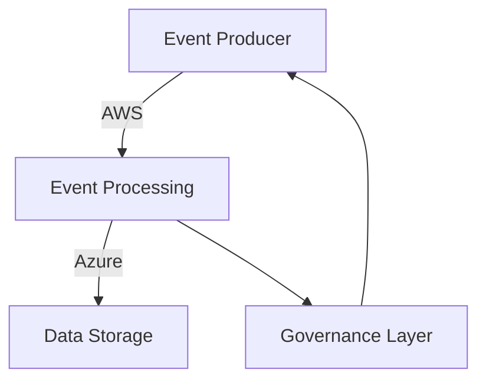
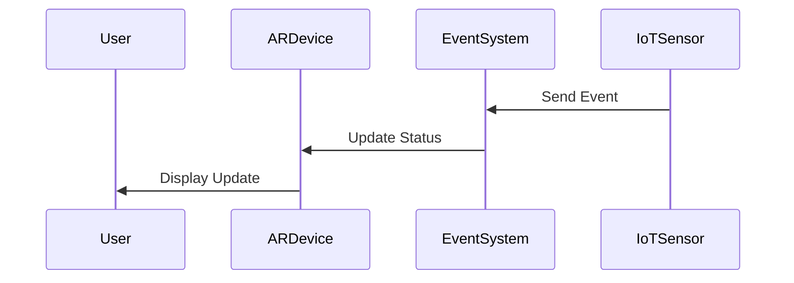

---

linkTitle: "19.2.3 Advanced Topics to Explore"
title: "Advanced Topics in Event-Driven Architecture: Exploring Future Directions"
description: "Explore advanced topics in Event-Driven Architecture, including event mesh architectures, blockchain integration, edge AI, and more. Delve into the future of EDA with practical examples and insights."
categories:
- Event-Driven Architecture
- Software Engineering
- Advanced Technologies
tags:
- Event Mesh
- Reactive Programming
- Blockchain
- Edge AI
- Multi-Cloud
- Security
- Serverless
- Quantum Computing
- AR/VR
date: 2024-10-25
type: docs
nav_weight: 1923000
---

## 19.2.3 Advanced Topics to Explore

As you continue your journey into the world of Event-Driven Architecture (EDA), it's essential to explore advanced topics that push the boundaries of traditional systems. This section delves into cutting-edge areas that are shaping the future of EDA, offering insights into how these innovations can be leveraged to build more robust, scalable, and intelligent systems.

### Event Mesh Architectures

Event mesh architectures represent a significant evolution in the way events are routed and processed across distributed systems. By enabling dynamic and decentralized event routing, event meshes enhance flexibility and scalability, making them ideal for complex environments.

#### Key Concepts

- **Dynamic Routing:** Event meshes allow for real-time event routing decisions based on current system conditions, enabling more efficient use of resources.
- **Decentralization:** Unlike traditional centralized brokers, event meshes distribute the event processing load across multiple nodes, reducing bottlenecks and single points of failure.

#### Practical Example

Consider a global e-commerce platform that needs to process events from various regions. An event mesh can dynamically route events to the nearest processing node, reducing latency and improving user experience.

```java
// Example of dynamic event routing using a hypothetical EventMesh library
EventMesh mesh = new EventMesh();
mesh.addNode(new EventNode("US-East"));
mesh.addNode(new EventNode("EU-West"));

Event event = new Event("OrderPlaced", payload);
mesh.routeEvent(event); // Automatically routes to the optimal node
```

### Reactive Programming Extensions

Reactive programming is a cornerstone of modern EDA, offering a paradigm for building responsive and resilient systems. Advanced reactive programming concepts extend these principles to more sophisticated implementations.

#### Advanced Concepts

- **Backpressure Management:** Handling data flow control to prevent overwhelming consumers.
- **Reactive Streams:** Implementing non-blocking data streams that can handle asynchronous data processing efficiently.

#### Java Example with Project Reactor

```java
import reactor.core.publisher.Flux;

Flux<String> eventStream = Flux.just("Event1", "Event2", "Event3")
    .doOnNext(event -> System.out.println("Processing: " + event))
    .onBackpressureBuffer();

eventStream.subscribe(System.out::println);
```

### Blockchain Integration with EDA

Integrating blockchain technology with EDA provides secure, immutable, and transparent event logging, enhancing trust and accountability.

#### Use Cases

- **Secure Event Logging:** Blockchain can ensure that event logs are tamper-proof, which is crucial for auditing and compliance.
- **Decentralized Event Processing:** Smart contracts can automate event-driven workflows without a central authority.

#### Example Scenario

In a financial system, blockchain can be used to log transactions as events, ensuring that all parties have a consistent and immutable record.

```java
// Pseudocode for logging an event to a blockchain
Blockchain blockchain = new Blockchain();
Event transactionEvent = new Event("Transaction", transactionDetails);
blockchain.logEvent(transactionEvent);
```

### Edge AI in EDA

The convergence of AI and EDA at the edge enables intelligent and autonomous event processing close to data sources, reducing latency and bandwidth usage.

#### Benefits

- **Real-Time Insights:** AI models can process events in real-time, providing immediate insights and actions.
- **Autonomous Decision-Making:** Edge devices can make decisions without relying on centralized systems.

#### Example: AI-Powered Anomaly Detection

In an IoT setup, edge devices can use AI to detect anomalies in sensor data and trigger events for further analysis.

```java
// Pseudocode for edge AI anomaly detection
EdgeDevice device = new EdgeDevice();
device.setAIModel(new AnomalyDetectionModel());

SensorData data = device.collectData();
if (device.detectAnomaly(data)) {
    Event anomalyEvent = new Event("AnomalyDetected", data);
    device.sendEvent(anomalyEvent);
}
```

### Multi-Cloud and Hybrid EDA Solutions

Designing multi-cloud and hybrid EDA solutions involves addressing challenges related to interoperability, data consistency, and centralized governance.

#### Strategies

- **Interoperability:** Use standardized protocols and APIs to ensure seamless integration across cloud providers.
- **Data Consistency:** Implement eventual consistency models to manage data across distributed environments.

#### Example Architecture

A hybrid EDA solution might use AWS for event processing and Azure for data storage, with a central governance layer ensuring policy compliance.



### Advanced Security Mechanisms

As EDA systems become more complex, advanced security mechanisms are essential to protect data and ensure system integrity.

#### Key Techniques

- **Zero-Trust Architectures:** Assume no implicit trust and verify every request.
- **Automated Threat Detection:** Use AI to identify and respond to threats in real-time.

#### Example Security Implementation

Implementing a zero-trust model in an EDA system involves authenticating every event and ensuring secure communication channels.

```java
// Pseudocode for zero-trust authentication
SecurityManager securityManager = new SecurityManager();
Event event = receiveEvent();

if (securityManager.authenticate(event)) {
    processEvent(event);
} else {
    rejectEvent(event);
}
```

### Serverless Event Processing

Serverless architectures offer dynamic scaling, reduced operational overhead, and cost-efficient processing of event-driven workloads.

#### Advantages

- **Cost Efficiency:** Pay only for the compute time you consume.
- **Scalability:** Automatically scale to handle varying loads.

#### Example with AWS Lambda

```java
// AWS Lambda function for processing events
public class EventProcessor implements RequestHandler<SQSEvent, Void> {
    @Override
    public Void handleRequest(SQSEvent event, Context context) {
        for (SQSEvent.SQSMessage msg : event.getRecords()) {
            System.out.println("Processing event: " + msg.getBody());
        }
        return null;
    }
}
```

### Quantum Computing Applications in EDA

Quantum computing holds the potential to revolutionize EDA by optimizing event routing algorithms, enhancing cryptographic security, and accelerating data processing tasks.

#### Potential Applications

- **Optimized Event Routing:** Quantum algorithms can find optimal paths for event routing in complex networks.
- **Enhanced Security:** Quantum cryptography can provide unbreakable encryption for event data.

#### Future Outlook

While still in its infancy, quantum computing promises to address some of the most challenging problems in EDA, offering unprecedented computational power.

### Augmented Reality (AR) and Virtual Reality (VR) Integration

Integrating AR and VR technologies with EDA can create immersive and interactive event-driven applications, enhancing user experiences and operational capabilities.

#### Use Cases

- **Interactive Training Simulations:** Use AR/VR to simulate real-world scenarios driven by real-time events.
- **Enhanced User Interfaces:** Provide users with a more engaging and intuitive way to interact with event-driven systems.

#### Example Scenario

In a manufacturing setting, AR can provide real-time updates on machine status, driven by events from IoT sensors.



### Example Advanced Topics

To illustrate these advanced topics, consider the following examples:

- **Blockchain for Secure Event Logging:** In financial systems, blockchain can ensure that transaction events are securely logged and immutable.
- **AI-Powered Anomaly Detection in IoT:** Use AI at the edge to detect anomalies in sensor data and trigger alerts.
- **Serverless Functions for Real-Time Gaming:** Deploy serverless functions to handle dynamic event processing in online gaming platforms.

### Conclusion

Exploring these advanced topics in EDA opens up new possibilities for building innovative and efficient systems. By integrating cutting-edge technologies such as blockchain, AI, and quantum computing, you can enhance the capabilities of your event-driven architectures, ensuring they remain at the forefront of technological advancement.

## Quiz Time!



### What is a key benefit of event mesh architectures?

- [x] Dynamic and decentralized event routing
- [ ] Centralized event processing
- [ ] Reduced flexibility
- [ ] Increased latency

> **Explanation:** Event mesh architectures enable dynamic and decentralized event routing, enhancing flexibility and scalability.


### Which of the following is an advanced reactive programming concept?

- [x] Backpressure Management
- [ ] Synchronous Processing
- [ ] Centralized Control
- [ ] Static Routing

> **Explanation:** Backpressure management is an advanced concept in reactive programming that helps control data flow.


### How can blockchain enhance EDA systems?

- [x] By providing secure, immutable event logging
- [ ] By centralizing event processing
- [ ] By increasing latency
- [ ] By reducing transparency

> **Explanation:** Blockchain provides secure, immutable, and transparent event logging, enhancing trust and accountability.


### What role does AI play in edge computing within EDA?

- [x] Enables intelligent and autonomous event processing
- [ ] Increases data latency
- [ ] Centralizes data processing
- [ ] Reduces data accuracy

> **Explanation:** AI at the edge allows for intelligent and autonomous event processing, reducing latency and bandwidth usage.


### What is a challenge in multi-cloud EDA solutions?

- [x] Interoperability and data consistency
- [ ] Increased centralization
- [ ] Reduced scalability
- [ ] Simplified governance

> **Explanation:** Multi-cloud EDA solutions face challenges related to interoperability, data consistency, and centralized governance.


### What is a key feature of serverless event processing?

- [x] Dynamic scaling and cost efficiency
- [ ] Increased operational overhead
- [ ] Static resource allocation
- [ ] Reduced scalability

> **Explanation:** Serverless architectures offer dynamic scaling and cost efficiency, reducing operational overhead.


### How can quantum computing benefit EDA?

- [x] Optimizing event routing algorithms
- [ ] Increasing computational latency
- [ ] Reducing cryptographic security
- [ ] Centralizing data processing

> **Explanation:** Quantum computing can optimize event routing algorithms and enhance cryptographic security.


### What is a potential use case for AR/VR in EDA?

- [x] Interactive training simulations
- [ ] Centralized data processing
- [ ] Static user interfaces
- [ ] Reduced user engagement

> **Explanation:** AR/VR can be used for interactive training simulations, enhancing user experiences.


### Which advanced topic involves using AI at the edge?

- [x] Edge AI in EDA
- [ ] Blockchain Integration
- [ ] Quantum Computing
- [ ] Serverless Processing

> **Explanation:** Edge AI in EDA involves using AI and ML at the edge for intelligent event processing.


### True or False: Event mesh architectures reduce flexibility in event-driven systems.

- [ ] True
- [x] False

> **Explanation:** Event mesh architectures enhance flexibility by enabling dynamic and decentralized event routing.




