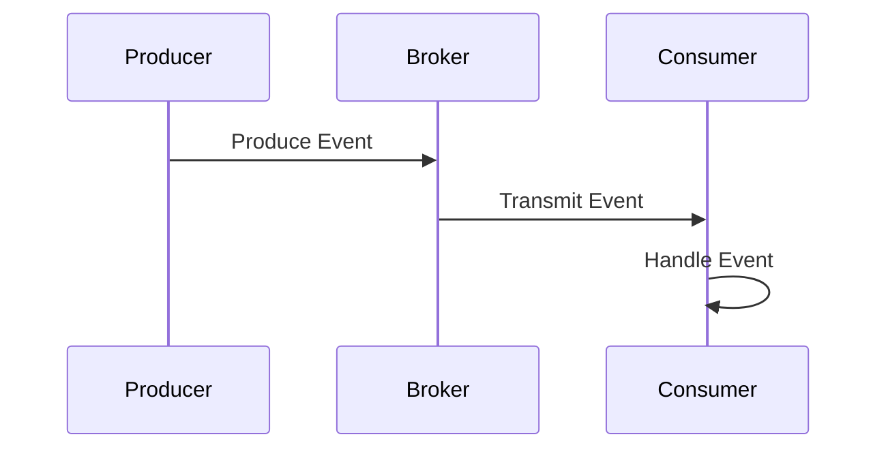
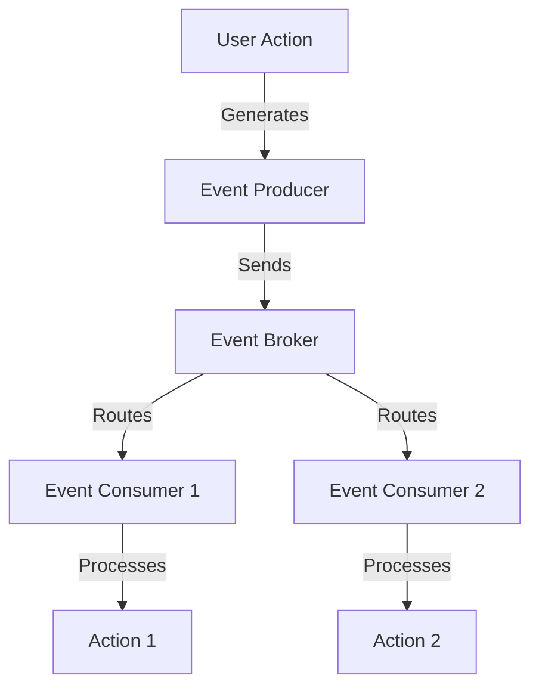

## 2.1.1 Defining Events

In the realm of Event-Driven Architecture (EDA), events are the cornerstone that enables systems to react to changes in real-time. Understanding what events are, how they function, and their significance is crucial for designing effective reactive systems. This section delves into the concept of events, exploring their types, structure, origin, lifecycle, and importance in EDA.

### Introducing the Concept of Events

In EDA, an event represents a significant change or action within a system. It is a record of something that has happened, which can trigger responses from other components within the architecture. Events are immutable facts that capture the state change in a system at a particular point in time. They serve as the primary mechanism for communication between decoupled components, allowing systems to be more flexible and scalable.

### Types of Events

Events can be categorized into several types based on their origin and purpose:

1. **Business Events:** These are events that represent significant business activities or milestones. For example, an "Order Placed" event in an e-commerce system indicates that a customer has completed a purchase.

2. **System Events:** These events are generated by the system itself, often related to operational aspects. Examples include "Service Started" or "Database Backup Completed."

3. **User-Generated Events:** These events are triggered by user interactions, such as "Button Clicked" or "Form Submitted" in a web application.

Understanding the different types of events helps in designing systems that can effectively respond to various triggers and conditions.

### Event Structure

An event typically consists of several key components:

- **Event Type:** A classification that identifies the nature of the event, such as "OrderPlaced" or "UserLoggedIn."

- **Timestamp:** The exact time when the event occurred, which is crucial for ordering and processing events in the correct sequence.

- **Payload:** The data associated with the event, which contains the details necessary for processing. For instance, an "OrderPlaced" event might include the order ID, customer details, and items purchased.

- **Metadata:** Additional information about the event, such as the source of the event, versioning information, or correlation IDs for tracking related events.

Here's a simple Java representation of an event structure:

```java
public class Event {
    private String eventType;
    private long timestamp;
    private Map<String, Object> payload;
    private Map<String, String> metadata;

    public Event(String eventType, long timestamp, Map<String, Object> payload, Map<String, String> metadata) {
        this.eventType = eventType;
        this.timestamp = timestamp;
        this.payload = payload;
        this.metadata = metadata;
    }

    // Getters and setters omitted for brevity
}
```

### Event Origin

Events can originate from various sources, each contributing to the system's overall functionality:

- **User Interactions:** Events triggered by user actions, such as clicking a button or submitting a form.

- **System Processes:** Internal processes that generate events, like scheduled tasks or automated workflows.

- **External Integrations:** Events from external systems or services, such as third-party APIs or IoT devices.

Understanding the origin of events is essential for designing systems that can effectively capture and respond to these triggers.

### Event Lifecycle

The lifecycle of an event encompasses several stages, from creation to consumption:

1. **Production:** The event is generated by a producer, which could be a user action, a system process, or an external system.

2. **Transmission:** The event is transmitted through an event channel or broker, which routes it to interested consumers.

3. **Consumption:** The event is consumed by one or more consumers, which process the event and take appropriate actions.

4. **Handling:** The consumer processes the event, which may involve updating a database, triggering another event, or performing a business operation.

Here's a visual representation of the event lifecycle:



### Importance of Events

Events are fundamental to EDA because they enable the decoupling of system components. By using events, systems can achieve:

- **Scalability:** Components can be scaled independently, as they are not tightly coupled.

- **Flexibility:** New features can be added without disrupting existing components, as communication is event-based.

- **Real-Time Processing:** Systems can react to changes as they occur, providing timely responses to users and other systems.

### Examples of Events

To illustrate the concept of events, consider the following examples:

- **E-Commerce:** An "Order Placed" event triggers inventory updates, payment processing, and order confirmation emails.

- **IoT Systems:** A "Temperature Reading" event from a sensor triggers alerts if the temperature exceeds a threshold.

- **Social Media:** A "New Post" event notifies followers and updates news feeds in real-time.

### Visual Representation

To further understand how events flow through a system, consider the following diagram that illustrates an event-driven architecture:



This diagram shows how a user action generates an event, which is then sent to an event broker. The broker routes the event to multiple consumers, each of which processes the event and takes specific actions.

### Conclusion

Events are the lifeblood of Event-Driven Architecture, enabling systems to be more responsive, scalable, and flexible. By understanding the types, structure, origin, and lifecycle of events, architects and developers can design systems that effectively leverage the power of events to achieve real-time processing and decoupling of components.

## Quiz Time!



### What is an event in the context of Event-Driven Architecture?

- [x] A significant change or action within a system
- [ ] A static configuration file
- [ ] A database transaction
- [ ] A user interface element

> **Explanation:** An event represents a significant change or action within a system, serving as a trigger for communication between components.

### Which of the following is NOT a type of event?

- [ ] Business Event
- [ ] System Event
- [ ] User-Generated Event
- [x] Static Event

> **Explanation:** Static events do not exist; events are dynamic and represent changes or actions.

### What is typically included in the structure of an event?

- [x] Event Type, Timestamp, Payload, Metadata
- [ ] Event Type, User Interface, Database Schema
- [ ] Timestamp, Database Connection, User Input
- [ ] Payload, Metadata, User Interface, API Endpoint

> **Explanation:** An event typically includes an event type, timestamp, payload, and metadata.

### Where can events originate from?

- [x] User interactions, System processes, External integrations
- [ ] Only from user interactions
- [ ] Only from system errors
- [ ] Only from external databases

> **Explanation:** Events can originate from user interactions, system processes, or external integrations.

### What is the first stage in the lifecycle of an event?

- [x] Production
- [ ] Transmission
- [ ] Consumption
- [ ] Handling

> **Explanation:** The first stage in the lifecycle of an event is production, where the event is generated.

### Why are events fundamental to EDA?

- [x] They enable decoupling of system components
- [ ] They increase the complexity of the system
- [ ] They require more hardware resources
- [ ] They slow down system processing

> **Explanation:** Events enable the decoupling of system components, allowing for scalability and flexibility.

### Which of the following is an example of a business event?

- [x] Order Placed
- [ ] Service Started
- [ ] Button Clicked
- [ ] Database Backup Completed

> **Explanation:** "Order Placed" is a business event representing a significant business activity.

### What is the role of an event broker?

- [x] To route events from producers to consumers
- [ ] To generate events
- [ ] To store events permanently
- [ ] To delete events after processing

> **Explanation:** An event broker routes events from producers to consumers.

### How do events contribute to real-time processing?

- [x] By allowing systems to react to changes as they occur
- [ ] By storing data in a database
- [ ] By requiring manual intervention
- [ ] By delaying responses to users

> **Explanation:** Events allow systems to react to changes as they occur, enabling real-time processing.

### True or False: Events in EDA are mutable and can be changed after creation.

- [ ] True
- [x] False

> **Explanation:** Events in EDA are immutable and represent a fact that cannot be changed after creation.


