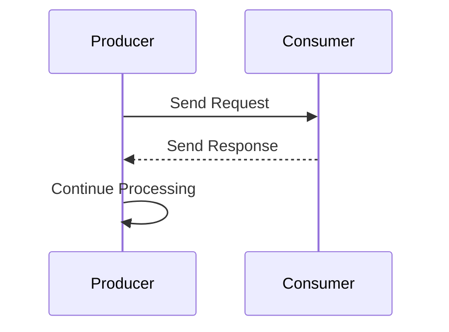
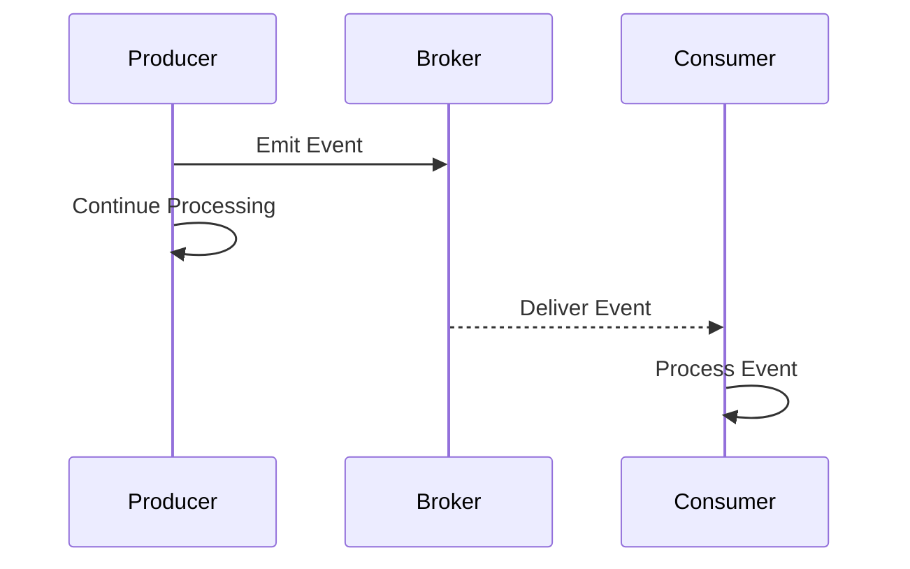

## 2.2.2 Synchronous vs. Asynchronous Communication

In the realm of event-driven architecture (EDA), understanding the nuances between synchronous and asynchronous communication is crucial for designing systems that are both efficient and responsive. This section delves into the definitions, advantages, disadvantages, and practical applications of both communication styles, providing insights into when and how to use each effectively.

### Defining Synchronous Communication

Synchronous communication is a pattern where the event producer sends a request and waits for the consumer to process it and return a response before continuing its execution. This type of communication is akin to a phone call, where both parties are engaged in a real-time conversation.

#### Key Characteristics:
- **Blocking Nature:** The producer is blocked until it receives a response from the consumer.
- **Immediate Feedback:** The producer gets an immediate acknowledgment or result from the consumer.
- **Tight Coupling:** The producer and consumer are often tightly coupled, as the producer relies on the consumer's immediate availability and response.

### Defining Asynchronous Communication

Asynchronous communication, on the other hand, allows the producer to emit an event and continue its processing without waiting for a response. This is similar to sending an email, where the sender can continue with other tasks while the recipient processes the message at their convenience.

#### Key Characteristics:
- **Non-Blocking Nature:** The producer is not blocked and can perform other tasks while the consumer processes the event.
- **Decoupled Interaction:** The producer and consumer are loosely coupled, allowing for greater flexibility and scalability.
- **Eventual Consistency:** Responses or results may not be immediate, leading to eventual consistency in the system.

### Pros and Cons of Synchronous Communication

#### Pros:
- **Simplicity:** Easier to implement and understand due to its straightforward request-response pattern.
- **Immediate Feedback:** Useful for scenarios requiring instant confirmation or results, such as user authentication.

#### Cons:
- **Tight Coupling:** Increases dependency between components, making the system less flexible.
- **Latency Issues:** Can lead to increased latency, especially if the consumer is slow or unavailable.
- **Scalability Challenges:** Difficult to scale as the system grows, due to the blocking nature of requests.

### Pros and Cons of Asynchronous Communication

#### Pros:
- **Loose Coupling:** Promotes independence between components, enhancing system flexibility and maintainability.
- **Improved Scalability:** Better suited for high-throughput systems, as producers are not blocked by consumers.
- **Fault Tolerance:** Systems can be more resilient to failures, as components can retry operations independently.

#### Cons:
- **Complexity in Error Handling:** Requires more sophisticated mechanisms to handle failures and retries.
- **Eventual Consistency:** Systems may need to handle scenarios where data is not immediately consistent.
- **Increased Complexity:** Designing and debugging asynchronous systems can be more complex due to the lack of immediate feedback.

### Use Cases for Synchronous Communication

Synchronous communication is ideal for scenarios where immediate feedback is critical:

- **Real-Time User Interactions:** Applications like online banking or e-commerce checkouts, where users expect instant confirmation.
- **Critical Transactions:** Operations that require immediate validation, such as booking systems or payment gateways.

### Use Cases for Asynchronous Communication

Asynchronous communication shines in scenarios that benefit from decoupling and scalability:

- **Background Processing:** Tasks like email notifications, report generation, or batch processing that do not require immediate feedback.
- **Event Notifications:** Systems that need to broadcast events to multiple consumers, such as social media updates or IoT device alerts.
- **High-Throughput Data Ingestion:** Applications like log processing or data analytics, where large volumes of data are processed independently.

### Hybrid Approaches

In many systems, a hybrid approach that combines both synchronous and asynchronous communication can be beneficial. For example, a system might use synchronous communication for critical user interactions while employing asynchronous communication for background processing and notifications. This approach allows architects to leverage the strengths of both paradigms, optimizing for performance and user experience.

### Implementation Considerations

When choosing between synchronous and asynchronous communication, consider the following guidelines:

- **System Requirements:** Assess the need for immediate feedback versus the benefits of decoupling and scalability.
- **Performance Needs:** Evaluate the expected load and throughput, and choose a communication style that can handle the anticipated demand.
- **Architectural Goals:** Align the communication strategy with the overall architectural vision, ensuring it supports the desired flexibility, maintainability, and resilience.

### Practical Java Code Examples

Let's explore how synchronous and asynchronous communication can be implemented in Java using Spring Boot and Kafka.

#### Synchronous Example

```java
@RestController
@RequestMapping("/api")
public class SyncController {

    @GetMapping("/sync")
    public ResponseEntity<String> synchronousEndpoint() {
        // Simulate a synchronous operation
        String result = performSynchronousTask();
        return ResponseEntity.ok(result);
    }

    private String performSynchronousTask() {
        // Simulate a blocking task
        return "Synchronous Response";
    }
}
```

#### Asynchronous Example

```java
@Service
public class AsyncService {

    @Autowired
    private KafkaTemplate<String, String> kafkaTemplate;

    public void sendMessage(String message) {
        // Send message to Kafka topic asynchronously
        kafkaTemplate.send("topicName", message);
    }
}

@RestController
@RequestMapping("/api")
public class AsyncController {

    @Autowired
    private AsyncService asyncService;

    @PostMapping("/async")
    public ResponseEntity<String> asynchronousEndpoint(@RequestBody String message) {
        // Call the asynchronous service
        asyncService.sendMessage(message);
        return ResponseEntity.accepted().body("Message sent asynchronously");
    }
}
```

### Diagrams and Visualizations

To further illustrate these concepts, consider the following diagrams:

#### Synchronous Communication Diagram



#### Asynchronous Communication Diagram



### Conclusion

Understanding the differences between synchronous and asynchronous communication is essential for designing effective event-driven systems. By carefully considering the pros and cons of each approach, and leveraging hybrid strategies when appropriate, architects can build systems that are both responsive and scalable.

## Quiz Time!



### What is a key characteristic of synchronous communication?

- [x] The producer waits for a response from the consumer before proceeding.
- [ ] The producer continues processing without waiting for a response.
- [ ] The producer and consumer are loosely coupled.
- [ ] The producer sends an event to a message broker.

> **Explanation:** In synchronous communication, the producer waits for a response from the consumer before continuing its execution.

### Which of the following is a benefit of asynchronous communication?

- [x] Loose coupling between components
- [ ] Immediate feedback
- [ ] Simplicity in implementation
- [ ] Tight coupling between components

> **Explanation:** Asynchronous communication allows for loose coupling between components, enhancing flexibility and scalability.

### What is a disadvantage of synchronous communication?

- [x] Tight coupling between components
- [ ] Improved scalability
- [ ] Loose coupling
- [ ] Non-blocking nature

> **Explanation:** Synchronous communication often results in tight coupling, making the system less flexible.

### In which scenario is synchronous communication preferable?

- [x] Real-time user interactions
- [ ] Background processing
- [ ] Event notifications
- [ ] High-throughput data ingestion

> **Explanation:** Synchronous communication is ideal for real-time user interactions where immediate feedback is required.

### What is a common challenge of asynchronous communication?

- [x] Complexity in error handling
- [ ] Immediate feedback
- [ ] Tight coupling
- [ ] Simplicity in implementation

> **Explanation:** Asynchronous communication can be complex to implement, particularly in terms of error handling and ensuring eventual consistency.

### Which Java framework is commonly used for implementing asynchronous communication?

- [x] Spring Boot
- [ ] Hibernate
- [ ] Struts
- [ ] JSF

> **Explanation:** Spring Boot is a popular framework for implementing asynchronous communication, often in conjunction with Kafka.

### What is a hybrid approach in communication?

- [x] Combining synchronous and asynchronous communication within the same system
- [ ] Using only synchronous communication
- [ ] Using only asynchronous communication
- [ ] Avoiding communication altogether

> **Explanation:** A hybrid approach involves using both synchronous and asynchronous communication to leverage the strengths of each.

### What is a key benefit of using a message broker in asynchronous communication?

- [x] Decoupling producers and consumers
- [ ] Immediate feedback
- [ ] Tight coupling
- [ ] Blocking nature

> **Explanation:** A message broker helps decouple producers and consumers, allowing them to operate independently.

### Which of the following is a characteristic of asynchronous communication?

- [x] Non-blocking nature
- [ ] Immediate feedback
- [ ] Tight coupling
- [ ] Blocking nature

> **Explanation:** Asynchronous communication is non-blocking, allowing the producer to continue processing without waiting for a response.

### True or False: Synchronous communication is always better than asynchronous communication.

- [ ] True
- [x] False

> **Explanation:** The choice between synchronous and asynchronous communication depends on the specific requirements and constraints of the system being designed.


