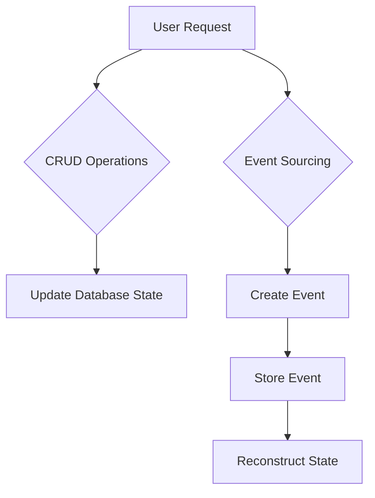

---

linkTitle: "3.1.2 Event Sourcing vs. Traditional CRUD"
title: "Event Sourcing vs. Traditional CRUD: A Comparative Analysis"
description: "Explore the differences between Event Sourcing and Traditional CRUD operations, highlighting their respective advantages, limitations, and use cases in modern software architecture."
categories:
- Software Architecture
- Event-Driven Systems
- Data Management
tags:
- Event Sourcing
- CRUD
- Data Modeling
- Scalability
- Auditability
date: 2024-10-25
type: docs
nav_weight: 312000
---

## 3.1.2 Event Sourcing vs. Traditional CRUD

In the realm of software architecture, data management is a critical component that influences the design and functionality of applications. Two prominent approaches to data management are Traditional CRUD operations and Event Sourcing. This section delves into the intricacies of these methodologies, comparing their strengths, weaknesses, and applicability in various scenarios.

### Defining CRUD Operations

CRUD stands for Create, Read, Update, and Delete, which are the four basic operations of persistent storage. In traditional architectures, CRUD operations are the cornerstone of data manipulation:

- **Create:** Adding new records to the database.
- **Read:** Retrieving data from the database.
- **Update:** Modifying existing records.
- **Delete:** Removing records from the database.

CRUD operations are typically implemented using relational databases, where data is stored in tables and manipulated through SQL queries. This approach is straightforward and well-suited for applications with simple data requirements.

### State-Based vs. Event-Based Modeling

#### State-Based Modeling (CRUD)

In state-based modeling, the current state of an entity is stored in the database. Each CRUD operation directly modifies this state. For example, updating a user's email address involves changing the email field in the user's record. The database reflects only the latest state, with no inherent history of changes.

#### Event-Based Modeling (Event Sourcing)

Event Sourcing, on the other hand, stores a sequence of events that represent changes to the state over time. Instead of storing the current state, each event captures a specific change, such as "UserEmailUpdated." The current state is derived by replaying these events. This approach provides a complete audit trail and allows for state reconstruction at any point in time.

### Pros and Cons of CRUD

#### Simplicity

- **Ease of Use:** CRUD operations are intuitive and easy to implement, making them ideal for simple applications.
- **Mature Ecosystem:** A wide range of tools and frameworks support CRUD operations, facilitating rapid development.

#### Limitations

- **Complex State Changes:** CRUD can struggle with complex state transitions, as it lacks a built-in mechanism for capturing the history of changes.
- **Audit Trails:** Maintaining an audit trail requires additional mechanisms, such as logging or triggers, which can complicate the architecture.
- **Scalability Issues:** As applications grow, CRUD operations may face performance bottlenecks, especially in high-concurrency environments.

### Pros and Cons of Event Sourcing

#### Advantages

- **Scalability:** Event Sourcing naturally supports horizontal scaling, as events can be partitioned and processed independently.
- **Auditability:** Every change is recorded as an event, providing a complete history that is invaluable for auditing and debugging.
- **State Reconstruction:** The ability to replay events allows for easy state reconstruction and supports scenarios like temporal queries and debugging.

#### Challenges

- **Architectural Complexity:** Implementing Event Sourcing requires a shift in mindset and architecture, introducing complexity in event handling and storage.
- **Event Handling:** Designing robust event handling mechanisms is crucial to ensure consistency and reliability.
- **Data Volume:** Storing events can lead to large data volumes, necessitating efficient storage and retrieval strategies.

### Comparative Analysis

| Aspect           | CRUD                              | Event Sourcing                     |
|------------------|-----------------------------------|------------------------------------|
| **Performance**  | Efficient for simple operations   | May require more resources for event replay |
| **Scalability**  | Limited by database constraints   | Highly scalable with event partitioning |
| **Maintainability** | Straightforward for small systems | Requires careful design and maintenance |
| **Use Case Suitability** | Best for simple, state-based applications | Ideal for complex, audit-heavy systems |

### Migration Considerations

Migrating from a CRUD-based system to Event Sourcing involves several considerations:

- **Data Model Transformation:** Convert existing state-based records into a series of events.
- **System Downtime:** Plan for potential downtime during migration, ensuring data consistency.
- **Incremental Adoption:** Consider adopting Event Sourcing incrementally, starting with specific components or services.

### Hybrid Approaches

In some cases, a hybrid approach that combines CRUD and Event Sourcing can be beneficial. For example, use CRUD for simple, non-critical data and Event Sourcing for components requiring auditability and complex state management. This approach leverages the strengths of both methodologies.

### Decision Factors

When choosing between CRUD and Event Sourcing, consider the following factors:

- **Complexity of State Changes:** If your application requires tracking complex state transitions, Event Sourcing may be more suitable.
- **Audit and Compliance Needs:** Applications with strict audit requirements benefit from the complete history provided by Event Sourcing.
- **Scalability Requirements:** For applications expected to scale significantly, Event Sourcing offers better scalability options.

### Practical Java Code Example

Let's explore a simple Java example to illustrate the differences between CRUD and Event Sourcing. We'll use a user management system as our context.

#### CRUD Example

```java
public class UserService {

    private final UserRepository userRepository;

    public UserService(UserRepository userRepository) {
        this.userRepository = userRepository;
    }

    public void updateUserEmail(Long userId, String newEmail) {
        User user = userRepository.findById(userId);
        if (user != null) {
            user.setEmail(newEmail);
            userRepository.save(user);
        }
    }
}
```

In this CRUD example, the `updateUserEmail` method directly updates the user's email in the database.

#### Event Sourcing Example

```java
public class UserEventService {

    private final EventStore eventStore;

    public UserEventService(EventStore eventStore) {
        this.eventStore = eventStore;
    }

    public void updateUserEmail(Long userId, String newEmail) {
        UserEmailUpdatedEvent event = new UserEmailUpdatedEvent(userId, newEmail);
        eventStore.save(event);
    }

    public User reconstructUserState(Long userId) {
        List<Event> events = eventStore.findByUserId(userId);
        User user = new User(userId);
        for (Event event : events) {
            user.apply(event);
        }
        return user;
    }
}
```

In the Event Sourcing example, the `updateUserEmail` method creates an event and stores it. The `reconstructUserState` method replays events to rebuild the user's state.

### Diagrams

To further illustrate the differences, let's use a Mermaid diagram to visualize the data flow in both approaches.



### Conclusion

Choosing between CRUD and Event Sourcing depends on the specific needs of your application. While CRUD offers simplicity and ease of use, Event Sourcing provides powerful capabilities for handling complex state changes and maintaining a comprehensive audit trail. By understanding the strengths and limitations of each approach, you can make informed architectural decisions that align with your project's goals.

## Quiz Time!



### What does CRUD stand for in traditional data management?

- [x] Create, Read, Update, Delete
- [ ] Create, Retrieve, Update, Destroy
- [ ] Compile, Run, Update, Delete
- [ ] Connect, Read, Update, Delete

> **Explanation:** CRUD stands for Create, Read, Update, and Delete, which are the four basic operations of persistent storage.

### How does Event Sourcing differ from CRUD in terms of data storage?

- [x] Event Sourcing stores events, while CRUD stores the current state.
- [ ] Event Sourcing stores the current state, while CRUD stores events.
- [ ] Both store the current state directly.
- [ ] Both store events directly.

> **Explanation:** Event Sourcing stores a sequence of events that represent changes over time, whereas CRUD stores the current state of an entity.

### What is a primary advantage of Event Sourcing over CRUD?

- [x] Enhanced auditability and ability to reconstruct state
- [ ] Simplicity and ease of implementation
- [ ] Lower data storage requirements
- [ ] Faster read operations

> **Explanation:** Event Sourcing provides enhanced auditability by recording every change as an event, allowing for state reconstruction.

### Which of the following is a limitation of CRUD?

- [x] Difficulty in maintaining audit trails
- [ ] Complexity in implementation
- [ ] High scalability
- [ ] Lack of support for relational databases

> **Explanation:** CRUD operations can struggle with maintaining audit trails, as they only store the current state without historical changes.

### What is a common challenge associated with Event Sourcing?

- [x] Increased architectural complexity
- [ ] Lack of support for audit trails
- [ ] Difficulty in implementing CRUD operations
- [ ] Inability to scale horizontally

> **Explanation:** Event Sourcing introduces architectural complexity due to the need for sophisticated event handling mechanisms.

### In which scenario is CRUD most suitable?

- [x] Simple applications with basic data requirements
- [ ] Applications requiring complex state transitions
- [ ] Systems with high auditability needs
- [ ] Applications with high scalability demands

> **Explanation:** CRUD is most suitable for simple applications with straightforward data requirements.

### What is a benefit of combining CRUD and Event Sourcing in a hybrid approach?

- [x] Leveraging the strengths of both methodologies
- [ ] Eliminating the need for event handling
- [ ] Simplifying data storage requirements
- [ ] Reducing the need for audit trails

> **Explanation:** A hybrid approach allows leveraging the simplicity of CRUD and the auditability of Event Sourcing.

### What factor should be considered when choosing between CRUD and Event Sourcing?

- [x] Complexity of state changes
- [ ] Availability of relational databases
- [ ] Number of CRUD operations
- [ ] Color of the user interface

> **Explanation:** The complexity of state changes is a key factor in deciding between CRUD and Event Sourcing.

### How can Event Sourcing improve scalability?

- [x] By allowing events to be partitioned and processed independently
- [ ] By reducing the number of CRUD operations
- [ ] By storing only the current state
- [ ] By eliminating the need for databases

> **Explanation:** Event Sourcing improves scalability by enabling events to be partitioned and processed independently.

### Event Sourcing provides a complete history of changes, making it ideal for applications with strict audit requirements.

- [x] True
- [ ] False

> **Explanation:** True. Event Sourcing records every change as an event, providing a complete history that is valuable for auditing.


