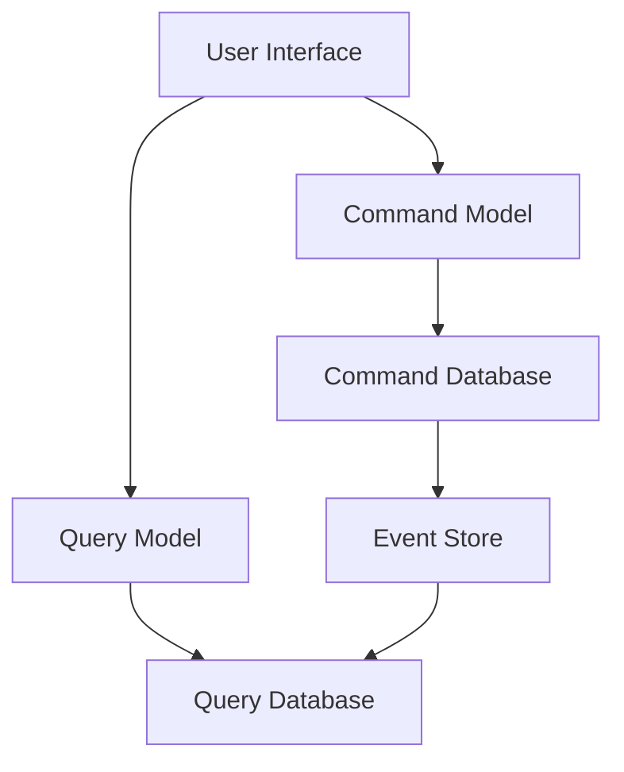

## 4.1.1 Understanding CQRS: Definition and Core Principles

Command Query Responsibility Segregation (CQRS) is an architectural pattern that plays a pivotal role in designing scalable and maintainable systems. By separating the read and write operations into distinct models, CQRS enables developers to optimize performance and scalability while maintaining a clean separation of concerns. In this section, we will delve into the definition, core principles, benefits, and implementation approaches of CQRS, providing practical insights and examples to illustrate its application.

### Defining CQRS

CQRS stands for Command Query Responsibility Segregation, a pattern that distinctly separates the responsibilities of handling commands (write operations) and queries (read operations) within a system. This separation allows each side to be optimized independently, catering to their specific needs and workloads. By doing so, CQRS enhances the system's ability to handle complex business logic and high-traffic scenarios efficiently.

### Core Principles of CQRS

#### Separation of Concerns

The fundamental principle of CQRS is the separation of concerns. By dividing the system into two distinct parts—commands and queries—CQRS allows each part to focus on its specific responsibilities. This separation not only simplifies the design but also enhances the system's ability to scale and adapt to changing requirements.

- **Command Model:** The command side is responsible for handling operations that modify the system's state, such as creating, updating, or deleting data. This model encapsulates business logic and validations, ensuring that all changes adhere to the defined rules and constraints.

- **Query Model:** The query side is dedicated to retrieving and reading data without affecting the system's state. This model can be optimized for performance, enabling efficient data retrieval and presentation.

#### Encapsulation of Business Logic

In CQRS, business rules and validations are encapsulated within the command model. This encapsulation ensures that all state changes are governed by the defined business logic, maintaining data integrity and consistency. By isolating business logic within the command model, CQRS simplifies the query model, allowing it to focus solely on data retrieval.

### Benefits of Separation

#### Improved Performance

By optimizing read and write operations independently, CQRS enhances system throughput. The query model can be tailored for fast data retrieval, while the command model focuses on ensuring data integrity and consistency. This separation allows each model to be fine-tuned for its specific workload, resulting in improved overall performance.

#### Scalability

CQRS enables the independent scaling of read and write operations. In high-traffic systems, the ability to scale read operations separately from write operations allows for better resource allocation and utilization. This flexibility is particularly beneficial in scenarios where read and write workloads differ significantly.

#### Flexibility in Data Models

With CQRS, different data models can be used for commands and queries to suit specific needs. For example, the command model might use a normalized database schema to ensure data integrity, while the query model could use a denormalized schema for fast data retrieval. This flexibility allows developers to choose the best data model for each side, optimizing performance and maintainability.

### Implementation Approaches

#### Separate Databases

One common approach to implementing CQRS is to use distinct databases for commands and queries. This separation allows each database to be optimized for its specific workload, enhancing performance and scalability. The command database can focus on ensuring data integrity and consistency, while the query database is optimized for fast data retrieval.

#### Shared Databases with Separation Logic

Alternatively, a single database can be logically separated to handle command and query operations. This approach involves using different tables or schemas within the same database to separate the responsibilities of commands and queries. While this approach may introduce some complexity, it can be a viable option when using separate databases is not feasible.

### Design Considerations

#### Eventual Consistency

In a CQRS system, eventual consistency between the command and query models is a key consideration. Since the models are separated, there may be a delay in propagating changes from the command model to the query model. This delay can lead to temporary inconsistencies, which must be managed effectively to ensure a seamless user experience.

#### Complexity Management

While CQRS offers numerous benefits, it also introduces additional complexity. Managing this complexity requires careful planning and design, including clear separation of responsibilities, robust error handling, and effective communication between the command and query models.

### Use Cases for CQRS

CQRS is particularly beneficial in scenarios where complex business logic, high-traffic systems, and distinct read and write workloads are present. Some common use cases include:

- **Complex Business Applications:** In applications with intricate business rules and validations, CQRS helps encapsulate and manage this complexity effectively.

- **High-Traffic Systems:** Systems with high read and write workloads can benefit from the independent scaling capabilities of CQRS.

- **Domains with Distinct Read and Write Workloads:** In domains where read and write operations have different performance and scalability requirements, CQRS provides the flexibility to optimize each side independently.

### Visual Representation

To better understand the separation between command and query models within a CQRS system, consider the following diagram:



In this diagram, the user interface interacts with both the command and query models. The command model communicates with the command database, while the query model retrieves data from the query database. An event store is used to propagate changes from the command model to the query model, ensuring eventual consistency.

### Practical Java Code Example

Let's explore a simple Java implementation of CQRS using Spring Boot. We'll create a basic system with separate command and query models.

#### Command Model

```java
import org.springframework.stereotype.Service;

@Service
public class CommandService {

    public void createOrder(OrderCommand command) {
        // Validate and process the command
        if (command.isValid()) {
            // Perform business logic and persist changes
            saveOrder(command);
        } else {
            throw new IllegalArgumentException("Invalid order command");
        }
    }

    private void saveOrder(OrderCommand command) {
        // Logic to save the order to the command database
        // This could involve calling a repository or another service
    }
}
```

#### Query Model

```java
import org.springframework.stereotype.Service;
import java.util.List;

@Service
public class QueryService {

    public List<Order> getOrders() {
        // Retrieve orders from the query database
        return fetchOrdersFromDatabase();
    }

    private List<Order> fetchOrdersFromDatabase() {
        // Logic to retrieve orders from the query database
        // This could involve calling a repository or another service
        return List.of(new Order("Order1"), new Order("Order2"));
    }
}
```

In this example, the `CommandService` handles the creation of orders, encapsulating business logic and validations. The `QueryService` retrieves orders, focusing solely on data retrieval.

### Conclusion

CQRS is a powerful architectural pattern that offers numerous benefits, including improved performance, scalability, and flexibility. By separating read and write operations into distinct models, CQRS allows developers to optimize each side independently, catering to their specific needs and workloads. While CQRS introduces additional complexity, careful planning and design can help manage this complexity effectively, enabling the development of robust and scalable systems.

## Quiz Time!



### What does CQRS stand for?

- [x] Command Query Responsibility Segregation
- [ ] Command Query Resource Segregation
- [ ] Command Query Resource Sharing
- [ ] Command Query Responsibility Sharing

> **Explanation:** CQRS stands for Command Query Responsibility Segregation, an architectural pattern that separates read and write operations into distinct models.

### What is the primary benefit of separating read and write operations in CQRS?

- [x] Improved performance and scalability
- [ ] Simplified codebase
- [ ] Reduced development time
- [ ] Enhanced security

> **Explanation:** By separating read and write operations, CQRS allows each side to be optimized independently, leading to improved performance and scalability.

### In CQRS, what is the command model responsible for?

- [x] Handling operations that modify data
- [ ] Retrieving and reading data
- [ ] Managing user authentication
- [ ] Logging system events

> **Explanation:** The command model in CQRS is responsible for handling operations that modify data, such as create, update, and delete operations.

### What is the query model in CQRS dedicated to?

- [x] Retrieving and reading data
- [ ] Modifying system state
- [ ] Managing business logic
- [ ] Handling user input

> **Explanation:** The query model in CQRS is dedicated to retrieving and reading data without affecting the system's state.

### How does CQRS improve system scalability?

- [x] By allowing independent scaling of read and write operations
- [ ] By reducing the number of servers required
- [ ] By simplifying the codebase
- [ ] By eliminating the need for databases

> **Explanation:** CQRS improves system scalability by allowing read and write operations to be scaled independently, optimizing resource allocation.

### What is a common approach to implementing CQRS?

- [x] Using separate databases for commands and queries
- [ ] Using a single database for all operations
- [ ] Using a monolithic architecture
- [ ] Using a single-threaded model

> **Explanation:** A common approach to implementing CQRS is to use separate databases for commands and queries, allowing each to be optimized for its specific workload.

### What is eventual consistency in the context of CQRS?

- [x] A delay in propagating changes from the command model to the query model
- [ ] Immediate consistency between command and query models
- [ ] Consistency in user interface design
- [ ] Consistency in database schemas

> **Explanation:** Eventual consistency in CQRS refers to the delay in propagating changes from the command model to the query model, leading to temporary inconsistencies.

### What is a potential challenge of implementing CQRS?

- [x] Increased complexity
- [ ] Reduced performance
- [ ] Limited scalability
- [ ] Inflexible data models

> **Explanation:** A potential challenge of implementing CQRS is increased complexity, which requires careful planning and design to manage effectively.

### Which of the following is a use case where CQRS is particularly beneficial?

- [x] High-traffic systems
- [ ] Simple CRUD applications
- [ ] Static websites
- [ ] Single-user applications

> **Explanation:** CQRS is particularly beneficial in high-traffic systems where read and write operations have distinct performance and scalability requirements.

### True or False: In CQRS, the command model and query model must always use the same database schema.

- [ ] True
- [x] False

> **Explanation:** False. In CQRS, the command model and query model can use different database schemas to optimize for their specific needs.


