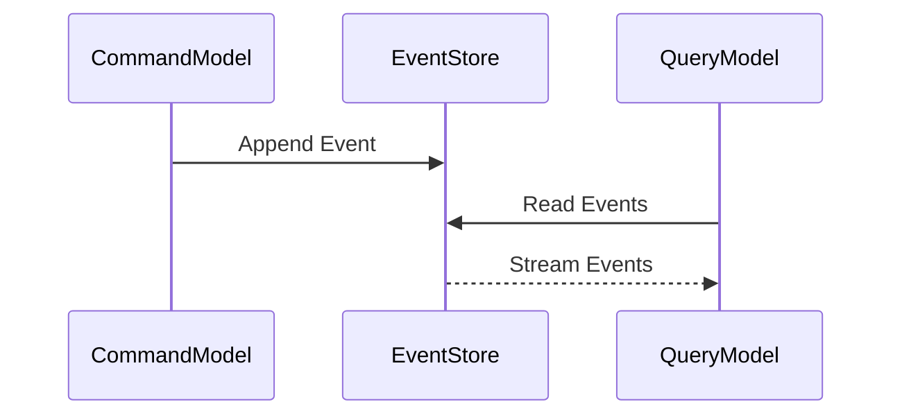

---

linkTitle: "4.2.3 Synchronizing Read and Write Models"
title: "Synchronizing Read and Write Models in CQRS for Consistent Event-Driven Architectures"
description: "Explore the intricacies of synchronizing read and write models in CQRS, focusing on event-driven synchronization, handling eventual consistency, and optimizing performance."
categories:
- Software Architecture
- Event-Driven Systems
- CQRS
tags:
- CQRS
- Event-Driven Architecture
- Synchronization
- Java
- Microservices
date: 2024-10-25
type: docs
nav_weight: 423000
---

## 4.2.3 Synchronizing Read and Write Models

In the realm of Command Query Responsibility Segregation (CQRS), synchronizing read and write models is a pivotal aspect that ensures data consistency and system reliability. This section delves into the mechanisms and strategies for achieving effective synchronization, leveraging event-driven architecture principles.

### Understanding Synchronization Needs

Synchronization between read and write models is crucial because it ensures that the system's state is consistently reflected across different components. In a CQRS architecture, the command model handles data modifications, while the query model is optimized for data retrieval. Without proper synchronization, discrepancies can arise, leading to outdated or incorrect data being presented to users. This can undermine the reliability and trustworthiness of the system.

### Event-Driven Synchronization

#### Publishing Events from Command Model

In an event-driven CQRS system, the command model is responsible for publishing events that represent state changes. These events are the primary mechanism for notifying the query model of updates. When a command is executed, such as creating or updating an entity, the command model emits an event encapsulating the change.

Here's a Java example using Spring Boot and Kafka to publish an event:

```java
import org.springframework.kafka.core.KafkaTemplate;
import org.springframework.stereotype.Service;

@Service
public class OrderService {

    private final KafkaTemplate<String, OrderEvent> kafkaTemplate;

    public OrderService(KafkaTemplate<String, OrderEvent> kafkaTemplate) {
        this.kafkaTemplate = kafkaTemplate;
    }

    public void placeOrder(Order order) {
        // Business logic to process the order
        OrderEvent orderEvent = new OrderEvent(order.getId(), order.getStatus());
        kafkaTemplate.send("order-events", orderEvent);
    }
}
```

In this example, the `OrderService` publishes an `OrderEvent` to a Kafka topic named "order-events" whenever an order is placed.

#### Subscribing to Events in Query Model

The query model subscribes to these events to update its data stores accordingly. By listening to the event stream, the query model can maintain an up-to-date representation of the system's state.

Here's how you might implement an event listener in Java:

```java
import org.springframework.kafka.annotation.KafkaListener;
import org.springframework.stereotype.Service;

@Service
public class OrderEventListener {

    @KafkaListener(topics = "order-events", groupId = "order-query")
    public void handleOrderEvent(OrderEvent orderEvent) {
        // Update the query model's data store
        System.out.println("Received Order Event: " + orderEvent);
        // Logic to update the query model
    }
}
```

This listener subscribes to the "order-events" topic and processes incoming events to update the query model.

### Handling Eventual Consistency

#### Managing Delays

Eventual consistency is a fundamental concept in distributed systems, where the query model may temporarily lag behind the command model. This delay is inherent in asynchronous communication and must be managed to set appropriate user expectations. Techniques such as user notifications or visual indicators can inform users of potential delays.

#### Compensating for Inconsistencies

To handle inconsistencies, systems can implement strategies like temporary read unavailability or compensating actions. For instance, if a user attempts to access data that hasn't yet been synchronized, the system might display a "data is being updated" message or provide a fallback mechanism.

### Synchronization Patterns

#### Event Sourcing

Event Sourcing is a powerful pattern that facilitates synchronization by maintaining an immutable log of all events. Both the command and query models can process this log to reconstruct the current state.



This diagram illustrates how the command model appends events to an event store, which the query model reads to update its state.

#### Publishing vs. Pulling Data

There are two primary approaches to synchronization: pushing events to the query model or having the query model actively pull updates. Pushing is more common in event-driven systems, as it allows for real-time updates. However, pulling can be useful in scenarios where the query model needs to control the timing of updates.

### Error Handling in Synchronization

#### Dealing with Failed Event Processing

Failed event processing can lead to inconsistencies. Implementing retry mechanisms and alerting systems can help mitigate these issues. For example, if an event fails to process, it can be retried a set number of times before alerting an administrator.

#### Ensuring Idempotency

Idempotency is critical to prevent duplicate updates in the query model. Each event should be processed in a way that ensures the same outcome, regardless of how many times it is applied.

### Optimizing Synchronization Performance

#### Batch Processing of Events

Processing events in batches can significantly improve throughput and reduce overhead. By grouping events together, the system can handle more updates with fewer resources.

#### Parallel Processing

Parallel processing of events can enhance synchronization speed and efficiency. By distributing event processing across multiple threads or nodes, systems can achieve higher performance and scalability.

### Testing Synchronization Mechanisms

#### Consistency Testing

Testing the synchronization mechanisms is essential to ensure that the read and write models remain consistent. Strategies include simulating high-load scenarios and verifying that the query model accurately reflects the command model's state.

#### Automated Testing Tools

Tools like Testcontainers and Kafka Streams TestUtils can assist in testing event-driven synchronization processes. These frameworks provide the ability to simulate event streams and verify the correctness of event handling logic.

### Example Implementation

Let's consider a practical example demonstrating synchronization between the command and query models in a sample application. We'll show how events are published, subscribed to, and processed to keep both models in sync.

```java
// Command Model - Publishing Events
@Service
public class ProductService {

    private final KafkaTemplate<String, ProductEvent> kafkaTemplate;

    public ProductService(KafkaTemplate<String, ProductEvent> kafkaTemplate) {
        this.kafkaTemplate = kafkaTemplate;
    }

    public void updateProduct(Product product) {
        // Business logic to update the product
        ProductEvent productEvent = new ProductEvent(product.getId(), product.getName(), product.getPrice());
        kafkaTemplate.send("product-events", productEvent);
    }
}

// Query Model - Subscribing to Events
@Service
public class ProductEventListener {

    @KafkaListener(topics = "product-events", groupId = "product-query")
    public void handleProductEvent(ProductEvent productEvent) {
        // Update the query model's data store
        System.out.println("Received Product Event: " + productEvent);
        // Logic to update the query model
    }
}
```

In this example, the `ProductService` publishes `ProductEvent` instances to a Kafka topic, while the `ProductEventListener` subscribes to these events to update the query model.

### Conclusion

Synchronizing read and write models in a CQRS architecture is a complex but essential task that ensures data consistency and system reliability. By leveraging event-driven synchronization, handling eventual consistency, and optimizing performance, developers can build robust systems that meet user expectations. Testing and error handling are critical components of this process, ensuring that synchronization mechanisms function correctly under various conditions.

## Quiz Time!



### Why is synchronization between read and write models crucial in CQRS?

- [x] To ensure data consistency and system reliability
- [ ] To increase the complexity of the system
- [ ] To reduce the number of events processed
- [ ] To simplify the architecture

> **Explanation:** Synchronization is crucial to ensure that the system's state is consistently reflected across different components, maintaining data consistency and reliability.

### What is the role of the command model in event-driven synchronization?

- [x] Publishing events representing state changes
- [ ] Subscribing to events to update data stores
- [ ] Managing user interfaces
- [ ] Handling read requests

> **Explanation:** The command model publishes events that represent state changes, which the query model subscribes to for updates.

### How does the query model update its data stores in an event-driven CQRS system?

- [x] By subscribing to events from the command model
- [ ] By directly querying the command model
- [ ] By polling the command model for changes
- [ ] By using a shared database with the command model

> **Explanation:** The query model subscribes to events published by the command model to update its data stores accordingly.

### What is eventual consistency in the context of CQRS?

- [x] The query model may temporarily lag behind the command model
- [ ] The command model always leads the query model
- [ ] The query model and command model are always in sync
- [ ] The system never reaches consistency

> **Explanation:** Eventual consistency means that the query model may temporarily lag behind the command model, but will eventually reflect the correct state.

### Which pattern facilitates synchronization by maintaining an immutable log of events?

- [x] Event Sourcing
- [ ] Command Sourcing
- [ ] Query Sourcing
- [ ] Data Sourcing

> **Explanation:** Event Sourcing maintains an immutable log of events, facilitating synchronization by allowing both models to process the same events.

### What is a key benefit of batch processing events?

- [x] Improved throughput and reduced overhead
- [ ] Increased complexity
- [ ] Slower processing times
- [ ] More frequent errors

> **Explanation:** Batch processing improves throughput and reduces overhead by handling multiple events together.

### Why is idempotency important in event processing?

- [x] To prevent duplicate updates in the query model
- [ ] To increase the number of processed events
- [ ] To simplify the command model
- [ ] To ensure faster processing

> **Explanation:** Idempotency ensures that the same event can be processed multiple times without causing duplicate updates.

### What strategy can help manage user expectations regarding eventual consistency?

- [x] User notifications or visual indicators
- [ ] Hiding the query model
- [ ] Disabling the command model
- [ ] Increasing event processing time

> **Explanation:** User notifications or visual indicators can inform users of potential delays due to eventual consistency.

### How can parallel processing enhance synchronization performance?

- [x] By distributing event processing across multiple threads or nodes
- [ ] By processing events one at a time
- [ ] By reducing the number of events
- [ ] By simplifying the architecture

> **Explanation:** Parallel processing distributes event processing across multiple threads or nodes, enhancing performance and scalability.

### True or False: In a CQRS architecture, the query model directly modifies the command model's data.

- [ ] True
- [x] False

> **Explanation:** In CQRS, the query model does not directly modify the command model's data. Instead, it updates its own data stores based on events from the command model.


